# ARCHITECTURE.md — SiteSentinel — Website Monitoring & Security Alerts

> **Specification only.** Nothing described in this document has been implemented.
> Every statement is future/conditional ("the worker will…", "Phase 4 implements…").
> No application code, no migrations, and no Laravel scaffold exist at the time of writing.

---

## 1. Purpose & Scope

This document specifies the **system architecture** of SiteSentinel: components, data flow,
monitoring/detection/incident/notification planes, security architecture, and deployment topology.

It is **not** a product-requirements document and **not** a schema document.

### 1.1 Relationship to sibling documents

| Document | Authority | Scope |
| --- | --- | --- |
| [`PRD.md`](PRD.md) | **Authoritative** for all product-level requirements | Requirements `FR-*`, severity, lifecycle, retention, canonical spec §22 |
| [`ARCHITECTURE.md`](ARCHITECTURE.md) (this file) | Derived | Components, flows, diagrams, deployment |
| [`DATABASE.md`](DATABASE.md) | Derived | Tables, columns, indexes, retention mechanics |
| [`DECISIONS.md`](DECISIONS.md) | Derived | ADR rationale for architecture and data choices |

If this document contradicts [`PRD.md`](PRD.md) on a product-level requirement,
[`PRD.md`](PRD.md) wins and this document must be fixed.

### 1.2 Canonical spec (identical to [`PRD.md`](PRD.md) §22)

```text
NAME          SiteSentinel — Website Monitoring & Security Alerts
STACK         Laravel 13, PHP 8.4+, MySQL 8, Redis, Hotwired Turbo, Tailwind CSS,
              Alpine.js (only where necessary), Laravel Scheduler, Laravel Queue (Redis),
              Laravel HTTP Client, Nginx, Docker Compose
FORBIDDEN     React, Vue, Next.js, Inertia, Livewire, SQLite, PostgreSQL, any SPA framework
ARCH STYLE    Server-rendered Laravel + Hotwired Turbo; clear separation between
              monitoring plane (queue workers) and web/UI plane (HTTP)
ROLES         Admin (MVP) — extensible
ROUTES        / = login, /admin = admin area, /status = status page
CORE CONCEPT  External Website Monitoring + Basic Website Compromise Detection + Incident Alerting
KEY RULE      HTTP 200 != healthy. Availability and Security/Content Health are SEPARATE,
              orthogonal dimensions. Availability: UP|DOWN. Security: OK|INFO|SUSPECT|INCIDENT.
SEVERITY      INFO | WARNING | CRITICAL
SCORING       Correlation guard: CRITICAL security escalation requires >= 2 independent signal
              categories. Thresholds INFO >= 1, WARNING >= 8, CRITICAL >= 15.
LIFECYCLE     DETECTED -> ACKNOWLEDGED -> RESOLVED  (no other states; resolved is terminal;
              recurrence opens a NEW incident; auto-resolution requires sustained recovery,
              logged as resolution_mode = auto)
CHANNELS MVP  Email, Telegram        FUTURE: WhatsApp, Webhook
STATUS VIS    Private | Public | Password Protected
RETENTION     checks 30d default (config 30/60/90) | incidents 365d | notification logs 90d |
              snapshots 14d
SNAPSHOTS     HTML snapshot + response headers = MVP. Screenshot = Phase 2/Future, NOT MVP.
SSRF          Layered on EVERY hop: scheme allowlist (http/https only), block localhost/
              loopback/private/link-local/unique-local + cloud metadata endpoints (169.254.169.254),
              DNS re-resolved on EVERY redirect hop, redirect validation, hop cap
```

---

## 2. System Architecture Overview

SiteSentinel separates a **web/UI plane** (HTTP request/response, served by Nginx + PHP-FPM)
from a **monitoring plane** (long-running queue workers). The web plane never performs an
external probe inline; it only reads state and enqueues work.

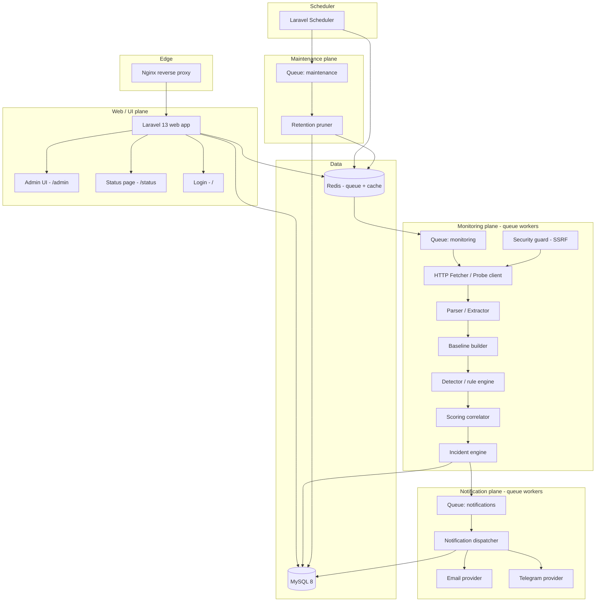

Naming legend: the monitoring plane's `Queue: monitoring`, notification plane's
`Queue: notifications`, and maintenance plane's `Queue: maintenance` are named Laravel queues
on the same Redis connection (see §12 Scheduler/worker architecture).

---

## 3. Component Inventory

All components are proposed to live under `app/` in the following namespaces. Names are
suggestions; the responsibility boundary is the binding part.

| Component | Responsibility | Inputs | Outputs | Dependencies | Suggested location |
| --- | --- | --- | --- | --- | --- |
| Web/UI plane | Serve login, admin area, status page; read state; enqueue work | HTTP requests, session, CSRF token | HTML/Turbo responses, queued jobs | Laravel HTTP kernel, MySQL, Redis, Nginx | `app/Http/Controllers`, `app/Http/Middleware` |
| Scheduler | Emit cadence ticks; dispatch due-work and maintenance jobs | Crontab tick, `websites.next_check_at` | Queued jobs, lock acquisition | Laravel Scheduler, Redis, MySQL | `app/Console/Kernel.php`, `app/Jobs` |
| Queue workers | Execute long-running monitoring/notification/maintenance work off the request path | Queued jobs from Redis | Persisted rows, further queued jobs, provider calls | Laravel Queue (Redis), all monitoring-plane services | `app/Jobs`, queue worker processes |
| HTTP Fetcher / Probe client | Perform bounded external HTTP request; follow redirects; collect response | Target `websites` row, probe options | Raw response, redirect chain, timing, TLS metadata | Laravel HTTP Client, `app/Services/Monitoring` | `app/Services/Monitoring/HttpFetcher.php` |
| Security guard (SSRF) | Enforce scheme allowlist, block private/link-local/metadata, revalidate DNS per hop | URL, resolved IPs, hop context | allow/deny decision, hop audit | DNS resolver, ip parsing | `app/Services/Monitoring/UrlGuard.php` |
| Parser / Extractor | Normalize body; extract title, final URL, keywords, external domains, suspicious patterns | Raw response body/headers | Extraction payload | DOM/html parser, `app/Services/Detection` | `app/Services/Detection/Extractor.php` |
| Baseline builder | Derive/refresh the comparison baseline from a stable observation | Extraction payload, prior baseline row | `website_baselines` row | MySQL, hashing service | `app/Services/Monitoring/BaselineBuilder.php` |
| Detector / rule engine | Evaluate each enabled `detection_rules` row against check + baseline | `checks` row, `check_extractions` row, `website_baselines` row, `website_rule_settings` | per-rule signals with category/weight | MySQL, rule registry | `app/Services/Detection/RuleEngine.php` |
| Scoring correlator | Aggregate signals, apply thresholds + correlation guard | per-rule signals | score, security state, incident candidate | config thresholds, rule categories | `app/Services/Detection/ScoringCorrelator.php` |
| Incident engine | Dedupe/merge against open incident; create/transition; emit timeline events | incident candidate, open `incidents` row | `incidents`, `incident_events`, snapshot trigger | MySQL, incident state machine | `app/Services/Incidents/IncidentEngine.php` |
| Notification dispatcher + providers | Gate (dedupe/cooldown), select channels, deliver, log | incident, channel set, cooldown state | provider call, `notification_logs` row | queue, Mail, HTTP client | `app/Services/Notifications/NotificationDispatcher.php`, `app/Services/Notifications/Channels/*`, contract `app/Contracts/NotificationProvider.php` |
| Web Push provider (Phase 11 — planned) | Deliver a redacted payload to a registered browser subscription | incident intent, `push_subscriptions` rows, VAPID config | push service call, `notification_logs` row | `minishlink/web-push`, push service, `MessageRedactor` | `app/Services/Notifications/Channels/WebPushProvider.php`, registered in `NotificationProviderRegistry` |
| Retention pruner | Delete rows past their retention window | retention config, current time | deleted rows, run metrics | MySQL, Redis | `model:prune` via `Prunable`/`MassPrunable` on `Check`/`Snapshot`/`NotificationLog`/`Incident`/`NotificationCooldown` (Phase 9) |
| Status page | Render public/password-safe aggregate status | `status_pages`, aggregated `checks`/`incidents` | HTML, redacted public projection | MySQL, visibility gate | `app/Http/Controllers/StatusPageController.php`, `app/Services/StatusPage` |
| Status pages admin (Phase 11 — planned) | CRUD multiple `status_pages`; manage slug, visibility mode, password, default flag | authenticated admin session | HTML/Turbo responses, `status_pages` rows | MySQL, auth + admin gate | `app/Http/Controllers/Admin/StatusPageController.php`, routes `/admin/status-pages*` |
| Admin dashboard | CRUD websites/channels/rules/settings; acknowledge/resolve incidents | authenticated admin session | HTML/Turbo responses | MySQL, auth gate, policy layer | `app/Http/Controllers/Admin/*`, `app/Policies` |

---

## 4. Data Flow — Full Check Cycle

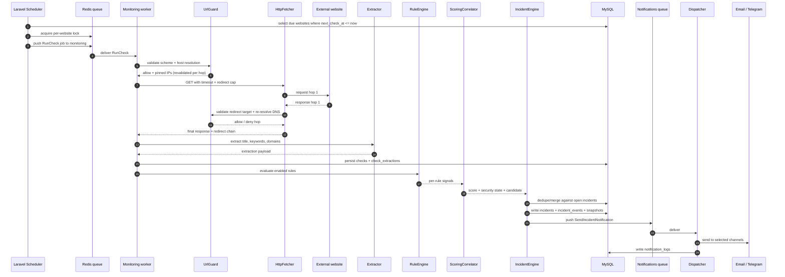

---

## 5. Monitoring Flow

Cadence -> **due-website selection with locking** -> one job per website -> bounded fetch ->
extraction -> persist. Locking prevents double-dispatch if the scheduler tick overlaps with a
slow run or a second scheduler replica exists.

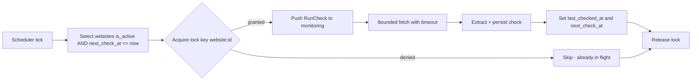

Details:

- **Due selection** — `SELECT id FROM websites WHERE is_active = 1 AND next_check_at <= UTC_NOW() AND locked_at IS NULL OR locked_at < stale_threshold`.
- **Locking** — a Redis lock keyed per website plus `websites.locked_at`/`websites.lock_token` as a durable fallback for cross-replica coordination. Locks auto-expire to avoid permanent starvation after a crashed worker.
- **Job per website** — one enqueued job per due website so retries and timeouts stay isolated.
- **Bounded fetch** — connect/response timeouts, redirect hop cap, max body bytes.
- **Persist** — one `checks` row + one `check_extractions` row per cycle.

### 5.1 Overlapping checks & idempotency

Each job carries a check identity derived from `website_id` + scheduled slot. If a job is retried
after a partial failure, the engine will upsert by that identity rather than insert a duplicate.
Sustained overlap is avoided by the lock; transient overlap is tolerated by idempotent upsert.

---

## 6. Detection Flow

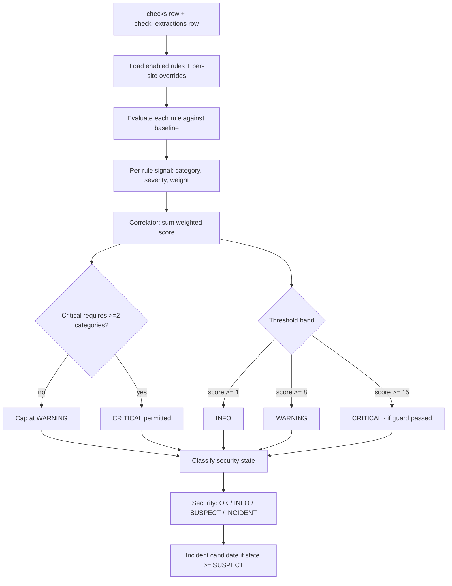

Rules:

- **Independent signal categories** are the correlation unit; the guard counts *distinct
  categories*, not distinct rules.
- Thresholds are fixed: `INFO >= 1`, `WARNING >= 8`, `CRITICAL >= 15`.
- Availability is evaluated separately and yields `UP|DOWN`; it is orthogonal to the security state.

---

## 7. Incident Flow

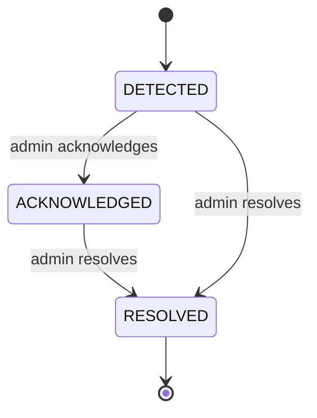

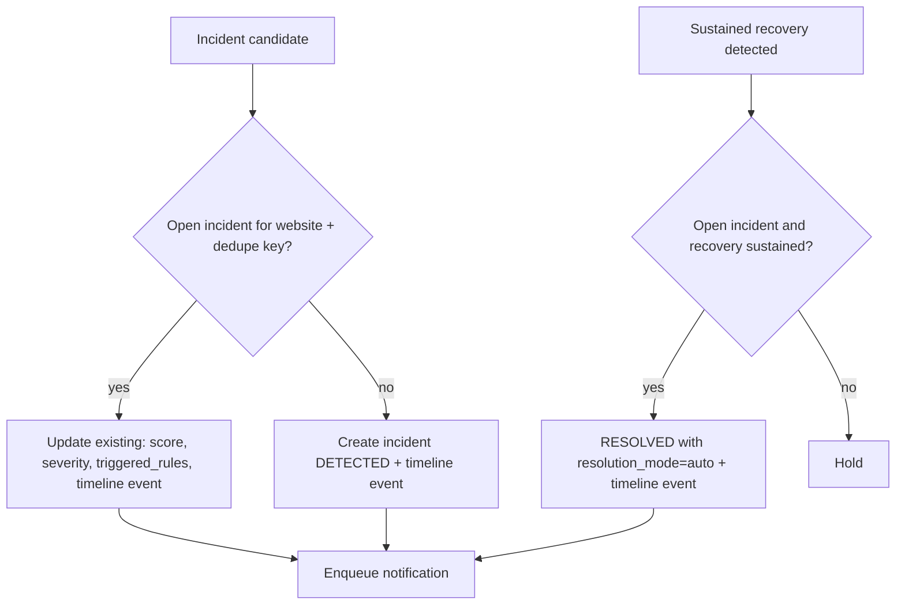

Lifecycle is exactly `DETECTED -> ACKNOWLEDGED -> RESOLVED`. `RESOLVED` is terminal. Recurrence
opens a **new** incident (new `incidents` row) rather than reopening the old one. Auto-resolution
requires **sustained recovery** and is logged with `resolution_mode = auto`.

---

## 8. Notification Flow

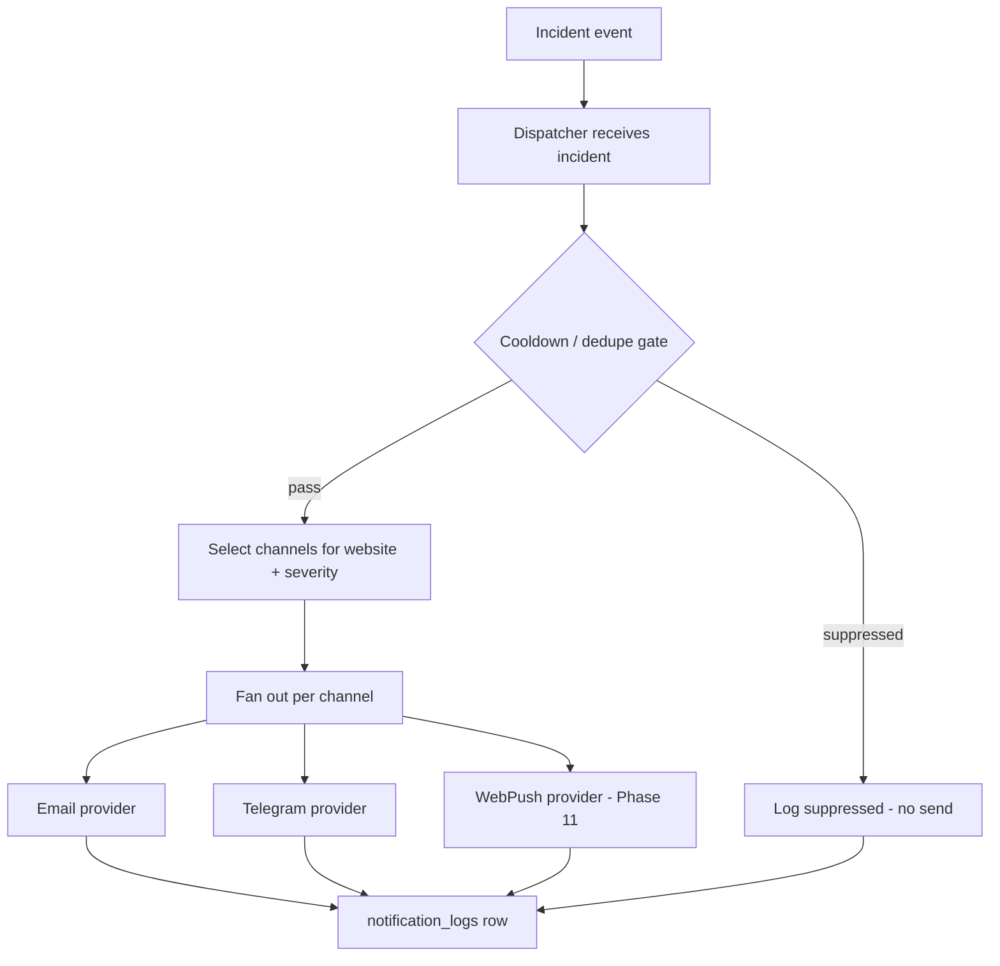

- **Dedupe / cooldown gate** — suppresses repeat notifications for the same incident within the
  cooldown window, keyed by incident + channel + event kind.
- **Channel selection** — global channels plus optional per-website scoping via
  `website_notification_channel`. Absence of pivot rows means all enabled globals.
- **Providers** — MVP supports Email and Telegram; WhatsApp and Webhook are Future and must not
  be built now. **Browser Push** (`WebPushProvider`, Phase 11 — planned) implements the same contract
  and is registered in `NotificationProviderRegistry`; the dispatcher and incident engine require
  **no change** (see §14.1 and [`NOTIFICATIONS.md`](NOTIFICATIONS.md) §7.3).
- **Delivery log** — every attempt writes a `notification_logs` row (sent, failed, or suppressed).
- **Implemented paths (Phase 7, PLAN wins over old names)** — contract
  `app/Contracts/NotificationProvider.php`, dispatcher
  `app/Services/Notifications/NotificationDispatcher.php`, providers
  `app/Services/Notifications/Channels/*`, intents/jobs `app/Services/Notifications/NotificationIntents.php`
  plus `app/Jobs/DispatchIncidentNotifications.php` and `app/Jobs/SendNotification.php`.

---

## 9. Authentication Flow

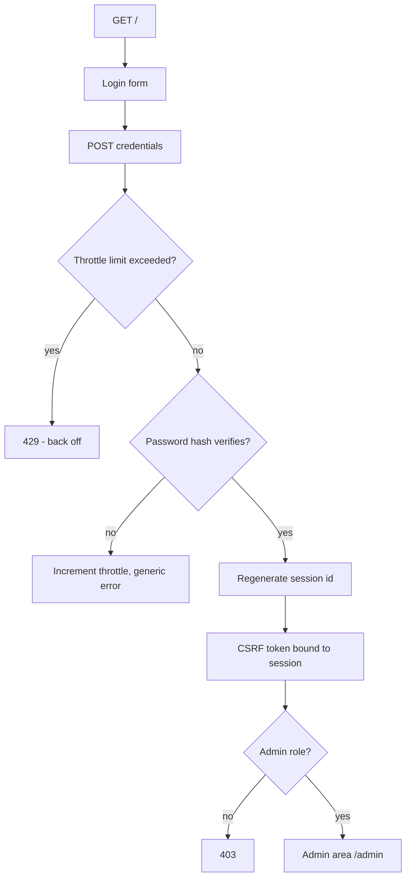

- Session-based authentication; **no public registration** — an admin is provisioned out of band.
- Login is throttled per IP + identity.
- Passwords stored with a modern one-way hash (see `DECISIONS.md` ADR-018).
- All admin routes sit behind an admin-only gate; `/` is login, `/admin` is the admin area.

---

## 10. Status Page Flow

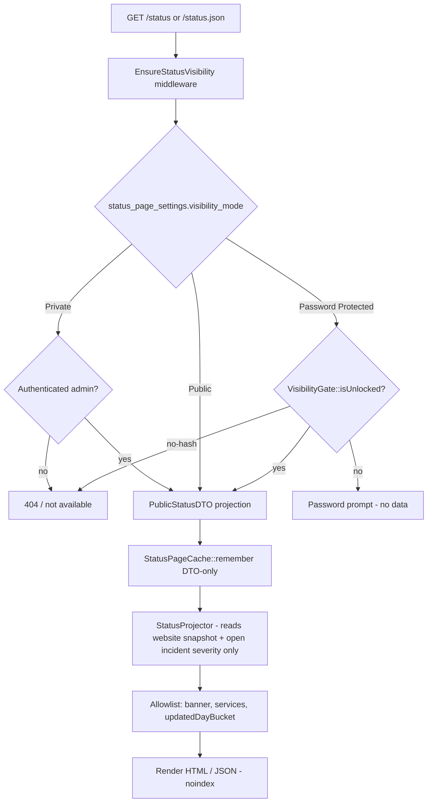

The public projection exposes availability and coarse status only. Security detail, technical
metadata, rule names, scores, and snapshot artifacts are stripped (see `DECISIONS.md` ADR-013).

### 10.1 Components (Phase 8, as implemented)

| Component | Path | Responsibility |
| --- | --- | --- |
| Controller | `app/Http/Controllers/StatusPageController.php` | Thin: `show` (HTML), `json` (`/status.json`), `unlock`, `logout`; sets `noindex` + cache-control |
| Middleware (visibility) | `app/Http/Middleware/EnsureStatusVisibility.php` | Single gate for HTML + JSON; locked password mode renders the form only; private/no-hash → `404` |
| Middleware (throttle) | `app/Http/Middleware/ThrottleStatusUnlock.php` | 5 attempts / 10 min per `ip+session`; `429` + `Retry-After` |
| Visibility decision | `app/Services/StatusPage/VisibilityGate.php` | Mode decision + unlock session-stamp check (`status_page.unlocked_at` / `settings_updated_at`) |
| Unlock | `app/Services/StatusPage/StatusPageUnlockService.php` | `Hash::check`, writes the three session keys, clears the throttle, audits failures |
| Projection | `app/Services/StatusPage/StatusProjector.php` | The single redaction chokepoint; reads `websites` snapshot columns + open incident severity only |
| DTO | `app/Services/StatusPage/PublicStatusDTO.php` | Allowlist view model: `banner`, `services[]`, `updatedDayBucket` |
| Cache | `app/Services/StatusPage/StatusPageCache.php` | DTO-only cache (`status:projection:v1:{modeHash}:{stamp}`); `bust()` post-commit |
| Model | `app/Models/StatusPageSetting.php` | `singleton()` (first-or-create `id=1`), mode predicates |
| Admin controller | `app/Http/Controllers/Admin/StatusPageSettingController.php` | Edit/update mode, password, branding, per-website publish + alias; audits + busts cache |
| Request | `app/Http/Requests/UpdateStatusPageSettingsRequest.php` | Fail-closed validation (`confirm_public`, password required for password mode) |

### 10.2 Cache flow

1. `StatusPageCache::remember()` computes key `status:projection:v1:{sha1(mode)}:{updated_at}` with TTL
   `max(60, min(published check_interval_seconds))`.
2. On a miss it calls `StatusProjector::project()` — which reads only the `websites` snapshot columns
   (`status_availability`, `status_security`, `last_checked_at`) and open incident **severity** — and
   stores the resulting `PublicStatusDTO`.
3. The DTO is the only cached artefact; no raw row is ever cached, so a cache read cannot leak an
   unprojected field (STATUS-PAGE.md §9.1).
4. `StatusPageCache::bust()` is invoked **post-commit** and failure-isolated (`try/catch` + `report`)
   from `IncidentEngine`, `IncidentStateMachine::apply()`, and the admin settings save. An admin save
   also advances `updated_at`, rolling the key forward.

### 10.3 No-probe / no-notify plane

The status page lives entirely on the **web/UI plane**. It performs **no outbound HTTP fetch** (no
SSRF surface, no probe), enqueues **no jobs**, and dispatches **no notifications** — rendering is a
read of already-persisted snapshot columns plus the projection cache. This keeps the status page
cheap and safe as the only high-traffic public endpoint (STATUS-PAGE.md §9.3, §10.1).

### 10.4 Multiple status pages (Phase 11 — planned, `ADR-031`)

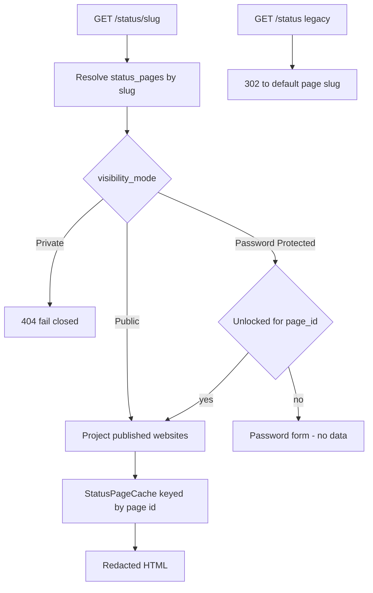

- Admin CRUD at **`/admin/status-pages`** (`index`/`create`/`store`/`edit`/`update`/`destroy`)
  behind **auth + admin**.
- A website's page is `websites.status_page_id`; NULL falls back to the default page
  (`status_pages.is_default = 1`).
- The unlock session is keyed per page (`status_unlock.{page_id}`); the cache key includes the page
  id; the redaction boundary is enforced per page and is unchanged (STATUS-PAGE.md §1.4, §4).

---

## 11. SSRF Security Architecture

Layered defense applied on **every hop**, including each redirect.

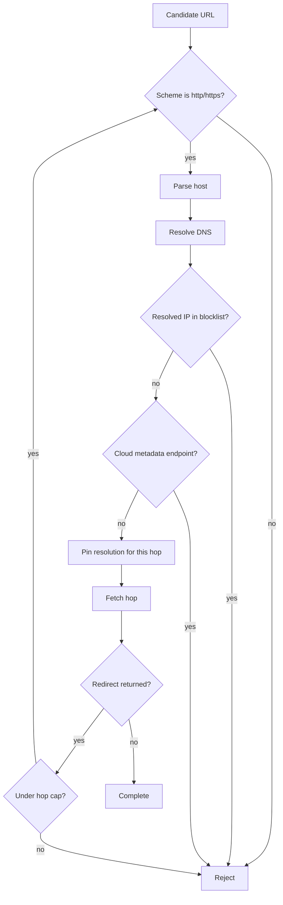

- **Scheme allowlist** — only `http` and `https`.
- **Blocklist** — localhost/loopback, private RFC1918, link-local, unique-local, and cloud
  metadata endpoints such as `169.254.169.254`.
- **DNS rebinding mitigation** — DNS is re-resolved on **every** redirect hop and the resolved
  address is validated before the connection; the resolution used for validation is the resolution
  used for the request for that hop, preventing a TOCTOU swap between validate and connect.
- **Redirect validation + hop cap** — each redirect target re-enters the pipeline at the scheme step.

---

## 12. Scheduler / Worker Architecture

- **Scheduler strategy** — a single Laravel Scheduler process drives cadence. It will own due
  selection, lock acquisition, and maintenance dispatch. It never blocks on a probe.
- **Queue strategy** — Laravel Queue on Redis with named queues: `monitoring`, `notifications`,
  `maintenance`, plus `default` for miscellaneous work.
- **Retry strategy** — bounded retries with backoff per queue; retries are idempotent because check
  identity derives from website + scheduled slot.
- **Timeout strategy** — per-job timeout shorter than the queue visibility/retry window so a hung
  job cannot block a worker indefinitely.
- **Concurrency** — monitoring workers scale horizontally; `monitoring` concurrency is capped to
  limit outbound fan-out and protect target sites.
- **Rate limiting** — per-host outbound rate limiting in the probe layer, plus login throttling in
  the web plane.
- **Failure handling** — terminal failures are recorded on the check row (`error_type`,
  `error_message`) and fed to the detector as an availability signal; failed jobs land in
  `failed_jobs`.
- **Idempotency & overlapping checks** — Redis locks plus durable `websites.locked_at`/`lock_token`
  prevent double-dispatch; upsert by check identity prevents duplicate rows.
- **Plane isolation** — scheduler and workers run as separate processes/containers from the web
  plane, so slow probes never consume web request slots.

---

## 13. Deployment Architecture

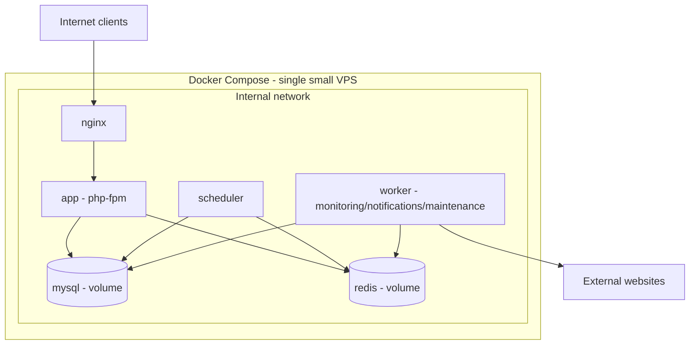

- **Services** — `nginx`, `app` (php-fpm), `worker`, `scheduler`, `mysql`, `redis`.
- **Volumes** — persistent volumes for MySQL data, Redis append-only data, and application logs.
- **Networks** — a single internal network; only Nginx is exposed to the host.
- **Env config** — DB/Redis credentials, `APP_KEY`, mail credentials, Telegram bot token and chat
  id, retention overrides. Secrets come from environment variables, never from committed files.
- **Sizing guidance** — a single small VPS is sufficient at MVP scale; MySQL and Redis run on the
  same host. Horizontal scaling, if ever needed, is achieved by adding worker replicas first.
- **Separation** — the scheduler and worker containers stay out of the web request path; Nginx
  only talks to `app`.

---

## 14. Phase 11 Components & Flows (implemented)

> **Implemented (Phase 11).** These components are realised per [`DECISIONS.md`](DECISIONS.md)
> `ADR-031`–`ADR-034`; the names below are the frozen names the implementation uses.

### 14.1 Browser Push subscription registration + `WebPushProvider`

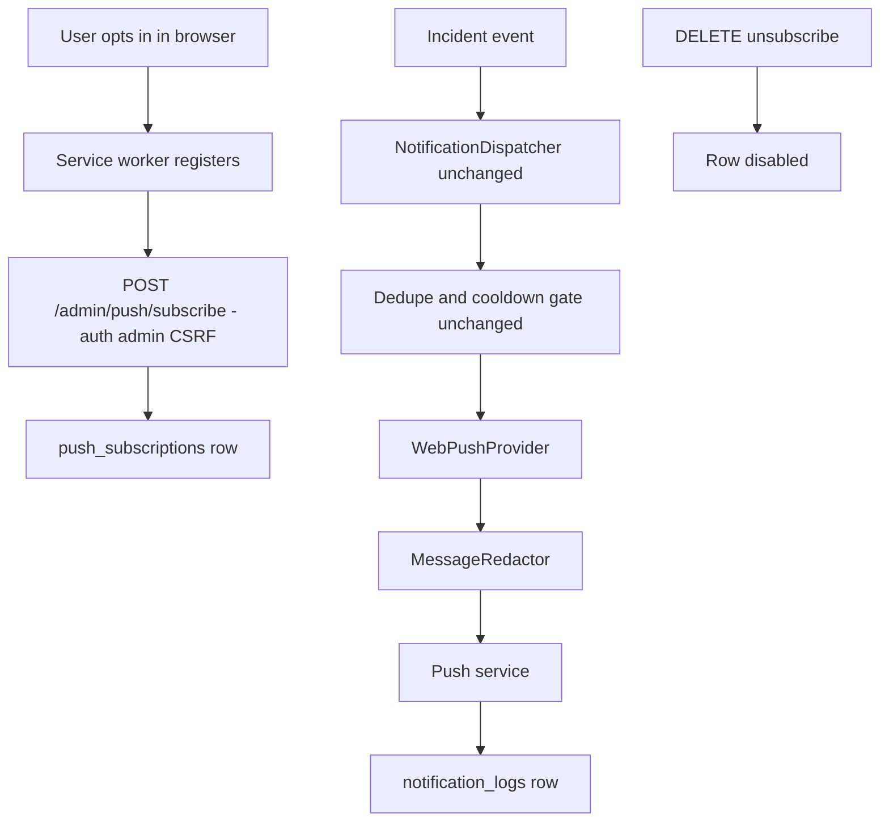

- `WebPushProvider` implements the **same contract** as `EmailProvider`/`TelegramProvider`
  (`app/Contracts/NotificationProvider.php`) and is registered in `NotificationProviderRegistry`;
  the `IncidentEngine` is **not modified**.
- VAPID keys from `config/sentinel.php` + env (`VAPID_PUBLIC_KEY`, `VAPID_PRIVATE_KEY`,
  `VAPID_SUBJECT`); the private key is **never logged**.
- Service worker at `public/` (push event + notificationclick); opt-in JS in `resources/js/app.js`.
- Dedup/cooldown via the existing `NotificationDispatcher` is **unchanged**
  ([`NOTIFICATIONS.md`](NOTIFICATIONS.md) §7.3).

### 14.2 Theme bootstrap (Light / Dark / System)

- Tailwind v4 class-based dark variant via `@custom-variant dark`.
- Persistence via `localStorage` + cookie; a **no-FOUC inline bootstrap script** in the Blade
  `<head>` applies the theme before first paint.
- `data-theme` / `.dark` are applied to `<html>`; the three-state control includes System, which
  follows `prefers-color-scheme`. Tokens are defined in `resources/css/app.css`.

### 14.3 Shared UI primitives

All primitives consume the semantic token layer (`:root` / `.dark` / `@theme inline` in
`resources/css/app.css`) and therefore need **no** `dark:`-duplicated colours — one source of truth,
correct in both themes (ADR-033).

- **Shell** — `x-admin-layout` (collapsible sidebar + top bar + `<main>`, ADR-036), `x-admin-sidebar`
  (grouped nav from real named routes, shared by the desktop rail and the mobile drawer),
  `x-theme-switcher` (icon-only Light/Dark/System dropdown, ADR-033) and `x-profile-dropdown`
  (initials avatar → identity + links + real POST logout).
- **Structure** — `x-ui.card` (header/actions/body), `x-ui.table` (+ `x-ui.table-head` /
  `x-ui.table-body` / `x-ui.table-empty`, each table rendering its own `overflow-x-auto` container so
  wide tables never push the page into horizontal overflow), and the dark-safe pagination override at
  `resources/views/vendor/pagination/tailwind.blade.php`.
- **Controls** — `x-ui.button` (primary / secondary / outline / ghost / danger / success / warning,
  `iconOnly` + `aria-label` for icon-only actions), `x-ui.input`, `x-ui.select`, `x-ui.textarea`,
  `x-ui.checkbox`, `x-ui.radio`, and `x-form.field` (label + help icon with hover tooltip **and** click
  modal + error + hint).
- **Feedback** — `x-ui.alert`, `x-ui.badge`, `x-ui.empty-state`, `x-ui.skeleton`, `x-modal`
  (Alpine-based; delete confirm, help, bulk actions), and the `x-per-page` selector (10 / 20 / 50 / 100
  / All, preserving the query string, backed by a shared controller-side validated per-page whitelist
  helper).
- **Icons** — `x-ui.icon` (name → inline SVG, `stroke="currentColor"` + `aria-hidden="true"` so
  colour/contrast is inherited from the surrounding semantic text colour and works in both themes;
  ADR-037). Icons are the shared primitive for later phases; existing views are migrated to it in
  those phases, not here.
- Icon-button convention for row actions with accessible `aria-label`; **delete is always gated by a
  confirmation modal**.

### 14.4 Phase A foundations — analytics, in-app notifications, status-page refresh (ADR-037–040)

> **Foundations (Phase A).** These are the architectural additions recorded in
> [`DECISIONS.md`](DECISIONS.md) `ADR-037`–`ADR-040`; the owning phase is [`PLAN.md`](PLAN.md) Phase A.

- **Analytics / charts (ADR-037)** — visualisations are **server-rendered inline SVG from Blade**,
  driven by data read on the web/UI plane. **No JS chart library** and no new dependency; the only
  interactivity is Alpine local display state. Charts render from **persisted rows only** — **no
  fabricated/historical data**; an empty dataset renders an explicit empty state.
- **In-app admin notification centre (ADR-038)** — `admin_notifications` ([`DATABASE.md`](DATABASE.md)
  §3.24) persisted **per admin**, generated from the existing incident/security/config events already
  written to `audit_logs`. It is **decoupled from outbound delivery**: not a provider, not on the
  `notifications` queue, no `notification_logs` coupling. Deduped via `uq_admin_notifications_dedupe_key`;
  read/unread via `read_at`; ownership scoped to the authenticated admin; `link_url` is an internal
  relative path only. See [`NOTIFICATIONS.md`](NOTIFICATIONS.md) §15.
- **Public status-page auto-refresh (ADR-039)** — **client-side periodic refresh** of the existing
  status route/DTO. Intervals **1 / 5 / 10 / 30 / 60 minutes**, countdown, **non-overlapping**
  requests, **paused while hidden**. No real-time infrastructure, no new route, no outbound probe;
  progressive enhancement only (the page is complete with JS disabled).
- **Precise last-update timestamp (ADR-040)** — the public status DTO gains an **allowlisted UTC
  ISO-8601** timestamp (projection generation stamp only, not an incident/check time), rendered in the
  visitor's **local timezone** as `Last update: H:i dd/mm/yyyy`. It passes the same redaction
  chokepoint (§10, [`STATUS-PAGE.md`](STATUS-PAGE.md) §4, §8.2).

---

## 15. Diagram Conventions

- All diagrams are **Mermaid** and must render on GitHub.
- Node labels avoid double quotes and parentheses inside square brackets to prevent parse errors.
- Table and column names shown in diagrams are the frozen names defined in [`DATABASE.md`](DATABASE.md).
