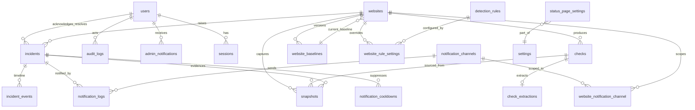

# DATABASE.md — SiteSentinel — Website Monitoring & Security Alerts

> **Specification only.** Nothing described in this document has been implemented.
> No migrations exist. Every statement is future/conditional ("the table will…", "Phase 3 adds…").
> Table and column names here are the frozen single source of truth used by
> [`ARCHITECTURE.md`](ARCHITECTURE.md) and [`DECISIONS.md`](DECISIONS.md).

---

## 1. Conventions

| Topic | Decision |
| --- | --- |
| Engine | MySQL 8, InnoDB |
| Charset / collation | `utf8mb4` / `utf8mb4_unicode_ci` |
| Timestamps | Stored in **UTC**; all `*_at` columns are UTC |
| Identifier case | `snake_case` for tables/columns; no reserved words |
| Table naming | **Plural** table names (`websites`, `checks`, `incidents`) |
| Primary keys | `id` `BIGINT UNSIGNED` auto-increment unless noted |
| Foreign keys | `{singular_table}_id` e.g. `website_id`, `incident_id`, `channel_id` |
| FK constraint names | `fk_{table}_{column}`; unique `uq_{table}_{column}`; index `idx_{table}_{column}` |
| Soft deletes | `deleted_at` **only** on user-authored/administrative tables (`websites`, `notification_channels`, `detection_rules` when disabled-then-hidden). High-volume telemetry (`checks`, `snapshots`, `notification_logs`) uses **hard deletes** via retention. |
| Enum strategy | MySQL `ENUM` for small, stable, closed sets (severity, security state, lifecycle). Lookup tables for open/extensible sets (rule registry lives in `detection_rules`). |
| JSON | MySQL `JSON` columns for structured payloads (redirect chains, extraction lists, metadata) |
| Money/decimals | none at MVP |

### 1.1 Frozen table-name list

`users`, `password_reset_tokens`, `sessions`, `websites`, `website_baselines`, `checks`,
`check_extractions`, `detection_rules`, `website_rule_settings`, `incidents`, `incident_events`,
`snapshots`, `notification_channels`, `website_notification_channel`, `notification_logs`,
`notification_cooldowns`, `status_pages`, `push_subscriptions`, `settings`,
`status_page_settings`, `audit_logs`, `admin_notifications`, `jobs`, `failed_jobs`, `cache`,
`cache_locks`.

`personal_access_tokens` — **N/A**: SiteSentinel is session-based admin-only (see
`DECISIONS.md` ADR-018) and does not expose an API at MVP, so no token table is required.

---

## 2. ER Diagram

---

## 3. Full Table Specifications

### 3.1 `users`

Purpose: admin accounts (MVP). Extensible to more roles later.

| Column | Type | Null | Default | Notes |
| --- | --- | --- | --- | --- |
| `id` | BIGINT UNSIGNED | no | auto | PK |
| `name` | VARCHAR(255) | no | — | display name |
| `email` | VARCHAR(255) | no | — | unique login identity |
| `password` | VARCHAR(255) | no | — | hash |
| `role` | ENUM('admin') | no | `admin` | extensible |
| `is_active` | TINYINT(1) | no | 1 | disable account |
| `email_verified_at` | TIMESTAMP | yes | NULL | reserved |
| `last_login_at` | TIMESTAMP | yes | NULL | audit |
| `created_at`/`updated_at` | TIMESTAMP | yes | NULL | standard |

Keys/indexes: PK `id`; `uq_users_email` (`email`).
Relationships: `incidents.acknowledged_by`, `incidents.resolved_by`, `audit_logs.user_id`,
`sessions.user_id`.

### 3.2 `password_reset_tokens`

Purpose: password reset flow. **Included** because admin password recovery is expected; if the
project decides to provision admins out of band only, this table can be dropped.

| Column | Type | Null | Default |
| --- | --- | --- | --- |
| `email` | VARCHAR(255) | no | — (PK) |
| `token` | VARCHAR(255) | no | — |
| `created_at` | TIMESTAMP | yes | NULL |

Keys: PK `email`.

### 3.3 `sessions`

Purpose: server-side session store (Laravel database session driver recommended over Redis so
sessions survive Redis restarts and stay auditable).

| Column | Type | Null | Default |
| --- | --- | --- | --- |
| `id` | VARCHAR(255) | no | — (PK) |
| `user_id` | BIGINT UNSIGNED | yes | NULL |
| `ip_address` | VARCHAR(45) | yes | NULL |
| `user_agent` | TEXT | yes | NULL |
| `payload` | LONGTEXT | no | — |
| `last_activity` | INTEGER | no | — |

Keys: PK `id`; `idx_sessions_user_id`; `idx_sessions_last_activity`.

Decision note: if the team prefers the Redis session driver instead, the `sessions` table becomes
unused. This document selects **database sessions** (see `DECISIONS.md` Open Questions).

### 3.4 `websites`

Purpose: monitored websites and their monitoring configuration/state.

| Column | Type | Null | Default | Notes |
| --- | --- | --- | --- | --- |
| `id` | BIGINT UNSIGNED | no | auto | PK |
| `name` | VARCHAR(255) | no | — | label |
| `url` | VARCHAR(2048) | no | — | target URL |
| `scheme` | VARCHAR(10) | no | — | http/https |
| `host` | VARCHAR(255) | no | — | normalized host |
| `is_active` | TINYINT(1) | no | 1 | monitoring on/off |
| `is_visible_on_status` | TINYINT(1) | no | 0 | status page publish toggle (Phase 8) |
| `status_alias` | VARCHAR(255) | yes | NULL | public display alias (Phase 8, display mapping only) |
| `check_interval_seconds` | INT UNSIGNED | no | 300 | cadence |
| `timeout_seconds` | SMALLINT UNSIGNED | no | 10 | per request |
| `expected_status` | SMALLINT UNSIGNED | no | 200 | expected HTTP status |
| `expected_title` | VARCHAR(512) | yes | NULL | expected page title |
| `expected_final_domain` | VARCHAR(255) | yes | NULL | expected redirect domain |
| `follow_redirects` | TINYINT(1) | no | 1 | follow redirects (1) or treat as final (0) — `FR-22` |
| `note` | TEXT | yes | NULL | free-text operator note (admin-only) — `FR-14` |
| `monitor_ssl` | TINYINT(1) | no | 1 | SSL checks on/off |
| `monitor_redirects` | TINYINT(1) | no | 1 | redirect checks on/off |
| `monitor_content` | TINYINT(1) | no | 1 | content family toggle |
| `monitor_security` | TINYINT(1) | no | 1 | security checks on/off |
| `current_baseline_id` | BIGINT UNSIGNED | yes | NULL | FK current baseline |
| `status_page_id` | BIGINT UNSIGNED | yes | NULL | FK status page; NULL falls back to default page (Phase 11) |
| `status_availability` | ENUM('UP','DOWN') | yes | NULL | snapshot |
| `status_security` | ENUM('OK','INFO','SUSPECT','INCIDENT') | yes | NULL | snapshot |
| `last_checked_at` | TIMESTAMP | yes | NULL | snapshot |
| `next_check_at` | TIMESTAMP | yes | NULL | due selector |
| `last_lock_token` | CHAR(36) | yes | NULL | lock |
| `locked_at` | TIMESTAMP | yes | NULL | lock |
| `consecutive_failures` | INT UNSIGNED | no | 0 | recovery logic |
| `consecutive_successes` | INT UNSIGNED | no | 0 | recovery logic |
| `created_at`/`updated_at` | TIMESTAMP | yes | NULL | standard |
| `deleted_at` | TIMESTAMP | yes | NULL | soft delete |

Keys/indexes: PK `id`; FK `current_baseline_id` -> `website_baselines.id`;
FK `status_page_id` -> `status_pages.id` ON DELETE SET NULL;
`idx_websites_next_check_at` (`next_check_at`); `idx_websites_is_active_next_check_at`
(`is_active`,`next_check_at`); `idx_websites_locked_at` (`locked_at`); `uq_websites_url` (`url`,
**decision: enforce unique normalized URL** — see §7 Data Integrity);
`idx_websites_visible_status` (`is_active`,`is_visible_on_status`) (Phase 8 status page publish filter).

### 3.5 `website_baselines`

Purpose: immutable, versioned baseline snapshot used as comparison source of truth.

| Column | Type | Null | Default |
| --- | --- | --- | --- |
| `id` | BIGINT UNSIGNED | no | auto |
| `website_id` | BIGINT UNSIGNED | no | — |
| `version` | INT UNSIGNED | no | 1 |
| `is_active` | TINYINT(1) | no | 1 |
| `http_status` | SMALLINT UNSIGNED | yes | NULL |
| `final_url` | VARCHAR(2048) | yes | NULL |
| `title` | VARCHAR(512) | yes | NULL |
| `content_hash` | CHAR(64) | yes | NULL |
| `hash_algorithm` | VARCHAR(20) | no | `sha256` |
| `keyword_counts` | JSON | yes | NULL |
| `external_link_count` | INT UNSIGNED | no | 0 |
| `ssl_valid` | TINYINT(1) | yes | NULL |
| `ssl_issuer` | VARCHAR(255) | yes | NULL |
| `ssl_expires_at` | TIMESTAMP | yes | NULL |
| `captured_at` | TIMESTAMP | no | — |
| `created_at`/`updated_at` | TIMESTAMP | yes | NULL |

Keys/indexes: PK `id`; FK `website_id`; `uq_website_baselines_website_version`
(`website_id`,`version`); `idx_website_baselines_website_active` (`website_id`,`is_active`).

### 3.6 `checks`

Purpose: one row per monitoring cycle result — the primary telemetry record.

| Column | Type | Null | Default |
| --- | --- | --- | --- |
| `id` | BIGINT UNSIGNED | no | auto |
| `website_id` | BIGINT UNSIGNED | no | — |
| `check_key` | VARCHAR(128) | no | — |
| `started_at` | TIMESTAMP | no | — |
| `finished_at` | TIMESTAMP | yes | NULL |
| `duration_ms` | INT UNSIGNED | yes | NULL |
| `http_status` | SMALLINT UNSIGNED | yes | NULL |
| `final_url` | VARCHAR(2048) | yes | NULL |
| `redirect_chain` | JSON | yes | NULL |
| `response_size_bytes` | INT UNSIGNED | yes | NULL |
| `ssl_valid` | TINYINT(1) | yes | NULL |
| `ssl_issuer` | VARCHAR(255) | yes | NULL |
| `ssl_expires_at` | TIMESTAMP | yes | NULL |
| `title` | VARCHAR(512) | yes | NULL |
| `content_hash` | CHAR(64) | yes | NULL |
| `error_type` | VARCHAR(64) | yes | NULL |
| `error_message` | TEXT | yes | NULL |
| `availability_state` | ENUM('UP','DOWN') | yes | NULL |
| `security_state` | ENUM('OK','INFO','SUSPECT','INCIDENT') | yes | NULL |
| `score` | INT UNSIGNED | no | 0 |
| `triggered_rules` | JSON | yes | NULL |
| `created_at`/`updated_at` | TIMESTAMP | yes | NULL |

Keys/indexes: PK `id`; FK `website_id`; `uq_checks_check_key` (`check_key`);
`idx_checks_website_started_at` (`website_id`,`started_at`); `idx_checks_created_at`
(`created_at`) for pruning; `idx_checks_availability_state` (`availability_state`).

> **`triggered_rules`** (added in Phase 5) records the fired signals verbatim as
> `{ "<RULE-ID>": { category, weight, confidence, reason } }` so attribution is reviewable
> (`FR-49`, `DETECTION-RULES.md` §6.1) and so the §6.4 decay arithmetic can carry prior
> signals forward at their own per-signal weights rather than from an aggregate score.
> It is the rule-attribution analogue of `incidents.triggered_rules` and does not
> duplicate any existing column.

### 3.7 `check_extractions`

Purpose: structured extraction artifacts per check. **Decision: separate table, not JSON folded
into `checks`.** Tradeoff: a separate table keeps hot `checks` rows narrow (fast list queries) and
lets extraction rows be pruned independently/queried by keyword, at the cost of one extra join and
slightly more insert overhead per cycle. Selected because keyword/domain queries are a core
detection input.

| Column | Type | Null | Default |
| --- | --- | --- | --- |
| `id` | BIGINT UNSIGNED | no | auto |
| `check_id` | BIGINT UNSIGNED | no | — |
| `website_id` | BIGINT UNSIGNED | no | — |
| `keywords` | JSON | yes | NULL |
| `external_domains` | JSON | yes | NULL |
| `suspicious_patterns` | JSON | yes | NULL |
| `created_at` | TIMESTAMP | yes | NULL |

Keys/indexes: PK `id`; FK `check_id` -> `checks.id` **ON DELETE CASCADE**;
`idx_check_extractions_website_id`; `uq_check_extractions_check_id` (`check_id`).

### 3.8 `detection_rules`

Purpose: rule registry (code-defined rules mirrored to DB for configuration + weights).

| Column | Type | Null | Default |
| --- | --- | --- | --- |
| `id` | BIGINT UNSIGNED | no | auto |
| `rule_id` | VARCHAR(64) | no | — |
| `name` | VARCHAR(255) | no | — |
| `category` | VARCHAR(64) | no | — |
| `severity` | ENUM('INFO','WARNING','CRITICAL') | no | `INFO` |
| `default_weight` | INT UNSIGNED | no | 1 |
| `enabled` | TINYINT(1) | no | 1 |
| `config` | JSON | yes | NULL |
| `created_at`/`updated_at` | TIMESTAMP | yes | NULL |

Keys/indexes: PK `id`; `uq_detection_rules_rule_id` (`rule_id`);
`idx_detection_rules_category` (`category`); `idx_detection_rules_enabled` (`enabled`).

### 3.9 `website_rule_settings`

Purpose: per-website overrides of rules.

| Column | Type | Null | Default |
| --- | --- | --- | --- |
| `id` | BIGINT UNSIGNED | no | auto |
| `website_id` | BIGINT UNSIGNED | no | — |
| `detection_rule_id` | BIGINT UNSIGNED | no | — |
| `enabled` | TINYINT(1) | yes | NULL |
| `weight_override` | INT UNSIGNED | yes | NULL |
| `threshold_override` | INT UNSIGNED | yes | NULL |
| `ignored_keywords` | JSON | yes | NULL |
| `created_at`/`updated_at` | TIMESTAMP | yes | NULL |

Keys/indexes: PK `id`; FKs `website_id`, `detection_rule_id`;
`uq_website_rule_settings_website_rule` (`website_id`,`detection_rule_id`).

### 3.10 `incidents`

Purpose: incident lifecycle record.

| Column | Type | Null | Default |
| --- | --- | --- | --- |
| `id` | BIGINT UNSIGNED | no | auto |
| `website_id` | BIGINT UNSIGNED | no | — |
| `type` | ENUM('availability','security') | no | — |
| `category` | VARCHAR(64) | yes | NULL |
| `severity` | ENUM('INFO','WARNING','CRITICAL') | no | — |
| `status` | ENUM('DETECTED','ACKNOWLEDGED','RESOLVED') | no | `DETECTED` |
| `score` | INT UNSIGNED | no | 0 |
| `triggered_rules` | JSON | yes | NULL |
| `message` | TEXT | yes | NULL |
| `technical_metadata` | JSON | yes | NULL |
| `dedupe_key` | VARCHAR(191) | no | — |
| `detected_at` | TIMESTAMP | no | — |
| `acknowledged_at` | TIMESTAMP | yes | NULL |
| `acknowledged_by` | BIGINT UNSIGNED | yes | NULL |
| `resolved_at` | TIMESTAMP | yes | NULL |
| `resolved_by` | BIGINT UNSIGNED | yes | NULL |
| `resolution_mode` | ENUM('manual','auto') | yes | NULL |
| `resolution_notes` | TEXT | yes | NULL |
| `created_at`/`updated_at` | TIMESTAMP | yes | NULL |

Keys/indexes: PK `id`; FKs `website_id`, `acknowledged_by`, `resolved_by`;
`idx_incidents_website_status` (`website_id`,`status`); `idx_incidents_status_detected_at`
(`status`,`detected_at`); `idx_incidents_dedupe_key` (`dedupe_key`);
`idx_incidents_created_at` (`created_at`) for pruning.

Open-incident partial-unique approach: enforce **one open incident per `website_id` + `dedupe_key`**
at the application layer, backed by `idx_incidents_website_status`. A DB partial unique is not
available on MySQL, so the dedupe lookup uses `status IN ('DETECTED','ACKNOWLEDGED')`.

### 3.11 `incident_events`

Purpose: immutable audit trail of state transitions and notes.

| Column | Type | Null | Default |
| --- | --- | --- | --- |
| `id` | BIGINT UNSIGNED | no | auto |
| `incident_id` | BIGINT UNSIGNED | no | — |
| `event_type` | VARCHAR(64) | no | — |
| `from_status` | ENUM('DETECTED','ACKNOWLEDGED','RESOLVED') | yes | NULL |
| `to_status` | ENUM('DETECTED','ACKNOWLEDGED','RESOLVED') | yes | NULL |
| `actor_user_id` | BIGINT UNSIGNED | yes | NULL |
| `note` | TEXT | yes | NULL |
| `metadata` | JSON | yes | NULL |
| `created_at` | TIMESTAMP | no | — |

Keys/indexes: PK `id`; FK `incident_id` **ON DELETE CASCADE**;
`idx_incident_events_incident_created_at` (`incident_id`,`created_at`); FK `actor_user_id`.

### 3.12 `snapshots`

Purpose: evidence artifact. **Decision: HTML stored on the filesystem, path recorded in DB.**
Tradeoff: DB BLOB keeps backup/restore atomic and simpler, but bloats the database and hurts
pruning/backup performance at high volume; filesystem storage keeps MySQL lean and lets snapshots
be pruned by deleting files, at the cost of a separate backup path. Selected **filesystem path**
(`html_path`) — see `DECISIONS.md` ADR-015. Screenshot fields are deferred (Phase 2/Future).

| Column | Type | Null | Default |
| --- | --- | --- | --- |
| `id` | BIGINT UNSIGNED | no | auto |
| `website_id` | BIGINT UNSIGNED | no | — |
| `incident_id` | BIGINT UNSIGNED | yes | NULL |
| `check_id` | BIGINT UNSIGNED | yes | NULL |
| `html_path` | VARCHAR(1024) | yes | NULL |
| `headers` | JSON | yes | NULL |
| `final_url` | VARCHAR(2048) | yes | NULL |
| `title` | VARCHAR(512) | yes | NULL |
| `keywords` | JSON | yes | NULL |
| `external_links` | JSON | yes | NULL |
| `redirect_chain` | JSON | yes | NULL |
| `size_bytes` | INT UNSIGNED | yes | NULL |
| `captured_at` | TIMESTAMP | no | — |
| `expires_at` | TIMESTAMP | yes | NULL |
| `created_at` | TIMESTAMP | yes | NULL |

Keys/indexes: PK `id`; FKs `website_id`, `incident_id` (nullable), `check_id`;
`idx_snapshots_incident_id` (`incident_id`); `idx_snapshots_expires_at` (`expires_at`) for pruning;
`idx_snapshots_created_at` (`created_at`).

### 3.13 `notification_channels`

Purpose: configured delivery channels.

| Column | Type | Null | Default |
| --- | --- | --- | --- |
| `id` | BIGINT UNSIGNED | no | auto |
| `type` | ENUM('email','telegram','browser_push') | no | — |
| `name` | VARCHAR(255) | no | — |
| `enabled` | TINYINT(1) | no | 1 |
| `config` | JSON | yes | NULL |
| `secret_ref` | TEXT | yes | NULL |
| `created_at`/`updated_at` | TIMESTAMP | yes | NULL |
| `deleted_at` | TIMESTAMP | yes | NULL |

Notes: `config` holds **non-secret** settings (e.g. sender address, chat id); `secret_ref` holds an
**encrypted** provider secret (SMTP password, Telegram bot token). `browser_push` is a `type` value
whose subscription material lives in `push_subscriptions`; VAPID keys are environment/config, not
row columns. `type` remains extensible to WhatsApp/Webhook later without schema change.
Keys/indexes: PK `id`; `idx_notification_channels_type_enabled` (`type`,`enabled`).

### 3.14 `website_notification_channel`

Purpose: per-website channel scoping pivot. **Decision: per-website scoping is supported.**

| Column | Type | Null | Default |
| --- | --- | --- | --- |
| `id` | BIGINT UNSIGNED | no | auto |
| `website_id` | BIGINT UNSIGNED | no | — |
| `channel_id` | BIGINT UNSIGNED | no | — |
| `created_at` | TIMESTAMP | yes | NULL |

Keys/indexes: PK `id`; FKs `website_id`, `channel_id`; `uq_website_notification_channel`
(`website_id`,`channel_id`). Absence of rows for a website means "use all enabled global channels".

### 3.15 `notification_logs`

Purpose: one row per delivery attempt.

| Column | Type | Null | Default |
| --- | --- | --- | --- |
| `id` | BIGINT UNSIGNED | no | auto |
| `incident_id` | BIGINT UNSIGNED | yes | NULL |
| `channel_id` | BIGINT UNSIGNED | yes | NULL |
| `status` | ENUM('queued','sent','failed','suppressed') | no | `queued` |
| `attempt` | TINYINT UNSIGNED | no | 1 |
| `provider_message_id` | VARCHAR(255) | yes | NULL |
| `error` | TEXT | yes | NULL |
| `dedupe_key` | VARCHAR(191) | yes | NULL |
| `sent_at` | TIMESTAMP | yes | NULL |
| `created_at` | TIMESTAMP | yes | NULL |

Keys/indexes: PK `id`; FKs `incident_id`, `channel_id`;
`idx_notification_logs_incident_channel` (`incident_id`,`channel_id`);
`idx_notification_logs_dedupe_key` (`dedupe_key`); `idx_notification_logs_created_at`
(`created_at`) for pruning.

### 3.16 `notification_cooldowns`

Purpose: suppression state. **Decision: dedicated table**, not derived from `notification_logs`,
because cooldown windows are stateful (window start, suppression count) and reading them from logs
would require scanning hot log rows.

| Column | Type | Null | Default |
| --- | --- | --- | --- |
| `id` | BIGINT UNSIGNED | no | auto |
| `incident_id` | BIGINT UNSIGNED | yes | NULL |
| `channel_id` | BIGINT UNSIGNED | yes | NULL |
| `event_kind` | VARCHAR(64) | no | — |
| `cooldown_key` | VARCHAR(191) | no | — |
| `window_started_at` | TIMESTAMP | no | — |
| `expires_at` | TIMESTAMP | no | — |
| `suppressed_count` | INT UNSIGNED | no | 0 |
| `created_at`/`updated_at` | TIMESTAMP | yes | NULL |

Keys/indexes: PK `id`; `uq_notification_cooldowns_key` (`cooldown_key`);
`idx_notification_cooldowns_expires_at` (`expires_at`).

### 3.17 `settings`

Purpose: key/value application settings, encrypted where sensitive.

| Column | Type | Null | Default |
| --- | --- | --- | --- |
| `id` | BIGINT UNSIGNED | no | auto |
| `key` | VARCHAR(191) | no | — |
| `value` | TEXT | yes | NULL |
| `is_encrypted` | TINYINT(1) | no | 0 |
| `created_at`/`updated_at` | TIMESTAMP | yes | NULL |

Keys/indexes: PK `id`; `uq_settings_key` (`key`).

**Phase 6 (ADR-035) — implemented.** Migration `0001_12_01_000000_create_settings_table.php` creates
this table verbatim. `App\Services\Settings\SettingsRepository` is the only read/write surface: it owns
the key registry (group, type, default resolver) and resolves a missing key to a config-derived default,
so a missing row never breaks a read. `is_encrypted` is carried for forward compatibility but is **not**
used at MVP — no secret is stored here (presentational/identity settings only).

Canonical settings keys (examples): `retention.checks_days` (30, allowed 30/60/90),
`retention.incidents_days` (365), `retention.notification_logs_days` (90),
`retention.snapshots_days` (14), `scoring.threshold_info` (1), `scoring.threshold_warning` (8),
`scoring.threshold_critical` (15), `scoring.correlation_guard` (2).

### 3.18 `status_page_settings`

Purpose: status page configuration. Single logical row; may live in `settings` but is modelled
separately for clarity.

| Column | Type | Null | Default |
| --- | --- | --- | --- |
| `id` | BIGINT UNSIGNED | no | auto |
| `visibility_mode` | ENUM('Private','Public','Password Protected') | no | `Private` |
| `password_hash` | VARCHAR(255) | yes | NULL |
| `slug` | VARCHAR(191) | yes | NULL |
| `branding` | JSON | yes | NULL |
| `created_at`/`updated_at` | TIMESTAMP | yes | NULL |

Keys/indexes: PK `id`; `uq_status_page_settings_slug` (`slug`).

**Singleton (superseded).** This table holds a single logical row (id = 1). `StatusPageSetting::singleton()`
resolves it via `firstOrCreate(['id' => 1], [...])`, creating a `Private`/no-password/no-branding row
on first access — there is no seeder dependency. The Phase 8 migration
(`0001_08_01_000000_create_status_page_settings_table.php`) creates the table verbatim to this
section and adds a MySQL `CHECK (visibility_mode IN ('Private','Public','Password Protected'))`
constraint (best-effort on SQLite). `password_hash` is a one-way hash and is in the model's
`$hidden` list.

**Phase 11 — superseded by `status_pages`.** The singleton model is replaced by the multi-row
**`status_pages`** table (§3.22) per [`DECISIONS.md`](DECISIONS.md) `ADR-031`. The migration is
**additive and data-preserving**: the existing single row is migrated into one **default**
`status_pages` row. This table is retained for one release for rollback safety; no new column is
added to it.

### 3.19 `audit_logs`

Purpose: admin action + auth event audit trail.

| Column | Type | Null | Default |
| --- | --- | --- | --- |
| `id` | BIGINT UNSIGNED | no | auto |
| `user_id` | BIGINT UNSIGNED | yes | NULL |
| `event` | VARCHAR(64) | no | — |
| `subject_type` | VARCHAR(191) | yes | NULL |
| `subject_id` | BIGINT UNSIGNED | yes | NULL |
| `ip_address` | VARCHAR(45) | yes | NULL |
| `user_agent` | TEXT | yes | NULL |
| `metadata` | JSON | yes | NULL |
| `created_at` | TIMESTAMP | no | — |

Keys/indexes: PK `id`; `idx_audit_logs_user_id`; `idx_audit_logs_event_created_at`
(`event`,`created_at`); `idx_audit_logs_created_at` (`created_at`).

### 3.20 `jobs` and `failed_jobs`

Framework-managed Laravel queue tables. **Note:** these are framework-managed; the application
must not rely on their internal shape. `jobs` holds pending work when the database queue driver is
used for fallback; the primary driver is Redis. `failed_jobs` captures terminal failures.

`jobs`: `id`, `queue`, `payload`, `attempts`, `reserved_at`, `available_at`, `created_at`.
`failed_jobs`: `id`, `uuid` (unique), `connection`, `queue`, `payload`, `exception`,
`failed_at`.

### 3.21 `cache` and `cache_locks`

Framework-managed cache/lock tables (used only if the database cache driver is selected; the
primary cache/lock store is Redis). Noted for completeness.

`cache`: `key` (PK), `value`, `expiration`.
`cache_locks`: `key` (PK), `owner`, `expiration`.

### 3.22 `status_pages`

Purpose: multiple independently-configured public status pages (Phase 11, [`DECISIONS.md`](DECISIONS.md)
`ADR-031`). Replaces the singleton `status_page_settings` (§3.18). A `websites` row points at a page
via `websites.status_page_id`; a website with `status_page_id IS NULL` falls back to the row with
`is_default = 1`.

| Column | Type | Null | Default | Notes |
| --- | --- | --- | --- | --- |
| `id` | BIGINT UNSIGNED | no | auto | PK |
| `name` | VARCHAR(255) | no | — | admin-facing label |
| `slug` | VARCHAR(191) | no | — | public URL segment; UNIQUE |
| `is_default` | TINYINT(1) | no | 0 | the fallback page for unassigned websites |
| `visibility_mode` | ENUM('Private','Public','Password Protected') | no | `Private` | per-page visibility |
| `password_hash` | VARCHAR(255) | yes | NULL | one-way hash; in `$hidden` |
| `created_by` | BIGINT UNSIGNED | yes | NULL | FK `users.id` |
| `created_at`/`updated_at` | TIMESTAMP | yes | NULL | standard |

Keys/indexes: PK `id`; `uq_status_pages_slug` (`slug`); FK `created_by` -> `users.id`
ON DELETE SET NULL (an Admin's deletion does not delete the page);
`idx_status_pages_is_default` (`is_default`).

Notes: `password_hash` is a one-way hash and **never** reversible ([`SECURITY.md`](SECURITY.md) §4).
Exactly one row SHOULD have `is_default = 1`; the default row is the target of the legacy `/status`
redirect. Redaction boundary ([`STATUS-PAGE.md`](STATUS-PAGE.md) §4) is enforced identically per page.

### 3.23 `push_subscriptions`

Purpose: Web Push subscription material for the **Browser Push** notification channel (Phase 11,
[`DECISIONS.md`](DECISIONS.md) `ADR-032`). One row per registered browser subscription.

| Column | Type | Null | Default | Notes |
| --- | --- | --- | --- | --- |
| `id` | BIGINT UNSIGNED | no | auto | PK |
| `user_id` | BIGINT UNSIGNED | yes | NULL | FK `users.id`; NULL = unowned/admin-wide |
| `website_id` | BIGINT UNSIGNED | yes | NULL | FK `websites.id`; NULL = all-website subscription |
| `endpoint` | TEXT | no | — | push service endpoint; a UNIQUE hash index is computed over it |
| `p256dh` | TEXT | yes | NULL | client public key material |
| `auth` | TEXT | yes | NULL | client auth secret material |
| `user_agent` | TEXT | yes | NULL | UA at registration (diagnostics) |
| `enabled` | TINYINT(1) | no | 1 | send on/off |
| `created_at`/`updated_at` | TIMESTAMP | yes | NULL | standard |

Keys/indexes: PK `id`; FKs `user_id` -> `users.id` ON DELETE CASCADE,
`website_id` -> `websites.id` ON DELETE CASCADE; unique hash index `uq_push_subscriptions_endpoint_hash`
over the `endpoint` hash (MySQL `TEXT` cannot be uniquely indexed directly, so the migration stores a
deterministic hash column/index backing this constraint); `idx_push_subscriptions_enabled`
(`enabled`).

Implementation note: the deterministic hash column is `endpoint_hash` (SHA-256 of the raw endpoint),
added alongside `endpoint` and carrying the `uq_push_subscriptions_endpoint_hash` unique constraint. The
raw `endpoint`/`p256dh`/`auth` columns are stored encrypted (model casts) and are never queried as
lookup keys. `notification_channels.type` gains the `browser_push` value; on MySQL this is an explicit
`ENUM` alter, while SQLite (local dev/test, ADR-022) rebuilds the column via `change()`.

Notes: `endpoint`, `p256dh`, and `auth` are **subscription secrets** — never logged and never placed
in a notification payload ([`SECURITY.md`](SECURITY.md) §4). VAPID keys are **not** stored here; they
live in `config/sentinel.php` + env (`VAPID_PUBLIC_KEY`, `VAPID_PRIVATE_KEY`, `VAPID_SUBJECT`).
Payloads are redacted through `MessageRedactor` before send.

### 3.24 `admin_notifications`

Purpose: per-admin in-app notification centre (ADR-038). One row per notifiable event, **persisted
per admin** and **decoupled from outbound channel delivery** — it is not a provider, does not run on
the `notifications` queue, and does not participate in `notification_logs` suppression/cooldown. It
reuses the existing incident/security/config event catalogue (the same events written to
`audit_logs`) and adds durable read/unread state.

| Column | Type | Null | Default | Notes |
| --- | --- | --- | --- | --- |
| `id` | BIGINT UNSIGNED | no | auto | PK |
| `user_id` | BIGINT UNSIGNED | no | — | FK `users.id`; ownership/admin scope |
| `type` | VARCHAR(64) | no | — | event type (see [`NOTIFICATIONS.md`](NOTIFICATIONS.md) §15) |
| `title` | VARCHAR(255) | no | — | short display title |
| `body` | VARCHAR(500) | yes | NULL | optional short description |
| `severity` | VARCHAR(16) | yes | NULL | icon/colour hint (`info`/`success`/`warning`/`danger`) |
| `link_url` | VARCHAR(2048) | yes | NULL | **internal relative path only**; never an absolute external URL |
| `read_at` | TIMESTAMP | yes | NULL | NULL = unread |
| `dedupe_key` | VARCHAR(191) | yes | NULL | idempotency key; UNIQUE (multiple NULLs allowed) |
| `created_at`/`updated_at` | TIMESTAMP | yes | NULL | standard |

Keys/indexes: PK `id`; FK `user_id` -> `users.id` **ON DELETE CASCADE** (an admin's rows die with
the admin); `uq_admin_notifications_dedupe_key` (`dedupe_key`) for idempotent generation across
retries; `idx_admin_notifications_user_read_created` (`user_id`,`read_at`,`created_at`) for the hot
unread-count / list query.

Notes: `link_url` is validated as a **relative internal path** (never an absolute external URL), so
the centre cannot become an open-redirect surface. The table is **not** in the retention set (§4) —
it is administrative, not high-volume telemetry, and is pruned only by user deletion (cascade).

---

## 4. Retention Strategy

| Table | Retention | Mechanism |
| --- | --- | --- |
| `checks` | 30d default, configurable 30/60/90 | hard delete by `created_at` |
| `check_extractions` | follows `checks` | cascade on `checks` delete |
| `website_baselines` | indefinite | versioned; old active-marked rows retained |
| `incidents` | 365d | hard delete by `created_at` |
| `incident_events` | follows `incidents` | cascade |
| `snapshots` | 14d (also honors `expires_at`) | file delete + row delete |
| `notification_logs` | 90d | hard delete by `created_at` |
| `notification_cooldowns` | transient | delete by `expires_at` |
| `audit_logs` | not specified at MVP | retain; revisit |
| `sessions` | transient | delete by `last_activity` |

Pruning approach: a scheduled maintenance job will delete rows older than the configured window in
bounded batches, using the `created_at`/`expires_at` indexes above. Snapshots are deleted in two
steps — remove the file, then remove the row — to avoid orphaned files.

Partitioning: **do NOT partition at MVP scale.** Recommend revisiting only if a single table
exceeds tens of millions of rows; batch deletes over `created_at` indexes are sufficient at the
expected growth (§6).

---

## 5. Indexing Strategy — Hot Query Paths

| Query path | Serving index |
| --- | --- |
| Due-website lookup | `idx_websites_is_active_next_check_at` (`is_active`,`next_check_at`) |
| Lock check | `idx_websites_locked_at` |
| Latest check per website | `idx_checks_website_started_at` (`website_id`,`started_at`) |
| Incident list by website/status | `idx_incidents_website_status` |
| Open-incident dedupe lookup | `idx_incidents_dedupe_key` + `idx_incidents_website_status` |
| Incident list by status/time | `idx_incidents_status_detected_at` |
| Status page aggregation | `idx_checks_website_started_at` + `websites.status_availability` snapshot |
| Status page publish filter | `idx_websites_visible_status` (`is_active`,`is_visible_on_status`) — Phase 8 projector row selection |
| Status page by slug | `uq_status_pages_slug` (`slug`) — Phase 11 per-page routing |
| Website to status page assignment | `idx_websites_status_page_id` (`status_page_id`) — Phase 11 page scoping |
| Push subscription lookup | `uq_push_subscriptions_endpoint_hash` (hash of `endpoint`) + `idx_push_subscriptions_enabled` (`enabled`) — Phase 11 dispatch |
| Status page response band | latest `checks.duration_ms` by `idx_checks_website_started_at` (per published website) |
| Notification dedupe lookup | `idx_notification_logs_dedupe_key` + `uq_notification_cooldowns_key` |
| In-app admin notification unread list | `idx_admin_notifications_user_read_created` (`user_id`,`read_at`,`created_at`) — Phase A centre |
| In-app admin notification dedupe | `uq_admin_notifications_dedupe_key` (`dedupe_key`) — idempotent generation |
| Retention pruning | `idx_checks_created_at`, `idx_incidents_created_at`, `idx_notification_logs_created_at`, `idx_snapshots_expires_at` |

---

## 6. Growth Estimate

Assumption: N websites, mean interval I seconds. Cycles/day = N × 86400 / I. Each cycle produces
one `checks` row plus one `check_extractions` row.

| N | I | Cycles/day | `checks` rows/day | `checks` rows @ 30d |
| --- | --- | --- | --- | --- |
| 50 | 300 | 14,400 | 14,400 | ~432,000 |
| 100 | 300 | 28,800 | 28,800 | ~864,000 |
| 100 | 60 | 144,000 | 144,000 | ~4,320,000 |

At MVP scale (≤100 sites, ≥5 min cadence) `checks` stays under ~1M rows at 30d retention, which
batch deletes and the `created_at` index handle comfortably — justifying 30/60/90 as the check
retention band and confirming that partitioning is unnecessary at MVP.

---

## 7. Data Integrity Rules

- **Website URL uniqueness** — `uq_websites_url` enforces one row per normalized URL. Decision:
  enforce at DB level; normalization (scheme+host+path, lowercase host) happens before insert.
- **Cascade vs soft delete** — soft delete only on `websites`, `notification_channels`
  (and optionally `detection_rules`). Telemetry children (`check_extractions`, `incident_events`)
  cascade hard-delete with their parent. `snapshots.incident_id` is nullable and uses
  `ON DELETE SET NULL` so evidence survives incident pruning within its own window.
- **Enum vs lookup table** — enums for closed sets (`severity`, `security_state`,
  `availability_state`, `incident.status`, `resolution_mode`, `visibility_mode`). `detection_rules`
  acts as the extensible rule registry rather than a generic lookup table.
- **Cross-file consistency** — all table/column names above are binding in
  [`ARCHITECTURE.md`](ARCHITECTURE.md) and [`DECISIONS.md`](DECISIONS.md).

---

## 8. Migration Plan Note (high-level only — no migration code)

Ordering the future agent will follow:

1. Framework tables: `users`, `password_reset_tokens`, `sessions`, `jobs`, `failed_jobs`,
   `cache`, `cache_locks`.
2. `websites` (without `current_baseline_id` FK) then `website_baselines`, then add the
   `current_baseline_id` FK.
3. `checks`, then `check_extractions`.
4. `detection_rules`, then `website_rule_settings`.
5. `incidents`, then `incident_events`, then `snapshots` (FKs to `checks`, `incidents`).
6. `notification_channels`, `website_notification_channel`, `notification_logs`,
   `notification_cooldowns`.
7. `settings`, `status_page_settings`, `audit_logs`.
8. Seed `detection_rules` and default `settings` values (retention + thresholds).
9. **Phase 11 (additive).** `status_pages`, then add `websites.status_page_id` FK (ON DELETE
   SET NULL), then `push_subscriptions`; migrate the existing `status_page_settings` singleton into
   one default `status_pages` row (data-preserving; never destructive).
10. **Phase A (additive).** `admin_notifications` (ADR-038) — depends only on `users`.

This ordering respects FK dependencies so every migration can run forward on a clean MySQL 8.
