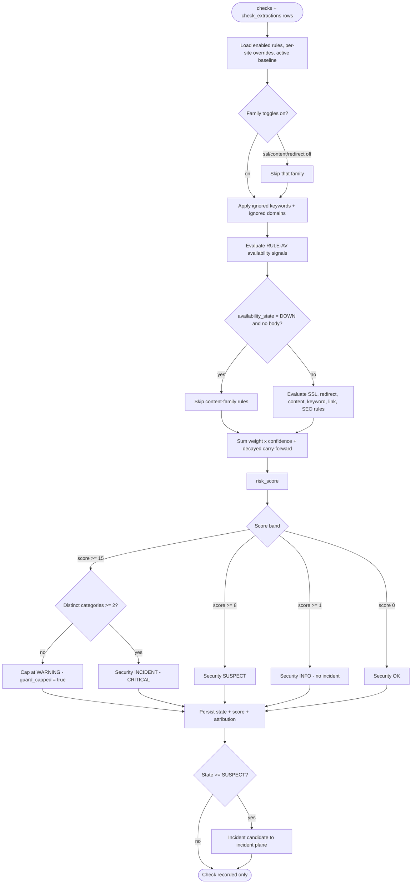

# DETECTION-RULES.md — SiteSentinel — Website Monitoring & Security Alerts

> **Specification only.** Nothing described in this document has been implemented.
> Every statement is future/conditional ("the engine will…", "Phase 4 implements…").
> There is no application code and there are no migrations at the time of writing.

> **This document is the authoritative rule catalogue.** [`PRD.md`](PRD.md) §11 defines the detection
> *model* (signal shape, severity meanings, thresholds, correlation guard) and
> [`ARCHITECTURE.md`](ARCHITECTURE.md) §6 defines the detection *component's* position in the flow.
> Where a rule-level identifier, weight, pattern, or detection algorithm is required, this document
> governs. Where the *model*, severities, thresholds, lifecycle, or retention are concerned,
> [`PRD.md`](PRD.md) remains authoritative.

---

## 1. Purpose & Position

### 1.1 What this document is

`DETECTION-RULES.md` is the exhaustive catalogue of every detection rule the engine will evaluate,
together with the scoring arithmetic that turns fired rules into a security state. It is the
rule-level source of truth referenced by [`PRD.md`](PRD.md) §11's scope note:

> *"The exhaustive rule catalogue — individual rule identifiers, patterns, weights, and examples —
> lives in `DETECTION-RULES.md`."*

### 1.2 Relationship to sibling documents

| Document | Authority over detection | What it owns |
| --- | --- | --- |
| [`PRD.md`](PRD.md) §11 | **Authoritative** | The model: signal shape, severity meanings, threshold values, correlation guard requirement. |
| [`ARCHITECTURE.md`](ARCHITECTURE.md) §6 | Derived | Where the detector sits (between the probe and the incident plane) and its input/output shape. |
| [`DATABASE.md`](DATABASE.md) | **Authoritative for names** | The exact `checks` / `check_extractions` / `detection_rules` / `website_rule_settings` / `website_baselines` columns a rule may read. |
| [`DECISIONS.md`](DECISIONS.md) | Derived | Rationale: `ADR-008` (weighted correlation), `ADR-009` (correlation guard), `ADR-019` (content fingerprinting), `ADR-020` (baseline immutability). |
| **`DETECTION-RULES.md`** (this file) | **Authoritative for rules** | Rule IDs, categories, weights, patterns, thresholds, evaluation order, tuning and test requirements. |
| [`SECURITY.md`](SECURITY.md) | Subordinate to §15 of the PRD | The `how` of SSRF defence, resource limits, and auth — referenced by the redirect and external-link rules below. |

### 1.3 Non-goals of this document

- It does **not** define product requirements (`FR-*` / `NFR-*`) — those live in [`PRD.md`](PRD.md).
- It does **not** define incident lifecycle or notification dispatch — see [`PRD.md`](PRD.md) §12 and
  [`ARCHITECTURE.md`](ARCHITECTURE.md) §7.
- It does **not** define storage, retention mechanics, or indexing — see [`DATABASE.md`](DATABASE.md).
- It is **not** a vulnerability scanner. SiteSentinel detects *defacement, injection, redirect
  abuse, and availability failure* on sites it monitors; it does not audit those sites' code
  (see [`SECURITY.md`](SECURITY.md) §13).

### 1.4 Technology constraints (from the canonical spec)

Detection runs inside Laravel 13 / PHP 8.4+ on MySQL 8, using Redis for locks and queues. The rule
engine is deterministic PHP. `SQLite` and `PostgreSQL` are explicitly rejected alternatives
([`ARCHITECTURE.md`](ARCHITECTURE.md) §1.2); no rule, cache, or fixture may assume either.

---

## 2. Detection Philosophy

### 2.1 The naive model is rejected

The obvious implementation of "detect a compromised site" is:

```text
if page.contains("casino") then hacked = true
```

This is wrong, and it is the specific failure mode the canonical spec forbids. It is wrong because
**legitimate businesses legitimately contain those words**:

| Legitimate business | Legitimately contains |
| --- | --- |
| Online gaming / esports platform | `game`, `betting`, `jackpot`, `bonus` |
| Fintech / payments | `deposit`, `withdrawal`, `balance` |
| Marketing / promotions agency | `bonus`, `promo`, `deposit` |
| News / media covering the gambling industry | `casino`, `slot`, `togel`, `betting` |
| Licensed operator in a regulated market | `slot`, `rtp`, `maxwin`, `bandar`, `togel` |

A monitor that fires on any of these is a monitor that gets muted. `PRD.md` §3.2 and §11.6 name
false positives as **the primary adoption risk**: *"a noisy monitor is abandoned."*

### 2.2 The governing principle

> **Correlate multiple independent signals before escalating.**

This principle has three consequences, all of them binding on the catalogue in §8:

1. **No single rule may raise `CRITICAL`.** A single signal, however heavy, caps at `WARNING`
   (`ADR-009`, `PRD.md` §11.4). This is structural, not a tuning knob.
2. **A keyword is a signal, not a verdict.** `FR-45` forbids equating a keyword with a compromise.
   This is why keyword rules carry *tiered weights* (§8.6) rather than a flat list.
3. **Change is not compromise.** Content drift is normal (`RULE-CNT-001` is deliberately the lowest
   weight, `FR-30`). Drift becomes interesting only when it *correlates* with other categories.

### 2.3 What the engine is allowed to conclude

The engine's output is a **state**, never a boolean "hacked":

```text
Availability ∈ { UP, DOWN }                        # orthogonal
Security     ∈ { OK, INFO, SUSPECT, INCIDENT }     # correlated, threshold-mapped
Severity     ∈ { INFO, WARNING, CRITICAL }         # per incident, escalatable, never silently downgraded
```

The words "hacked", "infected", and "compromised" appear only in *operator-facing narrative* when a
`CRITICAL` incident has already been raised by ≥ 2 independent categories. The engine itself never
asserts them.

---

## 3. The Two-Dimension Model, Restated

### 3.1 A single boolean is forbidden

`FR-02`/`G-2`/`G-3` and the canonical `KEY RULE` fix this: **`HTTP 200 != healthy`**. The system
must never model health as one column. `checks.availability_state` and `checks.security_state` are
**separate, independently queryable** columns ([`DATABASE.md`](DATABASE.md) §3.6; `AC-05`).

### 3.2 The combined matrix

| Availability | Security | Combined meaning |
| --- | --- | --- |
| `UP` | `OK` | **Healthy.** Site is reachable and serving expected content. Nothing to do. |
| `UP` | `INFO` | **Notable but not a threat.** Reachable; something changed that is worth recording (drift, a single weak keyword, an `INFO`-weight SSL window). No incident. No notification. |
| `UP` | `SUSPECT` | **Live but suspect.** Reachable; correlated signals crossed `WARNING`. An incident is open. The site may be serving injected or redirected content. |
| `UP` | `INCIDENT` | **Live but compromised.** Reachable; correlated cross-category signals crossed `CRITICAL`. Classic deferential shell / SEO-injection state. **This is the state a naive uptime monitor cannot express.** |
| `DOWN` | `OK` | **Hard down, integrity unknown.** Unreachable, so no content could be assessed. Security is reported `OK` only because nothing contradicted it; it is *not* evidence of integrity. |
| `DOWN` | `INFO` | **Down, prior notable finding.** Unreachable now; the last assessable check carried an `INFO`. Historic context, not a live verdict. |
| `DOWN` | `SUSPECT` | **Down and previously suspect.** The site was flagged before it went dark. Often a compromise being "fixed" by taking the site offline — or a crash caused by the injection. Investigate both dimensions. |
| `DOWN` | `INCIDENT` | **Worst case.** Confirmed active compromise *and* total unavailability. Response is immediate and parallel: restore service **and** preserve evidence (snapshots) before remediation destroys it. |

### 3.3 Explicit worked example — `HTTP: UP / Security: INCIDENT`

This is the scenario from `PRD.md` §10.6, and it is why this product exists.

**03:05** — every check is green:

```text
HTTP: 200   Availability: UP   Security: OK
```

**03:10** — the page content hash changes; the title does not:

```text
HTTP: 200   Availability: UP   Security: INFO
```

Only `RULE-CNT-001` fired (weight 1). Drift alone is normal, so no incident is opened (`FR-30`).

**03:15** — the drift persists *and* two new things appear:

- `RULE-KW-002` fires: a cluster of tier-1 keywords is now present in visible text.
- `RULE-LNK-001` fires: a new outbound domain `situs-judi.example` appears that is absent from the
  baseline link set (`website_baselines.external_link_count` and the baseline link set differ).

Three independent categories — `content-fingerprint`, `content-keyword`, `external-link` — now agree:

```text
HTTP: 200   Availability: UP   Security: SUSPECT   Severity: WARNING
```

**03:20** — the keyword block is discovered to be inside an element hidden with inline
`display:none`:

```text
HTTP: 200   Availability: UP   Security: INCIDENT   Severity: CRITICAL
```

The user-visible state is:

```text
HTTP: UP  +  Security: INCIDENT
```

A conventional uptime monitor reports this site as **"up"** for the entire window and sends the
operator **nothing**. SiteSentinel reports `UP` **and** `INCIDENT` simultaneously, with a snapshot
from 03:20 showing exactly what the site was serving (`AC-07`).

**Why the escalation was safe:** the `INFO` at 03:10 did not become an incident; the escalation at
03:15 *required correlation* of independent signals; and a legitimate site that merely added one word
would have produced only the `INFO` and never an alert (`AC-08`).

---

## 4. Severity Model

Severity meanings are fixed by [`PRD.md`](PRD.md) §11.3 and **must not be redefined**. The table
below restates them and adds the operational columns required by this catalogue.

| Severity | Meaning | Incident? | Notification by default? | Expected response time | Who acts | Auto-resolvable? |
| --- | --- | --- | --- | --- | --- | --- |
| **`INFO`** | Something notable was observed. It is **not** judged to be a threat on its own. | **No** — recorded on the check result and website timeline only. | **No.** | No action required. Review opportunistically. | Nobody, unless curious. | N/A — nothing to resolve. |
| **`WARNING`** | Correlated signals indicate a plausible problem warranting investigation. | **Yes** — incident created with severity `WARNING`. | **Yes**, subject to cooldown/dedup (`notification_cooldowns`). | Same business day. | Admin investigates; may acknowledge to stop re-notification (`FR-58`). | **Yes** — auto-resolution on sustained recovery (`FR-59`, `resolution_mode = auto`). |
| **`CRITICAL`** | Correlated signals match a compromise pattern, **or** a severe availability failure persists. | **Yes** — incident created, or an open incident escalated. | **Yes** — always attempted, subject to cooldown/dedup. | Immediately, out of hours. | Admin acts now; assume the site is serving unintended content or is hard down. | **Yes** — but only on *sustained* recovery, and the resolution is recorded with its actor. |

### 4.1 Additional binding severity rules (from `PRD.md` §11.3)

1. Severity is assigned **per incident**, and an open incident's severity **may be escalated**.
2. Severity **must not be silently downgraded** while an incident is open. Resolution closes it;
   a recurrence opens a **new** incident (`ADR-012`).
3. An **availability** incident is normally `WARNING` on threshold breach and `CRITICAL` when the
   failure *persists beyond a configured duration* or the website is marked critical.
4. A `CRITICAL` **security** escalation additionally requires the correlation guard (§6.3).

### 4.2 Severity vs. security state — do not conflate

`Security: SUSPECT` and severity `WARNING` are different fields that happen to track together:

| Security state | Score band | Default severity | Incident type |
| --- | --- | --- | --- |
| `OK` | 0 | — | none |
| `INFO` | `≥ 1` and `< 8` | `INFO` (not an incident) | none |
| `SUSPECT` | `≥ 8` and `< 15` | `WARNING` | `security` |
| `INCIDENT` | `≥ 15` **and** guard passed | `CRITICAL` | `security` |
| `INCIDENT` | `≥ 15` **and** guard failed | `WARNING` (capped) | `security` |

Availability is a separate axis and produces incidents of `type = 'availability'`
([`DATABASE.md`](DATABASE.md) §3.10).

---

## 5. Signal Taxonomy

Every rule emits zero or more **signals**. The signal shape is fixed by [`PRD.md`](PRD.md) §11.2:

```text
Signal {
  rule_id       # stable identifier, e.g. "RULE-KW-002"
  category      # one of the seven categories below
  weight        # integer contribution to the risk score (before confidence)
  confidence    # low | medium | high
  reason        # human-readable explanation shown to Admin
  evidence      # minimal excerpt/metadata (NEVER rendered on the public status page)
}
```

### 5.1 The seven independent categories

The correlation guard (§6.3) counts **categories**, and only these seven are recognised. They are
the frozen set from the canonical spec; the engine must reject or map any other value.

| Category | Prefix | What it observes | Primary source columns |
| --- | --- | --- | --- |
| `availability` | `RULE-AV-` | Did a response arrive at all, in time, with an expected status? | `checks.http_status`, `checks.error_type`, `checks.duration_ms`, `checks.finished_at` |
| `ssl` | `RULE-SSL-` | Certificate validity, hostname match, issuer/chain, expiry window. | `checks.ssl_valid`, `checks.ssl_issuer`, `checks.ssl_expires_at` |
| `redirect` | `RULE-RED-` | Whether the request was redirected, to where, and how many hops. | `checks.redirect_chain`, `checks.final_url` |
| `content-fingerprint` | `RULE-CNT-` | Whether the normalized body fingerprint, title, or structure changed vs. baseline. | `checks.content_hash`, `checks.title`, `checks.response_size_bytes`, `check_extractions.suspicious_patterns` |
| `content-keyword` | `RULE-KW-` | Which keywords appear, in what tier, in what density, and in which region. | `check_extractions.keywords` |
| `external-link` | `RULE-LNK-` | Which outbound domains are present vs. the baseline link set. | `check_extractions.external_domains` |
| `seo-pattern` | `RULE-SEO-` | Doorway/cloaking/injection patterns characteristic of SEO spam. | `check_extractions.suspicious_patterns`, `check_extractions.keywords`, `checks.title` |

These seven categories are exactly the category set fixed by the canonical spec and by
[`PRD.md`](PRD.md) §11.2. The correlation guard (§6.3) counts distinct categories from this set.

### 5.2 What "independent" means operationally for the guard

"Independent" is **not** "a different rule". Two rules in the same category are **one** vote.

> **Independent** = the signals derive from **different observable aspects of the response**, such
> that a single cause cannot plausibly produce both, and no signal is derived *from* the other.

Concretely, the guard counts the **cardinality of the set of distinct categories** among fired
signals, subject to these rules:

| Rule | Statement |
| --- | --- |
| **Same-category collapse** | `RULE-KW-001` + `RULE-KW-002` + `RULE-KW-003` = **1** category (`content-keyword`). Their weights still sum. |
| **Derivation prohibition** | If signal *B* is computed from signal *A*'s output (not from the raw response), *B* does not add a category. Example: `RULE-RED-002` ("final domain differs") is derived from `checks.redirect_chain`, which `RULE-RED-001` also reads — they are the same category regardless, so this is naturally satisfied. |
| **Baseline-relative independence** | A `content-fingerprint` signal (page changed) and a `content-keyword` signal (new keyword present) **are** independent: one is a whole-body transform, the other is a token occurrence. Both can occur without the other. |
| **Suppression does not create independence** | Disabling a rule removes its weight and its category vote. It never *adds* a vote to another rule. |
| **Guard input is post-whitelist** | Ignored keywords/domains (§7) are removed **before** signals are generated, so they cannot vote for a category. |
| **`availability` counts** | An availability signal (e.g. `RULE-AV-001`) is a genuine independent category and may serve as the second category that unlocks a `CRITICAL`. This is the "site went dark **and** was serving injected content" case. |
| **Category uniqueness is per-check** | The guard evaluates the set of categories present **in the current check's signal set**, plus (see §6.4) any carried-forward unexpired signals. |

### 5.3 Worked independence examples

| Fired signals | Distinct categories | Guard verdict |
| --- | --- | --- |
| `RULE-KW-002` only | 1 (`content-keyword`) | ❌ Cannot be `CRITICAL` — capped at `WARNING`. |
| `RULE-KW-002` + `RULE-KW-003` + `RULE-KW-004` | 1 (`content-keyword`) | ❌ Capped, even if the summed score is 40. |
| `RULE-LNK-001` + `RULE-LNK-002` + `RULE-LNK-003` | 1 (`external-link`) | ❌ Capped. Many new domains are still one aspect: outbound links. |
| `RULE-KW-002` + `RULE-LNK-001` | 2 (`content-keyword`, `external-link`) | ✅ `CRITICAL` permitted if score `≥ 15`. |
| `RULE-CNT-001` + `RULE-KW-002` + `RULE-LNK-001` + `RULE-RED-001` | 4 | ✅ `CRITICAL` permitted. |
| `RULE-AV-001` + `RULE-CNT-001` | 2 (`availability`, `content-fingerprint`) | ✅ `CRITICAL` permitted — site down *and* serving changed content. |

### 5.4 Rule-id prefixes and counts

The catalogue uses exactly seven prefixes, fixed by the canonical spec and by [`PRD.md`](PRD.md) §11.2:

| Category | Prefix | Rule count |
| --- | --- | --- |
| `availability` | `RULE-AV-` | 6 |
| `ssl` | `RULE-SSL-` | 5 |
| `redirect` | `RULE-RED-` | 6 |
| `content-fingerprint` | `RULE-CNT-` | 5 |
| `content-keyword` | `RULE-KW-` | 5 |
| `external-link` | `RULE-LNK-` | 5 |
| `seo-pattern` | `RULE-SEO-` | 4 |
| **Total** | | **36** |

---

## 6. Scoring & Correlation Model

### 6.1 The score formula

Fixed by [`PRD.md`](PRD.md) §11.4:

```text
risk_score = Σ ( weight(rule) × confidence_multiplier(rule) )   for all fired signals

confidence_multiplier:  low = 0.5   medium = 1.0   high = 1.5
```

The result is rounded to an integer and stored in `checks.score` (`INT UNSIGNED`, default `0`) and,
for incidents, `incidents.score`. Signals that contribute are recorded verbatim in
`incidents.triggered_rules` (JSON) so attribution is reviewable (`FR-49`).

### 6.2 Thresholds

| Threshold | Default score | Resulting state | Severity |
| --- | --- | --- | --- |
| Report floor | `≥ 1` | `Security: INFO` | `INFO` (recorded only, no incident) |
| Warning | `≥ 8` | `Security: SUSPECT` | `WARNING` (incident opened) |
| Critical | `≥ 15` | `Security: INCIDENT` | `CRITICAL` (incident opened/escalated) — **subject to the guard** |
| Correlation guard | **`≥ 2` independent categories** | — | Required for any `CRITICAL` **security** escalation |

Thresholds are globally configurable through `settings` keys
`scoring.threshold_info` (1), `scoring.threshold_warning` (8), `scoring.threshold_critical` (15),
and `scoring.correlation_guard` (2) ([`DATABASE.md`](DATABASE.md) §3.17), and overridable per website
via `website_rule_settings.threshold_override` (`FR-46`).

### 6.3 The correlation guard (detailed)

`ADR-009` fixes the guard: **a CRITICAL security escalation requires ≥ 2 independent signal
categories**. The single-category score is capped at `WARNING` regardless of its magnitude.

```text
function classify(score, fired_signals):
    categories     = distinct(category for s in fired_signals)
    reachable_band = band(score)                    # OK / INFO / SUSPECT / INCIDENT by thresholds

    if reachable_band == INCIDENT and size(categories) < 2:
        reachable_band = SUSPECT                   # hard cap — the guard
        guard_capped   = true
    else:
        guard_capped   = false

    return state(reachable_band), guard_capped
```

Properties the implementation must preserve:

1. **The cap is applied last**, after the sum. There is no configuration that lets a single category
   score past `WARNING` (`AC-08`).
2. **The cap is lossy for severity but not for evidence.** A capped check still stores its full
   `score` and its `triggered_rules`; only the *state* is capped. This means an operator can see
   "score 40, one category, capped to `WARNING`" and knows a second signal would tip it — which is
   actionable information, not a hidden failure.
3. **The guard evaluates the union of signals active on the current check**, where "active" includes
   carried-forward signals from lookback (§6.4).
4. **Availability counts as a category** but its own thresholds are separate (§6.6).

### 6.4 Aggregation, decay, and lookback

A single check is a point sample; compromise is a state that persists. The engine therefore
aggregates with an explicit, bounded lookback.

| Aspect | Rule |
| --- | --- |
| **Per-check contribution** | Signals are generated fresh for every check from that check's `checks` and `check_extractions` rows. |
| **Lookback window** | The engine looks back over the previous **3 checks** (default) of the same `website_id`, or the last **15 minutes**, whichever is shorter, to allow a multi-step attack (e.g. first a redirect appears, then keywords) to correlate across checks. |
| **Carry-forward weight** | A signal observed in a prior check within the window contributes at **half weight** (`× 0.5`) and **counts toward the category set** for the guard. |
| **Decay** | Carry-forward contribution decays by **50% per check** beyond the immediately preceding one: most recent prior check `× 0.5`, two checks back `× 0.25`, three back `× 0.125`. Beyond the window, contribution is zero. |
| **Idempotency** | Because scores are recomputed per check, a retried job (same `checks.check_key`, `ARCHITECTURE.md` §5.1) reproduces the same score — no double-counting. |
| **No unbounded accumulation** | Scores are never summed across the whole incident lifetime. A `CRITICAL` persists because the *signals* persist, not because weight piles up. |
| **Availability is exempt from the guard's decay reasoning** | Availability is assessed from the current check alone; it is not accumulated. |

The lookback length, carry-forward multiplier, and decay constants are fixed here and stated in
[`PRD.md`](PRD.md) §11.4 ("the last 3 check results, or 15 minutes"; bounded, never accumulating).

### 6.5 Mapping score → security state

| Score band | Distinct categories | `checks.security_state` | Incident |
| --- | --- | --- | --- |
| `0` | any | `OK` | none |
| `1–7` | any | `INFO` | none (recorded on the timeline) |
| `8–14` | any | `SUSPECT` | open `security` incident, severity `WARNING` |
| `≥ 15` | `≥ 2` | `INCIDENT` | open/escalated `security` incident, severity `CRITICAL` |
| `≥ 15` | `1` | `SUSPECT` | open incident, severity `WARNING` (guard-capped) |

### 6.6 Availability classification (separate path)

Availability does not use the risk score for its state; it uses explicit failure rules (§8.1). It
maps to `checks.availability_state ∈ { UP, DOWN }` and produces incidents of
`incidents.type = 'availability'`.

| Condition | `availability_state` | Incident |
| --- | --- | --- |
| Response within timeout with an expected status | `UP` | — |
| Failure below `websites.consecutive_failures` threshold (default 2) | `DOWN` | none — recorded only (`FR-53`) |
| Failure reaches `websites.consecutive_failures` threshold (default 2) | `DOWN` | incident opened, severity `WARNING` (per `PRD.md` §11.3) |
| Failure persists beyond the threshold **or** website marked critical | `DOWN` | incident escalated, severity `CRITICAL` |

Availability **also** emits a signal into the security correlator (category `availability`, e.g.
`RULE-AV-001`) so that "down + changed content" can correlate to a `CRITICAL` security escalation.
This is the *only* cross-feed between the two dimensions, and it does not merge them: the check
still carries two independent state columns.

### 6.7 Complete default weight table

These are the engine's **default** weights. They mirror [`PRD.md`](PRD.md) §11.4's illustrative
table where a concept maps across, and add the rules required by this catalogue. All weights are
overridable per website via `website_rule_settings.weight_override`.

| Rule ID | Category | Default weight | Confidence | Multiplier | Effective | Notes |
| --- | --- | --- | --- | --- | --- | --- |
| `RULE-AV-001` | `availability` | 5 | high | 1.5 | 7.5 | HTTP 5xx response |
| `RULE-AV-002` | `availability` | 4 | high | 1.5 | 6.0 | Unexpected HTTP status |
| `RULE-AV-003` | `availability` | 5 | high | 1.5 | 7.5 | Timeout |
| `RULE-AV-004` | `availability` | 6 | high | 1.5 | 9.0 | DNS resolution failure |
| `RULE-AV-005` | `availability` | 6 | high | 1.5 | 9.0 | Connection / TLS handshake failure |
| `RULE-AV-006` | `availability` | 2 | low | 0.5 | 1.0 | Response time above threshold (graduated) |
| `RULE-SSL-001` | `ssl` | 8 | high | 1.5 | 12.0 | Invalid / expired certificate |
| `RULE-SSL-002` | `ssl` | 8 | high | 1.5 | 12.0 | Hostname mismatch |
| `RULE-SSL-003` | `ssl` | 3 | medium | 1.0 | 3.0 | Chain / issuer problem |
| `RULE-SSL-004` | `ssl` | 2 | medium | 1.0 | 2.0 | Certificate nearing expiry (graduated windows) |
| `RULE-SSL-005` | `ssl` | 0 | low | 0.5 | 0.0 | SSL monitoring disabled (visibility only) |
| `RULE-RED-001` | `redirect` | 6 | high | 1.5 | 9.0 | Unexpected redirect present |
| `RULE-RED-002` | `redirect` | 5 | medium | 1.0 | 5.0 | Final URL domain differs from expected |
| `RULE-RED-003` | `redirect` | 3 | medium | 1.0 | 3.0 | Redirect to suspicious / external domain |
| `RULE-RED-004` | `redirect` | 3 | medium | 1.0 | 3.0 | Redirect chain length anomaly |
| `RULE-RED-005` | `redirect` | 7 | high | 1.5 | 10.5 | `https` → `http` downgrade |
| `RULE-RED-006` | `redirect` | 9 | high | 1.5 | 13.5 | Redirect to private/blocked target (SSRF policy) |
| `RULE-CNT-001` | `content-fingerprint` | 1 | low | 0.5 | 0.5 | Content hash drift from baseline |
| `RULE-CNT-002` | `content-fingerprint` | 6 | high | 1.5 | 9.0 | Page title changed to unrelated/spam content |
| `RULE-CNT-003` | `content-fingerprint` | 2 | medium | 1.0 | 2.0 | Major structural change (DOM size / content-length delta) |
| `RULE-CNT-004` | `content-fingerprint` | 5 | medium | 1.0 | 5.0 | Content became unreachable / empty |
| `RULE-CNT-005` | `content-fingerprint` | 5 | medium | 1.0 | 5.0 | Large hidden-text / hidden-link block |
| `RULE-KW-001` | `content-keyword` | 2 | low | 0.5 | 1.0 | Tier-1 keyword present in visible text |
| `RULE-KW-002` | `content-keyword` | 4 | medium | 1.0 | 4.0 | Tier-1 keyword cluster (≥ 5 distinct) |
| `RULE-KW-003` | `content-keyword` | 3 | medium | 1.0 | 3.0 | Tier-2 keyword cluster in suspicious density |
| `RULE-KW-004` | `content-keyword` | 6 | high | 1.5 | 9.0 | Suspicious keyword in `<title>` / meta / head |
| `RULE-KW-005` | `content-keyword` | 5 | medium | 1.0 | 5.0 | Hidden / obfuscated keyword pattern |
| `RULE-LNK-001` | `external-link` | 3 | medium | 1.0 | 3.0 | New external domain vs. baseline |
| `RULE-LNK-002` | `external-link` | 5 | medium | 1.0 | 5.0 | Suspicious TLD / domain-pattern heuristic |
| `RULE-LNK-003` | `external-link` | 5 | medium | 1.0 | 5.0 | Link farm (mass reciprocal off-domain links) |
| `RULE-LNK-004` | `external-link` | 6 | high | 1.5 | 9.0 | CSS-hidden anchor |
| `RULE-LNK-005` | `external-link` | 6 | high | 1.5 | 9.0 | Mass outbound link injection vs. baseline |
| `RULE-SEO-001` | `seo-pattern` | 3 | medium | 1.0 | 3.0 | Spam SEO fingerprint pattern (pharma/loan/gambling doorway) |
| `RULE-SEO-002` | `seo-pattern` | 5 | medium | 1.0 | 5.0 | Cloaking indicator |
| `RULE-SEO-003` | `seo-pattern` | 4 | medium | 1.0 | 4.0 | Injected sitemap / `robots.txt` anomaly |
| `RULE-SEO-004` | `seo-pattern` | 4 | medium | 1.0 | 4.0 | Suspicious script injection |

**Total rules documented: 36**, across 7 categories — matching the canonical rule count.

Each rule in the table above has a full entry in §8 ([`PRD.md`](PRD.md) §11.4's illustrative table is
derived from this one; where the two differ in rule id or category label, this table and §8 govern).

### 6.8 Worked scoring examples

#### Example A — a legitimate site that merely mentions "bonus"

A promotions page legitimately adds the sentence *"Sign up and receive a welcome bonus."*

| Signal | Tier | Weight | Confidence | Contribution | Category |
| --- | --- | --- | --- | --- | --- |
| `RULE-CNT-001` (hash drift) | — | 1 | low | 0.5 | `content-fingerprint` |
| `RULE-KW-003` (tier-2 `bonus` in one occurrence) | tier-2 | 3 | medium | 3.0 | `content-keyword` |

```text
score = 0.5 + 3.0 ≈ 3   →   < 8   →   Security: INFO
```

**Result:** `INFO`. Recorded on the timeline. **No incident.** This is the intended behaviour for a
legitimate use of a tier-2 word (`FR-45`, `AC-08`).

#### Example B — a legitimate gaming client tuning its own vocabulary

The same page belongs to a licensed casino client. The operator adds `bonus`, `deposit`, `jackpot`
to `website_rule_settings.ignored_keywords` for that website.

| Signal | Weight | Contribution |
| --- | --- | --- |
| `RULE-CNT-001` (hash drift) | 1 | 0.5 |

```text
score = 0.5   →   < 1 after ignore-rules applied? No — floor is ≥1 for INFO
→ Security: INFO (drift only)  or  OK if drift suppressed
```

**Result:** `INFO` at most. The client's own vocabulary no longer generates noise, but genuine
anomalies (new domains, redirects, hidden text) still do — because ignored keywords remove only
`content-keyword` signals, not other categories.

#### Example C — a cross-category compromise (the `CRITICAL` path)

An attacker injects a gambling doorway into a client's homepage and rewrites the title, in an
element hidden with `display:none`, adding links to a domain absent from the baseline.

| Signal | Weight | Confidence | Contribution | Category |
| --- | --- | --- | --- | --- |
| `RULE-KW-002` (tier-1 cluster, ≥ 5 distinct) | 4 | medium | 4.0 | `content-keyword` |
| `RULE-CNT-002` (title rewritten) | 6 | high | 9.0 | `content-fingerprint` |
| `RULE-LNK-001` (new external domain) | 3 | medium | 3.0 | `external-link` |

```text
score = 4.0 + 9.0 + 3.0 = 16   →   ≥ 15
categories = { content-keyword, content-fingerprint, external-link } = 3   →   ≥ 2  ✅
→ Security: INCIDENT   Severity: CRITICAL
```

#### Example D — one heavy signal, guard-capped

A defensive but over-eager operator raises `RULE-RED-006` (private/blocked redirect target) weight to
`40`, then a single misconfigured redirect fires it.

```text
score = 40   →   would be ≥ 15
categories = { redirect } = 1   →   < 2  ❌
→ Security: SUSPECT   Severity: WARNING   guard_capped = true
```

**Result:** `WARNING`, not `CRITICAL`, no matter how the weight is tuned. This is the concrete
expression of `ADR-009` and `AC-08`.

### 6.9 Per-website overrides

Overrides live in `website_rule_settings` ([`DATABASE.md`](DATABASE.md) §3.9) and are resolved in
this precedence order (highest first):

| Precedence | Source | Column | Applies to |
| --- | --- | --- | --- |
| 1 | Website rule setting | `website_rule_settings.weight_override` | One rule, one website |
| 2 | Website rule setting | `website_rule_settings.threshold_override` | The website's severity bands |
| 3 | Website rule setting | `website_rule_settings.enabled` | Whether the rule runs at all for this website |
| 4 | Website rule setting | `website_rule_settings.ignored_keywords` | Which keywords are suppressed for this website |
| 5 | Rule registry default | `detection_rules.default_weight` | All websites unless overridden |
| 6 | Global setting | `settings.scoring.threshold_*` | All websites unless overridden |

Additional per-website toggles that gate whole rule families are on `websites`:
`monitor_ssl`, `monitor_redirects`, `monitor_content`, `monitor_security`
([`DATABASE.md`](DATABASE.md) §3.4). A family toggle off means its rules produce **no** signals and
**no** category votes.

`threshold_override` in `website_rule_settings` is **rule-scoped**: it moves the band boundary for
that rule on that website, keyed by `(website_id, detection_rule_id)` ([`DATABASE.md`](DATABASE.md)
§3.9). Website-wide threshold overrides (`FR-46`) are applied by setting the same override value on
each rule row in scope. No additional column is required at MVP.

---

## 7. Whitelisting & False-Positive Controls

### 7.1 Baseline-relative evaluation first

The strongest anti-false-positive measure is not a whitelist — it is **comparison against a
baseline**. Before any rule fires, the engine loads `websites.current_baseline_id` → the matching
`website_baselines` row ([`DATABASE.md`](DATABASE.md) §3.5). Rules then ask "**changed relative to
baseline**" rather than "present". A site that always said `bonus` never fires on `bonus`.

Because baselines are **immutable and versioned** (`ADR-020`), rebasing is a deliberate admin action
(`FR-28`) that inserts a new `version` and flips `is_active`; it never mutates history.

### 7.2 Global controls

| Control | Where | Effect |
| --- | --- | --- |
| Global ignored keywords | `settings` (e.g. `keywords.ignored_global`) | Removed before keyword rules run, for every website. |
| Global ignored domains | `settings` (e.g. `links.ignored_domains_global`) | Removed before external-link rules run. |
| Expected-title tolerance | `websites.expected_title` | When set, `RULE-CNT-002` compares against this rather than the baseline title. |
| Allowlisted redirect domains | `websites.expected_final_domain` | When set, `RULE-RED-002` treats this domain as expected. |
| System-reserved domains | `settings` | The monitor's own domain, plus well-known CDN/analytics hosts, are never "new". |

### 7.3 Per-website controls

All per-website suppression lives in `website_rule_settings`:

- `ignored_keywords` (JSON) — keyword list suppressed for that website, matched case-insensitively
  after Unicode normalization and word-boundary matching (`FR-47`, `US-10`).
- `weight_override` — reweight a rule for that website.
- `threshold_override` — move the website's band boundaries.
- `enabled` — disable a structurally inapplicable rule (e.g. redirect rules on a site that never
  redirects).

### 7.4 The ordering invariant

Suppression happens **before** signal generation, which means:

1. Suppressed tokens cannot produce signals.
2. Therefore they cannot contribute weight.
3. And they cannot contribute a **category vote** to the correlation guard.

This is deliberate: ignoring a keyword must not be circumventable by a rule that "counts" it anyway.

### 7.5 Tuning a legitimate casino/gaming client — worked example

A licensed operator's homepage legitimately contains `slot`, `rtp`, `maxwin`, `jackpot`, `bonus`,
`deposit`, and links out to its own payment gateway and a licensing regulator.

| Step | Action | Field |
| --- | --- | --- |
| 1 | Add the client's core vocabulary to the ignore list: `slot`, `rtp`, `maxwin`, `jackpot`, `bonus`, `deposit`. | `website_rule_settings.ignored_keywords` on `RULE-KW-001`…`RULE-KW-005` |
| 2 | Record the two known outbound domains as baseline links (they are in the baseline after the first approved baseline capture). | `website_baselines` link set / `settings` allowlist |
| 3 | Set the expected title. | `websites.expected_title` |
| 4 | Set the expected redirect domain (their canonical host). | `websites.expected_final_domain` |
| 5 | Optionally lower `RULE-KW-003` weight for this website, because tier-2 words are marketing copy here. | `website_rule_settings.weight_override` |
| 6 | Keep `RULE-KW-002`, `RULE-LNK-001`, `RULE-RED-*`, and all `content-fingerprint` rules at default. | — |

After tuning, the client's legitimate vocabulary produces **no** `content-keyword` noise, yet a real
injection — a *new* domain, an unexpected redirect, hidden text, a rewritten title — still
correlates across categories and still reaches `CRITICAL`. The tuning removes noise without removing
detection capability, which is the whole point (`AC-09`).

### 7.6 What whitelisting must never do

- It must **never** disable the correlation guard. The guard is structural (`ADR-009`), not a knob.
- It must **never** let `ignored_keywords` suppress a `content-fingerprint`, `redirect`, or
  `external-link` signal. Ignore lists are category-scoped.
- It must **never** be applied silently: any suppression that changes state must be visible in the
  check's stored reason string (`FR-42`, `FR-49`).

---

## 8. Full Rule Catalogue

Every rule below uses the exact heading and field structure defined for this catalogue. `MVP` rules
are in the first delivery; `Future` rules must not be built now ([`PRD.md`](PRD.md) §1.1 rule 2).

Common conventions for `**Detection logic**`:

- `baseline` means the active `website_baselines` row for the website.
- `visible_text` means the body after `<script>`, `<style>`, `<noscript>`, and comment stripping,
  with entities decoded.
- `hidden_elements` means elements whose computed visibility is hidden via inline
  `style="display:none"`, `visibility:hidden`, `opacity:0`, `font-size:0`, `position:absolute` with
  off-canvas coordinates, or the `hidden` attribute — determined by the HTML parser, not by executing
  CSS.
- All comparisons are done on the **normalized** body produced by the fingerprint pipeline
  (`ADR-019`), so volatile tokens (CSRF/nonce/session ids, timestamps, cache-busters) cannot cause
  spurious differences.

### 8.1 Availability — `RULE-AV-*`

### RULE-AV-001: HTTP failure (5xx)
**Category** — `availability`
**Default severity** — `WARNING`, escalating to `CRITICAL` on persistence or for a critical website.
**Default weight** — 5 (confidence `high`, ×1.5 → 7.5)
**Purpose** — Detect the classic hard-down caused by a server-side error, which is also a common
symptom of a botched compromise remediation.
**Input** — `checks.http_status`.
**Detection logic**
```text
if checks.http_status >= 500 and checks.http_status <= 599:
    emit RULE-AV-001
```
**Threshold** — any 5xx on a website whose `websites.expected_status` is `2xx`.
**Correlation role** — Yes. `availability` is an independent category and may serve as the second
category that unlocks a `CRITICAL` when content signals are also present.
**False-positive considerations** — A 5xx during a deploy is transient; `websites.consecutive_failures`
gates escalation so a single blip produces no incident, and escalation beyond the threshold is a
`WARNING`, not a `CRITICAL`, unless the failure persists or the website is marked critical
(`FR-53`). Load-balancer health checks may return 503 briefly.
**Example** — `HTTP 502 Bad Gateway`, one check. `Availability: DOWN`, recorded with no incident until
the `consecutive_failures` threshold is reached.
**Recommended response** — Check server/upstream health; if the site was recently remediated, verify
the remediation did not break origin.
**MVP or Future** — MVP.

### RULE-AV-002: Unexpected HTTP status
**Category** — `availability`
**Default severity** — `INFO` (recorded) — a lone unexpected status is worth noting but not alarming.
**Default weight** — 4 (confidence `high`, ×1.5 → 6.0)
**Purpose** — Catch a site that is reachable but no longer serving the expected resource: 404 on a
homepage is a strong defacement signal, and 403 may indicate a hijacked access rule.
**Input** — `checks.http_status`, `websites.expected_status`.
**Detection logic**
```text
expected = websites.expected_status   # default 200; may be an acceptable list
if checks.http_status is not None
   and checks.http_status != expected
   and checks.http_status not in {304, 401}   # explicitly tolerated
   and not (checks.http_status >= 500 and checks.http_status <= 599):  # handled by RULE-AV-001
    emit RULE-AV-002 with reason = "expected {expected}, got {actual}"
```
**Threshold** — any unexpected status. A homepage 404 is treated as availability-relevant, not merely
a content issue.
**Correlation role** — Yes (`availability`).
**False-positive considerations** — Some sites return `403` to unknown user agents; the monitor
identifies itself (`FR-21`) and the operator can widen `websites.expected_status`.
**Example** — Homepage returns `404`. `Availability: DOWN`, `INFO` if transient, `WARNING` if it
persists, and typically an incident once a content rule corroborates it.
**Recommended response** — Confirm the site is serving the intended page; a homepage 404 usually
means a config or rewrite break, or a defacement that removed the index.
**MVP or Future** — MVP.

### RULE-AV-003: Timeout
**Category** — `availability`
**Default severity** — `WARNING`; `CRITICAL` if persistent.
**Default weight** — 5 (confidence `high`, ×1.5 → 7.5)
**Purpose** — Distinguish "no response within budget" from "responded with an error" for triage.
**Input** — `checks.error_type`, `checks.duration_ms`, `checks.finished_at`, `websites.timeout_seconds`.
**Detection logic**
```text
if checks.error_type == "timeout":
    emit RULE-AV-003
if checks.duration_ms >= (websites.timeout_seconds * 1000):
    # wall-clock budget exceeded even if a late response arrived
    emit RULE-AV-003
```
**Threshold** — no response within `websites.timeout_seconds` (default 10s, `FR-18`). A timeout is a
**recorded failure**, never a dropped check (`FR-37`).
**Correlation role** — Yes (`availability`).
**False-positive considerations** — A slow but alive site under heavy load may exceed the budget;
`RULE-AV-006` exists specifically to report gradual slowness before it becomes a hard timeout.
**Example** — No response in 10s on three consecutive checks. `Availability: DOWN`, `CRITICAL`.
**Recommended response** — Investigate origin load, network path, or a slow-loris style response
(see [`SECURITY.md`](SECURITY.md) §6).
**MVP or Future** — MVP.

### RULE-AV-004: DNS resolution failure
**Category** — `availability`
**Default severity** — `WARNING`; `CRITICAL` if persistent.
**Default weight** — 6 (confidence `high`, ×1.5 → 9.0)
**Purpose** — A specific and often meaningful failure: DNS failure can mean an expired domain, a
hijacked nameserver, or an infrastructure outage — all materially different from a 5xx.
**Input** — `checks.error_type`, `checks.error_message`.
**Detection logic**
```text
if checks.error_type == "dns_failure":
    emit RULE-AV-004
```
**Threshold** — resolution returns no address, times out, or returns `NXDOMAIN`/`SERVFAIL`.
**Correlation role** — Yes (`availability`).
**False-positive considerations** — Transient resolver outages; the check layer uses bounded retries
before recording a DNS failure, and a single failure should not page. Also note that a DNS failure
means the **SSRF pre-resolution step** (`SECURITY.md` §5) cannot validate the host, so the check is
recorded as a failure rather than attempted.
**Example** — `error_type = "dns_failure"` because the registrar suspended the domain.
**Recommended response** — Verify domain registration, nameservers, and DNS provider status.
**MVP or Future** — MVP.

### RULE-AV-005: Connection failure / TLS handshake failure
**Category** — `availability`
**Default severity** — `WARNING`; `CRITICAL` if persistent.
**Default weight** — 6 (confidence `high`, ×1.5 → 9.0)
**Purpose** — Separate "cannot open a connection" from "opened but the TLS handshake failed" for
faster triage; a sudden handshake failure frequently means an expired or replaced certificate.
**Input** — `checks.error_type`, `checks.error_message`.
**Detection logic**
```text
if checks.error_type in {"connection_refused", "connection_unreachable"}:
    emit RULE-AV-005 with sub_reason = "connection"
if checks.error_type == "tls_handshake_failure":
    emit RULE-AV-005 with sub_reason = "tls"
```
**Threshold** — any terminal connection or handshake error.
**Correlation role** — Yes (`availability`). Note that a TLS handshake failure whose root cause is
certificate expiry may *also* fire `RULE-SSL-001` when the certificate could be captured; the two are
in different categories and may legitimately correlate.
**False-positive considerations** — A TLS error may be caused by the monitor's egress being blocked
rather than by the site; when an egress block is detected the check is recorded as a **policy
failure**, not a site outage (`PRD.md` §10.7).
**Example** — `connection refused` on port 443 after a firewall change.
**Recommended response** — Verify the origin is listening and the firewall allows the monitor's egress.
**MVP or Future** — MVP.

### RULE-AV-006: Response time above threshold (slow, graduated)
**Category** — `availability`
**Default severity** — `INFO` by default; `WARNING` at the highest graduated tier.
**Default weight** — 2 (confidence `low`, ×0.5 → 1.0)
**Purpose** — Surface degradation *before* it becomes a hard timeout, and to give the availability
category a low-weight foothold for correlation without being noisy.
**Input** — `checks.duration_ms`, `websites.timeout_seconds`.
**Detection logic**
```text
budget = websites.timeout_seconds * 1000
if checks.duration_ms >= 0.80 * budget:  emit RULE-AV-006, tier = "critical_slow"  # severity WARNING
elif checks.duration_ms >= 0.50 * budget: emit RULE-AV-006, tier = "slow"           # severity INFO
# else: no signal
```
**Threshold** — graduated: `≥ 50%` of budget = `INFO`; `≥ 80%` of budget = `WARNING`. With the
default 10s timeout, thresholds are 5s and 8s.
**Correlation role** — Yes (`availability`).
**False-positive considerations** — Deliberately the lowest-weight availability rule; one slow check
is `INFO`. It must never alone push a check to an incident.
**Example** — 8.4s response against a 10s budget → `INFO`, `Security: INFO`, no incident.
**Recommended response** — Monitor the trend; investigate only if it persists.
**MVP or Future** — MVP.

### 8.2 SSL — `RULE-SSL-*`

### RULE-SSL-001: Invalid or expired certificate
**Category** — `ssl`
**Default severity** — `CRITICAL` if expiry is the cause and it is confirmed; otherwise `WARNING`.
**Default weight** — 8 (confidence `high`, ×1.5 → 12.0)
**Purpose** — A certificate that is invalid or expired is both an availability risk (browsers block)
and a compromise indicator (a replaced certificate can be a MITM or a hijacked renewal).
**Input** — `checks.ssl_valid`, `checks.ssl_expires_at`, `websites.monitor_ssl`.
**Detection logic**
```text
if websites.monitor_ssl is False:
    emit RULE-SSL-005 instead        # visibility only, weight 0
elif checks.ssl_valid is False:
    if checks.ssl_expires_at is not None and checks.ssl_expires_at < now():
        emit RULE-SSL-001 with cause = "expired"
    else:
        emit RULE-SSL-001 with cause = "invalid"
```
**Threshold** — `ssl_valid = 0`.
**Correlation role** — Yes (`ssl`). Because certificate failure is independent of content, it readily
forms the second category in a `CRITICAL` correlation when the site is also serving changed content —
a strong sign of a hijacked origin.
**False-positive considerations** — Self-signed certificates on staging sites are a legitimate case;
this is handled by the per-website TLS-verification opt-out (`SECURITY.md` §10), which records and
warns about the exception rather than silently suppressing it.
**Example** — `ssl_valid = 0`, `ssl_expires_at` three days in the past. `WARNING` alone (one category);
`CRITICAL` if a content signal co-fires.
**Recommended response** — Renew immediately; if the certificate is valid but unrecognized, verify
the origin has not been hijacked.
**MVP or Future** — MVP.

### RULE-SSL-002: Hostname mismatch
**Category** — `ssl`
**Default severity** — `WARNING`.
**Default weight** — 8 (confidence `high`, ×1.5 → 12.0)
**Purpose** — Detect a certificate that is valid but issued for a different name — often a
misconfiguration, occasionally a sign that traffic is being served by an unintended host.
**Input** — `checks.ssl_valid`, `checks.ssl_issuer`, `checks.error_message`, `websites.host`.
**Detection logic**
```text
if checks.ssl_valid is False
   and "hostname" in lower(checks.error_message) 
   and cert_san_does_not_match(websites.host):
    emit RULE-SSL-002
```
**Threshold** — certificate SAN/CN does not cover `websites.host`.
**Correlation role** — Yes (`ssl`).
**False-positive considerations** — Wildcard certificates and SANs are matched properly; IDN/punycode
hosts are normalized (see `SECURITY.md` §5.2) before comparison to avoid false mismatches.
**Example** — Certificate issued for `www.example.com`, monitor dials `example.com` without a SAN
covering the apex.
**Recommended response** — Reissue the certificate with the correct SAN, or correct the monitored host.
**MVP or Future** — MVP.

### RULE-SSL-003: Chain or issuer problem
**Category** — `ssl`
**Default severity** — `INFO` (a chain issue is often benign for modern clients but worth recording).
**Default weight** — 3 (confidence `medium`, ×1.0 → 3.0)
**Purpose** — Record an incomplete chain or an issuer the monitor does not trust, which is a
prerequisite for later correlation.
**Input** — `checks.ssl_valid`, `checks.ssl_issuer`, `checks.error_message`.
**Detection logic**
```text
if checks.ssl_valid is False
   and error indicates "unable to get local issuer certificate" or "incomplete chain":
    emit RULE-SSL-003
if checks.ssl_issuer changed vs. website_baselines.ssl_issuer
   and the new issuer is not a known CA:
    emit RULE-SSL-003 with cause = "issuer_change"
```
**Threshold** — chain verification fails while the leaf is otherwise valid, or issuer changes to an
unrecognized CA.
**Correlation role** — Yes (`ssl`).
**False-positive considerations** — Some servers omit intermediates and rely on client-side fetching;
this is common and benign, hence `INFO`. The `issuer_change` variant is more interesting when it
correlates with a content signal.
**Example** — `ssl_issuer` changes from a well-known CA to an internal CA between checks.
**Recommended response** — Confirm the certificate change was intentional; if not, investigate.
**MVP or Future** — MVP.

### RULE-SSL-004: Certificate nearing expiry (graduated windows)
**Category** — `ssl`
**Default severity** — `INFO` at `≤ 30` days; `WARNING` at `≤ 14` days; `CRITICAL`-eligible at `≤ 7` days.
**Default weight** — 2 (confidence `medium`, ×1.0 → 2.0)
**Purpose** — Prevent the certificate from becoming a real outage by warning while renewal is still
comfortable.
**Input** — `checks.ssl_expires_at`, `websites.monitor_ssl`.
**Detection logic**
```text
if websites.monitor_ssl is False:  no signal
days = days_until(checks.ssl_expires_at)
if   days <= 7:   emit RULE-SSL-004, tier = 7,  severity = CRITICAL
elif days <= 14:  emit RULE-SSL-004, tier = 14, severity = WARNING
elif days <= 30:  emit RULE-SSL-004, tier = 30, severity = INFO
```
**Threshold** — graduated windows: `≤ 30` days (`INFO`), `≤ 14` days (`WARNING`), `≤ 7` days
(`CRITICAL`-eligible). Note that even at the `≤ 7` tier the **correlation guard still applies** to a
`CRITICAL` *security* escalation, so this rule alone produces at most `WARNING` unless a second
category co-fires.
**Correlation role** — Yes (`ssl`).
**False-positive considerations** — Automated short-lived certificates (ACME renewals) may sit inside
the window by design; operators can lower this rule's weight or disable it per website when their
certificate lifecycle is fully automated.
**Example** — 6 days to expiry, uninterrupted renewal automation fails. `RULE-SSL-004` fires at the
`7` tier; alone it caps at `WARNING`.
**Recommended response** — Renew; verify the renewal automation's failure, which is the real story.
**MVP or Future** — MVP.

### RULE-SSL-005: SSL monitoring disabled
**Category** — `ssl`
**Default severity** — `INFO` (visibility only).
**Default weight** — 0 (confidence `low`, ×0.5 → 0.0)
**Purpose** — Make the monitoring gap **visible**. A website with `websites.monitor_ssl = 0` silently
loses a whole category; the operator must be told, because that gap weakens the correlation guard's
reach.
**Input** — `websites.monitor_ssl`.
**Detection logic**
```text
if websites.monitor_ssl is False:
    emit RULE-SSL-005   # informational, never contributes score
```
**Threshold** — monitoring disabled.
**Correlation role** — **No.** Weight 0 and it must not be counted as a category vote (a non-signal
cannot corroborate anything).
**False-positive considerations** — This is a configuration fact, not a detector; it should be shown
in the website detail view rather than only as a signal.
**Example** — An operator disables SSL checks on a staging site. The detail view shows a
"SSL checks disabled" warning banner.
**Recommended response** — Re-enable SSL monitoring once the certificate situation is understood.
**MVP or Future** — MVP.

### 8.3 Redirect — `RULE-RED-*`

> These rules read `checks.redirect_chain` (JSON) and `checks.final_url`. Each hop is an object
> recording status, from-URL, and to-URL. **Every hop is independently SSRF-validated**
> ([`SECURITY.md`](SECURITY.md) §5.6); a hop that fails validation is a policy failure, not a redirect
> finding (`RULE-RED-006`).

### RULE-RED-001: Unexpected redirect present
**Category** — `redirect`
**Default severity** — `WARNING`.
**Default weight** — 6 (confidence `high`, ×1.5 → 9.0)
**Purpose** — The site is actively sending users somewhere. On a site that never redirected before,
this is one of the highest-value signals of an active compromise.
**Input** — `checks.redirect_chain`, `checks.final_url`, `websites.monitor_redirects`.
**Detection logic**
```text
if websites.monitor_redirects is False:  no signal
if len(checks.redirect_chain) >= 1 and baseline had no redirect:
    emit RULE-RED-001
```
**Threshold** — a redirect exists now and none existed in `website_baselines.final_url` behavior.
**Correlation role** — Yes (`redirect`).
**False-positive considerations** — Legitimate `http→https` and `www` canonicalization redirects are
common; they are excluded because the baseline records them once established. A new *permanent*
redirect should be rebased by the admin (`FR-28`).
**Example** — A site that served `200` directly now `302`s every visitor to a third-party domain.
**Recommended response** — Inspect the redirect target immediately; capture a snapshot before fixing.
**MVP or Future** — MVP.

### RULE-RED-002: Final URL domain differs from expected
**Category** — `redirect`
**Default severity** — `INFO`.
**Default weight** — 5 (confidence `medium`, ×1.0 → 5.0)
**Purpose** — Detect a redirect that lands on a different registrable domain, which is the network
shape of a traffic-hijack.
**Input** — `checks.final_url`, `websites.expected_final_domain`, `website_baselines.final_url`.
**Detection logic**
```text
if websites.monitor_redirects is False:  no signal
expected = websites.expected_final_domain or registrable_domain(website_baselines.final_url)
if registrable_domain(checks.final_url) != expected
   and checks.final_url != website_baselines.final_url:
    emit RULE-RED-002
```
**Threshold** — registrable domain differs. Subdomain changes within the same registrable domain are
not flagged (to avoid noise from `www`/`cdn` canonicalization).
**Correlation role** — Yes (`redirect`).
**False-positive considerations** — A legitimate CDN or regional host change alters the registrable
domain; the operator sets `websites.expected_final_domain` to record the new expectation.
**Example** — `example.com` now resolves to `example.com.evil-cdn.net`.
**Recommended response** — Confirm the destination is intentional; if not, treat as a hijack.
**MVP or Future** — MVP.

### RULE-RED-003: Redirect to suspicious or external domain
**Category** — `redirect`
**Default severity** — `WARNING`.
**Default weight** — 3 (confidence `medium`, ×1.0 → 3.0)
**Purpose** — Distinguish a *benign* unexpected destination from a *suspicious* one (Tier-1 keyword
in hostname, cheap TLD, high-risk pattern) so the reason string is precise.
**Input** — `checks.redirect_chain`, `check_extractions.suspicious_patterns`.
**Detection logic**
```text
for hop in checks.redirect_chain:
    host = registrable_domain(hop.to_url)
    if matches_suspicious_tld(host) or contains_tier1_keyword(host) or is_url_shortener(host):
        emit RULE-RED-003
        break
```
**Threshold** — at least one hop target matches a suspicious-domain heuristic.
**Correlation role** — Yes (`redirect`).
**False-positive considerations** — URL shorteners are used legitimately in marketing; the heuristic
itself is medium-confidence by design, so it cannot drive a `CRITICAL` alone.
**Example** — A hop redirects to `maxwin-fast.example`.
**Recommended response** — Block the redirect at the origin; investigate how it was introduced.
**MVP or Future** — MVP.

### RULE-RED-004: Redirect chain length anomaly
**Category** — `redirect`
**Default severity** — `INFO`.
**Default weight** — 3 (confidence `medium`, ×1.0 → 3.0)
**Purpose** — A chain that grew unexpectedly long indicates redirect laundering: attackers chain
hops to obscure the final destination from simple checks.
**Input** — `checks.redirect_chain`, `website_baselines.final_url` (baseline hop count if captured).
**Detection logic**
```text
hops = len(checks.redirect_chain)
baseline_hops = baseline_redirect_hop_count()   # 0 if baseline had none
if hops > max(2, baseline_hops + 2):
    emit RULE-RED-004 with reason = "chain length {hops} exceeds baseline {baseline_hops}+2"
```
**Threshold** — chain length exceeds `max(2, baseline + 2)`.
**Correlation role** — Yes (`redirect`).
**False-positive considerations** — Some legitimate login flows intentionally chain several hops;
the baseline-plus-margin formulation absorbs established behaviour.
**Example** — A baseline of one canonicalization hop becomes six hops ending at an affiliate URL.
**Recommended response** — Trace each hop and identify where the injected hop was introduced.
**MVP or Future** — MVP.

### RULE-RED-005: HTTPS → HTTP downgrade
**Category** — `redirect`
**Default severity** — `WARNING`.
**Default weight** — 7 (confidence `high`, ×1.5 → 10.5)
**Purpose** — A downgrade from a secure to an insecure scheme exposes users to interception and is
essentially never legitimate. It is one of the strongest single-category redirect signals.
**Input** — `checks.redirect_chain`, `checks.final_url`.
**Detection logic**
```text
for hop in checks.redirect_chain:
    if scheme(hop.from_url) == "https" and scheme(hop.to_url) == "http":
        emit RULE-RED-005
        break
```
**Threshold** — any `https → http` hop.
**Correlation role** — Yes (`redirect`).
**False-positive considerations** — A mistaken mixed-content link is a bug, not an attack; either way
the operator wants to know. This rule has no meaningful benign case.
**Example** — `https://example.com` → `http://example.com/login`.
**Recommended response** — Fix the redirect immediately; investigate whether the origin was tampered
with.
**MVP or Future** — MVP.

### RULE-RED-006: Redirect to a private or blocked target
**Category** — `redirect`
**Default severity** — `WARNING` (and a security-policy event, not a site outage).
**Default weight** — 9 (confidence `high`, ×1.5 → 13.5)
**Purpose** — Detect the signature SSRF attack: a monitored site 302s the monitor into the internal
network. Cross-reference [`SECURITY.md`](SECURITY.md) §5.
**Input** — `checks.redirect_chain`, `checks.error_type`.
**Detection logic**
```text
for hop in checks.redirect_chain:
    target = hop.to_url
    if not ssrf_allowed(target):        # see SECURITY.md §5 for the full predicate
        emit RULE-RED-006 with blocked_ip = ssrf_resolution(target)
        # the hop is NOT followed
```
**Threshold** — any hop whose scheme or resolved IP fails the SSRF policy.
**Correlation role** — Yes (`redirect`).
**False-positive considerations** — A legitimate target hosted on a private range (e.g. an internal
staging site) is refused; this is a deliberate false-positive trade the operator accepts by hosting
the monitor where it cannot reach those ranges, or by using the explicit egress-firewall approach in
[`SECURITY.md`](SECURITY.md) §5.11. The check is recorded as a **configuration/policy error**, not as
a website outage (`PRD.md` §10.7).
**Example** — `https://example.com` → `http://169.254.169.254/latest/meta-data/`. The hop is refused,
`error_type = "ssrf_blocked"`, and `RULE-RED-006` fires.
**Recommended response** — Treat as an active attack. Preserve the `redirect_chain` evidence, review
the website's outbound redirects, and assume the site is compromised.
**MVP or Future** — MVP.

### 8.4 Content fingerprint — `RULE-CNT-*`

> All content rules compare against the active baseline (`website_baselines`), using the normalized
> fingerprint pipeline of `ADR-019` (`SHA-256` over a normalized body; volatile tokens stripped).

### RULE-CNT-001: Homepage fingerprint / hash changed
**Category** — `content-fingerprint`
**Default severity** — `INFO`.
**Default weight** — 1 (confidence `low`, ×0.5 → 0.5) — deliberately the lowest weight (`FR-30`).
**Purpose** — Detect that *something* changed, which is a prerequisite for deeper content rules, while
being near-zero on its own because normal sites change constantly.
**Input** — `checks.content_hash`, `website_baselines.content_hash`, `website_baselines.hash_algorithm`.
**Detection logic**
```text
if checks.content_hash is not None
   and checks.content_hash != website_baselines.content_hash:
    emit RULE-CNT-001 with reason = "content hash changed"
```
**Threshold** — any hash difference after normalization.
**Correlation role** — Yes (`content-fingerprint`). It is the canonical *low-weight corroborator*: it
never causes an incident alone but frequently supplies the second category.
**False-positive considerations** — This is the noisiest rule and is weighted accordingly; it exists
to corroborate, not to alert. Missing volatile patterns here is the main source of false drift
(`ADR-019` consequences).
**Example** — A benign content tweak changes the hash. `INFO`, no incident.
**Recommended response** — None by itself; rebase if the change is approved (`FR-28`).
**MVP or Future** — MVP.

### RULE-CNT-002: Page title changed / replaced
**Category** — `content-fingerprint`
**Default severity** — `WARNING`.
**Default weight** — 6 (confidence `high`, ×1.5 → 9.0)
**Purpose** — Titles are rarely changed by accident on a production site; a title replaced with
unrelated or spammy text is one of the highest-signal compromise indicators.
**Input** — `checks.title`, `website_baselines.title`, `websites.expected_title`.
**Detection logic**
```text
expected = websites.expected_title or website_baselines.title
if checks.title is None or checks.title.strip() == "":
    emit RULE-CNT-002, cause = "title_missing"
elif expected is not None and normalize(checks.title) != normalize(expected):
    if contains_tier1_keyword(checks.title) or contains_tier2_keyword(checks.title):
        emit RULE-CNT-002, cause = "title_replaced_spam"
    else:
        emit RULE-CNT-001, cause = "title_changed_neutral"   # fold neutral title drift into drift
```
**Threshold** — title differs from expectation; the spam variant fires when the new title contains a
tier-1 or tier-2 keyword, otherwise it degrades to drift.
**Correlation role** — Yes (`content-fingerprint`).
**False-positive considerations** — Marketing teams change titles legitimately; a neutral change is
weighted as drift (`RULE-CNT-001`), and the operator records the new expectation via
`websites.expected_title` or a rebase.
**Example** — Title changes from `Example Ltd — Home` to `Situs Slot Gacor Maxwin Terpercaya`.
**Recommended response** — Assume injection; capture a snapshot and inspect the head section.
**MVP or Future** — MVP.

### RULE-CNT-003: Major structural change (DOM size / content-length delta)
**Category** — `content-fingerprint`
**Default severity** — `INFO`.
**Default weight** — 2 (confidence `medium`, ×1.0 → 2.0)
**Purpose** — Detect a large change in body size or element count vs. baseline — the shape left by an
injected hidden block or a defacement that appended content.
**Input** — `checks.response_size_bytes`, `website_baselines` (baseline size recorded at capture).
**Detection logic**
```text
baseline_bytes = baseline_response_size()      # from the active baseline capture
if baseline_bytes and baseline_bytes > 0:
    ratio = checks.response_size_bytes / baseline_bytes
    if ratio >= 1.5 or ratio <= 0.5:
        emit RULE-CNT-003 with reason = "body size ratio {ratio:.2f}"
```
**Threshold** — response size `≥ 150%` or `≤ 50%` of baseline.
**Correlation role** — Yes (`content-fingerprint`).
**False-positive considerations** — A/B tests, seasonal banners, and news sections change size a lot;
the threshold is deliberately coarse (±50%) to avoid firing on ordinary variation.
**Example** — Body grows from 45 KB to 180 KB after a hidden doorway block is appended.
**Recommended response** — Inspect the diff against the baseline snapshot; correlate with other signals.
**MVP or Future** — MVP.

### RULE-CNT-004: Content became unreachable / empty
**Category** — `content-fingerprint`
**Default severity** — `WARNING`.
**Default weight** — 5 (confidence `medium`, ×1.0 → 5.0)
**Purpose** — Distinguish "reachable but empty/whitespace" from a clean availability failure, because
an empty body can mean the site was gutted or is serving a placeholder while compromised.
**Input** — `checks.http_status`, `checks.response_size_bytes`, `checks.content_hash`.
**Detection logic**
```text
if checks.http_status == 200
   and (checks.response_size_bytes < 512
        or visible_text_length() == 0
        or content_hash == HASH_OF_EMPTY):
    emit RULE-CNT-004
```
**Threshold** — `200` with a body under ~512 bytes or no visible text.
**Correlation role** — Yes (`content-fingerprint`).
**False-positive considerations** — Legitimate maintenance/coming-soon pages are small; they usually
carry a stable known hash once baselined, so a *change* to empty is what matters, not smallness alone.
**Example** — The homepage returns `200` with a 40-byte body after a botched remediation.
**Recommended response** — Check whether the origin is serving a placeholder; restore intended content.
**MVP or Future** — MVP.

### RULE-CNT-005: Large hidden-text / hidden-link block
**Category** — `content-fingerprint`
**Default severity** — `WARNING`.
**Default weight** — 5 (confidence `medium`, ×1.0 → 5.0)
**Purpose** — Hidden text is the classic SEO-injection technique: invisible to users, visible to
crawlers. A large hidden block that did not exist in the baseline is strong evidence of injection.
**Input** — `check_extractions.suspicious_patterns`, `check_extractions.keywords`, `checks.content_hash`.
**Detection logic**
```text
hidden = extract_text_from_hidden_elements()
if len(hidden) >= 500 and ratio(hidden, visible_text()) >= 0.20:
    emit RULE-CNT-005 with reason = "hidden block of {len(hidden)} chars"
    record which keywords appear in `hidden` for RULE-KW-005 correlation
```
**Threshold** — `≥ 500` hidden characters **and** hidden text is `≥ 20%` of visible text.
**Correlation role** — Yes (`content-fingerprint`).
**False-positive considerations** — Some sites hide legitimate text for accordions, tabs, or
accessibility (screen-reader-only). Those are typically small; the 500-char-and-20% gate avoids them.
Full-text cookie/GDPR modals are a known benign case and can be disabled per website.
**Example** — A 1,900-character list of gambling keywords in a `display:none` div, matching the
03:20 step of the §3.3 narrative.
**Recommended response** — Treat as an active injection; the hidden block is evidence, so snapshot
first, then remove it.
**MVP or Future** — MVP.

### 8.5 Content keyword — `RULE-KW-*`

> These rules read `check_extractions.keywords` (JSON). The dictionary strategy is defined in §8.6.
> All keyword rules apply the website's `ignored_keywords` **before** emitting signals (§7.4).

### RULE-KW-001: Tier-1 keyword present in visible text
**Category** — `content-keyword`
**Default severity** — `INFO`.
**Default weight** — 2 (confidence `low`, ×0.5 → 1.0)
**Purpose** — Record the presence of a high-signal term, without treating it as a verdict. This is the
"weakest form" signal from `ADR-008`/`PRD.md` §11.4.
**Input** — `check_extractions.keywords`, `website_baselines.keyword_counts`, `website_rule_settings.ignored_keywords`.
**Detection logic**
```text
visible = visible_text()
for kw in TIER1_KEYWORDS:
    if kw in visible and kw not in ignored_keywords and kw not in baseline_counts:
        emit RULE-KW-001, keyword = kw
        # one signal per distinct new tier-1 keyword, but all share one category
```
**Threshold** — presence of a tier-1 term that is absent from (or was rare in) the baseline.
**Correlation role** — Yes (`content-keyword`).
**False-positive considerations** — Weighted low precisely because even tier-1 terms occur on news
sites and comparison pages. A single term is `INFO`; clustering is `RULE-KW-002`.
**Example** — A blog article about online gambling contains `maxwin` once. `INFO`, no incident.
**Recommended response** — None; investigate only if it recurs or correlates.
**MVP or Future** — MVP.

### RULE-KW-002: Tier-1 keyword cluster
**Category** — `content-keyword`
**Default severity** — `WARNING`.
**Default weight** — 4 (confidence `medium`, ×1.0 → 4.0)
**Purpose** — A cluster of distinct high-signal terms is far more indicative than one word (`PRD.md`
§11.4: *"Clustering is far more indicative than one word"*).
**Input** — `check_extractions.keywords`, `website_rule_settings.ignored_keywords`.
**Detection logic**
```text
distinct_new_tier1 = { kw in TIER1 where kw in visible and not ignored and not in baseline }
if len(distinct_new_tier1) >= 5:
    emit RULE-KW-002 with keywords = distinct_new_tier1
```
**Threshold** — `≥ 5` distinct tier-1 keywords newly present.
**Correlation role** — Yes (`content-keyword`).
**False-positive considerations** — A news site publishing a roundup of gambling terms could cluster;
this is why the rule still cannot escalate alone and why `ignored_keywords` exists.
**Example** — A doorway injection introduces `situs slot`, `togel`, `bandar`, `maxwin`, `rtp slot`
simultaneously.
**Recommended response** — Assume injection; correlate with `external-link` and `content-fingerprint`
signals.
**MVP or Future** — MVP.

### RULE-KW-003: Tier-2 keyword cluster in suspicious density
**Category** — `content-keyword`
**Default severity** — `INFO`.
**Default weight** — 3 (confidence `medium`, ×1.0 → 3.0)
**Purpose** — Surface context-dependent terms (`jackpot`, `casino`, `betting`) only when their
*density* is abnormal, not merely present.
**Input** — `check_extractions.keywords`, `website_baselines.keyword_counts`.
**Detection logic**
```text
counts = keyword_counts(visible)
for kw in TIER2_KEYWORDS:
    if kw in ignored_keywords: continue
    baseline_rate = baseline_counts.get(kw, 0) / max(baseline_visible_chars, 1)
    rate = counts.get(kw, 0) / max(visible_chars, 1)
    if rate >= max(3 * baseline_rate, 0.002):   # ≥3× baseline density or ≥0.2% of all text
        emit RULE-KW-003, keyword = kw, rate = rate
```
**Threshold** — tier-2 term density at `≥ 3×` its baseline rate, or `≥ 0.2%` of visible text.
**Correlation role** — Yes (`content-keyword`).
**False-positive considerations** — A licensed casino client's own copy will exceed any density
threshold; that is exactly why `ignored_keywords` and `weight_override` exist and why §7.5 shows the
tuning workflow.
**Example** — A fintech homepage suddenly contains `jackpot` 40 times. `INFO` alone.
**Recommended response** — Check whether new copy was published; if not, inspect for injection.
**MVP or Future** — MVP.

### RULE-KW-004: Suspicious keyword in title / meta / head
**Category** — `content-keyword`
**Default severity** — `WARNING`.
**Default weight** — 6 (confidence `high`, ×1.5 → 9.0)
**Purpose** — Keywords in `<title>`, `<meta name="description">`, or `<meta name="keywords">` are
visible to crawlers and represent deliberate SEO manipulation, not stray prose.
**Input** — `checks.title`, `check_extractions.keywords`, `check_extractions.suspicious_patterns`.
**Detection logic**
```text
head_terms = tier1_keywords_in(title) ∪ tier1_keywords_in(meta_description) ∪ tier1_keywords_in(meta_keywords)
new_head_terms = head_terms - baseline_head_terms - ignored_keywords
if new_head_terms:
    emit RULE-KW-004 with keywords = new_head_terms
```
**Threshold** — any new tier-1 term in the head region.
**Correlation role** — Yes (`content-keyword`, and it is the highest-confidence member of that
category, so it frequently supplies the *first* of the two required categories).
**False-positive considerations** — SEO tools add meta keywords legitimately; those land in the
baseline after an approved capture and stop firing.
**Example** — `<title>Situs Togel Resmi</title>` on a corporate homepage.
**Recommended response** — Treat as active injection; preserve the head HTML as evidence.
**MVP or Future** — MVP.

### RULE-KW-005: Hidden / obfuscated keyword pattern
**Category** — `content-keyword`
**Default severity** — `WARNING`.
**Default weight** — 5 (confidence `medium`, ×1.0 → 5.0)
**Purpose** — Detect keywords deliberately obscured from human review but readable by crawlers, via
CSS hiding, zero-size fonts, or character-level obfuscation.
**Input** — `check_extractions.suspicious_patterns`, `check_extractions.keywords`.
**Detection logic**
```text
if tier1_keywords_in(hidden_elements()):
    emit RULE-KW-005 with cause = "hidden_element"
if has_css_obfuscation(hidden_elements()):        # opacity:0, font-size:0, off-canvas absolute
    emit RULE-KW-005 with cause = "css_obfuscation"
if contains_zero_width_or_entity_smuggling(visible_text()):
    emit RULE-KW-005 with cause = "obfuscation_encoding"
```
**Threshold** — a tier-1 term in a hidden element, or an obfuscation pattern wrapping keywords.
**Correlation role** — Yes (`content-keyword`).
**False-positive considerations** — Screen-reader-only text (`sr-only`) is a benign hiding pattern;
those utilities use a specific class and are excluded from the hidden-element extractor.
**Example** — The 03:20 narrative: a tier-1 keyword block inside `display:none`.
**Recommended response** — Assume injection; the hiding technique itself is evidence.
**MVP or Future** — MVP.

### 8.6 The suspicious keyword dictionary strategy

A single flat keyword list is exactly the naive approach §2.1 rejects. The dictionary is therefore
**tiered by signal strength**, and each tier carries different weights and escalation rules.

| Tier | Signal strength | Examples | Base weight | Escalation rule |
| --- | --- | --- | --- | --- |
| **Tier 1** | High — strongly associated with injected gambling/SEO spam; rare in ordinary business copy. | `maxwin`, `rtp slot`, `situs slot`, `togel`, `bandar`, `gacor`, `judi online`, `link alternatif`, `scatter hitam` | Used by `RULE-KW-001` (2), `RULE-KW-002` (4), `RULE-KW-004` (6) | May contribute to `WARNING`/`CRITICAL` **only in combination** with a second category or with clustering. |
| **Tier 2** | Context-dependent — legitimate in gaming, fintech, marketing, and media. | `jackpot`, `casino`, `betting`, `slot`, `rtp`, `deposit`, `withdraw`, `taruhan` | Used by `RULE-KW-003` (3) | Requires abnormal **density**; alone it cannot exceed `INFO` and never escalates. |
| **Tier 3** | Low — generic commercial vocabulary that appears on countless legitimate sites. | `bonus`, `deposit`, `game`, `promo`, `hadiah`, `menang` | 1 (only ever via density) | **Tier-3 alone can NEVER escalate beyond `INFO`.** It may corroborate *only* as part of a multi-category `content-keyword` cluster already driven by tier-1/2 terms. |

**Tier-3 constitutional rule (binding):**

> A detection in which the **only** `content-keyword` evidence is tier-3 vocabulary **cannot**
> produce `WARNING` or `CRITICAL` by itself. This is enforced by capping the tier-3 contribution so
> that a tier-3-only keyword result is recorded as `INFO` with `reason = "tier-3 vocabulary only"`.
> Tier-3 terms act as *corroborators*, never as *triggers*.

**Dictionary maintenance:**

- The dictionary is stored as code-defined defaults mirrored into `detection_rules.config` (JSON) for
  tunability, exactly as `ADR-008` describes for the rule registry ([`DATABASE.md`](DATABASE.md) §3.8).
- Per-website suppression is `website_rule_settings.ignored_keywords`.
- Adding a tier-1 term is a product decision (it widens false positives); adding a tier-3 term is
  cheap and low-risk.

### 8.7 External link — `RULE-LNK-*`

> These rules read `check_extractions.external_domains` (JSON) and compare against the baseline link
> set. `website_baselines.external_link_count` gives the *count*; the baseline link set gives the
> *membership*.

### RULE-LNK-001: New external domain vs. baseline
**Category** — `external-link`
**Default severity** — `INFO`.
**Default weight** — 3 (confidence `medium`, ×1.0 → 3.0)
**Purpose** — New outbound domains are "the single most common spam vector" (`PRD.md` §11.4). This is
the anchor rule of the category.
**Input** — `check_extractions.external_domains`, baseline link set, `settings` ignored-domain list.
**Detection logic**
```text
baseline_domains = baseline_external_domains()
current_domains  = registrable_domains(check_extractions.external_domains)
new_domains = current_domains - baseline_domains - ignored_domains - reserved_domains
if new_domains:
    emit RULE-LNK-001 with domains = new_domains
```
**Threshold** — at least one registrable domain not present in the baseline.
**Correlation role** — Yes (`external-link`).
**False-positive considerations** — Editorial content links to new sources constantly; hence `INFO`
alone. A news site operator may raise the weight threshold or accept the noise; the correlation guard
still protects against escalation.
**Example** — A homepage links to `situs-judi.example`, absent from the baseline.
**Recommended response** — Inspect the link's context; hidden or keyword-adjacent links are far more
concerning than visible editorial ones.
**MVP or Future** — MVP.

### RULE-LNK-002: Suspicious TLD / domain pattern
**Category** — `external-link`
**Default severity** — `INFO`.
**Default weight** — 5 (confidence `medium`, ×1.0 → 5.0)
**Purpose** — Identify destinations that match abuse-associated patterns (free/cheap TLDs, numeric
hosts, long random labels, punycode homographs).
**Input** — `check_extractions.external_domains`, `check_extractions.suspicious_patterns`.
**Detection logic**
```text
for domain in check_extractions.external_domains:
    if matches_suspicious_tld(domain)      # e.g. .top .xyz .click .loan .bid
       or is_numeric_or_random_label(domain)
       or is_punycode_homograph(domain):
        emit RULE-LNK-002, domain = domain
```
**Threshold** — any outbound domain matching a suspicious-domain heuristic.
**Correlation role** — Yes (`external-link`).
**False-positive considerations** — TLD heuristics are inherently noisy (`PRD.md` §11.4 keeps them
medium-confidence for this reason); a legitimate `.xyz` domain exists. The rule must never be tuned
high enough to drive a `CRITICAL` alone.
**Example** — A new link to `xn--exmple-9d0.example` (punycode homograph).
**Recommended response** — Verify the destination; punycode especially warrants a look.
**MVP or Future** — MVP.

### RULE-LNK-003: Link farm
**Category** — `external-link`
**Default severity** — `WARNING`.
**Default weight** — 5 (confidence `medium`, ×1.0 → 5.0)
**Purpose** — Detect a mass of off-domain links with reciprocal or repetitive anchors, a hallmark of
parasite-SEO link farms injected into a page.
**Input** — `check_extractions.external_domains`, `website_baselines.external_link_count`.
**Detection logic**
```text
if len(external_domains) >= 50 and len(external_domains) >= 3 * baseline_external_count():
    if most_links_share_anchor_or_are_hidden():
        emit RULE-LNK-003
```
**Threshold** — `≥ 50` external domains **and** `≥ 3×` the baseline count, with repetitive or hidden
anchors.
**Correlation role** — Yes (`external-link`).
**False-positive considerations** — Directories and news aggregators legitimately link widely; the
`3× baseline` gate and the anchor/hidden condition keep this rule specific.
**Example** — A 200-link footer block of `display:none` gambling links appears overnight.
**Recommended response** — Treat as an injection; the block's markup is evidence.
**MVP or Future** — MVP.

### RULE-LNK-004: CSS-hidden anchor
**Category** — `external-link`
**Default severity** — `WARNING`.
**Default weight** — 6 (confidence `high`, ×1.5 → 9.0)
**Purpose** — A link users cannot see but crawlers can follow is the canonical hidden-link injection.
**Input** — `check_extractions.external_domains`, `check_extractions.suspicious_patterns`.
**Detection logic**
```text
for a in anchors:
    if is_hidden(a) and registrable_domain(a.href) not in baseline_domains:
        emit RULE-LNK-004, domain = registrable_domain(a.href)
```
**Threshold** — any newly-present off-domain anchor inside a hidden element (including
`visibility:hidden`, `opacity:0`, `font-size:0`, zero-size, off-canvas).
**Correlation role** — Yes (`external-link`).
**False-positive considerations** — Skip-links and `sr-only` accessibility anchors are technically
hidden; they are same-domain and excluded by the `new off-domain` condition.
**Example** — `<a href="https://maxwin.example" style="display:none">play</a>`.
**Recommended response** — Assume injection; identify when the anchor was added.
**MVP or Future** — MVP.

### RULE-LNK-005: Mass outbound link injection vs. baseline
**Category** — `external-link`
**Default severity** — `WARNING`.
**Default weight** — 6 (confidence `high`, ×1.5 → 9.0)
**Purpose** — A sudden large increase in outbound link *count* independent of hiddenness indicates the
page was rewritten to funnel link equity or traffic.
**Input** — `check_extractions.external_domains`, `website_baselines.external_link_count`.
**Detection logic**
```text
baseline_count = website_baselines.external_link_count
current_count  = len(check_extractions.external_domains)
if baseline_count >= 0 and current_count >= max(20, 5 * max(baseline_count, 1)):
    emit RULE-LNK-005, reason = "external links {current_count} vs baseline {baseline_count}"
```
**Threshold** — `≥ 20` external links **and** `≥ 5×` baseline.
**Correlation role** — Yes (`external-link`).
**False-positive considerations** — A new "partners" section is a legitimate cause; the operator
rebases after review.
**Example** — Baseline 4 external links; a single check reports 180.
**Recommended response** — Inspect the added links; correlate with `content-fingerprint` and
`seo-pattern` signals.
**MVP or Future** — MVP.

### 8.8 SEO pattern — `RULE-SEO-*`

> These rules read `check_extractions.suspicious_patterns`, `check_extractions.keywords`, and
> `checks.title`. They encode known *structural* spam fingerprints rather than single words.

### RULE-SEO-001: Spam SEO fingerprint pattern (pharma / loan / gambling doorway)
**Category** — `seo-pattern`
**Default severity** — `WARNING`.
**Default weight** — 3 (confidence `medium`, ×1.0 → 3.0)
**Purpose** — Match the *shape* of a doorway page — a cluster of industry terms plus commercial
imperatives plus geographic modifiers — rather than any one word.
**Input** — `check_extractions.suspicious_patterns`, `check_extractions.keywords`.
**Detection logic**
```text
if matches_pharma_doorway(visible_text())        # e.g. drug names + "buy" + "online"
   or matches_gambling_doorway(visible_text())   # tier1 keywords + "daftar"/"login"/"link alternatif"
   or matches_loan_doorway(visible_text()):      # "pinjaman" + "cepat" + "tanpa jaminan"
    emit RULE-SEO-001 with pattern = "<matched pattern name>"
```
**Threshold** — a full doorway signature, not a single term.
**Correlation role** — Yes (`seo-pattern`).
**False-positive considerations** — A legitimate pharmacy or lender will match their own doorway
signature; those sites must be tuned via `ignored_keywords` and weight overrides.
**Example** — A corporate homepage gains a block of `situs slot gacor` + `daftar` + `link alternatif`.
**Recommended response** — Treat as injection; the doorways are intentionally designed to look like
content.
**MVP or Future** — MVP.

### RULE-SEO-002: Cloaking indicator
**Category** — `seo-pattern`
**Default severity** — `WARNING`.
**Default weight** — 5 (confidence `medium`, ×1.0 → 5.0)
**Purpose** — Detect content that changes depending on the requester, the classic way attackers hide
injected pages from the site owner while serving them to search engines and users.
**Input** — `check_extractions.suspicious_patterns`, `check_extractions.keywords`.
**Detection logic**
```text
if user_agent_conditional_markup(visible_text())     # server-side branch detected in markup
   or has_mobile_vs_desktop_divergence(suspicious=True)
   or has_referrer_conditional_content():
    emit RULE-SEO-002
```
**Threshold** — evidence of requester-conditional content whose hidden branch is spammy.
**Correlation role** — Yes (`seo-pattern`).
**False-positive considerations** — Responsive sites legitimately vary by device; the signal requires
the *divergent* branch to contain suspicious patterns, which ordinary responsive CSS does not.
**Example** — A check with the monitor's user agent receives a clean page; a simulated search-engine
user agent receives a doorway.
**Recommended response** — High probability of a cloaking shell; preserve both responses as evidence.
**MVP or Future** — **Future** (requires a second probe with an alternate user agent, outside MVP's
single-`GET` probe — `PRD.md` §10.1).

### RULE-SEO-003: Injected sitemap / `robots.txt` anomaly
**Category** — `seo-pattern`
**Default severity** — `INFO`.
**Default weight** — 4 (confidence `medium`, ×1.0 → 4.0)
**Purpose** — Attackers often inject spam URLs into `sitemap.xml` or add rules to `robots.txt` (e.g.
`Disallow` for the legitimate site, or new sitemap references).
**Input** — `check_extractions.suspicious_patterns` (captured when the check also fetches these
well-known paths).
**Detection logic**
```text
if sitemap_contains_new_offsite_urls() or sitemap_contains_tier1_urls():
    emit RULE-SEO-003, cause = "sitemap"
if robots_txt_changed() and (new_disallow_all() or new_sitemap_points_offsite()):
    emit RULE-SEO-003, cause = "robots"
```
**Threshold** — a new off-site or tier-1-keyword URL in the sitemap, or a disruptive `robots.txt`
change.
**Correlation role** — Yes (`seo-pattern`).
**False-positive considerations** — Sitemaps change as content is published; only *off-site* or
tier-1-keyword URLs are flagged, which ordinary publishing does not produce.
**Example** — `sitemap.xml` gains 4,000 URLs on an unrelated gambling domain.
**Recommended response** — Remove the injected entries; search engines may already have indexed them.
**MVP or Future** — **Future** (MVP fetches the monitored URL only; multi-path capture is a later
phase).

### RULE-SEO-004: Suspicious script injection
**Category** — `seo-pattern`
**Default severity** — `WARNING`.
**Default weight** — 4 (confidence `medium`, ×1.0 → 4.0)
**Purpose** — Detect script or inline-JS changes in the page head/body vs. the baseline — the
mechanism that rewrites content, redirects users, or cloaks.
**Input** — `check_extractions.suspicious_patterns`, `checks.content_hash`, baseline structure.
**Detection logic**
```text
for script in all_script_elements():
    if script.src not in baseline_script_srcs() and host(script.src) not in baseline_domains:
        emit RULE-SEO-004, cause = "new_script_src", src = script.src
if inline_script_added_vs_baseline() and contains_eval_or_obfuscation(inline_script):
    emit RULE-SEO-004, cause = "obfuscated_inline"
```
**Threshold** — a new off-baseline script source, or obfuscated inline script added.
**Correlation role** — Yes (`seo-pattern`).
**False-positive considerations** — Analytics and tag managers are added and removed routinely; those
hosts are absorbed into the baseline, and the obfuscation variant raises confidence.
**Example** — A base64-encoded inline script added to `<head>` that rewrites the title.
**Recommended response** — Treat as injection; capture the `<head>` as evidence before removal.
**MVP or Future** — MVP.

---

## 9. Rule Evaluation Pipeline

### 9.1 Order of evaluation

1. **Load** — resolve the website's rules and overrides: enabled `detection_rules` joined with
   `website_rule_settings`, plus the active `website_baselines` row, plus `settings` thresholds.
2. **Gate by family toggles** — apply `websites.monitor_ssl`, `monitor_redirects`, `monitor_content`,
   `monitor_security`. Rules in a disabled family do not run.
3. **Apply suppression** — remove `ignored_keywords` and ignored domains **before** extraction
   results are turned into signals (§7.4).
4. **Produce availability signals** — from `checks.error_type`/`http_status`/`duration_ms`.
5. **Short-circuit content rules when content is unavailable** — if `availability_state = DOWN` or the
   body could not be read, skip `RULE-CNT-*`, `RULE-KW-*`, `RULE-LNK-*`, `RULE-SEO-*` (there is no
   content to assess). The availability signal stands alone and is **not** capped by the guard, since
   availability severity follows its own path (§6.6).
6. **Produce ssl signals** — from `checks.ssl_*`.
7. **Produce redirect signals** — from `checks.redirect_chain`/`final_url`.
8. **Produce content/keyword/link/seo signals** — from `checks` + `check_extractions`.
9. **Aggregate** — sum `weight × confidence_multiplier`, add decayed carry-forward contributions
   (§6.4).
10. **Apply the correlation guard** — cap a would-be `INCIDENT` at `SUSPECT` if fewer than two
    distinct categories are present.
11. **Classify** — map score band + guard result to `checks.security_state` (§6.5).
12. **Persist** — write `checks.score`, `checks.availability_state`, `checks.security_state`, and the
    fired-signal attribution used later for `incidents.triggered_rules`.
13. **Candidate** — if `security_state ≥ SUSPECT`, hand off to the incident plane
    ([`ARCHITECTURE.md`](ARCHITECTURE.md) §7).

### 9.2 Short-circuit rules (must be exactly these)

| Condition | Short-circuit | Rationale |
| --- | --- | --- |
| `availability_state = DOWN` with no body | Skip all content-family rules | Nothing was fetched; a "changed content" verdict would be fabricated. |
| `websites.monitor_content = 0` | Skip `content-fingerprint`, `content-keyword`, `seo-pattern` | Operator disabled the family. |
| `websites.monitor_ssl = 0` | Skip `ssl` rules; emit `RULE-SSL-005` | Gap must be visible (§8.2). |
| `websites.monitor_redirects = 0` | Skip `redirect` rules | Operator disabled the family. |
| SSRF-blocked hop | Record `error_type = "ssrf_blocked"`, emit `RULE-RED-006`, stop following | Policy failure, not a site outage (`PRD.md` §10.7). |
| Redirect hop cap exceeded | Fail the check, emit `RULE-RED-004` | Bounded work (`FR-23`). |

### 9.3 Pipeline flowchart



### 9.4 Baseline-relative evaluation in detail

| Comparison | Baseline source | Rule(s) |
| --- | --- | --- |
| Body fingerprint | `website_baselines.content_hash` + `hash_algorithm` | `RULE-CNT-001` |
| Title | `website_baselines.title`, `websites.expected_title` | `RULE-CNT-002` |
| Body size | baseline capture size | `RULE-CNT-003` |
| Keyword counts | `website_baselines.keyword_counts` (JSON) | `RULE-KW-001`, `RULE-KW-003` |
| External link membership | baseline link set | `RULE-LNK-001`, `RULE-LNK-004` |
| External link count | `website_baselines.external_link_count` | `RULE-LNK-003`, `RULE-LNK-005` |
| SSL issuer | `website_baselines.ssl_issuer` | `RULE-SSL-003` |
| Final URL | `website_baselines.final_url`, `websites.expected_final_domain` | `RULE-RED-001`, `RULE-RED-002` |
| Redirect hops | derived from baseline `final_url` | `RULE-RED-004` |

A **missing** baseline is not an error: on the first check the engine records signals but suppresses
baseline-relative escalations, and the first successful check (or the first admin-approved capture)
becomes the baseline via `FR-28`.

---

## 10. Per-Website Tuning

### 10.1 Real columns that store overrides

All names below are frozen in [`DATABASE.md`](DATABASE.md) and must be used verbatim.

| Column | Table | Purpose in tuning |
| --- | --- | --- |
| `website_id` | `website_rule_settings` | Which website the override applies to. |
| `detection_rule_id` | `website_rule_settings` | Which rule is being overridden (FK to `detection_rules.id`). |
| `enabled` | `website_rule_settings` | Enable/disable this rule for this website. |
| `weight_override` | `website_rule_settings` | Replace `detection_rules.default_weight` for this website. |
| `threshold_override` | `website_rule_settings` | Adjust the severity band boundary for this website. |
| `ignored_keywords` | `website_rule_settings` | Suppress specific keywords for this website (`FR-47`). |
| `rule_id` | `detection_rules` | The stable rule identifier (e.g. `RULE-KW-002`). |
| `category` | `detection_rules` | The signal category this rule votes for (`VARCHAR(64)`). |
| `severity` | `detection_rules` | Default severity for the rule. |
| `default_weight` | `detection_rules` | Default weight before override. |
| `enabled` | `detection_rules` | Global enable/disable for a rule. |
| `config` | `detection_rules` | JSON: keyword tiers, heuristic lists, pattern definitions. |
| `expected_status` | `websites` | Accepted HTTP status (may be a list). |
| `expected_title` | `websites` | Expected page title (`RULE-CNT-002`). |
| `expected_final_domain` | `websites` | Expected redirect destination (`RULE-RED-002`). |
| `monitor_ssl` | `websites` | Gate SSL rules. |
| `monitor_redirects` | `websites` | Gate redirect rules. |
| `monitor_content` | `websites` | Gate content-family rules. |
| `monitor_security` | `websites` | Gate security checks. |
| `timeout_seconds` | `websites` | Per-request timeout (`RULE-AV-003`, `RULE-AV-006`). |
| `check_interval_seconds` | `websites` | Cadence bounded to protect the resource budget. |
| `consecutive_failures` | `websites` | Availability escalation gate. |
| `current_baseline_id` | `websites` | Active baseline for comparison. |

Global defaults live in `settings` under `scoring.threshold_info`, `scoring.threshold_warning`,
`scoring.threshold_critical`, and `scoring.correlation_guard`.

### 10.2 Worked example — tuning a legitimate casino/gaming client

**Scenario.** `example-casino.com` is a licensed operator. Its homepage legitimately contains
`slot`, `rtp`, `maxwin`, `jackpot`, `bonus`, `deposit`, links to its payment gateway
`payments.psp.example`, and its regulator `license.regulator.example`.

**Problem without tuning.** `RULE-KW-001`, `RULE-KW-002`, `RULE-KW-003`, and `RULE-LNK-001` all fire
on every check. Scores hover between 8 and 12, producing a permanent `SUSPECT`/`WARNING` incident.
This is the adoption-killing noise `PRD.md` §11.6 warns about.

**Tuning steps.**

| Step | Setting | Value | Effect |
| --- | --- | --- | --- |
| 1 | `website_rule_settings.ignored_keywords` on `RULE-KW-001`, `RULE-KW-002`, `RULE-KW-003` | `["slot","rtp","maxwin","jackpot","bonus","deposit"]` | Removes the client's own vocabulary from `content-keyword` signals. |
| 2 | `websites.expected_title` | `"Example Casino — Licensed Online Gaming"` | Stops neutral title variation from reading as a change. |
| 3 | `websites.expected_final_domain` | `example-casino.com` | Records the canonical host. |
| 4 | Baseline capture (`FR-28`) | Rebase after the approved homepage | The PSP and regulator domains enter the baseline link set, so they stop reading as "new". |
| 5 | `website_rule_settings.weight_override` on `RULE-KW-003` | `1` | Tier-2 density is expected here; reduce its corroboration value. |
| 6 | Leave `RULE-KW-004`, `RULE-LNK-001`, `RULE-RED-*`, `RULE-CNT-*`, `RULE-SEO-*` at defaults | — | A *new* keyword in the title, a *new* domain, or a redirect still correlates and still reaches `CRITICAL`. |

**Result.** Routine checks return `Security: OK` or `INFO`. A real injection — a new outbound domain,
a rewritten title, hidden text, or an unexpected redirect — still fires the untouched rules across
multiple categories and still escalates. Tuning removed noise, not detection capability.

### 10.3 Tuning a news site that links widely

| Step | Setting | Value |
| --- | --- | --- |
| 1 | `website_rule_settings.weight_override` on `RULE-LNK-001` | `1` (new domains are editorial normal) |
| 2 | `website_rule_settings.weight_override` on `RULE-LNK-005` | `2` (links change volume with stories) |
| 3 | Add known syndication/agency domains to the global ignored-domain list | — |
| 4 | Keep `RULE-LNK-004` (hidden anchors) and `RULE-SEO-004` (script injection) at defaults | — |

### 10.4 Tuning a staging site with a self-signed certificate

| Step | Setting | Value |
| --- | --- | --- |
| 1 | `websites.monitor_ssl` | `0` → emits `RULE-SSL-005` so the gap is visible |
| 2 | Per-website TLS verification opt-out | enables the check to succeed; recorded and warned about (`SECURITY.md` §10) |
| 3 | Keep content and link rules at defaults | — |

---

## 11. Testing Requirements for Rules

### 11.1 Principles

1. **Every rule has a regression test.** No rule ships without one; a rule without a test is
   considered unimplemented.
2. **Fixture-driven.** Tests feed recorded `checks` + `check_extractions` + `website_baselines` data
   into the engine and assert on the emitted signals and the resulting state. No live network calls
   in unit tests.
3. **Deterministic.** The engine is a pure function of its inputs (`PRD.md` §11.1), so every test is
   reproducible without timing or ordering assumptions.
4. **Boundary-complete.** Each rule is tested *below*, *at*, and *above* its threshold.

### 11.2 Per-rule test table shape

Every rule's test suite must include representative rows of this form:

| Fixture input | Expected signals | Expected score | Distinct categories | Expected `security_state` | Notes |
| --- | --- | --- | --- | --- | --- |
| `content hash changed` | `RULE-CNT-001` ×1 | 1 | 1 | `INFO` | Drift alone must never incident. |
| `title replaced with tier-1 keyword` | `RULE-CNT-002` ×1 | 9 | 1 | `SUSPECT` (guard-capped) | Heavy single signal must cap. |
| `tier-1 cluster + new external domain + title replaced` | 3 signals | 16 | 3 | `INCIDENT` | Cross-category `CRITICAL`. |
| `tier-3 keyword only ("bonus")` | at most `RULE-KW-003` | < 8 | 1 | `INFO` | Tier-3 constitutional rule. |
| `https -> http redirect hop` | `RULE-RED-005` ×1 | 10.5 | 1 | `SUSPECT` (capped) | Single heavy redirect capped. |
| `redirect hop to 169.254.169.254` | `RULE-RED-006`, `error_type=ssrf_blocked` | 13.5 | 1 | `SUSPECT` (capped) + policy failure | Cross-ref `SECURITY.md` §5. |
| `expired certificate + new external domain` | `RULE-SSL-001` + `RULE-LNK-001` | 15 | 2 | `INCIDENT` | Two independent categories. |
| `availability DOWN + content changed` | `RULE-AV-001` + `RULE-CNT-001` | 8 | 2 | availability `DOWN`, security `SUSPECT` | Dimensions stay separate. |

### 11.3 Mandatory test categories per rule

| Test kind | Requirement |
| --- | --- |
| **Positive** | The rule fires on a fixture that matches its detection logic. |
| **Negative** | The rule does not fire on a near-miss fixture (e.g. a single tier-2 word, a visible legitimate link). |
| **Boundary** | The rule's threshold is tested at `threshold - 1`, `threshold`, and `threshold + 1`. |
| **Suppression** | An ignored keyword/domain prevents the signal entirely — including its category vote. |
| **Guard** | The rule's contribution can never single-handedly produce `CRITICAL` (assert `guard_capped`). |
| **Regression** | A fixed corpus of historical false positives is replayed; none may regress into an incident. |

### 11.4 Cross-rule tests (the guard and the pipeline)

Because the guard is the product's structural promise, it needs **cross-rule** tests, not only
per-rule tests:

1. **Single-category saturation** — raise one rule's weight to an absurd value; assert the state is
   still capped at `SUSPECT`.
2. **Two-category unlock** — with weights summing to `≥ 15` across exactly two categories, assert
   `INCIDENT`.
3. **Tier-3 containment** — a page containing only tier-3 vocabulary, however dense, never exceeds
   `INFO`.
4. **Down-skips-content** — a `DOWN` check with no body does not fabricate content signals.
5. **Decay** — a three-check sequence asserting the `×0.5` carry-forward and per-check decay produce
   the specified score.
6. **Idempotency** — re-running the engine on the same `checks.check_key` produces an identical
   score and state.

### 11.5 Fixture provenance

Fixtures must be **synthetic or explicitly sanitized**: no real captured HTML containing credentials,
PII, or third-party tokens may be committed. Fixtures live alongside the rule tests and must declare
which `check_extractions` / `website_baselines` columns they populate, so the test doubles stay
aligned with [`DATABASE.md`](DATABASE.md).
