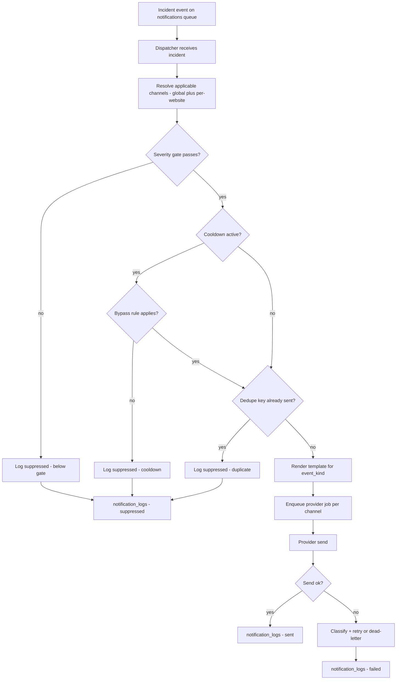
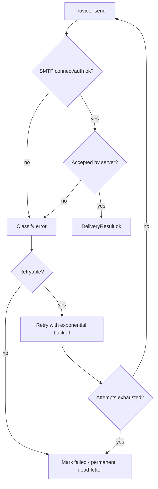

# NOTIFICATIONS.md — SiteSentinel — Website Monitoring & Security Alerts

> **Specification only.** Nothing described in this document has been implemented.
> Every statement is future/conditional ("the dispatcher will…", "Phase 5 implements…").
> There is no application code and there are no migrations at the time of writing.

> **Authority.** [`PRD.md`](PRD.md) §13 states *what must be true* about notifications;
> this document is the detailed source of truth for **how** they are delivered — provider
> contracts, payload shapes, retry/backoff policy, dedup and cooldown mechanics, and the
> delivery-log shape (`PRD.md` §21 Cross-Document Map). Table and column names used here are
> frozen in [`DATABASE.md`](DATABASE.md). Component names and flow positions come from
> [`ARCHITECTURE.md`](ARCHITECTURE.md) §3 and §8. Rationale is recorded in
> [`DECISIONS.md`](DECISIONS.md) (`ADR-010` provider-independent dispatcher, `ADR-011` MVP
> channels). Secret handling defers to [`SECURITY.md`](SECURITY.md) §4.

---

## 1. Purpose & Scope

### 1.1 What this document is

`NOTIFICATIONS.md` is the exhaustive specification of SiteSentinel's alerting subsystem: the
provider-independent **notification dispatcher**, the **Email** and **Telegram** providers that ship
at MVP, the notification event catalogue, template contracts, duplicate-suppression and cooldown
mechanics, delivery logging, failure handling, and per-website scoping.

### 1.2 Relationship to sibling documents

| Document | Authority over notifications | What it owns |
| --- | --- | --- |
| [`PRD.md`](PRD.md) §13 | **Authoritative** | Required behaviour: `FR-64`–`FR-76`, triggers, dedup/cooldown as product rules, content-safety rule (`FR-73`). |
| [`ARCHITECTURE.md`](ARCHITECTURE.md) §3, §8 | Derived | The dispatcher's position in the flow, the `Queue: notifications` worker, component boundaries. |
| [`DATABASE.md`](DATABASE.md) | **Authoritative for names** | `notification_channels`, `website_notification_channel`, `notification_logs`, `notification_cooldowns`, `settings` columns. |
| [`DECISIONS.md`](DECISIONS.md) | Derived | Rationale: `ADR-010` (provider independence), `ADR-011` (MVP channels = Email + Telegram). |
| [`DETECTION-RULES.md`](DETECTION-RULES.md) | Derived | Severity transitions and signal categories that produce incident events. |
| [`SECURITY.md`](SECURITY.md) §4 | **Authoritative for secrets** | Encryption of `secret_ref`, log redaction denylist, no-secrets-in-payloads rule. |
| **`NOTIFICATIONS.md`** (this file) | **Authoritative for delivery mechanics** | Provider contracts, payload shape, templates, retry/backoff, dedup/cooldown implementation. |

If this document contradicts [`PRD.md`](PRD.md) on a product-level requirement, [`PRD.md`](PRD.md)
wins and this document must be fixed.

### 1.3 Scope boundaries

- **In scope** — dispatch triggers, channel abstraction, Email and Telegram providers, template
  data contract, suppression/cooldown, retries, delivery logging, per-website scoping, test-send.
- **Out of scope** — the incident state machine ([`PRD.md`](PRD.md) §12), detection scoring
  ([`DETECTION-RULES.md`](DETECTION-RULES.md)), the status page ([`STATUS-PAGE.md`](STATUS-PAGE.md)),
  the SSRF guard for outbound probes ([`SECURITY.md`](SECURITY.md) §5).
- **Not implemented at MVP** — WhatsApp and Webhook channels (`FR-74`, `FR-75`), per-admin
  preferences and quiet hours (`FR-76`). See §7.

---

## 2. Design Principle — Provider Independence

### 2.1 The rule

> **The incident engine must know nothing about Telegram.**

The incident engine ([`ARCHITECTURE.md`](ARCHITECTURE.md) §3) creates and transitions incidents and
emits **channel-agnostic notification intents**. It never constructs a mail message, never formats a
Telegram MarkdownV2 string, and never holds a bot token. Its only notification-side responsibility is
to emit an event onto the `notifications` queue.

This is mandated by `FR-64` ("Notification dispatch MUST go through a **provider-independent
dispatcher** abstraction") and `NFR-18` ("Notification providers MUST be separable"), and recorded
in [`DECISIONS.md`](DECISIONS.md) `ADR-010`.

### 2.2 Required pipeline

```text
Incident -> Notification Dispatcher -> Provider (Email | Telegram | WhatsApp | Webhook)
```

- **Incident** — the incident engine produces an **incident event** (§3) and pushes a
  `SendIncidentNotification` job onto the `notifications` queue
  ([`ARCHITECTURE.md`](ARCHITECTURE.md) §3, §8).
- **Notification Dispatcher** — resolves applicable channels, applies suppression/cooldown/dedupe
  gates, renders templates, fans out one provider job per channel, and writes `notification_logs`.
- **Provider** — a concrete implementation (`Email`, `Telegram`, later `WhatsApp`, `Webhook`) that
  translates the provider-independent payload into a transport-specific message and delivers it.

### 2.3 The provider contract (conceptual)

Every provider MUST implement a common contract. The interface is conceptual — the binding part is
the **responsibility boundary**, not the exact PHP type names
([`ARCHITECTURE.md`](ARCHITECTURE.md) §3 places these under
`app/Services/Notifications/Channels/*`).

```text
interface NotificationProvider {
  send(NotificationPayload $payload): DeliveryResult
  supports(string $eventKind): bool
  validateConfig(array $config, ?string $secret): ValidationResult
}

DeliveryResult {
  ok: bool
  provider_message_id: ?string      # e.g. SMTP queue id, Telegram message_id
  error_code: ?string               # provider/transport classification
  error_message: ?string            # REDACTED per SECURITY.md §4 denylist
  retryable: bool                   # drives the retry policy in §12
  latency_ms: int
}
```

- **`send(NotificationPayload): DeliveryResult`** — deliver one already-rendered payload and return a
  structured outcome. Providers MUST NOT throw for expected delivery failures; they return a
  `DeliveryResult` so the dispatcher owns retry classification and logging.
- **`supports(event_kind)`** — declares which event kinds a provider handles. This lets a provider
  opt out of event kinds it cannot express (e.g. a future provider with no plain-text fallback).
- **`validateConfig(config, secret)`** — validates channel configuration at save time **and** at
  test-send time, without sending live traffic.

### 2.4 The payload DTO — provider-independent

The payload is a plain data transfer object carrying only **already-redacted, provider-neutral**
fields. Providers decide how to render it.

```text
NotificationPayload {
  incident_id: int
  website_id: int
  event_kind: string          # e.g. "incident.opened", "incident.resolved" (§3)
  severity: string            # INFO | WARNING | CRITICAL
  title: string               # human-readable, safe for transport
  summary: string             # human-readable, safe for transport
  detected_at: datetime       # UTC
  admin_url: string           # deep link into /admin (FR-73: summary + link only)
  dedupe_key: string          # §9.1
  template_vars: map          # §8 data contract — no secrets, no raw bodies
}
```

**Hard payload rules (from `FR-73` and [`PRD.md`](PRD.md) §13.6):**

- The payload MUST NOT contain secrets, credentials, full response bodies, suspicious keyword lists,
  malicious domain lists, redirect targets, rule IDs/weights/scores, or snapshot contents.
- The payload carries a **summary and a deep link into the admin area** — nothing more. Sensitive
  detail stays behind `/admin` authentication, because notification transports (especially Telegram)
  are **semi-public**.

### 2.5 Provider registry and binding

- Each `notification_channels.type` value maps to exactly one provider implementation via a registry
  resolved by the Laravel service container (a binding from `type` → provider class).
- The registry is **open for extension**: registering a new type is a one-line binding plus a new
  provider class. The `type` enum in `notification_channels` is intentionally extensible
  ([`DATABASE.md`](DATABASE.md) §3.13).
- Unknown types MUST fail closed: the dispatcher records a `failed` `notification_logs` row with a
  configuration error and surfaces it in the admin health view. It never silently ignores a channel.
- Provider selection for a dispatch is driven entirely by `notification_channels.type`; the
  dispatcher never branches on channel identity in application logic.

### 2.6 The extension guarantee

Adding a Future provider (WhatsApp, Webhook, or a Slack/Discord webhook expressed as a Webhook
channel — [`DECISIONS.md`](DECISIONS.md) `ADR-011`) MUST require:

1. a new provider class implementing the §2.3 contract,
2. a registry binding, and
3. an enum value for `notification_channels.type` (and one for `notification_cooldowns.event_kind`
   if it introduces new event kinds).

It MUST NOT require any change to the incident engine, the detection engine, or the dispatcher's
gating logic. This is the acceptance test for `ADR-010`.

---

## 3. Notification Events

The dispatcher is event-driven. Each incident event maps to a **notification event** with a stable
`event_kind` string used in `notification_cooldowns.event_kind`, in `notification_logs.dedupe_key`,
and in template selection.

| Event name | `event_kind` | Trigger | Default severity gate | Default enabled | MVP / Future |
| --- | --- | --- | --- | --- | --- |
| Incident opened | `incident.opened` | Incident transitions to `DETECTED` (`FR-65`, `FR-66`; [`PRD.md`](PRD.md) §12.2, §13.3) | `WARNING` and above | Enabled | `MVP` |
| Incident severity escalated | `incident.escalated` | Open incident's severity increases `WARNING` → `CRITICAL` (`FR-43` semantics; [`PRD.md`](PRD.md) §13.3) | `CRITICAL` | Enabled | `MVP` |
| Incident acknowledged | `incident.acknowledged` | Admin transitions `DETECTED` → `ACKNOWLEDGED` (`FR-58`; [`PRD.md`](PRD.md) §12.2) | `WARNING` and above | Disabled (informational, opt-in) | `MVP` |
| Incident resolved / recovered | `incident.resolved` | Incident transitions to `RESOLVED` (`FR-70`; [`PRD.md`](PRD.md) §12.2, §13.3) | `WARNING` and above | Enabled | `MVP` |
| Repeated-incident reminder | `incident.reminder` | A still-open incident remains unresolved past a reminder interval | `WARNING` and above | Disabled (opt-in) | `MVP` |
| Test notification | `channel.test` | Admin presses "send test" on a channel (§14.1) | n/a (always sent) | Enabled by action | `MVP` |
| Digest / bulk outage | `incident.digest` | Many websites fail within a short window (§9.6) | n/a | Disabled | `Future` |

Notes:

- **`INFO` never notifies.** `INFO` is "recorded on the check result and the website timeline. **No
  incident created.** No notification." ([`PRD.md`](PRD.md) §11.3). Only `WARNING` and `CRITICAL`
  yield incidents and therefore notifications.
- The **default severity gate** is the minimum incident severity at which a channel sends that event,
  configurable per channel (§13.2). The gate is applied **before** the suppression gates in §4.
- Acknowledged-mode notification is **informational only** and MUST never be treated as resolution
  (`FR-58`; [`PRD.md`](PRD.md) §13.3).

---

## 4. Dispatch Pipeline

### 4.1 Step-by-step

1. **Incident event emitted** — the incident engine writes `incidents` / `incident_events`
   and pushes `SendIncidentNotification` onto the **`notifications` queue**
   ([`ARCHITECTURE.md`](ARCHITECTURE.md) §3, §8). Dispatch happens **on the queue, never inline in
   the monitoring/detection path** (`FR-72`; `NFR-07`: a failing channel must not block incident
   creation).
2. **Dispatcher receives the event** — resolves the incident and its website.
3. **Resolve applicable channels** — global enabled channels plus per-website scoping via
   `website_notification_channel` (§13.1; [`DATABASE.md`](DATABASE.md) §3.14).
4. **Severity-gate filter** — drop channels whose configured gate is above the incident severity.
5. **Suppression / cooldown gate** — check `notification_cooldowns` for an active window on the
   dedupe/cooldown key (§9), including flapping thresholds (§9.3) and the escalation-only rule
   (§9.4).
6. **Dedupe gate** — check `notification_logs` via `idx_notification_logs_dedupe_key` for an existing
   successful send of the same `dedupe_key` (§9.1). One notification per incident + event + channel
   (`FR-68`).
7. **Render template** — select the `event_kind` template and render it through the provider's
   renderer using the §8 data contract.
8. **Enqueue provider job** — one job per surviving channel, on the `notifications` queue.
9. **Send** — the provider performs the transport call (§5, §6).
10. **Record `notification_logs`** — one row per attempt with outcome (§11). Suppressions are
    recorded with `status = suppressed` so "why didn't I get an alert?" is answerable
    ([`PRD.md`](PRD.md) §13.4).
11. **Handle failure** — classify, retry with backoff, or mark permanently failed (§12).

### 4.2 Flowchart



### 4.3 Ordering guarantees

- **Gate before enqueue** — both dedupe and cooldown MUST be enforced **before** enqueueing
  ([`PRD.md`](PRD.md) §13.4), so a flood never reaches the provider.
- **Per-channel isolation** — both gates are evaluated **per channel**, so a broken channel's retries
  cannot reset another channel's state ([`PRD.md`](PRD.md) §13.4).
- **Never inline** — no network call to a provider ever happens in the scheduler or the check
  worker. The monitoring plane and the notification plane are separate queue workers
  ([`ARCHITECTURE.md`](ARCHITECTURE.md) §1.2, §12).

---

## 5. Email Provider

### 5.1 Transport options

| Transport | Status | Notes |
| --- | --- | --- |
| **SMTP** | **MVP — primary** | Configured via Laravel's mailer. The canonical requirement is "Configurable SMTP" (`FR-65`; [`PRD.md`](PRD.md) §13.2). |
| Mailgun / SES / Sendmail | Future (configurable mailers) | Selectable by changing the mailer driver, consistent with `ADR-011`'s principle that transport is swappable behind the contract. |

Laravel's mail abstraction is used directly; SiteSentinel will **not** hand-roll an SMTP client.

### 5.2 Required settings

- `host`, `port`, `username`, `encryption` (`tls`/`ssl`) — non-secret, stored in
  `notification_channels.config` (JSON).
- `password` — **secret**, stored **encrypted** in `notification_channels.secret_ref`
  ([`DATABASE.md`](DATABASE.md) §3.13; [`SECURITY.md`](SECURITY.md) §4.2). It MUST NOT appear in
  `config`, logs, or payloads.
- `from_address` / `from_name` and one or more `recipients` — non-secret.

### 5.3 From-address conventions

- The `From` address MUST be a mailbox the operator controls and that passes SPF/DKIM for the sending
  domain; a mismatch degrades deliverability, not correctness.
- The envelope/`From` MUST NOT impersonate the monitored website. SiteSentinel sends as **itself**.
- Recipients are configured per channel; MVP supports one or more recipients per Email channel.

### 5.4 TLS requirement

SMTP submission MUST use TLS (`tls` or `ssl`) in production. Plaintext SMTP is a
misconfiguration and MUST be rejected by `validateConfig` unless explicitly overridden in a
non-production environment. This aligns with [`SECURITY.md`](SECURITY.md)'s "TLS in transit" posture
and `NFR-13` (secrets must not be exposed in transit).

### 5.5 Template rendering

- Email bodies are rendered from **server-rendered Blade templates** — consistent with the
  no-SPA architecture (`ADR-002`). There is no client-side templating and no JS-rendered body.
- Templates live in the notification template catalogue (§8) and are selected by `event_kind`.
- Every Email template MUST provide a **plain-text alternative** (`text/plain`) alongside HTML.
  Sending HTML-only mail is a failure mode that hurts deliverability and accessibility.

### 5.6 Header considerations

- Set an unambiguous `Subject` that identifies the product and the event, e.g.
  `[SiteSentinel] CRITICAL — <website name>: security incident`.
- Include a `Message-ID` so the mail is traceable; record the provider's identifier in
  `notification_logs.provider_message_id`.
- Use a consistent `List-` free, transactional header set — these are transactional alerts, not
  marketing, and MUST NOT carry unsubscribe machinery that implies opt-out of security alerts.
- Headers MUST NOT echo monitored content (see the escaping pitfall in §6.3, which applies equally
  to HTML mail).

### 5.7 Failure semantics



- Transient SMTP errors (connection refused, 4xx greylisting, timeouts) → **retry** with backoff.
- Permanent errors (5xx with a permanent code, malformed recipient) → **dead-letter** immediately.
- A failed email MUST NOT fail the monitoring job (`FR-72`, `NFR-10`).

---

## 6. Telegram Provider

### 6.1 Required settings

- `bot_token` — **secret**, stored **encrypted** in `notification_channels.secret_ref`
  ([`DATABASE.md`](DATABASE.md) §3.13; [`SECURITY.md`](SECURITY.md) §4.2).
- `chat_id` — **non-secret**, stored in `notification_channels.config` (JSON). May be a user chat, a
  group chat (negative id), or a forum **topic** id when the target is a topic within a supergroup.
- Optional `message_thread_id` (non-secret) for topic routing.

Cross-reference: token encryption, rotation, and the log-redaction denylist (`bot_token`, `token`)
are specified in [`SECURITY.md`](SECURITY.md) §4.2. A Telegram token can appear inside an HTTP client
exception, so the exception handler MUST scrub the denylist ([`SECURITY.md`](SECURITY.md) §4.2 rule 5).

### 6.2 Rate limits and dispatcher behaviour

Telegram's Bot API enforces per-chat rate limits and returns **HTTP 429 with `retry_after`** (seconds)
when exceeded. The dispatcher MUST respect them:

- **Per-chat throttling** — the dispatcher serialises sends to the same `chat_id` (a per-chat lock in
  Redis) so bursts on one target do not trip the limit.
- **429 / `retry_after` backoff** — on a 429, the job MUST honour `retry_after` as the minimum delay
  before the next attempt, rather than the generic exponential schedule (§12).
- **Respect, do not hammer** — repeated 429s MUST NOT trigger aggressive retries; the retry budget is
  consumed and the channel may be circuit-broken (§12.4).

### 6.3 Escaping — the critical pitfall

Telegram parse modes (`MarkdownV2`, `HTML`) require **reserved characters to be escaped**. Monitored
website content is attacker-influenced and MUST be treated as untrusted text.

- **The pitfall** — an unescaped monitored value containing `_`, `*`, `[`, `]`, `` ` ``, `(`, `)`, or
  a stray `\` causes the **entire message to be rejected** by Telegram with a 400 parse error. A
  single underscore in a website title can silently break every alert for that website.
- **The rule** — all interpolated values MUST be escaped for the chosen parse mode (or better, the
  dispatcher escapes centrally in the Telegram renderer, never in templates). Prefer `HTML` mode with
  strict `&`/`<`/`>` escaping, which is easier to get right than `MarkdownV2`.
- **The fallback** — if a send fails with a parse error, the provider MUST retry **once** with
  `parse_mode` disabled and plain text, so an escaping bug degrades formatting rather than suppressing
  the alert. The outcome is logged.

### 6.4 Message length and truncation

- Telegram caps message text at **4096 characters**. The renderer MUST enforce this limit.
- **Truncation strategy** — cap the human `summary` to a conservative budget (leaving room for the
  title, severity, timestamp, and `admin_url`), truncate on a word boundary, and append an ellipsis.
  The **`admin_url` deep link MUST always survive truncation** — it is the escape hatch to full
  detail (`FR-73`).
- Because the payload is a summary + link (§2.4), truncation should rarely trigger; it is a safety
  net against a pathological website name or summary.

### 6.5 Group / topic support

- `chat_id` may be a private chat, a group, or a supergroup; group ids are negative.
- For forum supergroups, an optional `message_thread_id` routes the message to a topic.
- Group targets are **semi-public** — this is precisely why payloads carry no secrets or evidence
  ([`PRD.md`](PRD.md) §13.6).

### 6.6 Webhook vs long-polling

- **MVP = outbound Bot API calls only.** SiteSentinel sends via the Telegram Bot API; it does **not**
  run an inbound webhook endpoint and does **not** long-poll for updates.
- Rationale — SiteSentinel is the sender, not a bot receiving commands. There is no inbound surface at
  MVP, so there is no webhook secret to manage and no additional public endpoint to defend. Inbound
  commands are not a requirement (`FR-66` requires only a bot token + chat identifier).

### 6.7 Test-send behaviour

- The admin "send test" action (§14.1) calls the Telegram provider with a `channel.test` payload.
- The provider MUST validate the token and chat id first (`validateConfig` + a `getMe`/send probe as
  appropriate), then send a clearly-labelled test message and record a `notification_logs` row with
  `dedupe_key` scoped to the test (so it never collides with real incident keys).
- A test send uses the same escaping and truncation path as production, so a passing test genuinely
  proves the channel works.

---

## 7. Future Providers

> **Both providers below are `Future` (`FR-74`, `FR-75`) and MUST NOT be built at MVP.** They are
> documented so the abstraction in §2 provably accommodates them without incident-engine changes
> (`ADR-010`, [`DECISIONS.md`](DECISIONS.md) assumptions: "WhatsApp/Webhook channels are explicitly
> Future and must not be built now").

### 7.1 WhatsApp (`Future` — Phase 2, `FR-74`)

- **Cloud API considerations** — WhatsApp Business Cloud API requires a Meta Business account, a
  verified sender, and a registered phone number; this is a heavier setup than Email/Telegram.
- **Template message pre-approval** — business-initiated messages MUST use **pre-approved message
  templates**. Arbitrary free-form text is only permitted inside a customer-service window. This means
  the WhatsApp provider cannot simply render the generic payload; it must map each `event_kind` to an
  approved template with positional parameters.
- **Cost implications** — per-conversation / per-message pricing applies (`DECISIONS.md` `ADR-011`
  records cost as a reason WhatsApp was deferred). Retention and volume therefore have a direct cost
  dimension that Email and Telegram do not.
- **Abstraction fit** — the provider implements the §2.3 contract and maps `template_vars` into an
  approved template; the dispatcher and incident engine are unchanged.

### 7.2 Generic Webhook (`Future` — Phase 2, `FR-75`)

- **Configuration** — URL, HTTP method, static headers, and a shared HMAC secret (admin-supplied).
- **HMAC signing** — the request body MUST be signed with the shared secret (e.g.
  `X-SiteSentinel-Signature: sha256=<hmac>`), so the receiver can verify authenticity and integrity.
  The signing secret is **encrypted** in `notification_channels.secret_ref`.
- **Timeout** — a bounded per-request timeout, consistent with the bounded-request posture
  ([`PRD.md`](PRD.md) §15.5).
- **Retry** — the standard retry/backoff policy (§12); a webhook receiver returning 5xx or timing out
  is retryable, a 4xx is permanent.
- **SSRF consideration** — webhook targets are **admin-configured URLs** and therefore carry the same
  class of risk as monitored URLs. The outbound request MUST pass the layered SSRF guard of
  [`SECURITY.md`](SECURITY.md) §5 (scheme allowlist, IP deny rules, per-hop DNS re-resolution, hop
  cap). This is the monitor calling an admin-supplied URL, so the guard is mandatory, not optional.

---

## 8. Notification Templates

### 8.1 Template catalogue

| Template | Selected by `event_kind` | Purpose |
| --- | --- | --- |
| Incident opened | `incident.opened` | First alert for a new `DETECTED` incident. |
| Severity escalated | `incident.escalated` | Re-alert when an open incident rises to `CRITICAL`. |
| Acknowledged | `incident.acknowledged` | Informational; a human has seen it. |
| Resolved | `incident.resolved` | Recovery notification (`FR-70`). |
| Reminder | `incident.reminder` | Nudge for a still-open incident. |
| Test | `channel.test` | Connectivity/content check for a channel. |

Each template has an Email rendering (HTML + plain-text) and a Telegram rendering (§5.5, §6.3).

### 8.2 Variable / data contract

Templates receive exactly this provider-neutral contract (the `template_vars` of §2.4). **Nothing
else** is exposed to a template.

| Variable | Meaning | Notes |
| --- | --- | --- |
| `website.name` | Display name of the website | See redaction rule §8.4. |
| `website.url` | Target URL | May be included for the admin-facing message. |
| `severity` | `INFO` / `WARNING` / `CRITICAL` | `WARNING`/`CRITICAL` only, at MVP. |
| `incident_type` | `availability` or `security` | From `incidents.type`. |
| `score` | Correlated risk score | Admin-facing only; see §8.4 caveat. |
| `triggered_rules` | Rule IDs/names that fired | Admin-facing summary; never public (status page). |
| `summary` | Human-readable description | `FR-55` `title`/`summary` are "safe for notification payloads". |
| `detected_at` | First detection timestamp (UTC) | |
| `incident_id` | Incident identifier | For correlation/traceability. |
| `current_status` | Current lifecycle state | `DETECTED` / `ACKNOWLEDGED` / `RESOLVED`. |
| `admin_url` | Deep link into `/admin` | The only link carried (`FR-73`). |

**`summary` reading.** `PRD.md` §12.4 / `FR-55` define `title`/`summary` as "human-readable
description safe for notification payloads", while §13.6 (`FR-73`) forbids keyword lists and
malicious-domain lists in payloads. This document therefore treats `summary` as a **human-authored,
non-identifying** description (e.g. "content on this website does not match its baseline") and never
as a raw enumeration of detected keywords or domains.

### 8.3 Worked example — incident-opened notification

**Scenario** — `contoh-toko.example` (client e-commerce site) transitions to `DETECTED` with severity
`CRITICAL`, type `security` ([`PRD.md`](PRD.md) §10.6 scenario). Every check returned HTTP `200`, so
availability is `UP`.

**Email rendering (subject + plain-text body):**

```text
Subject: [SiteSentinel] CRITICAL — Contoh Toko: security incident detected

SiteSentinel detected a CRITICAL security incident.

Website : Contoh Toko
Type    : security
Severity: CRITICAL
Detected: 2026-09-01 03:15 UTC (incident #4821)
Status  : DETECTED
Summary : Content served does not match this website's baseline.

Open the incident in the admin area for full detail and evidence:
https://sentinel.example/admin/incidents/4821

You are receiving this because Email is an enabled notification channel.
```

Note the body carries a **summary and a link only** — no keywords, no domains, no raw HTML.

**Telegram rendering (HTML parse mode, escaped):**

```text
<b>CRITICAL — security incident detected</b>
Website: Contoh Toko
Type: security
Detected: 2026-09-01 03:15 UTC (incident #4821)
Status: DETECTED
Summary: Content served does not match this website's baseline.

<a href="https://sentinel.example/admin/incidents/4821">Open incident in admin</a>
```

All interpolated values are escaped for the parse mode (§6.3); the `admin_url` survives truncation
(§6.4).

### 8.4 The no-secrets rule

> **Templates MUST NEVER include unredacted secrets.**

- No SMTP password, Telegram bot token, HMAC secret, DB/Redis credential, `APP_KEY`, or session
  value may be interpolated — directly or via `template_vars`.
- No full response bodies, snapshot contents, raw headers, or resolved IPs.
- No suspicious keyword enumeration, malicious domain list, or redirect chain
  ([`PRD.md`](PRD.md) §13.6; `FR-73`).
- The `score`, `triggered_rules`, and `website.url` variables are **admin-facing** — they belong in a
  notification delivered to the operator's own channel, and MUST NOT be reused by the public status
  page ([`STATUS-PAGE.md`](STATUS-PAGE.md), [`PRD.md`](PRD.md) §14.4).

---

## 9. Duplicate Suppression & Spam Protection

This is the core anti-noise design. A noisy monitor is abandoned
([`PRD.md`](PRD.md) §11.6), so suppression is a **first-class rule**, not a tuning knob.

### 9.1 Incident-scoped suppression (identity rule)

- **One notification per incident per state transition per channel** (`FR-68`;
  [`PRD.md`](PRD.md) §13.4). This is an **identity rule, not a time rule**.
- **Dedupe key composition** — the dispatcher computes:

  ```text
  dedupe_key = incident_id + ":" + event_kind + ":" + channel_id
  ```

  stored in `notification_logs.dedupe_key` (`VARCHAR(191)`) and queried via
  `idx_notification_logs_dedupe_key` ([`DATABASE.md`](DATABASE.md) §3.15, §5). A matching
  previously-**sent** row suppresses the new attempt.
- **Idempotency across restarts** — because the key is deterministic, restarting workers cannot
  re-send for an unchanged condition (`NFR-09`).
- **Repeated detections while open** never re-notify beyond cooldown; evidence is appended silently
  to the existing incident (`FR-60`; [`PRD.md`](PRD.md) §13.3).

### 9.2 Cooldown (time rule)

- An **additional** per-website + per-channel minimum interval between notifications, guarding
  against flapping and cross-incident bursts (`FR-69`; [`PRD.md`](PRD.md) §13.4).
- Cooldown state lives in `notification_cooldowns`, keyed by `cooldown_key`
  (`uq_notification_cooldowns_key`), with `window_started_at`, `expires_at`, and
  `suppressed_count` ([`DATABASE.md`](DATABASE.md) §3.16).

  ```text
  cooldown_key = channel_id + ":" + website_id   (for most events)
  ```

  `incident_id` is recorded on the row for traceability; `event_kind` records what triggered the
  window.

- **Recommended defaults:**

  | Scope | Default | Notes |
  | --- | --- | --- |
  | Global default cooldown | **15 minutes** | Applied per `website_id` + `channel_id` when no per-website override exists. |
  | Per-website override | 15 min, admin-tunable | Stored as a setting; MVP ships the global default. |
  | Per-channel override | 15 min, admin-tunable | Sends are always per-channel isolated. |

- **Bypass rules — when cooldown does NOT suppress:**

  | Condition | Bypasses cooldown? | Why |
  | --- | --- | --- |
  | `incident.escalated` to a **higher** severity | **Yes** | Escalation is a materially new fact ([`PRD.md`](PRD.md) §13.3, `FR-43` semantics); suppressing it would hide the moment a problem got worse. |
  | `incident.resolved` (recovery) | **Yes** | Recovery must always be delivered (§10), otherwise the operator is left believing an outage is ongoing. |
  | First notification for a brand-new incident | **Yes** | Cooldown cannot suppress the opening alert for a new incident; otherwise a genuine new outage inside a busy window goes silent. |
  | Anything else at the same severity | **No** | Same-severity re-detections are noise (§9.5). |

  > **Escalation-only + recovery-never-suppressed** is the whole point: cooldown exists to stop
  > repetition, never to stop *change*.

### 9.3 Flapping protection

Repeated `UP`/`DOWN` oscillation must not spam the operator.

| Threshold | Recommended default | Rationale |
| --- | --- | --- |
| **Consecutive failures before the first `DOWN` notification** | **2** (configurable, ≥ 2) | One failed check is frequently a transient network blip or a single dropped packet. Notifying on 1 would wake the operator for a hiccup that self-heals before they read the message — the single largest source of false-positive noise. Two consecutive failures strongly indicate a real outage while still notifying within one interval. |
| **Consecutive successes before a recovery notification** | **2** (configurable, ≥ 2) | A single success during an unstable period does not mean stable recovery; notifying on 1 produces a "resolved / down again" ping-pong. Two consecutive successes is the mirror of the failure threshold and keeps the two ends symmetric. |

These thresholds are already realised as durable counters in the schema:
`websites.consecutive_failures` and `websites.consecutive_successes`
([`DATABASE.md`](DATABASE.md) §3.4, "recovery logic"). `FR-53` requires exactly this behaviour: an
incident is created "when an availability failure crosses its configured threshold (e.g. N
consecutive failed checks), **not on a single transient failure by default**".

### 9.4 Escalation-only rule

- Re-notify only when severity **increases** (`WARNING` → `CRITICAL`), never on every re-detection at
  the same severity ([`PRD.md`](PRD.md) §13.3).
- Severity MUST NOT be silently downgraded while an incident is open
  ([`PRD.md`](PRD.md) §11.3); a recurrence after resolution opens a **new** incident (new
  `incident_id`, hence a new dedupe key), which is correctly notifiable again.

### 9.5 Batch / digest behaviour (`Future`)

- When many websites fail within a short window (e.g. a shared upstream or network outage), per-site
  notifications can still be noisy even with cooldown. A single **"bulk outage"** alert summarising N
  websites is therefore a **`Future`** item (`incident.digest`, §3).
- At MVP the combination of dedupe (§9.1), cooldown (§9.2), and flapping thresholds (§9.3) is the
  approved mitigation; digests are **not** built now.

### 9.6 Where suppression state lives

| Concern | Location | Reference |
| --- | --- | --- |
| Dedupe (identity) state | `notification_logs.dedupe_key` + `idx_notification_logs_dedupe_key` | [`DATABASE.md`](DATABASE.md) §3.15, §5 |
| Cooldown (time) state | `notification_cooldowns` (`cooldown_key`, `window_started_at`, `expires_at`, `suppressed_count`) | [`DATABASE.md`](DATABASE.md) §3.16 |
| Flapping counters | `websites.consecutive_failures`, `websites.consecutive_successes` | [`DATABASE.md`](DATABASE.md) §3.4 |
| Per-chat throttle / circuit state (runtime) | Redis | [`ARCHITECTURE.md`](ARCHITECTURE.md) §3 |

> ⚠️ **Residual-risk note — Redis vs DB durability.** The **authoritative** suppression state is in
> MySQL (`notification_logs`, `notification_cooldowns`), because it must survive worker restarts
> (`NFR-09`). Redis is used for *transient runtime* coordination (per-chat throttles, circuit
> breakers, locks). If Redis is flushed or evicted, a throttle window may be lost and the dispatcher
> may send slightly sooner than intended — but it will never send a duplicate, because the identity
> dedupe lives in MySQL. **Cooldown must never be Redis-only**, or a Redis restart could re-enable a
> notification storm.

---

## 10. Recovery Notifications

### 10.1 When a recovery is declared

A recovery is declared when an incident transitions to **`RESOLVED`**
([`PRD.md`](PRD.md) §12.1–12.2). Entry is either:

- **automatic** — the system observes sustained recovery in the relevant dimension (`FR-59`), i.e.
  the flapping success threshold (§9.3) is met, or
- **manual** — an Admin resolves the incident directly (`FR-59`, `US-06`).

The audit trail MUST distinguish automatic from manual resolution (`FR-59`) via
`incidents.resolution_mode` = `auto` | `manual` ([`DATABASE.md`](DATABASE.md) §3.10).

### 10.2 What the message contains

The `incident.resolved` template carries: website name, incident id, type, the severity the incident
held, `detected_at`, the resolved timestamp, and `resolution_mode` (auto/manual) surfaced in human
terms ("recovered automatically" vs "resolved by an operator"). It is **clearly distinguished from
the detection message** (`FR-70`) — different subject, different wording, never confusable.

### 10.3 Recovery is never suppressed by cooldown

> **A recovery notification MUST always be delivered, even inside a cooldown window.**

Rationale — the operator's mental model is "is it broken right now?". Suppressing a recovery leaves
them acting on a stale outage, which is worse than one extra message. This is enforced as a cooldown
**bypass** (§9.2). Identity dedupe still applies: the recovery is sent **once** per incident per
channel, keyed `incident_id:incident.resolved:channel_id`.

### 10.4 Interaction with auto-resolution

- Auto-resolution is itself the product of the flapping-success threshold (§9.3), so a stable
  recovery produces exactly one recovery notification.
- Because recurrence after `RESOLVED` opens a **new** incident ([`PRD.md`](PRD.md) §12.1), a genuine
  re-failure is notifiable again as `incident.opened` with a fresh dedupe key. There is no need to
  "re-open" a notification on the old incident.

---

## 11. Delivery Logging

### 11.1 Fields captured per attempt

One row in `notification_logs` per delivery attempt ([`DATABASE.md`](DATABASE.md) §3.15):

| `notification_logs` column | Captures |
| --- | --- |
| `id` | Attempt row identifier. |
| `incident_id` | Incident reference (nullable — e.g. test sends). |
| `channel_id` | Channel used. |
| `status` | `queued` / `sent` / `failed` / `suppressed`. |
| `attempt` | Attempt number for this dispatch (`TINYINT UNSIGNED`, default 1). |
| `provider_message_id` | Provider-side id (SMTP id, Telegram `message_id`). |
| `error` | Failure reason / classification — **redacted** per §11.3. |
| `dedupe_key` | The §9.1 identity key. |
| `sent_at` | UTC send timestamp. |
| `created_at` | Row creation (attempt) timestamp. |

**Event kind** is encoded within `dedupe_key` (`incident_id:event_kind:channel_id`), and the
provider identity is derivable from `channel_id` → `notification_channels.type`. Where the PRD asks
for "channel, target, timestamp, outcome" (`FR-71`), these map to `channel_id`, the channel's
configured target, `sent_at`/`created_at`, and `status` respectively.

`FR-71` requires logging channel, target, timestamp, outcome, and failure reason. Those map onto the
frozen `notification_logs` columns ([`DATABASE.md`](DATABASE.md) §3.15) as `channel_id`, the channel's
configured target (derivable from `notification_channels.config`), `sent_at`/`created_at`, `status`,
and `error` — **no dedicated `latency_ms` column exists at MVP**, so dispatch latency is recorded
inside the existing `error`/metadata path rather than a new column.

### 11.2 Retention

`notification_logs` are retained **90 days** by default (`FR-71`, `PRD.md` §16.1), configurable, and
pruned by hard delete on `created_at` ([`DATABASE.md`](DATABASE.md) §4). `notification_cooldowns`
rows are transient — deleted by `expires_at`.

### 11.3 Redaction

- `error` MUST be redacted against the [`SECURITY.md`](SECURITY.md) §4.2 denylist (`password`,
  `token`, `secret`, `authorization`, `cookie`, `x-api-key`, `bot_token`, `smtp`) before persisting,
  because a provider exception can embed a bot token or SMTP credential.
- Logs MUST NOT contain message bodies or monitored content beyond what is already permitted in
  payloads (§2.4).

### 11.4 Admin visibility

- Notification logs are **admin-visible in the dashboard** — every dispatch attempt, including
  `suppressed` rows, so "why didn't I get an alert?" is answerable (`FR-71`, `FR-101`;
  [`PRD.md`](PRD.md) §13.4, §13.5).
- Failure states MUST be visible in the admin UI, not merely in application logs (`FR-101`).
- The per-website timeline interleaves notification dispatches with checks and incident events
  (`FR-61`).

---

## 12. Failure Handling

### 12.1 Retry strategy

- **Exponential backoff** with a bounded attempt cap (Laravel's queue retry semantics; `NFR-08`
  requires backoff and that jobs are not silently lost).
- **Max attempts** — bounded (recommended: 3–5 attempts per dispatch). Exhausting the budget moves
  the attempt to the **failed** state (§12.3).
- **Per-channel isolation** — retries on one channel MUST NOT reset or delay another channel's state
  ([`PRD.md`](PRD.md) §13.4).

### 12.2 Retryable vs permanent classification

| Condition | Class | Action |
| --- | --- | --- |
| HTTP 5xx from provider | Retryable | Retry with backoff. |
| HTTP **429** / rate limited | Retryable | Retry honouring `retry_after` (§6.2). |
| Timeout / connection reset | Retryable | Retry with backoff. |
| HTTP **401/403** (invalid/revoked token) | **Permanent** | Dead-letter; surface `auth` failure in admin; likely circuit-break (§12.4). |
| HTTP **400** (bad request, invalid chat id, parse error after fallback) | **Permanent** | Dead-letter; surface configuration error. |
| SMTP permanent 5xx / invalid recipient | **Permanent** | Dead-letter. |
| SMTP transient 4xx / greylist | Retryable | Retry with backoff. |

Classification is the provider's job (`DeliveryResult.retryable`, §2.3); the dispatcher owns the
retry loop and the logging.

### 12.3 Dead-letter / failed state

- After the attempt budget is exhausted, the attempt is recorded as `failed` in `notification_logs`
  and the underlying job lands in Laravel's `failed_jobs` ([`DATABASE.md`](DATABASE.md) §3.20).
- A dead-lettered notification MUST be visible to Admin (§12.2, §11.4). It MUST NOT be silently
  dropped — `NFR-08` forbids silent loss.

### 12.4 Circuit-breaker behaviour

- When a provider is **persistently** down (repeated permanent failures, or sustained retryable
  failures across the backoff budget), the dispatcher SHOULD **open a circuit** for that channel:
  stop attempting sends for a cool-off period to avoid burning workers and tripping provider rate
  limits.
- **Recommended policy:**
  1. **Disable** the channel (set `notification_channels.enabled = 0`) after a sustained failure
     threshold, **and**
  2. **Raise a monitor-internal alert** — an incident/alert about SiteSentinel's *own* alerting being
     down (`PRD.md` §17 item 17: "notification failure visibility"; `FR-101`), **and**
  3. Never **silently drop**. A disabled channel is recorded, visible, and reported.
- This satisfies `NFR-10`: monitoring continues even when all channels are broken; channel failure
  degrades **alerting**, not **monitoring**.

### 12.5 The golden rule

> **A failed notification must NEVER fail the monitoring job.**

Dispatch runs on the `notifications` queue, fully decoupled from the monitoring plane
([`ARCHITECTURE.md`](ARCHITECTURE.md) §1.2, §8). A provider outage cannot stop checks from running,
incidents from being recorded, or other channels from delivering (`FR-72`, `NFR-07`, `NFR-10`).

---

## 13. Configuration & Per-Website Scoping

### 13.1 Global channels vs per-website selection

- Channels are defined **globally** in `notification_channels` with `type`
  (`email`/`telegram`), `name`, `enabled`, non-secret `config` (JSON), and encrypted `secret_ref`
  ([`DATABASE.md`](DATABASE.md) §3.13).
- **Per-website scoping** is supported via `website_notification_channel`
  (`website_id`, `channel_id`, `uq_website_notification_channel`) ([`DATABASE.md`](DATABASE.md)
  §3.14).
- **Absence rule** — if a website has **no** rows in `website_notification_channel`, it uses **all
  enabled global channels**. Rows, when present, restrict the website to the selected channels.
- This is the "overridable per website" of `FR-67`.

### 13.2 Severity gating per channel

- Each channel carries a **minimum severity gate** (§3) — e.g. "only `CRITICAL`". The gate is applied
  before suppression (§4.1 step 4), so a below-gate event is logged as `suppressed` (reason: gate) for
  traceability.
- Gates are non-secret and belong in `notification_channels.config`, or in `settings` if modelled
  globally.

### 13.3 Quiet hours (`Future`)

- Per-admin notification preferences and quiet hours are **`Future`** (`FR-76`) and MUST NOT be built
  at MVP. When added, they apply on top of — never instead of — the VIP bypass that keeps escalations
  and recoveries deliverable (§9.2, §10.3).

### 13.4 Where these settings live

| Setting | Table / column |
| --- | --- |
| Channels (type, name, enabled) | `notification_channels.type`, `.name`, `.enabled` |
| Non-secret channel config (from-address, recipients, chat id) | `notification_channels.config` (JSON) |
| Provider secrets (SMTP password, bot token) | `notification_channels.secret_ref` (**encrypted**) |
| Per-website channel selection | `website_notification_channel` |
| Cooldown / threshold / retry defaults | `settings` (key/value; e.g. `retention.*`, `scoring.*` pattern) ([`DATABASE.md`](DATABASE.md) §3.17) |

---

## 14. Testing Requirements

### 14.1 Test-send feature

- Admin MUST be able to send a **test notification** per channel (`channel.test` event, §3).
- The test exercises the real provider path (escaping, truncation, transport) and writes a
  `notification_logs` row whose `dedupe_key` is scoped to the test so it never collides with incident
  keys.
- A failing test MUST report the classified error (auth vs parse vs transport) to the admin.

### 14.2 Unit-testing the dispatcher with a fake provider

- The dispatcher MUST be testable against a **fake provider** implementing the §2.3 contract,
  returning scripted `DeliveryResult`s (ok, retryable failure, permanent failure, 429 with
  `retry_after`).
- Required dispatcher tests:
  1. **Channel resolution** — global + per-website scoping, including the absence rule (§13.1).
  2. **Severity gate** — below-gate events are `suppressed`, never sent.
  3. **Dedupe** — a second identical `dedupe_key` is suppressed; a different `event_kind` or
     `channel_id` is not.
  4. **Cooldown** — within-window repeats suppressed; bypass conditions (§9.2) pass.
  5. **Escalation** — `WARNING` → `CRITICAL` bypasses cooldown and sends.
  6. **Recovery** — always sent even inside a cooldown.
  7. **Escaping/truncation** — a payload with reserved characters and an over-length summary is
     rendered safely and keeps the `admin_url`.
  8. **Retry classification** — retryable vs permanent routing (§12.2).
  9. **Failure isolation** — a provider throwing does not fail the monitoring path (§12.5).

### 14.3 Deterministic suppression/cooldown tests (clock control)

- Time-dependent behaviour MUST be tested with a **frozen/controllable clock** (Laravel time travel),
  so cooldown windows and flapping counters are asserted deterministically rather than by sleeping.
- Required clock-controlled tests:
  1. Window boundary — just inside `expires_at` suppresses; just outside sends.
  2. Flapping — N−1 consecutive failures do **not** notify; N does (§9.3).
  3. Recovery threshold — N−1 consecutive successes do **not** resolve; N does.
  4. `retry_after` honoured — a 429 delays the next attempt by at least the returned value (§6.2).

### 14.4 Required regression tests

- **No-secrets** — assert no `secret_ref`, token, or credential ever appears in a rendered payload,
  template output, or `notification_logs.error` (§8.4, §11.3).
- **No-evidence** — assert payloads never contain keyword lists, malicious domains, redirect chains,
  raw bodies, or snapshot content ([`PRD.md`](PRD.md) §13.6).
- **Provider-addition test** — a mock "new provider" can be registered and dispatched to **without
  any change to the incident engine** (`ADR-010` §2.6 guarantee).
- **Restart idempotency** — re-dispatching the same incident event after a simulated restart produces
  no duplicate sends (`NFR-09`).

---

## Appendix A — Notification Ops Runbook (Phase 7 as-built)

SMTP/TLS setup: create Email channel in `/admin/notifications` with `host`, `port` (587), `username`, `encryption=tls`, `from_address`/`from_name`, `recipients`, `min_severity`; paste SMTP password into `secret_ref` (encrypted at rest, never prefilled, never logged). Production `validateConfig` rejects non-`tls`/`ssl`. Verify via test-send (`throttle:10,1`) and check `notification_logs` row.

Telegram setup: create bot via BotFather, keep token in secret store; create Telegram channel with `chat_id` (user/group/topic) plus optional `message_thread_id`; paste token into `secret_ref`. Send test message; confirm HTML escaping path. Token never appears in logs (redacted).

Workers: run `php artisan queue:work redis --queue=monitoring,notifications,maintenance,default --sleep=3 --tries=3` (same order as `docker-compose.yml` worker). `DispatchIncidentNotifications` + `SendNotification` both pin `notifications` queue with `tries=3`, `timeout=30`, backoff 60/300/900s.

`after_commit=false` caution: `config/queue.php` leaves `after_commit=false` on all connections, so dispatch inside a transaction would run before commit. `NotificationIntents::enqueue()` wraps every dispatch in `DB::afterCommit()`; `RunWebsiteCheck` diffs `snapshotOpen` before incident reconcile and enqueues after. Never dispatch notification jobs inside a transaction body.

Diagnosis: filter `/admin/notification-logs` by `status`/`channel_id`/`incident_id`; each incident show page carries delivery history. `queued` = waiting, `sent` (+`sent_at`, `provider_message_id`) = delivered, `failed` (+ redacted `error`) = dead-letter after budget, `suppressed` = gate hit (severity/cooldown/dedupe reason in `error`). `suppressed_count` on `notification_cooldowns` counts repeats inside window.

Circuit re-enable: `CircuitBreaker` disables channel (`enabled=0`) after 5 permanent streak or 10 failed/hour, writing `audit_logs` `notification.channel_disabled`. Re-enable by editing channel (verify config/secret, rotate secret if revoked), setting enabled on, then test-send. Monitoring never stops (NFR-10).

429 handling: Telegram 429 returns `retry_after`; `SendNotification` honors it as delay, else backoff schedule. Per-chat Redis lock (`telegram:chat:{id}`, 30s) serializes bursts. Repeated 429s consume budget and may trip circuit — widen cooldown or split chats.

*End of `NOTIFICATIONS.md` — specification only; authoritative for notification delivery mechanics.*
