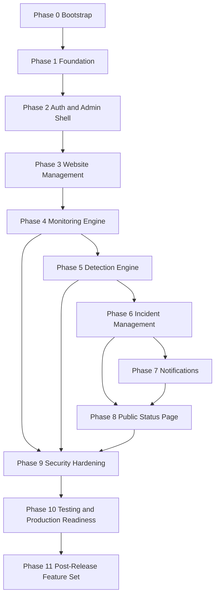

# PLAN.md — SiteSentinel — Implementation Roadmap

> **Specification only.** Nothing described in this document has been implemented.
> This plan is the implementation handoff artifact for the future coding agent ("Hermes").
> Every phase below is **future work**. The repository currently contains documentation only.

---

## 1. How to Use This Plan

This document decomposes the SiteSentinel MVP into **eleven sequential phases** (`Phase 0` … `Phase 10`).
It is derived from [`PRD.md`](PRD.md), [`ARCHITECTURE.md`](ARCHITECTURE.md), [`DATABASE.md`](DATABASE.md),
[`DETECTION-RULES.md`](DETECTION-RULES.md), [`NOTIFICATIONS.md`](NOTIFICATIONS.md),
[`STATUS-PAGE.md`](STATUS-PAGE.md), [`SECURITY.md`](SECURITY.md), and [`DECISIONS.md`](DECISIONS.md).
It never introduces behaviour not traceable to those documents.

### 1.1 The rules of this plan

1. **Each phase is independently executable.** A phase must be completable without starting later phases,
   and must leave the repository in a working, testable state after every merge.
2. **A phase is only complete when its `### Definition of Done` is met.** Partial completion is not
   completion; unfinished items carry into the next phase rather than being silently dropped.
3. **Architecture changes require a doc update first.** If implementation forces a deviation from
   [`ARCHITECTURE.md`](ARCHITECTURE.md), [`DATABASE.md`](DATABASE.md), or any sibling specification, the
   owning document MUST be updated **in the same change**, and a new/amended ADR recorded in
   [`DECISIONS.md`](DECISIONS.md). See [`AGENTS.md`](AGENTS.md) "no silent deviation".
4. **Stay in scope.** Anything marked `Future` in [`PRD.md`](PRD.md) is explicitly out of scope for the
   MVP phases below and is tracked in `## Post-MVP Backlog`.

### 1.2 Canonical spec (unchanged from [`PRD.md`](PRD.md) §22)

```text
NAME          SiteSentinel — Website Monitoring & Security Alerts
STACK         Laravel 13, PHP 8.4+, MySQL 8, Redis, Hotwired Turbo, Tailwind CSS,
              Alpine.js (only where necessary), Laravel Scheduler, Laravel Queue (Redis),
              Laravel HTTP Client, Nginx, Docker Compose
FORBIDDEN     React, Vue, Next.js, Inertia, Livewire, SQLite, PostgreSQL, SPA frameworks
ROLES         Admin (MVP)
ROUTES        / = login, /admin, /status
KEY RULE      HTTP 200 != healthy. Availability: UP|DOWN. Security: OK|INFO|SUSPECT|INCIDENT.
SEVERITY      INFO | WARNING | CRITICAL
SCORING       INFO >= 1, WARNING >= 8, CRITICAL >= 15; CRITICAL requires >= 2 independent categories
LIFECYCLE     DETECTED -> ACKNOWLEDGED -> RESOLVED (terminal; recurrence = new incident)
CHANNELS MVP  Email, Telegram        FUTURE: WhatsApp, Webhook
STATUS VIS    Private | Public | Password Protected
RETENTION     checks 30d (cfg 30/60/90) | incidents 365d | notif logs 90d | snapshots 14d
SNAPSHOTS     HTML + headers = MVP; screenshot = Phase 2/Future
VERSION       documentation phase = 0.1.0
```

---

## 2. Phase Overview

| Phase | Name | Objective | Depends on | Est. size |
| --- | --- | --- | --- | --- |
| 0 | Repository & Architecture Bootstrap | Decide and document the repo/container/config/CI skeleton before any app code. | None | S |
| 1 | Application Foundation | Stand up Laravel 13 on PHP 8.4+ with MySQL 8, Redis queue/scheduler, Turbo + Tailwind, base layout, health endpoint. | Phase 0 | M |
| 2 | Authentication & Admin Shell | Deliver Admin session login at `/`, `/admin` shell, authorization scaffold, audit foundation. | Phase 1 | M |
| 3 | Website Management | Deliver website CRUD with per-website monitoring settings and SSRF input validation at write time. | Phase 2 | M |
| 4 | Monitoring Engine | Deliver the scheduler -> queue -> probe pipeline, check persistence, baselines, and the Availability dimension end to end. | Phase 3 | L |
| 5 | Detection Engine | Deliver the rule engine, scoring + correlation guard, and the Security dimension (`OK`/`INFO`/`SUSPECT`/`INCIDENT`). | Phase 4 | L |
| 6 | Incident Management | Deliver incident lifecycle, dedupe/merge, escalation, auto-resolution, timeline, and dashboard counters. | Phase 5 | L |
| 7 | Notifications | Deliver the provider-independent dispatcher with Email + Telegram, dedup/cooldown, retry, and delivery log. | Phase 6 | L |
| 8 | Public Status Page | Deliver `/status` in three visibility modes with the redaction boundary enforced. | Phase 6, Phase 7 | M |
| 9 | Security Hardening | Deliver final SSRF defence-in-depth, limit/rate-limit audits, secret management, Nginx/TLS, and retention pruning. | Phase 4, Phase 5, Phase 8 | L |
| 10 | Testing & Production Readiness | Deliver full test suite, load profiling, observability, backup/restore, release runbook, and 0.1.0 -> 1.0.0 plan. | Phase 9 | L |
| 11 | Post-Release Feature Set | Deliver multiple status pages, Browser Push, theme, manual check trigger, and shared UI primitives (additive; does not renumber Phases 0–10). | Phase 10 | L |

### 2.1 Phase dependency graph



---

## Phase 0 — Repository & Architecture Bootstrap

### Objective

Establish the repository, container topology decision, configuration skeleton, coding standards, and CI scaffolding so that every later phase has a stable, documented foundation — without writing any monitoring logic.

### Scope

- Confirm and document repository state: the repo is currently **docs-only / greenfield**; there is no Laravel scaffold.
- Record the Docker Compose topology decision (`app`, `nginx`, `scheduler`, `worker`, `mysql`, `redis`) aligned with [`ARCHITECTURE.md`](ARCHITECTURE.md) §13.
- Create the `config/sentinel.php` skeleton (keys/values only, no logic) mirroring documented defaults.
- Establish coding standards and static-analysis/lint configuration.
- Create the CI skeleton (install, lint, test stages; no deployment).
- Decide and record whether to `composer create-project` Laravel 13 now or in `Phase 1`.

**Out of scope for this phase:**

- No monitoring logic, no probe, no rule engine, no incidents, no notifications.
- No application business code and no feature migrations.
- No production deployment.

### Prerequisites / Depends on

None.

### Files & Components Likely Affected

- `config/sentinel.php` (skeleton only)
- `docker-compose.yml`, `docker/` (topology placeholders)
- `.github/workflows/ci.yml` (or equivalent CI config)
- `.editorconfig`, `pint.json`, `.php-cs-fixer.php` equivalents
- `README.md` (developer bootstrap pointer)
- `.env.example` (placeholder keys only, no secrets)

### Database Changes

None. No migrations are created in this phase.

### Implementation Notes

- `config/sentinel.php` must expose retention (`checks` 30/60/90, `incidents` 365, `notification_logs` 90, `snapshots` 14), check defaults (interval 5 min, timeout 10 s), scoring thresholds (`INFO >= 1`, `WARNING >= 8`, `CRITICAL >= 15`), and the `CRITICAL` two-category requirement — sourced from [`PRD.md`](PRD.md) and [`SECURITY.md`](SECURITY.md).
- Do not hardcode any value that the docs place in config.
- Container topology must not place the scheduler or worker in the web request path ([`ARCHITECTURE.md`](ARCHITECTURE.md) §13).

### Acceptance Criteria

1. `AC-0-01` The repository contains a documented bootstrap decision (scaffold now vs. Phase 1) recorded in [`DECISIONS.md`](DECISIONS.md).
2. `AC-0-02` `config/sentinel.php` exists with the documented default keys and no application logic.
3. `AC-0-03` `docker-compose.yml` defines `app`, `nginx`, `scheduler`, `worker`, `mysql`, `redis` services with persistent volumes.
4. `AC-0-04` CI skeleton runs install + lint + test stages on a clean checkout.
5. `AC-0-05` A coding-standards configuration is committed (Pint / PSR-12).
6. `AC-0-06` `.env.example` documents required keys without any secret values.

### Tests Required

| Test | Type | Mandatory |
| --- | --- | --- |
| `config` skeleton loads without error | Unit | Yes |
| CI pipeline executes lint stage on clean checkout | CI | Yes |
| Compose file validates (`docker compose config`) | Integration | Yes |

### Security Considerations

- `.env.example` must never contain real credentials ([`SECURITY.md`](SECURITY.md) §4).
- No secret is committed to the repository at any point.
- Compose must expose only Nginx to the host; MySQL/Redis stay internal.

### Definition of Done

- [x] Acceptance criteria `AC-0-01` … `AC-0-06` met.
- [x] CI skeleton green (lint stage validates PHP syntax and the `config/sentinel.php` load check; test stage explicitly reports "no tests yet" pending Phase 1).
- [x] `config/sentinel.php` skeleton committed.
- [x] Scaffold-now-vs-later decision recorded in [`DECISIONS.md`](DECISIONS.md) (ADR-021 — scaffold deferred to Phase 1).
- [x] Docs updated if any topology decision deviated from [`ARCHITECTURE.md`](ARCHITECTURE.md) §13 (no deviation: `docker-compose.yml` matches ADR-017 / §13 exactly).
- [x] No monitoring logic introduced.

### Risks / Watch-outs

- Per-formulating the topology before the scaffold exists can bake in assumptions (PHP version, extensions).
- CI without an application will report "no tests" — make the stage explicit about that, not silently passing.

---

## Phase 1 — Application Foundation

### Objective

Stand up the Laravel 13 application on PHP 8.4+ with MySQL 8 and Redis wired, queue and scheduler configured, Hotwired Turbo + Tailwind installed, a base layout, error handling, a health endpoint, and the base framework migrations.

### Scope

- Install Laravel 13 (`composer create-project` or equivalent) on PHP 8.4+.
- Configure MySQL 8 connection (`utf8mb4`/`utf8mb4_unicode_ci`, InnoDB).
- Configure Redis for queue + cache; configure the scheduler.
- Install Hotwired Turbo and Tailwind CSS; set up the asset pipeline and base layout.
- Implement error handling, request logging baseline, and a health/readiness endpoint.
- Create base framework migrations: `users`, `password_reset_tokens`, `sessions`, `jobs`, `failed_jobs`, `cache`, `cache_locks` per [`DATABASE.md`](DATABASE.md) §8 migration order.
- Produce `.env.example` reflecting real runtime keys.

**Out of scope for this phase:**

- No authentication logic, no admin shell, no website CRUD.
- No monitoring, detection, incidents, notifications, or status page.
- No non-canonical service or framework may be introduced.

### Prerequisites / Depends on

- `Phase 0` — bootstrap decision + `config/sentinel.php` skeleton + topology.
- Completed artifacts: `docker-compose.yml`, `.env.example`, CI skeleton.

### Files & Components Likely Affected

- `composer.json`, `package.json`
- `bootstrap/app.php` (Laravel 13 application bootstrapping), `config/database.php`, `config/queue.php`, `config/cache.php`, `config/sentinel.php`
- `routes/web.php`, `routes/console.php`
- `app/Providers/AppServiceProvider.php`, `app/Http/Middleware/` (baseline)
- `resources/views/layouts/app.blade.php`, `resources/css/app.css`, `resources/js/app.js`
- `database/migrations/*` (framework tables only)
- `config/` health route wiring, `app/Http/Controllers/HealthController.php`
- `.env.example`, `docker-compose.yml`

### Database Changes

Introduce framework tables exactly as frozen in [`DATABASE.md`](DATABASE.md):

- `users` (`id`, `name`, `email`, `password`, `role` ENUM('admin'), `is_active`, `email_verified_at`, `last_login_at`, `created_at`/`updated_at`).
- `password_reset_tokens` (`email` PK, `token`, `created_at`).
- `sessions` (`id` PK, `user_id`, `ip_address`, `user_agent`, `payload`, `last_activity`).
- `jobs`, `failed_jobs`, `cache`, `cache_locks` (framework-managed).

### Implementation Notes

- DB session driver per [`DATABASE.md`](DATABASE.md) §3.3; Redis is the queue/cache driver.
- All timestamps UTC ([`DATABASE.md`](DATABASE.md) §1).
- Health endpoint must report DB + Redis + queue-worker readiness (feeds `AC-21`).
- Server-rendered Blade + Turbo only; no SPA toolchain ([`DECISIONS.md`](DECISIONS.md) ADR-002).
- `APP_DEBUG=false` in production defaults.

### Acceptance Criteria

1. `AC-1-01` Application boots on PHP 8.4+ against MySQL 8 with all base migrations applied.
2. `AC-1-02` Redis is the queue driver; a test job dispatches and is processed by a worker.
3. `AC-1-03` Scheduler is wired and visible via `schedule:list`.
4. `AC-1-04` Turbo + Tailwind assets build and render in the base layout.
5. `AC-1-05` A health/readiness endpoint reports DB, Redis, and worker status.
6. `AC-1-06` A base error page renders safely with no stack-trace leakage in production mode.

### Tests Required

| Test | Type | Mandatory |
| --- | --- | --- |
| Base migration suite applies forward on clean MySQL 8 | Integration | Yes |
| Queue round-trip job | Feature | Yes |
| Health endpoint readiness contract | Feature | Yes |
| Asset build (Tailwind/Turbo) | Build | Yes |

### Security Considerations

- Production `APP_DEBUG=false`; error pages must not leak internals.
- No public route may be created in this phase beyond the health endpoint; health must not expose secrets.
- DB/Redis credentials from environment only.

### Definition of Done

- [x] `AC-1-01` … `AC-1-06` met (see phase report; AC-1-01 verified on SQLite — MySQL 8 forward-migration is an environment-dependent verification pending a MySQL instance).
- [x] Base migrations match [`DATABASE.md`](DATABASE.md) exactly (framework-table group of §8; `users`/`password_reset_tokens`/`sessions` columns per §3.1–3.3).
- [x] CI green including lint and tests (workflow updated to install deps, run Pint, migrations, test suite, asset build).
- [x] `.env.example` complete and secret-free.
- [x] Docs updated if foundation deviated from [`ARCHITECTURE.md`](ARCHITECTURE.md) §12 (no deviation: scheduler/queue/web-plane separation unchanged; local-only substitutions recorded in ADR-022).

### Risks / Watch-outs

- Laravel 13 requires PHP 8.4+; older local toolchains fail silently.
- Choosing the wrong session/cache driver early is costly; follow [`DATABASE.md`](DATABASE.md) §3.3.

---

## Phase 2 — Authentication & Admin Shell

### Objective

Deliver Admin session authentication at `/`, the protected `/admin` shell with navigation, an authorization scaffold extensible to future roles, and the audit-log foundation.

### Scope

- Session login at `/` with rate limiting, CSRF, logout, and password reset flow.
- `role` enforcement scaffold (Admin only in MVP), middleware protecting `/admin`.
- `/admin` shell: layout, navigation, dashboard placeholder separating availability vs. security presentation.
- Create `audit_logs` table and a minimal audit-writing service.
- Admin account provisioning via a seed/install command — **no public registration route**.
- Turbo-friendly layouts.

**Out of scope for this phase:**

- No website CRUD, no monitoring, no detection, no incidents, no notifications, no status page.
- No additional roles or role UI (`FR-04` is `Future`).
- No 2FA (`FR-08` is `Future`).

### Prerequisites / Depends on

- `Phase 1` — app foundation, framework migrations, layout, health endpoint.
- User-authored tables `users` and `sessions` from [`DATABASE.md`](DATABASE.md).

### Files & Components Likely Affected

- `routes/web.php` (`/`, `/admin/*`)
- `app/Http/Controllers/Auth/LoginController.php`, `.../PasswordResetController.php`
- `app/Http/Middleware/EnsureAdmin.php`
- `app/Services/Audit/AuditLogger.php`
- `app/Models/User.php`, `app/Models/AuditLog.php`
- `resources/views/auth/*`, `resources/views/admin/layouts/*`, `resources/views/admin/dashboard.blade.php`
- `database/migrations/*_create_audit_logs_table.php`
- `database/seeders/AdminUserSeeder.php`
- `config/sentinel.php` (auth throttle values)

### Database Changes

- Introduce `audit_logs` per [`DATABASE.md`](DATABASE.md) §3.19: `id`, `user_id`, `event`, `subject_type`/`subject_id`, `ip_address`, `user_agent`, `metadata` JSON, `created_at`; indexes `idx_audit_logs_user_id`, `idx_audit_logs_event_created_at` (`event`,`created_at`), `idx_audit_logs_created_at`.
- No changes to `users` beyond what `Phase 1` created (`role`, `is_active`, `last_login_at` already present).

### Implementation Notes

- Login MUST be rate-limited with a lockout window (`FR-06`, [`SECURITY.md`](SECURITY.md) §2.4).
- CSRF on all state-changing routes.
- All `/admin` routes require authenticated Admin (`FR-02`, `AC-02`).
- Passwords use Laravel default one-way hashing (`FR-03`).
- Audit for auth events: login, logout, failed login, password reset.

### Acceptance Criteria

1. `AC-2-01` An Admin can log in at `/`, and repeated failures are throttled (`AC-01`).
2. `AC-2-02` Unauthenticated access to any `/admin` route is rejected for every HTTP method (`AC-02`).
3. `AC-2-03` A public registration route does not exist and cannot be reached.
4. `AC-2-04` Logout invalidates the session (`FR-07`).
5. `AC-2-05` Password reset flow works for an existing Admin.
6. `AC-2-06` Auth events are written to `audit_logs` with actor + timestamp.
7. `AC-2-07` `/admin` dashboard placeholder renders with availability and security shown as separate areas.

### Tests Required

| Test | Type | Mandatory |
| --- | --- | --- |
| Login success/failure | Feature | Yes |
| Login throttling/lockout window | Feature | Yes |
| `/admin` auth guard per method | Feature | Yes |
| Password reset | Feature | Yes |
| Audit log written on auth events | Feature | Yes |
| Absence of registration route | Feature | Yes |

### Security Considerations

- Throttle auth endpoints; generic failure messaging to avoid account enumeration.
- CSRF protection must remain enabled; never disable globally.
- `APP_DEBUG=false` in production; no secret in logs.

### Definition of Done

- [x] `AC-2-01` … `AC-2-07` met.
- [x] No public registration route exists (asserted by test).
- [x] `audit_logs` matches [`DATABASE.md`](DATABASE.md).
- [x] CI green; no regression to Phase 1. *(Verified locally: 44 tests / 184 assertions, Pint, Vite build, `migrate:fresh`, `schedule:list`, live HTTP smoke. GitHub Actions run pending first push — environment limitation, nothing was pushed during Phase 2.)*
- [x] Docs updated if auth deviated from [`SECURITY.md`](SECURITY.md) §3. *(No deviation: §2.1–2.5 and §2.9 implemented as specified; throttle/lockout/min-password values are wired through `config/sentinel.php` `auth` section.)*

### Risks / Watch-outs

- Throttle key must combine email + IP to resist distributed guessing without locking out shared IPs.
- Seeding an Admin with a known default password is a security defect — require an install command.

---

## Phase 3 — Website Management

### Objective

Deliver website CRUD with per-website monitoring settings and the **SSRF input validation performed at write time**, so only allowed URLs can ever be registered.

### Scope

- Website create/edit/delete with confirmation; cascade delete to checks, incidents, snapshots, baselines (`FR-13`).
- Website fields: `name`, `url`, `is_active` (enabled flag), `check_interval_seconds`, `timeout_seconds`, `expected_status`, `follow_redirects`, `expected_title`, `expected_final_domain`, `note` (`FR-14`).
- Monitoring toggles: SSL checks, redirect handling, content checks, security checks.
- Expected title / final domain configuration.
- Active/inactive (enable/disable) behaviour excluding disabled sites from scheduling (`FR-12`).
- Website list showing availability + security + last check timestamp as separate fields (`FR-15`).
- Website detail skeleton (timeline placeholder for later phases).
- Per-website rule settings placeholder (`website_rule_settings` scaffold).
- **SSRF input validation at write time**: scheme allowlist and allowlist/private-space rejection before any check.

**Out of scope for this phase:**

- No check execution, no probe, no scheduling dispatch.
- No detection rules evaluated.
- No audit of outbound requests (arrives in `Phase 4`/`Phase 9`).
- Bulk import/grouping (`FR-16` is `Future`).

### Prerequisites / Depends on

- `Phase 2` — Admin auth, `/admin` shell, audit foundation.
- Frozen table names from [`DATABASE.md`](DATABASE.md) §3.4 (`websites`).

### Files & Components Likely Affected

- `app/Http/Controllers/Admin/WebsiteController.php`
- `app/Http/Requests/StoreWebsiteRequest.php`, `UpdateWebsiteRequest.php`
- `app/Services/Security/SsrfUrlValidator.php` (write-time validation only)
- `app/Models/Website.php`, `app/Models/WebsiteRuleSetting.php`
- `resources/views/admin/websites/index.blade.php`, `form.blade.php`, `show.blade.php`
- `resources/views/components/` (form components)
- `routes/web.php`
- `database/migrations/*_create_websites_table.php`, `*_create_website_rule_settings_table.php`
- `config/sentinel.php` (allowed schemes, interval values, timeout bounds)

### Database Changes

- Introduce `websites` per [`DATABASE.md`](DATABASE.md) §3.4 (`id`, `name`, `url`, `scheme`, `host`, `is_active`, `check_interval_seconds`, `timeout_seconds`, `expected_status`, `expected_title`, `expected_final_domain`, `follow_redirects`, `note`, `monitor_ssl`, `monitor_redirects`, `monitor_content`, `monitor_security`, and the two-dimensional state columns `status_availability` ENUM(`UP`,`DOWN`) / `status_security` ENUM(`OK`,`INFO`,`SUSPECT`,`INCIDENT`) plus `last_checked_at`, `next_check_at`, `consecutive_failures`, `consecutive_successes` — created here as null-placeholders, populated in later phases; `current_baseline_id` FK added in `Phase 4` per [`DATABASE.md`](DATABASE.md) §8).
- Introduce `website_rule_settings` per [`DATABASE.md`](DATABASE.md) §3.9 as a scaffold (`website_id`, `detection_rule_id`, `enabled`, `weight_override`, `threshold_override`, `ignored_keywords`).
- Soft deletes (`deleted_at`) on `websites` per [`DATABASE.md`](DATABASE.md) §1.

### Implementation Notes

- Write-time SSRF validation: reject non-`http`/`https` schemes, reject loopback/private/link-local/metadata, reject internal hostnames ([`SECURITY.md`](SECURITY.md) §5, `FR-10`).
- Full request-time, per-hop enforcement lands in `Phase 4` and is completed in `Phase 9` — this phase only blocks bad input at write time.
- No business logic in controllers; use form requests for validation.
- Cascade delete policy per [`DATABASE.md`](DATABASE.md) FK/cascade rules.

### Acceptance Criteria

1. `AC-3-01` An Admin can create a website with name + URL; the record persists with frozen columns (`FR-09`).
2. `AC-3-02` A URL failing SSRF validation (e.g. `http://127.0.0.1/`) is rejected before any request is made (`AC-03`, `FR-10`).
3. `AC-3-03` An Admin can edit name, URL, settings, and notification overrides (`FR-11`).
4. `AC-3-04` Enable/disable excludes disabled sites from eligibility (no incidents generated) (`FR-12`).
5. `AC-3-05` Delete cascades to that website's dependent records (`FR-13`).
6. `AC-3-06` The list shows availability, security, and last-check as separate fields (`FR-15`).
7. `AC-3-07` Per-website rule settings scaffold is present and editable.

### Tests Required

| Test | Type | Mandatory |
| --- | --- | --- |
| Website create/edit/delete | Feature | Yes |
| SSRF write-time rejection matrix | Feature | Yes |
| Cascade delete | Feature | Yes |
| Enable/disable scheduling eligibility | Feature | Yes |
| List renders separate state fields | Feature | Yes |

### Security Considerations

- Write-time validation is the first SSRF layer; never trust the initial URL alone ([`SECURITY.md`](SECURITY.md) §5).
- Escape all user-supplied content in views.
- CSRF on all mutating routes.
- Never accept a URL from an unauthenticated user.

### Definition of Done

- [ ] `AC-3-01` … `AC-3-07` met.
- [ ] `websites` and `website_rule_settings` match [`DATABASE.md`](DATABASE.md).
- [ ] SSRF write-time tests passing.
- [ ] CI green; no regression to Phase 2.
- [ ] Docs updated if forms deviated from [`PRD.md`](PRD.md) §9.

### Risks / Watch-outs

- DNS-based hostnames that resolve to private space cannot be fully judged at write time — defer resolution checks to `Phase 4`/`Phase 9`.
- Cascade delete must not orphan `checks`/`incidents` rows.

---

## Phase 4 — Monitoring Engine

### Objective

Deliver the scheduler -> queue -> probe pipeline end to end: due websites are dispatched, probed with the documented limits, persisted as check results, baselines are captured, and the **Availability** dimension is fully operational.

### Scope

- Scheduler dispatch of due websites with per-website locking to prevent overlap.
- `RunWebsiteCheck` job on the monitoring queue.
- HTTP probe via Laravel HTTP Client with [`SECURITY.md`](SECURITY.md) limits (timeouts, response size caps, redirect hop cap, decompression caps).
- Manual hop-by-hop redirect handling with SSRF re-validation per hop.
- SSL/TLS certificate metadata capture (`FR-33`).
- Title + content-hash extraction (`FR-34`).
- Baseline capture on first successful check (`website_baselines`).
- Persistence of check results and `next_check_at` scheduling.
- Retry/failure handling; failures recorded, not discarded (`FR-36`).
- Availability classification `UP|DOWN` (`checks.availability_state`).

**Out of scope for this phase:**

- No rule evaluation, scoring, or security classification (`Phase 5`).
- No incidents, notifications, or status page.
- No snapshots (captured on detection in `Phase 5`).
- No full defence-in-depth SSRF enforcement (completed in `Phase 9`).

### Prerequisites / Depends on

- `Phase 3` — `websites` table and settings.
- Frozen tables from [`DATABASE.md`](DATABASE.md) §3.5–§3.7.

### Files & Components Likely Affected

- `app/Console/Kernel.php` / `routes/console.php` (scheduler entry)
- `app/Jobs/DispatchDueWebsiteChecks.php`, `app/Jobs/RunWebsiteCheck.php`
- `app/Services/Monitoring/HttpProbe.php`, `.../RedirectHandler.php`, `.../SslInspector.php`, `.../ContentExtractor.php`, `.../BaselineBuilder.php`
- `app/Services/Security/SsrfGuard.php` (shared guard, used per hop)
- `app/Models/Website.php`, `app/Models/Check.php`, `app/Models/CheckExtraction.php`, `app/Models/WebsiteBaseline.php`
- `database/migrations/*_create_website_baselines_table.php`, `*_create_checks_table.php`, `*_create_check_extractions_table.php`, `*_add_current_baseline_fk_to_websites.php`
- `config/sentinel.php` (probe limits)
- `docker-compose.yml` (worker/scheduler queue assignment)

### Database Changes

- Introduce `website_baselines` per [`DATABASE.md`](DATABASE.md) §3.5.
- Introduce `checks` per [`DATABASE.md`](DATABASE.md) §3.6 (`http_status`, `error_type`, `duration_ms`, `resolved_ip`, `final_url`, `redirect_chain` JSON, `response_size_bytes`, `title`, `content_hash`, `ssl_valid`, `ssl_issuer`, `ssl_expires_at`, `availability_state` ENUM(`UP`,`DOWN`), `security_state` ENUM(`OK`,`INFO`,`SUSPECT`,`INCIDENT`), `check_key` idempotency identity, `started_at`/`finished_at`, `next_check_at`).
- Introduce `check_extractions` per [`DATABASE.md`](DATABASE.md) §3.7 (`keywords`, `suspicious_patterns`, `external_domains`, and documented extraction columns).
- Add `current_baseline_id` FK to `websites` (per [`DATABASE.md`](DATABASE.md) §8 step 2).
- `checks` uses hard deletes via retention (no `deleted_at`) per [`DATABASE.md`](DATABASE.md) §1.

### Implementation Notes

- **Queue only.** No outbound monitoring request may execute inside a web/HTTP request ([`ARCHITECTURE.md`](ARCHITECTURE.md) §2).
- Per-website lock prevents overlapping checks; idempotent upsert by `check_key` tolerates transient overlap ([`ARCHITECTURE.md`](ARCHITECTURE.md) §5.1).
- Redirects handled manually hop-by-hop; each hop re-validated by the shared `SsrfGuard`; hop cap enforced (`FR-22`, `FR-23`, [`SECURITY.md`](SECURITY.md) §5).
- Set an identifiable `User-Agent` (`FR-21`).
- Record every failure (timeout, DNS, connection) as a check result; never throw away a check (`FR-36`).
- A failing check must never break the web UI (`NFR-07`).

### Acceptance Criteria

1. `AC-4-01` A registered website receives scheduled checks at its interval without Admin action, on the queue not in a web request (`AC-04`).
2. `AC-4-02` Each check persists availability (`UP|DOWN`) and security (`OK|INFO|SUSPECT|INCIDENT`) as separate queryable values (`AC-05`).
3. `AC-4-03` Redirects are followed hop-by-hop, the chain is recorded, and a hop to private/link-local space is blocked and recorded as a policy failure — not an outage (`AC-16`).
4. `AC-4-04` SSL metadata, title, content hash, size, and resolved IP are captured where available (`FR-33`, `FR-34`).
5. `AC-4-05` First successful check establishes a baseline in `website_baselines`.
6. `AC-4-06` `next_check_at` is set and drives the next dispatch.
7. `AC-4-07` A continuously failing target produces `DOWN` availability checks without impairing other websites (`NFR-07`).
8. `AC-4-08` Overlapping checks are prevented by the per-website lock; retries upsert by `check_key`.

### Tests Required

| Test | Type | Mandatory |
| --- | --- | --- |
| Scheduler dispatches due websites only | Feature | Yes |
| `RunWebsiteCheck` with faked HTTP client | Feature | Yes |
| Redirect hop-by-hop + hop cap + per-hop SSRF block | Feature | Yes |
| Probe limits (timeout/size/decompression) | Unit | Yes |
| Baseline capture on first success | Feature | Yes |
| Idempotent upsert by `check_key` | Feature | Yes |
| Failure recorded (timeout/DNS/connection) | Feature | Yes |

### Security Considerations

- Outbound requests only through the shared SSRF guard; no raw HTTP client call ([`SECURITY.md`](SECURITY.md) §5).
- Never exceed documented request limits (timeout, response size, redirect hops, decompression).
- A policy failure (blocked redirect) is not a website outage and must be classified distinctly.
- Never perform outbound requests inline in the web plane.

### Definition of Done

- [ ] `AC-4-01` … `AC-4-08` met.
- [ ] Monitoring stays entirely on the queue (asserted by test).
- [ ] `checks`/`check_extractions`/`website_baselines` match [`DATABASE.md`](DATABASE.md).
- [ ] CI green; no regression to Phase 3.
- [ ] Docs updated if probe limits deviated from [`SECURITY.md`](SECURITY.md) §6.

### Risks / Watch-outs

- Scheduler overlap can double-dispatch; the lock plus `next_check_at` must be consistent.
- Redirect handling is the highest SSRF-risk surface; keep it manual and validated.
- Slow targets can exhaust workers — enforce timeouts strictly.

---

## Phase 5 — Detection Engine

### Objective

Deliver the rule engine, two-dimensional security classification, weighted correlation with the correlation guard, baseline-relative comparison, and snapshot capture — completing the **Security** dimension (`OK`/`INFO`/`SUSPECT`/`INCIDENT`).

### Scope

- Rule registry (`detection_rules`) seeded with the full `RULE-xx` catalogue from [`DETECTION-RULES.md`](DETECTION-RULES.md).
- Per-website overrides (`website_rule_settings`).
- Two-dimensional state classification: Availability `UP|DOWN` and Security `OK|INFO|SUSPECT|INCIDENT`.
- Weighted scoring: `INFO >= 1`, `WARNING >= 8`, `CRITICAL >= 15`; `CRITICAL` requires `>= 2` independent categories (correlation guard).
- Baseline-relative comparison (fingerprint, title, structure, link set).
- Keyword tiers (tier-1/2/3) with containment rule: tier-3 vocab never exceeds `INFO`.
- Snapshot capture (`snapshots`) — HTML + headers only (MVP boundary); screenshot is **not** in this phase.
- Rule categories (all seven): `availability` (`RULE-AV-`), `ssl` (`RULE-SSL-`), `redirect` (`RULE-RED-`), `content-fingerprint` (`RULE-CNT-`), `content-keyword` (`RULE-KW-`), `external-link` (`RULE-LNK-`), and `seo-pattern` (`RULE-SEO-`) — per [`DETECTION-RULES.md`](DETECTION-RULES.md) §3.
- Fixture-driven tests per rule.

**Out of scope for this phase:**

- No incidents or lifecycle (Phase 6).
- No notifications (Phase 7).
- No screenshots (`Phase 2`/`Future`).
- No automatic snapshot retention pruning (Phase 9).

### Prerequisites / Depends on

- `Phase 4` — persisted `checks`/`check_extractions`/`website_baselines` and the Availability dimension.

### Files & Components Likely Affected

- `app/Services/Detection/RuleEngine.php`, `.../Correlator.php`, `.../ScoringService.php`, `.../BaselineComparator.php`
- `app/Services/Detection/Rules/*` (per-category rule classes)
- `app/Services/Snapshots/SnapshotWriter.php`
- `app/Models/DetectionRule.php`, `app/Models/WebsiteRuleSetting.php`, `app/Models/Snapshot.php`
- `database/migrations/*_create_detection_rules_table.php`, `*_create_snapshots_table.php`
- `database/seeders/DetectionRuleSeeder.php`
- `tests/Fixtures/detection/*`
- `config/sentinel.php` (scoring thresholds)

### Database Changes

- Introduce `detection_rules` per [`DATABASE.md`](DATABASE.md) §3.8 (registry: rule id/key, category, severity contribution, weight, enabled, config JSON).
- Alter/create `website_rule_settings` per [`DATABASE.md`](DATABASE.md) §3.9 (per-website enable/threshold overrides).
- Introduce `snapshots` per [`DATABASE.md`](DATABASE.md) §3.12 (FKs to `checks` and `incidents`; HTML body + headers; hard deletes via retention).
- Seed `detection_rules` with canonical defaults ([`DATABASE.md`](DATABASE.md) §8 step 8).

### Implementation Notes

- **Never equate a keyword with a compromise** ([`PRD.md`](PRD.md) §11.4, `FR-45`).
- Enforce the correlation guard: a single heavy signal caps at `SUSPECT`; only `>= 2` categories permit `INCIDENT` (`AC-08`, [`DECISIONS.md`](DECISIONS.md) ADR-009).
- `DOWN` checks skip content rules and must not fabricate content signals.
- Idempotency: re-running the engine on the same `check_key` yields identical score/state.
- Snapshots are HTML + headers only; never store screenshots at MVP.
- All rule arithmetic and thresholds are sourced from [`DETECTION-RULES.md`](DETECTION-RULES.md); the model from [`PRD.md`](PRD.md) §11.

### Acceptance Criteria

1. `AC-5-01` A `200` page with altered correlated content yields `HTTP: UP` **and** `Security: INCIDENT` (`AC-07`).
2. `AC-5-02` A single keyword with no corroboration yields at most `INFO`/`WARNING`, never `CRITICAL` (`AC-08`).
3. `AC-5-03` An ignored keyword does not contribute to that website's detections (`AC-09`).
4. `AC-5-04` Scoring bands map correctly: `INFO >= 1`, `WARNING >= 8`, `CRITICAL >= 15` with the two-category guard.
5. `AC-5-05` Tier-3 vocabulary alone never exceeds `INFO`.
6. `AC-5-06` Baseline drift alone produces at most `INFO` and never an incident.
7. `AC-5-07` Every fired rule yields an explainable signal (rule id, category, weight).
8. `AC-5-08` An HTML snapshot + headers are stored for a detection and are viewable in admin (`AC-15`).
9. `AC-5-09` Re-running the engine on the same check is idempotent.

### Tests Required

| Test | Type | Mandatory |
| --- | --- | --- |
| Per-rule fixture test (every `RULE-xx`) | Unit | Yes |
| Correlation guard (single heavy signal capped) | Unit | Yes |
| Two-category INCIDENT unlock | Unit | Yes |
| Tier-3 containment | Unit | Yes |
| `DOWN` skips content rules | Unit | Yes |
| Decay / carry-forward arithmetic | Unit | Yes |
| Idempotency on identical `check_key` | Unit | Yes |
| Snapshot persistence (HTML + headers only) | Feature | Yes |

Fixtures must be synthetic/sanitized and declare which `check_extractions`/`website_baselines` columns they populate ([`DETECTION-RULES.md`](DETECTION-RULES.md) §11.5).

### Security Considerations

- Never render captured HTML as HTML anywhere ([`SECURITY.md`](SECURITY.md)).
- Snapshots may contain sensitive content — access restricted to `/admin`.
- Snapshot storage respects the 14-day retention (pruning in Phase 9).

### Definition of Done

- [ ] `AC-5-01` … `AC-5-09` met.
- [ ] Every rule has a passing fixture-driven test.
- [ ] `detection_rules`/`snapshots` match [`DATABASE.md`](DATABASE.md).
- [ ] Correlation guard enforced (asserted by test).
- [ ] CI green; no regression to Phase 4.
- [ ] Docs updated if scoring deviated from [`DETECTION-RULES.md`](DETECTION-RULES.md).

### Risks / Watch-outs

- False positives from drift are the biggest product risk — keep baseline-relative comparisons conservative.
- Rule seeding must be idempotent to allow re-runs.
- Do not let a cheap keyword override the constitutional tier-3 rule.

---

## Phase 6 — Incident Management

### Objective

Deliver the incident engine: creation on threshold cross, dedupe/merge against open incidents, severity escalation, the `DETECTED -> ACKNOWLEDGED -> RESOLVED` lifecycle with authorized actors, auto-resolution on sustained recovery, incident UI, timeline, and dashboard counters.

### Scope

- Incident engine: `incidents`, `incident_events`.
- Creation on threshold cross; dedupe/merge against open incidents (no duplicate open incidents) (`AC-13`).
- Severity escalation updates (`INFO -> WARNING -> CRITICAL`) on the open incident.
- State machine `DETECTED -> ACKNOWLEDGED -> RESOLVED`; `RESOLVED` is terminal; recurrence opens a **new** incident (`AC-12`).
- Acknowledgement/resolution recorded with actor + timestamp (`AC-10`).
- Auto-resolution on sustained recovery with `resolution_mode = auto` and configurable consecutive healthy checks (`AC-11`).
- Incident list / detail / dashboard UI, timeline.
- Dashboard counters: total / operational / warning / incident; check history timeline.

**Out of scope for this phase:**

- No notification dispatch (Phase 7).
- No public status page (Phase 8).
- No incident deletion — history is append-only.

### Prerequisites / Depends on

- `Phase 5` — detection producing security states and scored signals.

### Files & Components Likely Affected

- `app/Services/Incidents/IncidentEngine.php`, `.../IncidentStateMachine.php`, `.../AutoResolver.php`
- `app/Http/Controllers/Admin/IncidentController.php`, `.../DashboardController.php`
- `app/Models/Incident.php`, `app/Models/IncidentEvent.php`
- `resources/views/admin/incidents/*`, `resources/views/admin/dashboard.blade.php`
- `database/migrations/*_create_incidents_table.php`, `*_create_incident_events_table.php`
- `config/sentinel.php` (recovery threshold default)

### Database Changes

- Introduce `incidents` per [`DATABASE.md`](DATABASE.md) §3.10 (`website_id`, severity ENUM(`INFO`,`WARNING`,`CRITICAL`), lifecycle state ENUM(`DETECTED`,`ACKNOWLEDGED`,`RESOLVED`), availability/security dimension, `resolution_mode` ENUM incl. `auto`, `acknowledged_by`/`resolved_by` FK to `users`, score/summary, `detected_at`/`acknowledged_at`/`resolved_at`).
- Introduce `incident_events` per [`DATABASE.md`](DATABASE.md) §3.11 (append-only event trail per incident).
- `snapshots` FK to `incidents` already present from Phase 5.

### Implementation Notes

- Incident history is append-only; `RESOLVED` is terminal — recurrence creates a new incident (`PRD.md` §12.1).
- Dedupe/merge must not create duplicate open incidents for an unresolved condition.
- Auto-resolution requires sustained recovery; the consecutive-healthy threshold is configurable.
- Escalation updates the open incident in place; it does not create a new one.
- Authorized actor = authenticated Admin; acknowledge does not resolve (`AC-10`).

### Acceptance Criteria

1. `AC-6-01` A down website produces a `DETECTED` availability incident with severity per `PRD.md` §11.3 (`AC-06`).
2. `AC-6-02` An Admin can acknowledge; actor + timestamp recorded; incident not resolved (`AC-10`).
3. `AC-6-03` Auto-resolution occurs only after sustained recovery; recorded as `auto` (`AC-11`).
4. `AC-6-04` A resolved incident is terminal; recurrence opens a new incident (`AC-12`).
5. `AC-6-05` Repeated detections of an open condition do not create duplicate open incidents (`AC-13`).
6. `AC-6-06` Every incident displays the rules/weights/score (security) or failure classification (availability) (`AC-14`).
7. `AC-6-07` The dashboard exposes counters total / operational / warning / incident and a check history timeline.

### Tests Required

| Test | Type | Mandatory |
| --- | --- | --- |
| Incident creation on threshold cross | Feature | Yes |
| Dedupe against open incident | Feature | Yes |
| Severity escalation update | Feature | Yes |
| State machine transitions + authorization | Feature | Yes |
| Auto-resolution on sustained recovery | Feature | Yes |
| Recurrence opens new incident | Feature | Yes |
| Dashboard counters + timeline | Feature | Yes |
| Clock-controlled recovery threshold | Feature | Yes |

### Security Considerations

- `/admin` incident routes require authenticated Admin.
- Incident detail must not leak monitored-site secrets; render captured content escaped.
- Acknowledgement/resolution must record the actor for audit.

### Definition of Done

- [x] `AC-6-01` … `AC-6-07` met.
- [x] Lifecycle terminal semantics enforced (asserted by test).
- [x] `incidents`/`incident_events` match [`DATABASE.md`](DATABASE.md).
- [x] CI green; no regression to Phase 5.
- [x] Docs updated if lifecycle deviated from [`PRD.md`](PRD.md) §12.1. (No deviation; CHANGELOG.md records the delivery.)

### Risks / Watch-outs

- Flapping can cause incident churn — escalate rather than reopen within the cooldown window.
- Auto-resolution needs a controllable clock in tests to avoid flakiness.

---

## Phase 7 — Notifications

### Objective

Deliver the provider-independent notification dispatcher with Email and Telegram providers, dedup/cooldown/flapping suppression, recovery and test-send events, retry/backoff/dead-letter, and a delivery-log UI — without letting notification failure affect monitoring.

### Scope

- Notification dispatcher abstraction + provider contract.
- `notification_channels` (Email, Telegram), `website_notification_channel` mapping, `notification_logs`, `notification_cooldowns`.
- Email provider and Telegram provider (encrypted bot token).
- Event catalogue: opened / escalated / acknowledged / resolved / reminder / test.
- Templates for both providers.
- Duplicate suppression + cooldown + flapping thresholds per [`NOTIFICATIONS.md`](NOTIFICATIONS.md).
- Recovery notifications.
- Retry/backoff/dead-letter.
- Delivery log UI + test-send action.
- **`WhatsApp` and generic webhook are explicitly OUT of this phase** (`Future`).

**Out of scope for this phase:**

- WhatsApp channel (`Future`).
- Generic webhook channel (`Future`).
- Per-Admin quiet hours / digests (`Future`).

### Prerequisites / Depends on

- `Phase 6` — incidents and incident events that trigger notifications.

### Files & Components Likely Affected

- `app/Services/Notifications/NotificationDispatcher.php`
- `app/Contracts/NotificationProvider.php`
- `app/Services/Notifications/Providers/EmailProvider.php`, `.../TelegramProvider.php`
- `app/Jobs/SendNotification.php`
- `app/Models/NotificationChannel.php`, `.../NotificationLog.php`, `.../NotificationCooldown.php`
- `resources/views/admin/notifications/*`, `resources/views/mail/*`
- `database/migrations/*_create_notification_channels_table.php`, `*_create_website_notification_channel_table.php`, `*_create_notification_logs_table.php`, `*_create_notification_cooldowns_table.php`
- `config/sentinel.php` (cooldown defaults)

### Database Changes

- Introduce `notification_channels` per [`DATABASE.md`](DATABASE.md) §3.13 (`type` ENUM incl. `email`/`telegram`, config, `secret_ref` encrypted).
- Introduce `website_notification_channel` per [`DATABASE.md`](DATABASE.md) §3.14 (pivot).
- Introduce `notification_logs` per [`DATABASE.md`](DATABASE.md) §3.15 (delivery attempts, hard deletes via retention).
- Introduce `notification_cooldowns` per [`DATABASE.md`](DATABASE.md) §3.16 (cooldown/suppression state).

### Implementation Notes

- The incident engine stays **provider-agnostic**; providers are added only through the provider contract ([`DECISIONS.md`](DECISIONS.md) ADR-010).
- Never bypass suppression/cooldown ([`NOTIFICATIONS.md`](NOTIFICATIONS.md) §9).
- A failing channel must **not** block incident creation or fail the monitoring job (`NFR-07`, `AC-22`).
- Always log delivery attempts, including failures (redacted).
- Never include secrets, keyword lists, malicious domains, redirect chains, raw bodies, or snapshot content in payloads (`FR-73`, [`NOTIFICATIONS.md`](NOTIFICATIONS.md) §14.4).
- Telegram token encrypted at rest ([`SECURITY.md`](SECURITY.md) §4).

### Acceptance Criteria

1. `AC-7-01` An incident opens and dispatches to each enabled channel (`AC-06`).
2. `AC-7-02` Repeated detections do not re-notify beyond cooldown (`AC-13`).
3. `AC-7-03` Escalation, acknowledged, and resolved events dispatch to enabled channels.
4. `AC-7-04` A recovery notification is sent after auto-resolution.
5. `AC-7-05` A failing channel does not prevent incident creation; failures are visible to Admin (`AC-22`).
6. `AC-7-06` Test-send works for both Email and Telegram.
7. `AC-7-07` Delivery attempts are logged redacted; re-dispatch after restart is idempotent (`NFR-09`).
8. `AC-7-08` No payload contains secrets, keyword lists, domains, or snapshot content.

### Tests Required

| Test | Type | Mandatory |
| --- | --- | --- |
| Dispatcher routing to providers | Feature | Yes |
| Duplicate suppression + cooldown | Feature | Yes |
| Flapping threshold | Feature | Yes |
| Retry/backoff/dead-letter | Feature | Yes |
| Provider-addition without incident-engine change | Feature | Yes |
| No-secrets payload assertion | Feature | Yes |
| No-evidence payload assertion | Feature | Yes |
| Restart idempotency (`NFR-09`) | Feature | Yes |

### Security Considerations

- Encrypted casts for `secret_ref`; never log tokens ([`SECURITY.md`](SECURITY.md) §4).
- Redaction denylist on `notification_logs.error`.
- Throttle test-send to prevent abuse.

### Definition of Done

- [x] `AC-7-01` … `AC-7-08` met (evidence: 49 notification tests pass; full suite 230 passed / 5 pre-existing env failures in `sessions` table; see CHANGELOG Phase 7).
- [x] Both providers pass no-secrets and no-evidence tests.
- [x] `notification_*` tables match [`DATABASE.md`](DATABASE.md) §§3.13–3.16 verbatim (verified; no drift, no doc change).
- [x] CI green; no regression to Phase 6 (same 5 pre-existing `sessions` failures; zero new failures).
- [x] Docs updated if cooldown defaults deviated from [`NOTIFICATIONS.md`](NOTIFICATIONS.md) (no deviation: `SENTINEL_DEFAULT_COOLDOWN_MINUTES=15`).

### Risks / Watch-outs

- Cooldown state must survive restarts (`NFR-09`) — persist in `notification_cooldowns`, not memory.
- Telegram rate limits (`retry_after`) must be honoured.

---

## Phase 8 — Public Status Page

### Objective

Deliver `/status` in three visibility modes with the **redaction boundary enforced** and proven by a mandatory regression test asserting no sensitive field leaks.

### Scope

- `/status` page rendering.
- Visibility modes: `Private` (default), `Public`, `Password Protected` (hashed password + session unlock + throttling).
- Status derivation to public labels (availability-only; `SUSPECT` maps to `Degraded`, never a security label).
- **Redaction boundary enforcement** with a mandatory regression test asserting no sensitive field is present in the public response (`AC-18`).
- Caching (cache the projection, invalidate on incident state change).
- Branding settings (`status_page_settings`).
- `noindex` on the public page.
- Consent/warning UX before switching to `Public`.

**Out of scope for this phase:**

- No security detail on the public page, ever (`PRD.md` §14.4).
- No admin controls beyond visibility/branding/per-website inclusion.
- No outbound requests triggered by the status page.

### Prerequisites / Depends on

- `Phase 6` — incidents to present publicly.
- `Phase 7` — notification state (sibling; redaction must align).

### Files & Components Likely Affected

- `app/Http/Controllers/StatusPageController.php`
- `app/Services/StatusPage/StatusProjector.php`, `.../VisibilityGate.php`
- `app/Models/StatusPageSetting.php`
- `resources/views/status/*`, `resources/views/admin/status-settings/*`
- `database/migrations/*_create_status_page_settings_table.php`
- `config/sentinel.php`

### Database Changes

- Introduce `status_page_settings` per [`DATABASE.md`](DATABASE.md) §3.18 (`visibility_mode` ENUM(`Private`,`Public`,`Password Protected`) default `Private`, `password_hash` (hashed, never reversible), `slug`, `branding` JSON, `created_at`/`updated_at`).

### Implementation Notes

- Default visibility is `Private` ([`STATUS-PAGE.md`](STATUS-PAGE.md) §2).
- The projector emits **availability-only** labels; `SUSPECT` -> `Degraded`; staleness -> `Unknown`, never `Operational` ([`STATUS-PAGE.md`](STATUS-PAGE.md) §5.3).
- Password Protected reveals nothing before the password is accepted; unlock is throttled.
- `password_hash` is hashed, never reversible ([`SECURITY.md`](SECURITY.md) §4).
- The cached artefact is the projection; invalidate on incident state change.
- The page performs no outbound request and accepts no fetch-inducing parameter.

### Acceptance Criteria

1. `AC-8-01` `/status` renders in `Private`, `Public`, and `Password Protected` modes (`AC-17`).
2. `AC-8-02` `Password Protected` reveals no data before the password is accepted (`AC-17`).
3. `AC-8-03` No mode exposes keywords, domains, redirect targets, rule ids, or snapshots — verified by inspecting the raw response (`AC-18`).
4. `AC-8-04` `SUSPECT` maps to `Degraded` and never to a security label.
5. `AC-8-05` A stale website renders `Unknown`, not `Operational`.
6. `AC-8-06` The public page is `noindex`.
7. `AC-8-07` The cached artefact contains no raw admin field.
8. `AC-8-08` The status page performs no outbound request.

### Tests Required

| Test | Type | Mandatory |
| --- | --- | --- |
| Redaction regression across all three modes | Feature | **Yes — release blocker** |
| Derivation table mapping | Unit | Yes |
| Staleness (clock-controlled) | Unit | Yes |
| Cache projection + invalidation | Feature | Yes |
| Password unlock throttling | Feature | Yes |
| No-SSRF (`/status` triggers no outbound request) | Feature | Yes |
| Enumeration (`website_id`/rule id absent) | Feature | Yes |

### Security Considerations

- The redaction test is a **release blocker** — a failure means the `PRD.md` §14.4 hard rule is violated.
- Escape all projected content; never render captured HTML.
- Throttle unlock to prevent password guessing.
- Public mode requires explicit admin consent UX.

### Definition of Done

- [x] `AC-8-01` … `AC-8-08` met — evidence: `tests/Feature/StatusPage/*` (94 tests, all passing).
  - `AC-8-01` all three modes render: `VisibilityGateTest`, `StatusPageHttpTest`.
  - `AC-8-02` no data before unlock: `PasswordGateTest`, `RedactionRegressionTest::test_password_locked_projection_never_leaks_canaries`.
  - `AC-8-03` no keywords/domains/redirects/rule-ids/snapshots in the raw response: `RedactionRegressionTest` (17 canaries × every mode/unlock state) + `EnumerationTest`.
  - `AC-8-04` `SUSPECT` → `Degraded` (never a security label): `DerivationTest`.
  - `AC-8-05` stale → `Unknown`, never `Operational`: `StalenessTest` (300 s floor).
  - `AC-8-06` `noindex`: `StatusPageHttpTest` (header + meta + `robots.txt`).
  - `AC-8-07` cached artefact is the projection only: `CacheTest`.
  - `AC-8-08` no outbound request: `NoSsrfTest`.
- [x] Redaction regression test passing across all three modes — `RedactionRegressionTest` (release blocker) green.
- [x] `status_page_settings` matches [`DATABASE.md`](DATABASE.md) §3.18 verbatim; additive `websites.is_visible_on_status` + `status_alias` + `idx_websites_visible_status` (`0001_08_02`).
- [x] CI green; no regression to Phase 6/7 — full suite **329 tests, 324 passed, 5 pre-existing `sessions` env failures** (baseline unchanged; zero new failures).
- [x] Docs updated where visibility deviated from [`STATUS-PAGE.md`](STATUS-PAGE.md) — `ADR-029` records the frozen choices; STATUS-PAGE/ARCHITECTURE/DATABASE/SECURITY/CHANGELOG updated.

### Risks / Watch-outs

- Partial serialization of Eloquent models can leak fields; project explicitly.
- Cache key must not encode admin identifiers (enumeration).

---

## Phase 9 — Security Hardening

### Objective

Deliver the final defence-in-depth: complete SSRF enforcement, audited limits/rate-limits/concurrency, secret-management audit, admin auth hardening, Nginx/TLS/security headers, container hardening, and retention pruning jobs.

### Scope

- SSRF defence-in-depth final enforcement: per-hop DNS revalidation, private IP blocking, metadata endpoint blocking, DNS rebinding mitigations ([`SECURITY.md`](SECURITY.md) §5).
- Request/response limit enforcement audit (timeouts, size, hops, decompression).
- Rate limiting + concurrency + per-website serialization verification.
- Secret-management audit: encrypted casts, log redaction, no secrets in payloads.
- Admin auth hardening (2FA optional/`Future`).
- Nginx/TLS/security headers.
- Container hardening (least privilege, internal network only).
- Retention pruning jobs: `checks` 30d (configurable 30/60/90), `notification_logs` 90d, `snapshots` 14d; `incidents` 365d.
- Migrate any remaining hardcoded defaults into `config/sentinel.php`.
- Complete the security checklist.

**Out of scope for this phase:**

- No 2FA implementation (design/placeholder only; `FR-08` is `Future`).
- No new features — hardening only.

### Prerequisites / Depends on

- `Phase 4` — outbound probe pipeline to harden.
- `Phase 5` — detection/snapshot pipeline.
- `Phase 8` — public surface to harden.

### Files & Components Likely Affected

- `app/Services/Security/SsrfGuard.php` (final enforcement)
- `app/Jobs/PruneCheckResults.php`, `.../PruneNotificationLogs.php`, `.../PruneSnapshots.php`, `.../PruneIncidents.php`
- `app/Console/Kernel.php` / `routes/console.php` (pruning schedule)
- `app/Http/Middleware/` (rate limiting, security headers)
- `docker-compose.yml`, `docker/nginx/*`, TLS config
- `config/sentinel.php` (retention + limits)
- `tests/Security/*`

### Database Changes

None. This phase enforces behaviour over existing tables. If any index is required for pruning performance, add a migration and update [`DATABASE.md`](DATABASE.md) in the same change.

### Implementation Notes

- SSRF guard is the single choke point for all outbound fetches; bypassing it is a critical defect ([`AGENTS.md`](AGENTS.md) SSRF rules).
- Pruning must respect frozen retention: `checks` 30 (cfg 30/60/90), `incidents` 365, `notification_logs` 90, `snapshots` 14 ([`PRD.md`](PRD.md) §16, `AC-19`).
- `incidents` are append-only history — never pruned below 365d; resolution stays terminal.
- `APP_DEBUG=false`, HSTS, and security headers on the monitor's own UI.
- Only Nginx exposed to the host; MySQL/Redis on the internal network.

### Acceptance Criteria

1. `AC-9-01` Every redirect hop revalidates DNS; private/link-local/metadata endpoints are blocked ([`SECURITY.md`](SECURITY.md) §5).
2. `AC-9-02` All request limits (timeout, size, hops, decompression) are enforced and tested.
3. `AC-9-03` Rate limits + concurrency caps + per-website serialization verified.
4. `AC-9-04` Secrets use encrypted casts; logs are redacted; no secret in any payload.
5. `AC-9-05` Retention jobs prune checks/logs/snapshots per config while incidents persist 365d (`AC-19`).
6. `AC-9-06` Nginx/TLS/security headers and container hardening applied.
7. `AC-9-07` No hardcoded default remains outside `config/sentinel.php`.
8. `AC-9-08` The security checklist in [`SECURITY.md`](SECURITY.md) is complete.

### Tests Required

| Test | Type | Mandatory |
| --- | --- | --- |
| SSRF adversarial suite (private IP / metadata unreachable) | Integration | **Yes** |
| DNS rebinding mitigation | Integration | Yes |
| Limit enforcement (timeout/size/hops) | Integration | Yes |
| Retention pruning per config | Feature | Yes |
| Secret redaction in logs | Feature | Yes |
| Per-website serialization / lock | Feature | Yes |

### Security Considerations

- SSRF guard bypass is a **critical defect** — adversarial tests must fail loudly if a private/metadata address is reachable.
- Never fetch a URL supplied by an unauthenticated user.
- Keep `/admin` behind auth+admin; keep `APP_DEBUG=false`.
- Never add a public registration route.

### Definition of Done

- [x] `AC-9-01` … `AC-9-08` met — evidence: `tests/Feature/Security/*` (82 tests, all passing) + `SECURITY.md` §12.1.
  - `AC-9-01` every hop revalidates DNS; private/link-local/metadata blocked: `SsrfRegressionTest` (33 blocked destinations, redirect revalidation, rebinding).
  - `AC-9-02` request limits enforced/tested: `ProbeTest` (timeout/size/hops) — decompression-ratio cap DEFERRED (§12.1 L5).
  - `AC-9-03` rate limits + concurrency + per-website serialization: `ThrottlingTest`, `QueueExternalServiceTest::test_per_website_check_lock_prevents_overlap`.
  - `AC-9-04` secrets encrypted/redacted: `SecretsRedactionTest`, `LoggingBoundariesTest`.
  - `AC-9-05` retention pruning per config, incidents 365d: `RetentionPruningTest`.
  - `AC-9-06` Nginx/TLS/headers + container hardening: Nginx headers present; full header set / non-root DEFERRED-operational (§12.1 L17/L21).
  - `AC-9-07` no hardcoded default outside config: values read via `config('sentinel.*')`.
  - `AC-9-08` security checklist complete: `SECURITY.md` §12 updated with dispositions.
- [x] SSRF adversarial suite passing — `tests/Feature/Security/SsrfRegressionTest.php`.
- [x] Retention pruning enabled and tested (`AC-19`) — `Prunable`/`MassPrunable` on the four telemetry models.
- [x] Security checklist complete — `SECURITY.md` §12 + §12.1 disposition matrix.
- [x] CI green; no regression to Phases 4/5/8 — full suite **413 tests / 408 passed / 5 pre-existing `sessions` env failures**; zero new failures.
- [x] Docs updated: `SECURITY.md` §12.1 (findings + §6 dispositions + operational requirements), `CHANGELOG.md`, `ARCHITECTURE.md`, `DECISIONS.md` (ADR-030), `.env.example`.
- [x] Local commit only (no push).

### Risks / Watch-outs

- Pruning must not delete open-incident evidence; `incidents` retention is separate and longer.
- DNS rebinding requires validating resolved IPs at connect time, not only at URL parse.

---

## Phase 10 — Testing & Production Readiness

### Objective

Deliver the complete test suite, fixture/corpus detection testing, load/resource profiling, observability finalisation, backup/restore, upgrade/rollback procedure, `.env.example` completeness, acceptance validation against [`PRD.md`](PRD.md), a production deployment runbook, and the `0.1.0 -> 1.0.0` release plan.

### Scope

- Full test suite: unit, feature, integration, security adversarial.
- Fixture/corpus testing for detection rules.
- Load/resource profiling on a small VPS within the `NFR-03` envelope (2 vCPU / 4 GB / 40 GB).
- Observability/logging finalisation (`NFR-20`, `NFR-21`): scheduler fired, queue drained, failing check reason, failing notification reason; DB/Redis/worker health (`AC-21`).
- Backup/restore procedure for MySQL + Redis + snapshot volume.
- Upgrade & rollback procedure.
- `.env.example` completeness.
- Acceptance criteria validation against [`PRD.md`](PRD.md) §16 (`AC-01` … `AC-24`).
- Production deployment runbook (Docker Compose, single command set).
- Release tagging plan: `0.1.0` (docs) -> `1.0.0` (first complete MVP).

**Out of scope for this phase:**

- No new features.
- No `Future` items (backlog remains backlog).

### Prerequisites / Depends on

- `Phase 9` — hardened, complete implementation.

### Files & Components Likely Affected

- `tests/*` (full suite), `tests/Fixtures/*`
- `phpunit.xml`, `pest.php` (if used) / coverage config
- `README.md`, `docs/runbook/*` (or `RUNBOOK.md`)
- `.env.example`
- CI workflow (full test + build)
- `docker-compose.yml` (production profile)

### Database Changes

None expected. If a profiling/index change is required, add a migration and update [`DATABASE.md`](DATABASE.md) in the same change.

### Implementation Notes

- Acceptance validation maps each `AC-xx` in [`PRD.md`](PRD.md) §16 to a passing test.
- Queues must drain before the next batch at the reference workload of 50 websites / 5-minute interval (`NFR-02`, `AC-20`).
- Tests must not perform real outbound network calls; fake the HTTP client.
- Clock-dependent logic (cooldowns, expiry, retention, recovery) uses a controllable clock.
- State the minimum coverage expectation and the rule that a bug fix requires a regression test ([`AGENTS.md`](AGENTS.md)).

### Acceptance Criteria

1. `AC-10-01` All [`PRD.md`](PRD.md) §16 acceptance criteria (`AC-01` … `AC-24`) pass.
2. `AC-10-02` Full suite runs with no real outbound network calls.
3. `AC-10-03` Load profile confirms queue drains within the interval at reference workload (`AC-20`).
4. `AC-10-04` Health/readiness for DB, Redis, worker is exposed (`AC-21`).
5. `AC-10-05` Backup/restore is documented and verified.
6. `AC-10-06` Upgrade & rollback procedures are documented.
7. `AC-10-07` `.env.example` is complete and secret-free.
8. `AC-10-08` A production deployment runbook exists and is runnable.
9. `AC-10-09` Release tagging plan `0.1.0 -> 1.0.0` is recorded.

### Tests Required

| Test | Type | Mandatory |
| --- | --- | --- |
| Full acceptance validation matrix | Integration | Yes |
| Detection corpus/fixture suite | Unit | Yes |
| Load/resource profile | Performance | Yes |
| Backup/restore drill | Integration | Yes |
| No outbound network in test suite | CI | Yes |
| Redaction + SSRF adversarial re-run | Security | Yes |

### Security Considerations

- Runbooks must not embed secrets; reference environment variables.
- Backup artefacts containing snapshots must be access-controlled.
- Confirm `APP_DEBUG=false`, no telemetry (`AC-23`), no SPA deps (`AC-24`).

### Definition of Done

- [ ] `AC-10-01` … `AC-10-09` met.
- [ ] All `PRD.md` acceptance criteria validated.
- [ ] Full suite green; no real outbound calls.
- [ ] Runbook + backup/restore + rollback documented.
- [ ] `CHANGELOG.md` updated; release tagging plan recorded.
- [ ] No regression to any earlier phase.

### Risks / Watch-outs

- Coverage "green" without adversarial/redaction tests is misleading — those are mandatory.
- Load profiling must use the reference workload, not a toy dataset.

---

## Phase 11 — Post-Release Feature Set

> **Additive.** Phase 11 does **not** renumber Phases 0–10 and does not change the MVP
> boundary. It delivers the feature set designed in [`DECISIONS.md`](DECISIONS.md) `ADR-031`–`ADR-034`
> (implemented as Plans S1–S6; see [`CHANGELOG.md`](CHANGELOG.md)).

### Objective

Deliver multiple status pages, the Browser Push notification channel, the three-state theme, a manual
check trigger, and the shared UI primitives — all additively, leaving Phases 0–10 unchanged.

### Scope

- **Multiple status pages (`ADR-031`).** New `status_pages` table ([`DATABASE.md`](DATABASE.md)
  §3.22); `websites.status_page_id` FK (nullable, `ON DELETE SET NULL`); migrate the single
  `status_page_settings` row into one default `status_pages` row (data-preserving). Public routing at
  `/status/{slug}` with a `302` redirect from legacy `/status`; per-page unlock
  (`status_unlock.{page_id}`); `StatusPageCache` keyed by page id; per-page redaction boundary. Admin
  CRUD at `/admin/status-pages` behind auth + admin.
- **Browser Push (`ADR-032`).** New `push_subscriptions` table; `WebPushProvider` implementing the
  provider contract and registered in `NotificationProviderRegistry` (no `IncidentEngine` change);
  VAPID keys via `config/sentinel.php` + env (`VAPID_PUBLIC_KEY`/`VAPID_PRIVATE_KEY`/`VAPID_SUBJECT`);
  optional `minishlink/web-push` (PHP 8.4-aware); service worker in `public/` + opt-in JS in
  `resources/js/app.js`; `POST /admin/push/subscribe` and `DELETE` unsubscribe; payloads redacted and
  delivery logged.
- **Theme (`ADR-033`).** Tailwind v4 `@custom-variant dark`; `localStorage` + cookie; no-FOUC inline
  bootstrap; `data-theme`/`.dark` on `<html>`; three-state Light/Dark/System; tokens in
  `resources/css/app.css`.
- **Shared UI primitives (`ADR-034`).** `x-form.field`, `x-modal`, `x-per-page` selector with a
  validated whitelist helper, icon-button convention, modal-gated deletes.
- **Manual check trigger (`FR-103`).** Admin-triggered check outside cadence, rate-limited.
- **System settings (`ADR-035`).** Implement the frozen `settings` key/value table
  ([`DATABASE.md`](DATABASE.md) §3.17) with a cached typed `SettingsRepository` + `settings()` helper;
  admin-protected General/Branding/System page for `site_name`, `site_description`, `site_logo`,
  `favicon` and `timezone`. No infrastructure secret is writable (fixed key whitelist).

**Out of scope for this phase:**

- Any renumbering of Phases 0–10.
- Destructive migrations — the status-page migration is **additive and data-preserving**.

### Prerequisites / Depends on

- `Phase 10` — MVP complete and released.

### Tests Required

| Test | Type | Mandatory |
| --- | --- | --- |
| Per-page slug routing + legacy `302` redirect | Feature | Yes |
| Per-page visibility gate + per-page unlock isolation | Security | Yes |
| Per-page redaction regression | Security | Yes |
| Browser Push provider contract + redaction + suppression unchanged | Feature/Security | Yes |
| VAPID/push-secret no-log assertions | Security | Yes |
| Theme no-FOUC + System follows `prefers-color-scheme` | Feature | Yes |
| Per-page selector whitelist + query-string preservation | Feature | Yes |
| Modal-gated delete + icon-button aria-label | Feature | Yes |

### Acceptance Criteria

- [x] `AC-25` Multiple status pages with unique slugs and per-page visibility; `/status/{slug}` served; legacy `/status` `302`.
- [x] `AC-26` Page assignment via `websites.status_page_id` with default-page fallback; per-page redaction holds.
- [x] `AC-27` Per-page unlock keyed `status_unlock.{page_id}`; unlocking one page does not unlock another.
- [x] `AC-28` Browser Push delivered via the provider-independent dispatcher; unsubscribe stops delivery; no secret logged or in a payload.
- [x] `AC-29` Light / Dark / System theme, persisted, System follows OS, no theme flash.
- [x] `AC-30` Per-page selector 10/20/50/100/All preserving query string; out-of-whitelist values rejected.
- [x] `AC-31` Delete gated by a confirmation modal; icon-only actions carry an accessible label.

### Definition of Done

- [x] `AC-25` ... `AC-31` met.
- [ ] Phases 0–10 unrenumbered and still green; no regression.
- [ ] Schema additions are additive; existing status-page settings preserved.
- [ ] `CHANGELOG.md` updated.

---

## 3. Cross-Phase Traceability

Maps [`PRD.md`](PRD.md) requirement IDs to the delivering phase(s).

| Requirement | Phase(s) |
| --- | --- |
| `FR-01`–`FR-08` (auth, roles, provisioning) | Phase 2 (note `FR-04`, `FR-08` = Future) |
| `FR-09`–`FR-16` (website management) | Phase 3 (note `FR-16` = Future) |
| `FR-17`–`FR-23` (monitoring config, redirects) | Phase 3 (config), Phase 4 (execution) |
| `FR-24`–`FR-36` (check execution, capture, baselines) | Phase 4 |
| `FR-37`–`FR-48` (detection, scoring, correlation) | Phase 5 |
| `FR-49`–`FR-63` (incidents, lifecycle, recovery) | Phase 6 |
| `FR-64`–`FR-76` (notifications) | Phase 7 (note `FR-76` = Future) |
| `FR-77`–`FR-83` (status page, visibility) | Phase 8 |
| `FR-84`–`FR-101` (retention, observability, hardening) | Phase 9 (retention/security), Phase 10 (observability validation) |
| `FR-102` (metrics export) | Post-MVP Backlog |
| `FR-103`–`FR-109` (manual check, theme, browser push, per-page selector, delete modal, multiple status pages, field help) | Phase 11 |
| `NFR-01`–`NFR-06` (performance, capacity) | Phase 10 (validated), shaped by Phase 4 |
| `NFR-07`–`NFR-12` (isolation, reliability) | Phase 4, Phase 7 |
| `NFR-13`–`NFR-19` (security posture) | Phase 9 |
| `NFR-20`–`NFR-21` (observability) | Phase 10 |
| `NFR-22`–`NFR-24` (deployability, config) | Phase 0, Phase 1, Phase 10 |
| `AC-01`–`AC-02` | Phase 2 |
| `AC-03` | Phase 3 |
| `AC-04`–`AC-05` | Phase 4 |
| `AC-07`–`AC-09`, `AC-14`–`AC-15` | Phase 5 |
| `AC-06`, `AC-10`–`AC-13` | Phase 6 |
| `AC-22` | Phase 7 |
| `AC-16` | Phase 4 (probe) / Phase 9 (final SSRF) |
| `AC-17`–`AC-18` | Phase 8 |
| `AC-19` | Phase 9 |
| `AC-20`–`AC-21` | Phase 10 |
| `AC-23`–`AC-24` | Phase 0–1 (stack), Phase 10 (validation) |
| `AC-25`–`AC-31` | Phase 11 |

Rule catalogue `RULE-AV-`, `RULE-SSL-`, `RULE-RED-`, `RULE-CNT-`, `RULE-KW-`, `RULE-LNK-`, and `RULE-SEO-` (seven categories) are owned by [`DETECTION-RULES.md`](DETECTION-RULES.md) and delivered in Phase 5.

---

## 4. Post-MVP Backlog

Deferred items, each tagged with a suggested future phase. These are **not** in the MVP and must not be built during Phases 0–10. Items tagged **Phase 11** are the post-release feature set ([`DECISIONS.md`](DECISIONS.md) `ADR-031`–`ADR-034`); they are additive and do not renumber Phases 0–10.

| Deferred item | Suggested future phase | Source |
| --- | --- | --- |
| WhatsApp notification channel | Future Phase A | [`PRD.md`](PRD.md) §13; [`NOTIFICATIONS.md`](NOTIFICATIONS.md) |
| Generic webhook channel | Future Phase A | [`PRD.md`](PRD.md) §13; [`NOTIFICATIONS.md`](NOTIFICATIONS.md) |
| Screenshot capture | Future Phase B | [`PRD.md`](PRD.md) §10.3 (screenshot = Phase 2/Future) |
| Quiet hours / per-Admin notification preferences | Future Phase A | [`PRD.md`](PRD.md) `FR-76` |
| Digest notifications | Future Phase A | [`PRD.md`](PRD.md) §13 |
| Multi-user / additional roles (viewer/operator) | Future Phase C | [`PRD.md`](PRD.md) `FR-04` |
| Two-factor authentication (2FA) | Future Phase C | [`PRD.md`](PRD.md) `FR-08` |
| ML-based anomaly detection | Future Phase D | [`PRD.md`](PRD.md) §18 |
| Time-series metrics export | Future Phase D | [`PRD.md`](PRD.md) `FR-102` |
| Bulk import (CSV) / grouping & tagging | Future Phase B | [`PRD.md`](PRD.md) `FR-16` |
| Multiple status pages | Phase 11 | [`PRD.md`](PRD.md) `FR-108`; [`DECISIONS.md`](DECISIONS.md) `ADR-031` |
| Browser Push notification channel | Phase 11 | [`PRD.md`](PRD.md) `FR-105`; [`NOTIFICATIONS.md`](NOTIFICATIONS.md) §7.3 |
| Light / Dark / System theme | Phase 11 | [`PRD.md`](PRD.md) `FR-104`; [`DECISIONS.md`](DECISIONS.md) `ADR-033` |
| Manual check trigger | Phase 11 | [`PRD.md`](PRD.md) `FR-103` |
| Per-page selector, bulk actions, field help | Phase 11 | [`PRD.md`](PRD.md) `FR-106`, `FR-107`, `FR-109`; [`DECISIONS.md`](DECISIONS.md) `ADR-034` |

---

*End of `PLAN.md` — specification only; implementation roadmap for Phases 0–11.*
