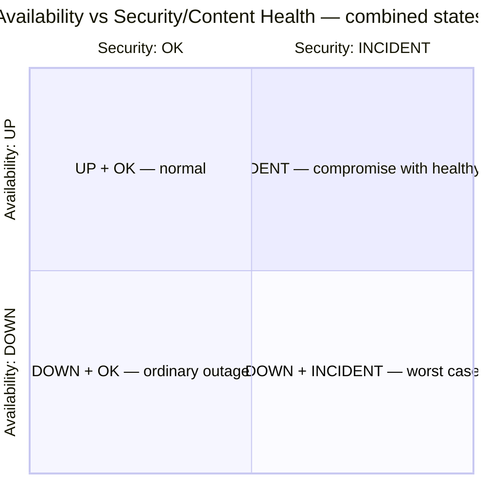
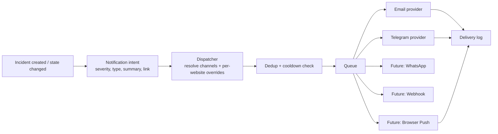

# PRD.md — SiteSentinel — Website Monitoring & Security Alerts

> **This document is the authoritative source of truth for product-level requirements.**
> Every other document in this repository derives from it. If another document contradicts
> `PRD.md` on a product-level requirement, `PRD.md` wins and the other document must be fixed.

---

## 1. Document Metadata

| Field | Value |
| --- | --- |
| Title | Product Requirements Document — SiteSentinel |
| Product name | SiteSentinel — Website Monitoring & Security Alerts |
| Version | `0.1.0` |
| Status | Draft — Approved for implementation |
| Date | 2026-09-28 |
| Owner role | Lead Product Engineer / Technical Architect |
| Primary audience | The future coding agent ("Hermes") that will implement this system phase by phase |
| Secondary audience | Human reviewers validating scope before implementation begins |
| Authority | Authoritative for all product-level requirements (see §21 Cross-Document Map) |
| Implementation state | **Specification only.** Nothing described in this document has been implemented. No feature described here should be assumed to exist. |

### 1.1 How to read this document

This PRD is written as an instruction set for an autonomous coding agent. Every requirement is
numbered so that it can be referenced from `PLAN.md`, tested, and traced back to a user story.
Requirements are marked either **`MVP`** (must be built in the first delivery) or **`Future`**
(must not be built now, but the architecture must not preclude it).

Guiding rules for the implementing agent:

1. **Technology is fixed.** See §22 Canonical Spec Compliance. Do not substitute alternatives.
2. **Do not over-build.** If a requirement is marked `Future`, do not implement it.
3. **Separate Availability from Security.** This is the single most important product rule and is
   elaborated in §10 and §11.
4. **Never assert compromise from a single signal.** See §11.4.

---

## 2. Product Overview

### 2.1 What SiteSentinel is

SiteSentinel is a self-hosted, server-rendered web application that continuously monitors
external websites for two independent things:

- **Availability** — is the website reachable and responding as expected?
- **Security / Content Health** — is the website serving the content it is supposed to serve, or
  has something been injected, altered, or redirected?

When either dimension degrades, SiteSentinel records the event as an **incident**, assigns a
**severity**, and dispatches notifications to configured channels. It also exposes an optional
**status page** so that third parties (clients, end users) can see high-level service health
without exposing security details.

### 2.2 Elevator pitch

> Self-hosted website owners — especially agencies and hosting resellers managing many client
> sites — have no affordable, private way to distinguish "the site is down" from "the site is up
> but has been quietly compromised and is now serving gambling/SEO-spam content." Traditional
> uptime monitors only check whether an HTTP response arrives. SiteSentinel treats **Availability**
> and **Security/Content Health** as two separate, independently reported dimensions, detects
> anomalies with a rule-based, weighted-correlation engine, and escalates to a real incident with
> notifications only when multiple signals agree — so operators get warned about real compromises
> without drowning in false positives.

### 2.3 Core concept (verbatim from the canonical spec)

```text
CORE CONCEPT  "External Website Monitoring + Basic Website Compromise Detection + Incident Alerting"
```

### 2.4 The defining rule

```text
KEY RULE      HTTP 200 does NOT mean healthy. Monitoring must keep Availability and
              Security/Content Health as SEPARATE dimensions.
                HTTP: UP  +  Security: INCIDENT  is a valid combined state.
```

Everything in this PRD is downstream of that rule. The implementing agent must never model health
as a single boolean or a single status column.

---

## 3. Problem Statement

### 3.1 The gap

A website owner managing one or more sites has two distinct failure modes:

| Failure mode | What the owner experiences | What existing uptime tools tell them |
| --- | --- | --- |
| **Availability failure** | The site is unreachable, timing out, or returning 5xx | Correctly reported as "down" |
| **Integrity failure** | The site returns a healthy `200 OK` but the page content is not the owner's content | **Nothing.** The tool reports "up", which is true and useless. |

### 3.2 Why integrity failures matter

The dominant integrity failure in the target market is **judol** (Indonesian slang for *judi
online* — online gambling) SEO-spam injection. A compromised site is typically modified to:

- inject hidden or low-visibility links and keyword blocks pointing to gambling domains,
- add doorway pages or redirect logic that only triggers for search-engine crawlers or specific
  referrers,
- insert meta tags, `<title>` overrides, or structured data targeting gambling keywords,
- load third-party scripts from previously unseen domains.

The site owner discovers this weeks later, usually when search rankings collapse or a client
complains. Meanwhile every conventional uptime monitor has been reporting green the entire time.

### 3.3 Why existing tools fail

1. **They measure the wrong thing.** A `200 OK` is a transport-level success, not a content-level
   statement of trust. Uptime tools stop at the transport layer.
2. **They are not purpose-built for compromise detection.** Generic keyword alerting tools either
   trigger constantly (false positives from legitimate content) or require manual page-diffing.
3. **They are hosted and multi-tenant.** Operators in this market often need the monitor itself to
   be private — checks reveal customer domains, and incident detail may reveal vulnerabilities.
   Sending that telemetry to a third-party SaaS is unacceptable for many of them.
4. **They conflate dimensions.** When "up/down" is the only output, a compromise has nowhere to
   be reported and is therefore invisible.

### 3.4 Problem statement (one sentence)

> Self-hosted website owners cannot tell the difference between "site is down" and "site is up but
> compromised / serving injected SEO-spam content," because existing uptime tooling only verifies
> that an HTTP response arrived — leaving integrity failures undetected until rankings or clients
> are already damaged.

---

## 4. Goals

Goals are expressed as measurable outcomes. "Measurable" here means the implementing agent can
construct a test or a query that verifies the goal.

| # | Goal | Measurable target |
| --- | --- | --- |
| G-1 | Detect availability failures promptly | A monitored website that transitions to a failing state produces an incident within `1 check interval + dispatch latency`; default interval is 5 minutes, so detection is ≤ ~6 minutes for a hard failure.
| G-2 | Detect content-integrity failures that HTTP status cannot reveal | At least one `CRITICAL`-severity security detection path exists that triggers on a website whose HTTP status is `200` (proof: `HTTP: UP` + `Security: INCIDENT` is reachable).
| G-3 | Keep Availability and Security as independent, separately-visible dimensions | Every check result stores availability status and security assessment as distinct fields; the admin UI can display any of the four combinations (UP/DOWN × OK/INCIDENT).
| G-4 | Control false positives structurally, not by tuning alone | Escalation to a security `CRITICAL` requires correlation of ≥ 2 independent signals (see §11.4); a single keyword hit must never, on its own, produce a `CRITICAL` security incident.
| G-5 | Deliver alerts to channels the operator already uses | MVP delivers via Email and Telegram, with per-incident deduplication so a single incident does not produce more than one notification per channel per state transition (subject to cooldown, §13.4).
| G-6 | Run on a small VPS | The whole stack (app, queue worker, scheduler, MySQL, Redis, Nginx) runs within 2 vCPU / 4 GB RAM / 40 GB disk for ~50 monitored websites at a 5-minute interval. See `NFR-02`.
| G-7 | Preserve forensic evidence | A monitoring check that produces a detection retains an HTML snapshot + response headers for the snapshot retention window (default 14 days), so the operator can review *what the site actually served*.
| G-8 | Publish a safe public health view | The status page exposes aggregate availability health only. No security detail, keyword, malicious domain, or redirect target is ever rendered publicly (see §14.4).
| G-9 | Keep all sensitive data on infrastructure the operator controls | The system is self-hosted; no third-party telemetry, error reporting, or analytics calls are required or made by default.

---

## 5. Non-Goals

SiteSentinel is deliberately narrow. The following are **explicit non-goals** for both MVP and the
foreseeable roadmap. The implementing agent must not expand scope toward these without an explicit
amendment to `PRD.md` and a corresponding entry in `DECISIONS.md`.

| # | Non-goal | Why it is excluded |
| --- | --- | --- |
| NG-1 | **Full vulnerability scanner.** SiteSentinel does not probe for CVEs, injection flaws, misconfigurations, exposed admin panels, or OWASP-class issues. | Requires active offensive probing against targets, has legal/abuse implications, and is a fundamentally different product.
| NG-2 | **Port / network vulnerability scanner.** No port scanning, no service fingerprinting, no TLS-cipher auditing beyond capturing the certificate as metadata. | Out of scope for external content monitoring; would trigger abuse complaints against the operator's VPS IP.
| NG-3 | **Web Application Firewall (WAF).** SiteSentinel does not sit in front of traffic, does not block requests, and does not modify responses. | Monitoring is out-of-band and read-only. A WAF is an inline, latency-critical component.
| NG-4 | **Malware remover / cleaner.** Detection does not imply remediation. SiteSentinel will not modify a monitored website's files, database, or configuration. | Remediation requires host access SiteSentinel is not designed to have, and any automated write action against a client site is dangerous.
| NG-5 | **Intrusion detection system for server internals.** No host-based IDS, no file-integrity monitoring on the target server, no process/network monitoring on the target. | SiteSentinel monitors **external** observable behaviour only. This is a deliberate boundary: it works without any agent installed on the target.
| NG-6 | **Log aggregator / SIEM.** SiteSentinel does not ingest, index, or search the monitored website's server logs. | Different data model, different scale, different product.
| NG-7 | **CMS plugin / on-host agent.** No WordPress plugin, no server-side agent. | Would require installing code on client infrastructure and would break the "external monitoring" concept.
| NG-8 | **Multi-tenant SaaS platform.** No organization/billing/subscription model in MVP. | Roles are Admin-only in MVP; extensibility is preserved but not built (§8.1).
| NG-9 | **Real-user monitoring / analytics.** No JavaScript beacon, no traffic metrics from real visitors. | Different measurement method; SiteSentinel's checks are synthetic probes.

---

## 6. Target Users

### 6.1 Primary user — the Administrator

**Profile:** Agency operator or hosting reseller managing multiple client websites (typically 5–150
domains). Technically comfortable: can provision a VPS, run Docker Compose, configure DNS and
SMTP, and read an HTTP header dump. Not necessarily a security specialist.

**Responsibilities:** Uptime of client sites, client-facing communication about incidents, and
protecting client sites from reputation damage (especially SEO-spam injection).

**Needs:**

- One place to see the state of every monitored website without logging into each one.
- A trustworthy alert that fires on compromise, not a noisy keyword feed.
- Enough forensic detail (snapshot, headers, redirect chain) to open a conversation with the client
  or the host.
- Privacy: check targets and incident detail stay on own infrastructure.
- Low resource footprint — the monitor must not need a dedicated server.

**Anti-needs (things that would make the product unusable for them):**

- Alerts that fire on every occurrence of a common word.
- Security detail leaking to a public status page.
- A heavyweight stack that requires a large VPS or a managed database.

### 6.2 Secondary user — the Status Page Viewer

**Profile:** A client, stakeholder, or end user of a monitored website who has been given the status
page URL. Low technical depth and no SiteSentinel account.

**Needs:**

- A fast, readable answer to "is the service working right now?"
- Confidence that the page is not leaking anything sensitive.
- Tolerance for the page being private, public, or password-protected, depending on the operator's
  choice.

**Not a user of:** the admin area, incident detail, or any security signal.

### 6.3 Explicitly out of MVP

- Non-admin authenticated roles (viewers, client accounts) — see `FR-04` marked `Future`.
- Anonymous self-service signup.

---

## 7. User Stories

Legend: `MVP` = must ship in first delivery. `Future` = planned, not now.

| ID | Status | As a… | I want to… | So that… |
| --- | --- | --- | --- | --- |
| **US-01** | `MVP` | Administrator | register a website for monitoring by entering its URL and a few basic settings | monitoring begins with minimal setup effort |
| **US-02** | `MVP` | Administrator | have SiteSentinel automatically establish a baseline of the website's normal state | subsequent checks are compared against what is normal for *this* site, not a generic template |
| **US-03** | `MVP` | Administrator | receive a notification when a monitored website becomes unavailable | I can react before clients notice |
| **US-04** | `MVP` | Administrator | receive a notification when a monitored website shows signs of compromise | I can investigate an integrity problem that a plain uptime check would have missed |
| **US-05** | `MVP` | Administrator | acknowledge an incident | the system (and my own future self) knows I have seen it, and duplicate alerting stops even though the underlying problem persists |
| **US-06** | `MVP` | Administrator | resolve an incident, manually or automatically on recovery | the incident record reflects reality and the timeline is closed cleanly |
| **US-07** | `MVP` | Administrator | view a check history and incident timeline per website | I can see when a problem started, what the site served, and how it evolved |
| **US-08** | `MVP` | Administrator | configure which notification channels are used and per-website overrides | alerts land where I actually read them, at a volume I can tolerate |
| **US-09** | `MVP` | Administrator | publish a status page, choosing private / public / password-protected | clients can self-serve the "is it up?" question without me answering it manually |
| **US-10** | `MVP` | Administrator | mark a keyword as ignored (per website) so it stops triggering detections | legitimate site-specific vocabulary does not generate recurring false positives |
| **US-11** | `MVP` | Administrator | see at a glance, on a dashboard, which monitored websites are currently unhealthy | I can triage quickly instead of opening each website individually |
| **US-12** | `MVP` | Administrator | retain enough history to investigate an incident after the fact | evidence does not vanish before I look at it |
| **US-13** | `MVP` | Administrator | have availability and security shown as separate dimensions everywhere | I am never misled by a "200 OK = healthy" summary |
| **US-14** | `Future` | Administrator | add non-admin users with scoped access | I can delegate monitoring of a subset of websites |
| **US-15** | `Future` | Administrator | receive alerts via WhatsApp or a generic webhook | I can integrate with the tooling my team already uses |
| **US-16** | `Future` | Administrator | capture a visual screenshot of a monitored page | I can visually confirm defacement without parsing HTML |

---

## 8. Functional Requirements

### 8.1 Authentication

| ID | Status | Requirement |
| --- | --- | --- |
| **FR-01** | `MVP` | The application MUST provide session-based login at `/`. The root path is the login page (`ROUTES: / = login`). |
| **FR-02** | `MVP` | The system MUST have exactly one role in MVP: **Admin**. All admin-area routes live under `/admin` and MUST require an authenticated Admin session. |
| **FR-03** | `MVP` | Passwords MUST be stored using a modern one-way hash (Laravel's default password hashing). Plaintext or reversible storage is prohibited. |
| **FR-04** | `Future` | The authorization model MUST be designed so additional roles (e.g. per-website viewer/operator) can be added without schema rewrites. No role UI is built in MVP. |
| **FR-05** | `MVP` | Admin account(s) MUST be creatable via an installation/seed command rather than public self-registration. There is no public signup route. |
| **FR-06** | `MVP` | Login MUST be rate-limited; repeated failures MUST be throttled with a lockout window. |
| **FR-07** | `MVP` | Users MUST be able to log out, invalidating the session. |
| **FR-08** | `Future` | Two-factor authentication for Admin accounts. |

### 8.2 Website Management

The term **website** (or **monitored website**) means a target URL registered for monitoring. It is
the primary entity; checks, incidents, and baselines all belong to a website.

| ID | Status | Requirement |
| --- | --- | --- |
| **FR-09** | `MVP` | Admin MUST be able to create a monitored website by supplying at minimum a display name and an absolute `http`/`https` URL. |
| **FR-10** | `MVP` | The system MUST reject or flag a URL that fails the SSRF validation rules in §15.4 before any check is executed against it. |
| **FR-11** | `MVP` | Admin MUST be able to edit a website's display name, URL, check settings, and notification overrides. |
| **FR-12** | `MVP` | Admin MUST be able to enable/disable a website. Disabled websites are excluded from scheduling and do not generate incidents. |
| **FR-13** | `MVP` | Admin MUST be able to delete a website, with confirmation. Deletion MUST cascade to that website's checks, incidents, snapshots, and baselines. |
| **FR-14** | `MVP` | Each website MUST store: name, URL, enabled flag, check interval, timeout, expected status code(s), and a free-text note. |
| **FR-15** | `MVP` | The website list MUST show, per website, its current availability status, current security status, and last check timestamp — as separate fields. |
| **FR-16** | `Future` | Bulk import of websites (CSV) and grouping/tagging. |

### 8.3 Monitoring Configuration

| ID | Status | Requirement |
| --- | --- | --- |
| **FR-17** | `MVP` | Each website MUST have a configurable **check interval**, constrained to a set of allowed values (default 5 minutes). |
| **FR-18** | `MVP` | Each website MUST have a configurable **request timeout** (default 10 seconds). |
| **FR-19** | `MVP` | Each website MUST have a configurable **expected status code** (default `200`), supporting an explicit list of acceptable codes (e.g. `200`, `301`/`302` when redirects are permitted). |
| **FR-20** | `MVP` | Monitoring MUST be non-invasive: `GET` requests only, no request body, no authentication against the target, no form submission. |
| **FR-21** | `MVP` | The system MUST send an identifiable `User-Agent` string for SiteSentinel checks, so target operators can recognise and allow the traffic. |
| **FR-22** | `MVP` | Redirect behaviour MUST be configurable per website: follow (default) or treat as final. If following, the redirect chain is recorded (see `FR-30`). |
| **FR-23** | `MVP` | The system MUST cap the number of redirect hops followed, and MUST re-validate every hop against SSRF rules (§15.4) and against the configured allowlist. |
| **FR-24** | `MVP` | Admin MUST be able to trigger a manual "check now" for a website, bypassing the schedule, subject to rate limiting. |
| **FR-25** | `Future` | Per-website custom request headers and HTTP method selection. |

### 8.4 Baseline

A **baseline** is the recorded normal state of a monitored website, used as the comparison reference
for content-integrity checks. Without a baseline, a keyword appearing in a page tells you nothing;
with one, a keyword appearing *newly and in an unexpected structural position* is a signal.

| ID | Status | Requirement |
| --- | --- | --- |
| **FR-26** | `MVP` | The system MUST be able to establish a baseline for a website, capturing at minimum: a content fingerprint (hash), page title, response headers of interest, and the set of links/domains referenced by the page. |
| **FR-27** | `MVP` | Baseline establishment MUST be explicit and/or automatic-on-first-successful-check; either way the resulting baseline MUST be visible and reviewable by Admin. |
| **FR-28** | `MVP` | Baseline MUST be re-establishable by Admin after a legitimate site change (e.g. a redesign), so that the site's new normal becomes the reference. |
| **FR-29** | `MVP` | Baseline establishment MUST NOT occur from a check result that itself failed normally or is judged untrustworthy (e.g. the page returned an error page with a `200` status) — a bad baseline poisons all future comparisons. |
| **FR-30** | `MVP` | Detection logic MUST be able to distinguish "differs from baseline" (informational drift) from "differs from baseline in a suspicious direction" (potential incident). Drift alone is not an incident. |

### 8.5 Check Execution

| ID | Status | Requirement |
| --- | --- | --- |
| **FR-31** | `MVP` | Checks MUST be dispatched by the Laravel Scheduler and executed on the Laravel Queue backed by Redis — never in the HTTP request/response cycle of an admin action. |
| **FR-32** | `MVP` | A check MUST record, at minimum: `website_id`, start timestamp, total duration, HTTP status, resolved IP, final URL, redirect chain, error type/message if any, response size, page title, content hash, TLS certificate metadata, and the resulting availability + security assessment. |
| **FR-33** | `MVP` | A check MUST capture **SSL/TLS certificate metadata** (issuer, subject, validity window at minimum) when the target is HTTPS. |
| **FR-34** | `MVP` | A check MUST capture the response **body** for the purpose of content hashing and rule evaluation, and MUST store an HTML snapshot when the check produces a detection (`FR-35`). |
| **FR-35** | `MVP` | An **HTML snapshot** (response body) plus **response headers** MUST be persisted as the MVP forensic artifact. Screenshot capture is **not** MVP-mandatory. |
| **FR-36** | `MVP` | Check execution MUST be isolated: a failure or exception on one website's check MUST NOT abort the batch or affect other websites' checks. |
| **FR-37** | `MVP` | Checks MUST enforce the configured timeout and MUST NOT hang indefinitely; a hung check MUST be recorded as a timeout failure. |
| **FR-38** | `MVP` | Checks MUST enforce a maximum response body size to prevent memory exhaustion from a hostile or broken target. |
| **FR-39** | `MVP` | Each check MUST produce a **persistent result record** even when it fails — "no data" is itself a signal and must never be silently dropped. |
| **FR-40** | `Future` | Screenshot capture (headless browser) as an additional forensic artifact. |
| **FR-103** | `Future` | Admin MUST be able to trigger a manual check for a website outside its scheduled cadence, subject to the manual-check rate limit (`FR-24`) and the scheduler/queue boundary (`FR-31`). |

### 8.6 Detection Engine

The full rule catalogue lives in `DETECTION-RULES.md`. This PRD defines the **model**: rule-based
evaluation, weighted scoring, correlation threshold, and severity assignment.

| ID | Status | Requirement |
| --- | --- | --- |
| **FR-41** | `MVP` | Detection MUST be **rule-based and deterministic**. The same check input MUST produce the same assessment. No machine-learning or opaque scoring. |
| **FR-42** | `MVP` | Each detection rule MUST emit a **signal** with: rule identifier, a weight, and an explanation string suitable for showing to Admin. |
| **FR-43** | `MVP` | Signals within a single check (and, where specified, across a short trailing window) MUST be **correlated** into a weighted risk score. |
| **FR-44** | `MVP` | Assessment MUST assign exactly one **severity**: `INFO`, `WARNING`, or `CRITICAL`, per the definitions in §11.3. |
| **FR-45** | `MVP` | The engine MUST NEVER escalate to a security incident on the basis of a single keyword match. A keyword hit alone can at most produce `INFO`/`WARNING`. See §11.4. |
| **FR-46** | `MVP` | Severity thresholds MUST be configurable defaults, overridable per website. |
| **FR-47** | `MVP` | Admin MUST be able to define **per-website ignored keywords**, excluded from keyword rules for that website. |
| **FR-48** | `MVP` | Rules MUST be able to distinguish contextual signals — e.g. a keyword in visible text vs. in a hidden element, in a `<title>`/meta tag, in an outbound link, or in a newly injected script domain. |
| **FR-49** | `MVP` | Every detection MUST persist its **rule attribution**: which rules fired, with what weights, contributing to which score. A user must be able to see *why* an incident was raised. |
| **FR-50** | `MVP` | Rules MUST be data-driven where practical so that the catalogue can evolve without structural rewrites (see `DETECTION-RULES.md`). |
| **FR-51** | `Future` | Rules that correlate across multiple websites of the same owner (e.g. same suspicious domain appearing on several sites). |
| **FR-52** | `Future` | Threat-intelligence / blocklist feed integration. |

### 8.7 Incident Management

An **incident** is the alert record created when monitoring detects a condition requiring attention.
It is not the same thing as a failed check — many failed checks may map to one incident, and a
security incident may be created from checks that all returned `200`.

| ID | Status | Requirement |
| --- | --- | --- |
| **FR-53** | `MVP` | The system MUST create an incident when an availability failure crosses its configured threshold (e.g. N consecutive failed checks), not on a single transient failure by default. |
| **FR-54** | `MVP` | The system MUST create an incident when the detection engine's correlated score crosses the `WARNING` or `CRITICAL` threshold, tagged as a **security/content** incident. |
| **FR-55** | `MVP` | Each incident MUST record: website, type (availability \| security), severity, state, detection rule attribution (for security), first-detected timestamp, acknowledged timestamp + actor, resolved timestamp + actor, and a human-readable summary. |
| **FR-56** | `MVP` | Incidents MUST support the lifecycle `DETECTED → ACKNOWLEDGED → RESOLVED`, with the exact semantics in §12. |
| **FR-57** | `MVP` | State transitions MUST be recorded in an audit trail with timestamp and, where human-initiated, the acting Admin. |
| **FR-58** | `MVP` | Acknowledging an incident MUST NOT resolve it, and MUST be available to Admin regardless of whether the underlying condition has cleared. |
| **FR-59** | `MVP` | An incident MAY be resolved automatically when the system observes sustained recovery in the relevant dimension; automatic resolution MUST be distinguishable in the audit trail from manual resolution. |
| **FR-60** | `MVP` | Repeated detections of the same unresolved condition MUST NOT create duplicate open incidents for the same website and type; they MUST append evidence to the existing open incident. |
| **FR-61** | `MVP` | The system MUST maintain a per-website **timeline** interleaving check results, incident lifecycle events, and notification dispatches. |
| **FR-62** | `MVP` | Incidents MUST be filterable by state, severity, type, and website. |
| **FR-63** | `Future` | Incident comments/notes and manual severity override with reason. |

### 8.8 Notifications

Detail (provider contracts, payload shapes, retry behaviour) lives in `NOTIFICATIONS.md`. This PRD
defines the required behaviour.

| ID | Status | Requirement |
| --- | --- | --- |
| **FR-64** | `MVP` | Notification dispatch MUST go through a **provider-independent dispatcher** abstraction: incident logic produces a channel-agnostic notification intent; providers translate and deliver it. |
| **FR-65** | `MVP` | **Email** MUST be a supported channel. |
| **FR-66** | `MVP` | **Telegram** MUST be a supported channel. |
| **FR-67** | `MVP` | Channel configuration MUST be manageable by Admin (enabled/disabled per channel, credentials/recipients) and overridable per website. |
| **FR-68** | `MVP` | The system MUST suppress duplicate notifications: one notification per incident per state transition per channel, subject to cooldown. |
| **FR-69** | `MVP` | The system MUST apply a **cooldown** window per website+channel so a flapping or repeatedly-detecting website cannot flood the operator. |
| **FR-70** | `MVP` | The system MUST send a **recovery notification** when an incident resolves, distinct from the detection notification. |
| **FR-71** | `MVP` | Every dispatch attempt MUST be logged with channel, target, timestamp, outcome, and failure reason, retained per §16. |
| **FR-72** | `MVP` | Notification delivery MUST be asynchronous (queued) with bounded retries; a failing channel MUST NOT block incident creation or other channels. |
| **FR-73** | `MVP` | Notification payloads MUST NOT include secrets or full page bodies; they carry a summary and a link into the admin area. |
| **FR-74** | `Future` | WhatsApp channel. |
| **FR-75** | `Future` | Generic outbound Webhook channel. |
| **FR-76** | `Future` | Per-Admin notification preferences and quiet hours. |

### 8.9 Status Page

Detail (layout, caching, theming) lives in `STATUS-PAGE.md`.

| ID | Status | Requirement |
| --- | --- | --- |
| **FR-77** | `MVP` | The system MUST expose a status page at `/status`. |
| **FR-78** | `MVP` | The status page MUST support three visibility modes: **Private**, **Public**, and **Password Protected**. |
| **FR-79** | `MVP` | The status page MUST show high-level health only (current availability state and, optionally, recent availability history per website or group). |
| **FR-80** | `MVP` | The status page MUST NEVER expose security dimension detail, incident rule attribution, suspicious keywords, malicious domains, redirect targets, response headers, or snapshots. See §14.4. |
| **FR-81** | `MVP` | In Password Protected mode, the page MUST require a password before rendering any data; the password MUST be stored hashed. |
| **FR-82** | `MVP` | The status page MUST be readable without authentication in Public mode and MUST be lightweight (cacheable, no admin dependencies in the render path). |
| **FR-83** | `MVP` | Admin MUST be able to toggle the status page visibility mode and, per website, whether it appears on the status page at all. |
| **FR-84** | `Future` | Custom branding, custom domain, and historical uptime percentage graphs. |

### 8.10 Admin Dashboard

| ID | Status | Requirement |
| --- | --- | --- |
| **FR-85** | `MVP` | The admin area at `/admin` MUST present a dashboard summarising total websites, counts by availability status, counts by security status, and open incidents by severity. |
| **FR-86** | `MVP` | The dashboard MUST list currently open incidents, ordered by severity then recency, with direct links to incident detail. |
| **FR-87** | `MVP` | The dashboard MUST separate availability and security presentation so the `HTTP: UP / Security: INCIDENT` combination is visibly representable. |
| **FR-88** | `MVP` | Admin MUST be able to reach, from the dashboard: website list, website detail (check history + timeline), incident list, notification settings, and status page settings. |
| **FR-89** | `MVP` | The UI MUST be server-rendered with Hotwired Turbo for navigation/partial updates. It MUST NOT be an SPA. |

### 8.11 Retention

| ID | Status | Requirement |
| --- | --- | --- |
| **FR-90** | `MVP` | The system MUST enforce the retention windows in §16 via scheduled pruning jobs. |
| **FR-91** | `MVP` | Check retention MUST be configurable between **30 / 60 / 90** days, defaulting to **30**. |
| **FR-92** | `MVP` | Incident history MUST be retained for **365** days by default. |
| **FR-93** | `MVP` | Notification logs MUST be retained for **90** days by default. |
| **FR-94** | `MVP` | Snapshots MUST be retained for **14** days by default. |
| **FR-95** | `MVP` | Pruning MUST be a scheduled, idempotent job that never partially corrupts a reference (e.g. must not delete an incident's evidence while the incident is open, unless the snapshot window explicitly governs that evidence — see §16.4). |
| **FR-96** | `MVP` | Admin MUST be able to see the currently effective retention configuration. |
| **FR-97** | `Future` | Per-website retention overrides and archival/export before pruning. |

### 8.12 Observability

| ID | Status | Requirement |
| --- | --- | --- |
| **FR-98** | `MVP` | The system MUST log check execution outcomes (success/failure, duration, error class) with enough structure to diagnose scheduling or queue problems. |
| **FR-99** | `MVP` | The system MUST expose a health/readiness indication for the application, its database connection, its Redis connection, and queue worker liveness. |
| **FR-100** | `MVP` | The system MUST surface queue backlog/scheduler health to Admin, so a silent monitoring outage (monitor is down, therefore no alerts) is itself detectable. |
| **FR-101** | `MVP` | Notification delivery failures MUST be visible to Admin, not only written to logs. |
| **FR-102** | `Future` | Time-series metrics export and external alerting on SiteSentinel's own health. |
| **FR-104** | `Future` | The admin UI MUST support a three-state theme control — Light, Dark, System — where System follows the OS `prefers-color-scheme`, and the chosen theme MUST persist across sessions. |
| **FR-105** | `Future` | The system MUST provide **Browser Push** as a notification channel delivered through the provider-independent dispatcher (`FR-64`), with per-subscription opt-in and unsubscribe. |
| **FR-106** | `Future` | List views MUST offer a per-page selector with the fixed page-size set 10 / 20 / 50 / 100 / All, preserving the active query string; accepted values MUST be validated against a server-side whitelist. |
| **FR-107** | `Future` | Destructive row actions (at minimum delete) MUST be gated by a confirmation modal, and icon-only row actions MUST carry an accessible label. |
| **FR-108** | `Future` | Admin MUST be able to manage **multiple status pages** — create, edit, and delete named pages with a unique `slug`, mark one as default, and assign a website to a page. |
| **FR-109** | `Future` | Form fields MAY expose contextual help; where help is shown it MUST be reachable both on hover (tooltip) and on click (modal). |
| **FR-110** | `Future` | The admin area MUST present analytics visualisations rendered as server-side inline SVG (no client-side charting library), from persisted data only — no fabricated or historical data is ever displayed. |
| **FR-111** | `Future` | The admin area MUST provide an **in-app notification centre** persisted per admin, generated from existing incident/security/config events, with read/unread state, deduplication, and ownership scoped to the authenticated admin. It MUST be independent from outbound channel delivery. |
| **FR-112** | `Future` | The public status page MUST support a client-side auto-refresh of the existing status projection at selectable intervals (1 / 5 / 10 / 30 / 60 minutes) with a countdown, non-overlapping requests, and visibility-based pausing, without new real-time infrastructure. |
| **FR-113** | `Future` | The public status projection MUST expose a precise last-update timestamp as an allowlisted UTC ISO-8601 field, rendered in the visitor's local timezone. |

---

## 9. Non-Functional Requirements

### 9.1 Performance

| ID | Status | Requirement |
| --- | --- | --- |
| **NFR-01** | `MVP` | Admin pages MUST render server-side and respond within 500 ms at p95 under the reference load defined in `NFR-02`, excluding the cost of slow-checking external targets (which is always asynchronous). |
| **NFR-02** | `MVP` | Under the reference workload (50 enabled websites, 5-minute interval), the scheduled check workload MUST complete comfortably within its interval window, i.e. the queue MUST drain well before the next batch is due, with capacity headroom of at least 3×. |

### 9.2 Resource Footprint

| ID | Status | Requirement |
| --- | --- | --- |
| **NFR-03** | `MVP` | The complete system MUST run on a small VPS: **2 vCPU / 4 GB RAM / 40 GB SSD** for the reference workload. |
| **NFR-04** | `MVP` | No component may require a managed or external service to function. MySQL and Redis run alongside the app. |
| **NFR-05** | `MVP` | Snapshot and log growth MUST be bounded by retention (§16), so disk usage is predictable rather than monotonically increasing. |
| **NFR-06** | `MVP` | Idle baseline RAM consumption of the application + worker + scheduler MUST leave meaningful headroom on a 4 GB machine (target: total stack steady-state under ~2 GB). |

### 9.3 Reliability

| ID | Status | Requirement |
| --- | --- | --- |
| **NFR-07** | `MVP` | A single website's failing check MUST NOT impair other checks (`FR-36`), and a failing notification channel MUST NOT block incident creation (`FR-72`). |
| **NFR-08** | `MVP` | Queued jobs MUST be retried with backoff on transient failure, and jobs MUST NOT be silently lost. |
| **NFR-09** | `MVP` | Restarting the application or workers MUST NOT cause duplicate incidents or duplicate notifications for an unchanged condition (`FR-60`, `FR-68`). |
| **NFR-10** | `MVP` | Monitoring MUST continue to function (checks still execute and incidents still record) even when all notification channels are broken; channel failure degrades alerting, not monitoring. |

### 9.4 Security

| ID | Status | Requirement |
| --- | --- | --- |
| **NFR-11** | `MVP` | All admin traffic MUST be served over HTTPS in production, with secure session cookie flags. |
| **NFR-12** | `MVP` | The system MUST implement the layered SSRF protections of §15.4 on **every** outbound request, including every redirect hop. |
| **NFR-13** | `MVP` | Secrets (SMTP credentials, Telegram bot token, status page password hash inputs, app key) MUST be supplied via environment configuration and MUST NOT be committed to the repository. |
| **NFR-14** | `MVP` | Admin-area actions that mutate state MUST be protected against CSRF. |
| **NFR-15** | `MVP` | User-supplied values rendered in the UI (website names, URLs, notes, keyword lists) MUST be escaped to prevent stored XSS. |

### 9.5 Maintainability

| ID | Status | Requirement |
| --- | --- | --- |
| **NFR-16** | `MVP` | The codebase MUST follow Laravel conventions for structure, naming, and dependency injection, so a future contributor (human or agent) can navigate it without bespoke documentation. |
| **NFR-17** | `MVP` | Detection rules MUST be separable from check execution, so the rule catalogue can change without altering the probe mechanism. |
| **NFR-18** | `MVP` | Notification providers MUST be separable from incident logic (`FR-64`), so adding a channel is additive. |
| **NFR-19** | `MVP` | The system MUST be deployable via Docker Compose with a single documented command set, and its tests runnable without network access to monitored targets (targets stubbed). |

### 9.6 Observability

| ID | Status | Requirement |
| --- | --- | --- |
| **NFR-20** | `MVP` | Logs MUST be structured enough to answer: did the scheduler fire, did the queue drain, which website's check failed and why, which notifications failed and why. |
| **NFR-21** | `MVP` | The system MUST make its own liveness observable to Admin (`FR-99`, `FR-100`), because a monitoring system that silently stops monitoring is worse than none. |

### 9.7 Portability / Self-Hosting

| ID | Status | Requirement |
| --- | --- | --- |
| **NFR-22** | `MVP` | Installation MUST be achievable by a competent operator using Docker Compose, without requiring Kubernetes or cloud-specific services. |
| **NFR-23** | `MVP` | The system MUST NOT phone home. No telemetry, analytics, or update-check calls to third parties by default (`G-9`). |
| **NFR-24** | `MVP` | Configuration MUST be environment-driven so the same image runs in development and production with different `.env` values. |

---

## 10. Monitoring Behavior

### 10.1 What a check does

For each enabled website, on its schedule, the system performs one probe and records one **check
result**. The probe is deliberately simple and read-only.

| Aspect | Default | Configurable | Notes |
| --- | --- | --- | --- |
| **Interval** | 5 minutes | Yes (`FR-17`) | Allowed set is bounded to protect the resource budget (`NFR-02`). |
| **Timeout** | 10 seconds | Yes (`FR-18`) | A timeout is a recorded failure, not a dropped check (`FR-37`). |
| **Method** | `GET` | No (MVP) | Non-invasive (`FR-20`). |
| **User-Agent** | SiteSentinel identifier | No (MVP) | Identifiable traffic (`FR-21`). |
| **Expected status** | `200` | Yes (`FR-19`) | Supports an explicit acceptable list. |
| **Redirects** | Follow, max hops capped | Yes (`FR-22`, `FR-23`) | Chain recorded; every hop revalidated for SSRF. |
| **Body size cap** | Enforced | No (MVP) | Protects the monitor (`FR-38`). |
| **TLS capture** | On for HTTPS | No (MVP) | Issuer, subject, validity window (`FR-33`). |
| **Title capture** | Yes | No (MVP) | Cheap, high-signal indicator of defacement/spam. |
| **Content hash** | Yes | No (MVP) | Enables drift detection vs. baseline (`FR-26`). |
| **Snapshot** | On detection | No (MVP) | HTML + headers persisted (`FR-35`). |

### 10.2 What a check result records

Minimum recorded fields (aligned to `FR-32`):

- `website_id`
- started at / finished at / duration
- resolved IP address actually connected to
- HTTP status code (or a synthetic failure class)
- final URL after redirects
- full **redirect chain** (each hop: status, from, to, resolved IP)
- error type and message, if the probe failed
- response size in bytes
- page `<title>`
- content hash
- TLS certificate metadata (issuer, subject, not-before, not-after, days to expiry)
- response headers (persisted with the snapshot, `FR-35`)
- **availability assessment** — see §10.3
- **security/content assessment** — see §10.4
- rule attribution, if any signal fired (`FR-49`)

### 10.3 Dimension 1 — Availability

Availability answers: *did the website respond as expected, within the budget?*

| Value | Meaning |
| --- | --- |
| **UP** | A response was received within the timeout and the status code is in the acceptable set. |
| **DOWN** | No response, connection failure, timeout, or a status code outside the acceptable set. |

Availability is exactly two-valued (`UP` / `DOWN`). A slow but acceptable response is not a third
availability state; a graduated response-time signal may still be recorded as a detection signal
(category `availability`), but the stored availability value remains `UP` or `DOWN`. Availability is
a transport/DNS/TLS-layer judgement and says nothing about content.

### 10.4 Dimension 2 — Security / Content Health

Security/Content Health answers: *does the content served match what this website is supposed to
serve, and are there signs of injected, hidden, or redirected content?*

| Value | Meaning |
| --- | --- |
| **OK** | No rule crossed a reporting threshold; content is consistent with the baseline. |
| **INFO** | Something noteworthy was observed that is not deemed threatening. Recorded for the timeline; no incident. |
| **SUSPECT** | Weighted score crossed the `WARNING` threshold. An incident is opened. |
| **INCIDENT** | Weighted score crossed the `CRITICAL` threshold, or a correlated multi-signal pattern matched a known compromise shape. An incident is opened and escalated. |

### 10.5 The two dimensions are orthogonal

This is the core product rule. Availability is **not** derived from Security, and Security is **not**
derived from Availability. Both are computed and both are stored and displayed.



### 10.6 Worked example — `HTTP: UP` / `Security: INCIDENT`

The following is the canonical scenario that this product exists to catch. Note that **every check
in this sequence returns a perfectly healthy HTTP status**.

**Website:** `contoh-toko.example` — a client's e-commerce site.
**Baseline established:** 2026-09-01, content hash `B`, title `Toko Contoh — Belanja Online`,
referenced domains `{cdn.contoh-toko.example, fonts.googleapis.com}`.

| Time | Status | Availability | Security | What the check observed |
| --- | --- | --- | --- | --- |
| 03:00 | 200 | UP | OK | Content hash matches baseline `B`. |
| 03:05 | 200 | UP | OK | Hash matches. |
| 03:10 | 200 | UP | **INFO** | Content hash changed to `C`; title unchanged. Drift detected but unexplained → recorded, no incident. |
| 03:15 | 200 | UP | **SUSPECT** | Hash `C` persists **and** a `RULE-KW-*` rule matches newly-present spam keywords, **and** a new outbound domain `situs-judi.example` appears that is absent from the baseline link set (`RULE-LNK-*`). Signals correlate → score crosses `WARNING`. **Incident opened.** |
| 03:20 | 200 | UP | **INCIDENT** | The same correlated pattern persists; the newly injected keyword block is inside an element hidden with inline `display:none`, which is itself a strong structural signal. Score crosses `CRITICAL`. **Severity escalated on the existing incident.** |

**Resulting user-visible state:**

```text
HTTP: UP  +  Security: INCIDENT
```

A conventional uptime monitor would have reported this website as "up" for the entire window and
sent the operator nothing. SiteSentinel reports `UP` **and** `INCIDENT` simultaneously, at `CRITICAL`
severity, with a snapshot from 03:20 showing exactly what the site was serving.

**Why the escalation is safe (false-positive control):** the `INFO` at 03:10 did not become an
incident because drift alone is not an incident (`FR-30`). Escalation at 03:15 required the
*correlation* of three independent signals (`FR-45`, §11.4). A legitimate site adding a single
word would have produced only the `INFO` and never an alert.

### 10.7 Failure capture

When the probe fails, the check result MUST still be written (`FR-39`) with an explicit failure
classification, so the operator can distinguish:

- DNS resolution failure
- connection refused / unreachable
- TLS handshake failure (including expired/invalid certificate)
- timeout (no response within budget)
- unexpected status code
- body too large / truncated read
- blocked by SSRF policy (recorded as a configuration error, not a website outage)

---

## 11. Detection Behavior

> **Scope note.** This section defines the detection **model**: signal structure, severity meanings,
> weighted scoring, correlation threshold, and tunability. The exhaustive rule catalogue —
> individual rule identifiers, patterns, weights, and examples — lives in **`DETECTION-RULES.md`**.
> This PRD intentionally does not duplicate that catalogue, and the implementing agent must treat
> `DETECTION-RULES.md` as the rule-level source of truth while `PRD.md` remains authoritative for the
> model and thresholds.

### 11.1 Detection principles

1. **Rule-based.** Detection is a deterministic function of observable inputs.
2. **Explainable.** Every signal carries a human-readable reason (`FR-42`, `FR-49`).
3. **Correlational.** Weak signals combine; they do not escalate alone (§11.4).
4. **Tunable.** Thresholds and ignored keywords are per-website adjustable (`FR-46`, `FR-47`).
5. **Cheap to run.** Rule evaluation happens on already-fetched content and headers; it must not
   add meaningful cost to a check (`NFR-02`).

### 11.2 Signal shape

Every rule produces zero or more signals of the form:

```text
Signal {
  rule_id       # stable identifier, e.g. "RULE-KW-001"
  category      # availability | ssl | redirect | content-fingerprint |
                # content-keyword | external-link | seo-pattern
  weight        # integer contribution to the risk score
  confidence    # low | medium | high — modulates weight for correlation
  reason        # human-readable explanation shown to Admin
  evidence      # minimal excerpt/metadata (NEVER rendered on the public status page)
}
```

**Category set is fixed.** The seven signal categories above are the only valid category values
and are the exact set counted by the correlation guard (§11.4). The **exhaustive rule catalogue** —
every `RULE-AV-*`, `RULE-SSL-*`, `RULE-RED-*`, `RULE-CNT-*`, `RULE-KW-*`, `RULE-LNK-*`, and
`RULE-SEO-*` identifier, its weight, confidence, pattern, and detection algorithm — lives in
`DETECTION-RULES.md`, which is authoritative for rule-level detail. The summary table in §11.4 is
**illustrative only** and does not enumerate the catalogue.

### 11.3 Severity model

Severity is `INFO`, `WARNING`, or `CRITICAL`. These meanings are exact and MUST NOT be redefined
elsewhere.

| Severity | Meaning | System behaviour | Operator expectation |
| --- | --- | --- | --- |
| **INFO** | Something notable was observed. It is **not** judged to be a threat on its own. | Recorded on the check result and the website timeline. **No incident created.** No notification. | Awareness only. It is safe to ignore. |
| **WARNING** | Correlated signals indicate a plausible problem that warrants investigation. | **Incident created** with severity `WARNING`. Notification dispatched (subject to cooldown/dedup). | Look at it soon; it may be benign but deserves eyes. |
| **CRITICAL** | Correlated signals match a compromise pattern, or a severe availability failure persists. | **Incident created** (or existing incident escalated) with severity `CRITICAL`. Notification dispatched. | Act now; assume the website is serving unintended content or is hard down. |

Additional severity rules:

- Severity is assigned per **incident**, and an incident's severity MAY be **escalated** while open.
- Severity MUST NOT be silently **downgraded** while an incident is open; resolution closes it, and
  a recurrence opens a new incident.
- An availability incident is normally `WARNING` on threshold breach and `CRITICAL` when the failure
  persists beyond a configured duration or affects a website marked as critical.

### 11.4 Weighted scoring / correlation model

The engine computes a **risk score** per check (with limited lookback, see below) and maps it to a
severity via thresholds. The design intent is that **a single weak signal is never sufficient to
raise a `CRITICAL` security incident**.

**Scoring model:**

```text
risk_score = Σ ( weight(rule) × confidence_multiplier(rule) )   for all fired signals
confidence_multiplier: low = 0.5, medium = 1.0, high = 1.5
```

**Default thresholds** (configurable per website, `FR-46`):

| Threshold | Default risk score | Resulting severity |
| --- | --- | --- |
| Report floor | ≥ 1 | `INFO` (recorded only) |
| Warning | ≥ 8 | `WARNING` (incident opened) |
| Critical | ≥ 15 | `CRITICAL` (incident opened/escalated) |
| Correlation guard | **≥ 2 independent signal categories** | Required for any `CRITICAL` **security** escalation |

**Illustrative weight table** (indicative defaults only; the authoritative catalogue — every
`RULE-AV-*`, `RULE-SSL-*`, `RULE-RED-*`, `RULE-CNT-*`, `RULE-KW-*`, `RULE-LNK-*`, and `RULE-SEO-*`
rule id, weight, confidence, pattern, and detection algorithm — is in `DETECTION-RULES.md`):

| Category | Example rule | Weight | Confidence | Notes |
| --- | --- | --- | --- | --- |
| `content-keyword` | `RULE-KW-001` — known spam keyword present in visible text | 2 | low | Weakest form; a single hit is `INFO`-level noise control territory. |
| `content-keyword` | `RULE-KW-002` — spam keyword cluster (≥ 5 distinct) present | 4 | medium | Clustering is far more indicative than one word. |
| `content-fingerprint` | `RULE-CNT-004` — keyword block inside a hidden element | 5 | medium | Hidden text is a classic injection technique. |
| `content-fingerprint` | `RULE-CNT-005` — script/link injected into an unexpected page region vs. baseline | 4 | medium | Position matters. |
| `external-link` | `RULE-LNK-001` — outbound link to a domain absent from baseline | 3 | medium | New domains are the single most common spam vector. |
| `external-link` | `RULE-LNK-002` — outbound link to a domain matching a suspicious TLD/pattern heuristic | 5 | medium | TLD heuristics are tuning-sensitive; kept medium confidence. |
| `redirect` | `RULE-RED-001` — unexpected redirect off-domain vs. baseline | 6 | high | Strong signal: the site is actively sending users elsewhere. |
| `seo-pattern` | `RULE-SEO-004` — server/injection fingerprint pattern characteristic of SEO spam | 2 | low | Weak alone; useful corroboration. |
| `content-fingerprint` | `RULE-CNT-002` — page title replaced with unrelated/spam content | 6 | high | Titles are rarely changed by accident on a production site. |
| `content-fingerprint` | `RULE-CNT-001` — content hash drift from baseline | 1 | low | **Drift alone is normal.** Deliberately the lowest weight. |

**Worked scoring example** (matches §10.6 at 03:15):

| Signal | Weight | Confidence × | Contribution |
| --- | --- | --- | --- |
| `RULE-CNT-001` (hash drift) | 1 | 0.5 | 0.5 |
| `RULE-KW-002` (keyword cluster) | 4 | 1.0 | 4.0 |
| `RULE-LNK-001` (new outbound domain) | 3 | 1.0 | 3.0 |
| **Total** | | | **7.5 → below Warning (8)?** |

At 03:15 the totals sit just under `WARNING`, which is the intended conservative behaviour; the
incident in §10.6 is opened once the keyword block is *also* found inside a hidden element
(`RULE-CNT-004`, +5.0 → total **12.5 ≥ 8 → `WARNING`**). At 03:20 the pattern persists and
`RULE-RED-001` also fires (+9.0 → total **21.5 ≥ 15**) with **three independent signal
categories**, satisfying the correlation guard → `CRITICAL`. This two-stage progression is the
concrete demonstration of `FR-45`: **one keyword, one hit, never an incident.**

**Lookback window:** the engine MAY consider signals from a short trailing window (default: the last
3 check results, or 15 minutes) so that slow injections that change one small thing per check still
correlate. Lookback MUST be bounded and documented in `DETECTION-RULES.md`; it must not accumulate
indefinitely, or a website would eventually accumulate "drift" signals into a false `CRITICAL`.

### 11.5 Per-website tunability

| Control | Requirement |
| --- | --- |
| Interval / timeout / expected codes | `FR-17`–`FR-19` |
| Warning and Critical thresholds | Overridable per website (`FR-46`). |
| Ignored keywords | Per-website list excluded from keyword rules (`FR-47`, `US-10`). |
| Baseline reset | Admin can re-establish after a legitimate change (`FR-28`). |
| Rule enable/disable | Per-website rule suppression is supported where a rule is structurally inapplicable. |

### 11.6 False-positive handling

False positives are the primary adoption risk for this product; a noisy monitor is abandoned. The
model therefore treats them as a first-class design concern:

1. **Correlation requirement** — `CRITICAL` security escalation needs ≥ 2 independent categories
   (§11.4). This is the structural guard, not a tuning knob.
2. **Ignored keywords** — `US-10` / `FR-47` lets the operator teach the system site-specific
   vocabulary permanently.
3. **Baseline refresh** — `FR-28` lets a legitimate redesign be adopted as the new normal without
   an incident treadmill.
4. **Drift is low-weight** — `RULE-CNT-001` (content hash drift from baseline) is deliberately
   near-zero (`FR-30`).
5. **Severity, not suppression** — the operator can acknowledge a `WARNING` (`US-05`) to stop
   re-notification while continuing to record evidence (`FR-58`).
6. **Reviewability of attribution** — `FR-49` means every incident shows the exact rules and weights
   that produced it, so the operator can adjust the specific rule instead of distrusting the tool.

---

## 12. Incident Lifecycle

### 12.1 State machine

```mermaid
stateDiagram-v2
    [*] --> DETECTED : detection crosses threshold\n(availability threshold or risk score)
    DETECTED --> ACKNOWLEDGED : Admin acknowledges\n(US-05) — condition may still be active
    DETECTED --> RESOLVED : condition clears and auto-resolution\ntriggers, or Admin resolves directly
    ACKNOWLEDGED --> RESOLVED : condition clears (auto) or Admin resolves (FR-59)
    RESOLVED --> [*] : terminal; recurrence opens a NEW incident
```



### 12.2 States and semantics

| State | Meaning | Entry conditions | Notification |
| --- | --- | --- | --- |
| **DETECTED** | The condition exists and has been recorded. Nobody has confirmed seeing it. | Availability failure crosses its threshold, **or** security risk score crosses `WARNING`/`CRITICAL`. | Detection notification dispatched (`FR-65`, `FR-66`). |
| **ACKNOWLEDGED** | A human has seen the incident. The condition may or may not still be active. | Admin acts on the incident. | An acknowledgement notification MAY be dispatched to other configured channels (avoids duplicate human work). |
| **RESOLVED** | The incident is closed. | Automatic resolution on sustained recovery (`FR-59`), **or** explicit Admin action. | Recovery notification dispatched (`FR-70`). |

### 12.3 Who transitions what

| Transition | Actor | Notes |
| --- | --- | --- |
| → `DETECTED` | System (scheduler/detection engine) | Never human-initiated. |
| `DETECTED` → `ACKNOWLEDGED` | Admin (`US-05`) | Explicit human action only. Must not resolve the incident (`FR-58`). |
| `DETECTED`/`ACKNOWLEDGED` → `RESOLVED` | System (auto-recovery) or Admin (`US-06`) | The audit trail MUST record which (`FR-57`, `FR-59`). |

### 12.4 Incident record contents

An incident record MUST contain at minimum (`FR-55`):

| Field | Purpose |
| --- | --- |
| `website_id` | Which monitored website. |
| `type` | `availability` or `security`. |
| `severity` | `INFO` / `WARNING` / `CRITICAL` (INFO never yields an incident, but the field domain is shared). |
| `state` | `DETECTED` / `ACKNOWLEDGED` / `RESOLVED`. |
| `title` / `summary` | Human-readable description safe for notification payloads. |
| `detected_at` | First detection timestamp. |
| `acknowledged_at`, `acknowledged_by` | Acknowledgement audit. |
| `resolved_at`, `resolved_by`, `resolution_mode` | Resolution audit (`manual` vs `auto`). |
| `rule_attribution` | Rules fired, weights, score, categories — for security incidents (`FR-49`). |
| `evidence_refs` | References to the checks and snapshots that support the incident. **Admin-only.** |
| `notification_state` | Which channels have been notified, and when — drives dedup/cooldown (`FR-68`, `FR-69`). |

### 12.5 Recovery and resolution behaviour

- **Sustained recovery required.** Auto-resolution MUST require evidence of sustained recovery (a
  configurable number of consecutive healthy checks), not a single good check, so flapping does not
  produce a resolve/re-open storm (`NFR-09`).
- **Security incidents and "recovery".** For security incidents, "recovery" means the correlated
  signature is no longer present *and* the content has returned to a state consistent with the
  baseline (or an Admin has re-baselined). An injected artifact disappearing is not by itself proof
  of remediation — the incident summary MUST make this explicit to the operator, and the incident
  remains resolvable manually at any time.
- **No silent closure.** Every resolution writes an audit entry (`FR-57`) and, when
  auto-resolution occurs, sets `resolution_mode = auto` so the operator is never confused about why
  an incident disappeared.
- **Recurrence.** A resolved incident is terminal. The same condition returning opens a **new**
  incident with its own lifecycle, preserving an honest historical record.
- **Duplicate suppression while open.** Repeated detections of the same condition while an incident
  is open append evidence rather than creating new incidents (`FR-60`), and do not re-notify beyond
  the cooldown rules (`FR-69`).

---

## 13. Notification Requirements

> Detail — provider configuration, exact payloads, retry policy, and formatting — lives in
> **`NOTIFICATIONS.md`**. This PRD fixes the required behaviour and the MVP channel boundary.

### 13.1 Provider-independent dispatcher

Incident logic MUST NOT know about email or Telegram. Detecting an incident produces a
**channel-agnostic notification intent**; a dispatcher resolves which channels apply and delegates
to providers (`FR-64`). Rationale: adding WhatsApp and Webhook later (`FR-74`, `FR-75`) must be
purely additive, and the same intent must be re-routable without touching incident code
(`NFR-18`).



### 13.2 MVP channels

| Channel | Status | Required capability |
| --- | --- | --- |
| **Email** | `MVP` (`FR-65`) | Configurable SMTP; one or more recipients; plain-text-with-markup body; link into the admin area. |
| **Telegram** | `MVP` (`FR-66`) | Bot token + chat/channel identifier; concise formatted message; link into the admin area. |
| **Browser Push** | `Future` (`FR-105`) | Web Push via VAPID; per-subscription opt-in and unsubscribe; delivered through the same provider contract as Email/Telegram. |
| **WhatsApp** | `Future` (`FR-74`) | Out of MVP. |
| **Webhook** | `Future` (`FR-75`) | Out of MVP. |

### 13.3 Notification triggers

| Trigger | Channel behaviour |
| --- | --- |
| Incident created (`DETECTED`) | Notify on all enabled applicable channels. |
| Incident escalated (`WARNING` → `CRITICAL`) | Notify — an escalation is a materially new fact (`FR-43` semantics). |
| Incident acknowledged | Optional informational notification; never treated as resolution. |
| Incident resolved (`RESOLVED`) | Recovery notification (`FR-70`), clearly distinguished from the detection message. |
| Repeated detections while open | **No re-notification** beyond cooldown; evidence is appended silently to the incident. |

### 13.4 Duplicate suppression and cooldown

- **Deduplication** (`FR-68`): at most one notification per incident, per state transition, per
  channel. This is an identity rule, not a time rule.
- **Cooldown** (`FR-69`): an additional per-website+channel minimum interval between notifications
  (default **15 minutes**, admin-tunable), guarding against flapping and cross-incident bursts.
  Escalation to a higher severity and recovery are never suppressed; the first notification of a new
  incident is never suppressed.
- Both MUST be enforced before enqueueing, and both MUST be per-channel so a broken channel's
  retries cannot reset another channel's state.
- Suppression MUST be recorded in the delivery log (as suppressed, with reason), so "why didn't I
  get an alert?" is answerable.

### 13.5 Delivery logging

- Every attempt is logged: channel, target, incident reference, timestamp, outcome, failure reason
  (`FR-71`), retained 90 days (§16).
- Failures MUST be visible in the admin UI, not merely in logs (`FR-101`).
- A permanently failing channel MUST NOT block monitoring or other channels (`NFR-10`).

### 13.6 Content safety

Notification payloads carry a summary and a deep link only. They MUST NOT include secrets,
credentials, full response bodies, suspicious keyword lists, or malicious domain lists (`FR-73`),
because notification channels (especially Telegram) are semi-public transports.

---

## 14. Public Status Page

> Layout, caching strategy, and visual design live in **`STATUS-PAGE.md`**. This PRD fixes
> visibility modes and the public/private boundary.

### 14.1 Visibility modes

| Mode | Behaviour | Notes |
| --- | --- | --- |
| **Private** | Not reachable without authentication. | Default for a new installation. |
| **Public** | Reachable by anyone with the URL; no authentication. | Renders aggregate availability health only. |
| **Password Protected** | Reachable by anyone with the URL, but requires a password before any data is rendered. | Password stored **hashed** (`FR-81`). |

### 14.2 What the status page may show (public)

- Overall service status per website that Admin has chosen to publish.
- Current **availability** state at a coarse granularity (e.g. operational / degraded / outage).
- Optionally, a short recent availability history.

### 14.3 What is admin-only

- Any **security** dimension value beyond a coarse "operational" rollup.
- Incident detail of any kind, including severity, rule attribution, and evidence (`FR-80`).
- Check result internals: response headers, redirect chains, resolved IPs, TLS details, content
  hashes, snapshots.
- Notification configuration, delivery logs, and failure states.

### 14.4 The public-exposure prohibition (hard rule)

> **Suspicious keywords, malicious domains, and redirect targets are NEVER public.**

Rationale: publishing "this site contains the keyword X" or "this site links to domain Y" would
(a) reveal to a site's visitors that it is compromised, damaging the operator's client relationship;
(b) provide a roadmap that tells an attacker exactly which of their artifacts were detected, letting
them adjust; and (c) potentially create legal exposure by naming third-party domains publicly.

Consequently the public status page MUST NOT render, embed, or leak — in HTML, JSON, comments, or
asset names — any of:

- detected keywords or keyword lists (including ignored keywords),
- outbound or injected domains,
- redirect targets or redirect chains,
- rule identifiers, weights, or risk scores,
- snapshots or excerpts of page content,
- the existence or severity of a security incident.

If a security incident is in progress, the status page may show **no outward change in availability
status** while the admin area correctly reports `HTTP: UP` + `Security: INCIDENT` (§10.6). That
divergence is intentional and correct.

---

## 15. Security Requirements

> **`SECURITY.md` is the detailed source of truth** for security implementation. This section states
> the requirements that constrain the product; where they conflict, `SECURITY.md` governs the *how*,
> `PRD.md` governs the *what must be true*.

### 15.1 Authentication

- Session-based admin login at `/` (`FR-01`), hashed passwords (`FR-03`), no public signup
  (`FR-05`), rate-limited login (`FR-06`), logout (`FR-07`).

### 15.2 Authorization

- Admin-only in MVP, enforced on **every** `/admin` route, not just on navigation rendering
  (`FR-02`). The status page route is authorized by its visibility mode, not by session.

### 15.3 Secrets

- All secrets from environment configuration (`NFR-13`); never committed; never rendered in the UI;
  never included in notification payloads (`FR-73`) or status page output.

### 15.4 SSRF protection (mandatory, layered)

SSRF is the defining security risk of this product: it is, by design, a machine that fetches
arbitrary URLs supplied by a user. Protection is **mandatory and layered**, and applies to the
initial URL **and every redirect hop**:

| Layer | Requirement |
| --- | --- |
| **Scheme allowlist** | Only `http` and `https` are permitted. `file://`, `gopher://`, `ftp://`, `dict://`, and all other schemes are rejected. |
| **Host/IP deny rules** | Block `localhost`, loopback (`127.0.0.0/8`, `::1`), private ranges (`10/8`, `172.16/12`, `192.168/16`), link-local (`169.254/16`, `fe80::/10`), unique-local IPv6 (`fc00::/7`), and cloud metadata endpoints (`169.254.169.254`). |
| **DNS re-resolution on every hop** | DNS MUST be resolved immediately before each connection and the result validated against the deny rules. Caching a previously-validated resolution across a redirect is prohibited. |
| **Redirect validation** | Each redirect target MUST independently pass the scheme allowlist and the IP deny rules before being followed. |
| **Hop cap** | Redirect chains are capped (`FR-23`); exceeding the cap fails the check. |
| **No credential forwarding** | SiteSentinel sends no target credentials (`FR-20`), so a redirect can never leak auth material. |
| **Failure handling** | A blocked request is recorded as a policy failure, not as a website outage (§10.7). |

The implementing agent should assume an attacker with the ability to create a monitored website or
to control a redirect on one — that is precisely the threat model SSRF defence must hold against.

### 15.5 Resource abuse

- Per-request timeout (`FR-18`), body size cap (`FR-38`), redirect hop cap (`FR-23`), bounded check
  intervals (`FR-17`), and manual-check rate limiting (`FR-24`) collectively prevent a monitored
  website (or a hostile registrant) from using SiteSentinel as a resource-exhaustion weapon.

### 15.6 General

- CSRF protection on state-mutating admin actions (`NFR-14`).
- Output escaping for all user-supplied values (`NFR-15`).
- HTTPS in production with secure cookie flags (`NFR-11`).

---

## 16. Data Retention

### 16.1 Retention table

| Data class | Default window | Configurable? | Rationale for the default |
| --- | --- | --- | --- |
| **Check results** | **30 days** | Yes — 30 / 60 / 90 (`FR-91`) | 30 days covers a month of history, enough to answer "when did this start?" and to review a weekly incident cycle, while keeping the highest-volume table bounded. It is the default because check results dominate storage. |
| **Incidents** | **365 days** | Yes (`FR-92`) | Incidents are the *product outcome* and are low-volume. A year supports seasonality (e.g. campaigns, annual client reviews) and gives a defensible audit trail for client disputes. |
| **Notification logs** | **90 days** | Yes (`FR-93`) | Long enough to investigate "was the client actually alerted?" across a quarter, and to detect a silently broken channel — but short enough to discard high-churn, low-forensic-value data. |
| **Snapshots** (HTML + headers) | **14 days** | Yes (`FR-94`) | Snapshots are the bulkiest artifact and their value decays fast: the operator cares about what the site served *at the time of the incident*, and typically triages well within two weeks. Short retention is what makes `NFR-03`/`NFR-05` achievable. |
| **Baselines** | Life of the website | Implicitly, via re-baseline (`FR-28`) | A baseline has no meaningful expiry; it is replaced, not aged out. |
| **Audit/lifecycle events** | Follows the parent incident (365 days) | Yes | Kept with the incident so attribution and audit remain intact. |
| **Application logs** | Operational default | Deployment-level | Not a product-managed data class; handled by deployment/rotation. |

### 16.2 Enforcement

- Pruning is performed by scheduled, idempotent jobs (`FR-90`, `FR-95`).
- Pruning MUST be observable: a failed prune causes disk growth, so failures MUST be logged
  (`NFR-20`) and SHOULD surface in the admin health view (`FR-99`–`FR-101`).

### 16.3 Interaction with open incidents

- Pruning MUST NOT destroy evidence referenced by an **open** incident in a way that leaves the
  incident unexplainable (`FR-95`). Because snapshot retention (14 days) is shorter than the
  incident retention (365 days), an old incident may legitimately outlive its snapshots; the
  incident record MUST therefore retain its **rule attribution and summary** — which are small —
  independently of the snapshot files.
- The admin UI MUST indicate when an incident's snapshot evidence has been pruned, rather than
  rendering a silent broken reference. This preserves honesty about what evidence remains.

### 16.4 Configurability

- Admin can see effective retention settings (`FR-96`).
- Per-website retention overrides and export-before-prune are `Future` (`FR-97`).

---

## 17. MVP Scope

The following constitutes the **definitive MVP boundary**. Anything not on this list is not MVP.

**Platform and stack**

1. Laravel 13 / PHP 8.4+ application, server-rendered, MySQL 8, Redis, Nginx, Docker Compose.
2. Hotwired Turbo for navigation/partial updates; Tailwind CSS for styling; Alpine.js only where
   genuinely necessary (no SPA framework — see §22).
3. Laravel Scheduler for triggering checks; Laravel Queue on Redis for execution and notifications;
   Laravel HTTP Client for outbound probes.

**Functionality**

4. Admin-only authentication with session login at `/`, hashed passwords, login rate limiting,
   logout, no public signup.
5. Admin area at `/admin` with a dashboard separating availability and security presentation.
6. Website CRUD: create with name + URL (SSRF-validated), edit, enable/disable, delete with cascade.
7. Per-website monitoring configuration: interval, timeout, expected status code(s), redirect
   follow behaviour.
8. Check execution with the full recorded result set of §10.2: status, duration, resolved IP, final
   URL, redirect chain, error capture, size, title, content hash, TLS metadata, headers.
9. Baseline establishment, review, and re-establishment, plus drift-vs-suspicion distinction.
10. Rule-based detection engine emitting weighted, explainable signals; correlation into a risk
    score; severity mapping to `INFO`/`WARNING`/`CRITICAL`; per-website thresholds.
11. HTML snapshot + response headers persisted on detection.
12. Incident lifecycle `DETECTED → ACKNOWLEDGED → RESOLVED` with audit trail, duplicate suppression
    while open, and automatic resolution on sustained recovery.
13. Per-website timeline of checks, incident events, and notification dispatches.
14. Provider-independent notification dispatcher with **Email** and **Telegram** channels, per-website
    overrides, deduplication, cooldown, recovery notifications, delivery logging.
15. Status page at `/status` with Private / Public / Password Protected modes, availability-only
    content, and the §14.4 public-exposure prohibition enforced. *Phase 11 extends this to
    multiple status pages served at `/status/{slug}` (`FR-108`, `AC-25`–`AC-27`) with the same
    §14.4 prohibition enforced **per page**; this is additive and does not change the MVP
    boundary below.*
16. Retention jobs enforcing 30 / 365 / 90 / 14 defaults with check retention configurable to
    30/60/90.
17. Observability sufficient to detect SiteSentinel's own silence: check logging, health/readiness
    for DB/Redis/worker, queue backlog visibility, notification failure visibility.

**Explicitly NOT MVP (carried into §18):** screenshots, WhatsApp, Webhook, extra roles, 2FA,
CSV import, custom headers, cross-website correlation, threat-intel feeds, per-website retention
overrides, incident comments/manual severity override, custom status-page branding/history graphs,
external metrics export.

---

## 18. Future Scope

| Item | Phase | Notes |
| --- | --- | --- |
| Screenshot capture as a forensic artifact (`FR-40`, `US-16`) | **Phase 2** | Adds a headless-browser dependency; deliberately excluded from MVP to keep the VPS footprint small (`NFR-03`). |
| WhatsApp notification channel (`FR-74`, `US-15`) | **Phase 2** | Requires a provider decision (business API vs. gateway) and per-message cost considerations. |
| Generic outbound Webhook channel (`FR-75`, `US-15`) | **Phase 2** | Natural extension of the provider-independent dispatcher (`FR-64`). |
| Non-admin roles / scoped users (`FR-04`, `US-14`) | **Phase 2** | Authorization extensibility is preserved in MVP but no role UI is built. |
| Per-website retention overrides + export-before-prune (`FR-97`) | **Phase 2** | |
| Incident comments and manual severity override with reason (`FR-63`) | **Phase 2** | |
| Custom status-page branding, custom domain, historical uptime graphs (`FR-84`) | **Phase 2** | |
| Multiple status pages with per-page visibility and assignment (`FR-108`, `AC-25`–`AC-27`) | **Phase 3** | Multi-row `status_pages` ([`DATABASE.md`](DATABASE.md) §3.22); per-page unlock + redaction. |
| Browser Push notification channel (`FR-105`, `AC-28`) | **Phase 3** | Web Push via VAPID; same provider contract ([`NOTIFICATIONS.md`](NOTIFICATIONS.md) §7.3). |
| Light / Dark / System theme (`FR-104`, `AC-29`) | **Phase 3** | No-FOUC bootstrap; tokens in `resources/css/app.css`. |
| Manual check trigger (`FR-103`) | **Phase 2** | Subject to the manual-check rate limit and the queue boundary. |
| Per-page selector, bulk actions, field help, modal-gated deletes (`FR-106`, `FR-107`, `FR-109`, `AC-30`, `AC-31`) | **Phase 3** | Shared UI primitives ([`DECISIONS.md`](DECISIONS.md) `ADR-034`). |
| Bulk website import and grouping/tagging (`FR-16`) | **Phase 3** | Relevant once an operator approaches the upper end of the reference workload. |
| Per-website custom headers / HTTP method (`FR-25`) | **Phase 3** | Introduces request-body and auth-material handling concerns that need their own security review. |
| Cross-website correlation of suspicious domains (`FR-51`) | **Phase 3** | High value for agencies: one injected domain across several client sites is a strong, low-false-positive signal. |
| Threat-intelligence / blocklist feed integration (`FR-52`) | **Phase 3** | Must remain optional and offline-friendly (`NFR-23`). |
| Two-factor authentication (`FR-08`) | **Phase 3** | |
| Per-Admin notification preferences and quiet hours (`FR-76`) | **Phase 3** | |
| Time-series metrics export (`FR-102`) | **Phase 3** | |
| Analytics visualisations as server-rendered inline SVG (`FR-110`) | **Phase 3** | No JS chart library; persisted data only ([`DECISIONS.md`](DECISIONS.md) `ADR-037`). |
| In-app admin notification centre (`FR-111`) | **Phase 3** | `admin_notifications` ([`DATABASE.md`](DATABASE.md) §3.24); decoupled from outbound delivery ([`NOTIFICATIONS.md`](NOTIFICATIONS.md) §15). |
| Status-page auto-refresh + precise last-update timestamp (`FR-112`, `FR-113`) | **Phase 3** | Client-side refresh of the existing route/DTO; allowlisted UTC ISO-8601 stamp ([`STATUS-PAGE.md`](STATUS-PAGE.md) §8.2). |

---

## 19. Acceptance Criteria

High-level product acceptance criteria. `PLAN.md` phases map onto these; each `AC-xx` should be
verifiable by a test or a documented manual procedure.

| ID | Criterion |
| --- | --- |
| **AC-01** | An Admin can log in at `/`, is rate-limited after repeated failures, can log out, and no public signup route exists. |
| **AC-02** | An unauthenticated request to any `/admin` route is rejected, regardless of HTTP method. |
| **AC-03** | An Admin can register a monitored website with a name and URL; a URL failing SSRF validation (e.g. `http://127.0.0.1/`) is rejected before any request is made to it. |
| **AC-04** | A registered website receives scheduled checks at its configured interval without any Admin action, executed on the queue (not in a web request). |
| **AC-05** | Each check produces a persisted result containing availability status and security assessment as **separate, independently queryable** values. |
| **AC-06** | A website that stops responding produces a `DETECTED` availability incident with severity per §11.3, and a notification is dispatched to each enabled channel. |
| **AC-07** | A website returning `200` whose content is altered to include a correlated spam pattern produces `HTTP: UP` **and** `Security: INCIDENT` — demonstrating that availability and security are independent (`G-2`, `G-3`). |
| **AC-08** | A single keyword occurrence, with no other corroborating signal, produces at most `INFO`/`WARNING` and **never** a `CRITICAL` security incident. |
| **AC-09** | Adding a keyword to a website's ignored list prevents that keyword from contributing to detections for that website. |
| **AC-10** | An Admin can acknowledge an incident; acknowledgement is recorded with actor and timestamp, and does not resolve the incident. |
| **AC-11** | An incident resolves automatically only after sustained recovery (configurable consecutive healthy checks), and the resolution is recorded as `auto`. |
| **AC-12** | A resolved incident is terminal; the same condition recurring opens a new incident. |
| **AC-13** | Repeated detections of an unresolved condition do not create duplicate open incidents and do not re-notify beyond the configured cooldown. |
| **AC-14** | Every incident displays the rules, weights, and score that produced it (security incidents), or the failure classification (availability incidents). |
| **AC-15** | An HTML snapshot plus response headers are stored for a detection and are viewable in the admin area. |
| **AC-16** | A redirect to a private/loopback/link-local address is blocked and recorded as a policy failure, and is **not** reported as a website outage. |
| **AC-17** | The status page renders at `/status` in Private, Public, and Password Protected modes; Password Protected mode reveals no data before the password is accepted. |
| **AC-18** | The status page, in every mode, exposes no security detail: no keywords, no domains, no redirect targets, no rule identifiers, no snapshots. This must be verified by inspecting the raw response, not just the rendered page. |
| **AC-19** | Retention jobs prune check results (default 30 days), notification logs (90 days), and snapshots (14 days) per configuration, while incidents persist for 365 days. |
| **AC-20** | The full stack runs within the `NFR-03` envelope (2 vCPU / 4 GB / 40 GB) at the reference workload, with the queue draining before the next batch is due. |
| **AC-21** | The admin dashboard exposes health/readiness for the database, Redis, and queue worker, so a stalled monitoring pipeline is visible to Admin. |
| **AC-22** | A failing notification channel does not prevent incident creation, and its failures are visible to Admin. |
| **AC-23** | The system runs with no calls to third-party telemetry, analytics, or update services. |
| **AC-24** | The UI is server-rendered with Turbo; no SPA framework is present in the dependency tree (`§22`). |
| **AC-25** | An Admin can create, edit, and delete multiple status pages, each with a unique `slug` and its own visibility mode; the public URL `/status/{slug}` serves the addressed page, and legacy `/status` redirects `302` to the default page's slug. |
| **AC-26** | A website assigned `status_page_id` appears only on that page; a website with a NULL `status_page_id` falls back to the default page. The per-page visibility gate and the redaction boundary hold independently per page. |
| **AC-27** | The unlock flow for a `Password Protected` page is keyed per page (`status_unlock.{page_id}`); unlocking one page does not unlock another. |
| **AC-28** | Browser Push is delivered through the provider-independent dispatcher with no special-casing in incident logic; a registered subscription receives an incident alert, an unsubscribe stops delivery, and no secret (endpoint, `p256dh`, `auth`, VAPID private key) is ever logged or placed in a payload. |
| **AC-29** | The admin UI offers Light / Dark / System theme control, persists the choice across sessions, follows `prefers-color-scheme` when set to System, and applies the theme with no flash-of-wrong-theme on first paint. |
| **AC-30** | A list view per-page selector offers 10 / 20 / 50 / 100 / All, preserves the active query string, and rejects page-size values outside the server-side whitelist. |
| **AC-31** | Delete actions are confirmed by a modal before the request is sent, and icon-only row actions expose an accessible label. |

---

## 20. Glossary

| Term | Definition |
| --- | --- |
| **Availability** | The transport-layer judgement of whether a monitored website responded as expected within budget. Values: `UP` / `DOWN`. One of the two mandatory, independent monitoring dimensions (§10.3). |
| **Security / Content Health** | The content-layer judgement of whether a monitored website is serving what it should — no injected, hidden, or redirected content beyond its baseline. Values: OK / INFO / SUSPECT / INCIDENT. The second mandatory, independent dimension (§10.4). |
| **Baseline** | The recorded normal state of a monitored website — content fingerprint, title, headers of interest, and referenced domains — used as the comparison reference for content-integrity detection (§8.4). |
| **Fingerprint** | A compact derived representation of a page used for fast comparison, primarily the content hash, optionally supplemented by structural features (title, referenced-domain set, script sources). |
| **Snapshot** | The persisted forensic artifact of a check: the HTML response body plus response headers, stored when a detection occurs (or per configuration), retained for the snapshot window (§16). Snapshot retention = 14 days by default. |
| **Judol** | Indonesian slang for *judi online* (online gambling). In this project's context it names the dominant SEO-spam injection pattern: a compromised site is altered to carry hidden or low-visibility gambling-related keywords and outbound links, typically while continuing to return `200 OK` to normal visitors. |
| **Incident** | The alert record created when monitoring detects a condition requiring attention; carries type, severity, state, timestamps, attribution, and evidence references. Distinct from a check result — many checks may feed one incident, and a security incident may arise from checks that all returned `200` (§8.7, §12). |
| **Severity** | The exact classification `INFO` \| `WARNING` \| `CRITICAL`, with the meanings fixed in §11.3. `INFO` never opens an incident; `WARNING` and `CRITICAL` do. |
| **Cooldown** | A per-website, per-channel minimum interval between notifications, additional to duplicate suppression, preventing alert floods from flapping or rapidly-recurring conditions (§13.4). |
| **SSRF** | Server-Side Request Forgery — the class of attack in which an attacker causes the server to make requests to unintended destinations (internal services, cloud metadata, localhost). SiteSentinel is intrinsically exposed to this because it fetches user-supplied URLs, and therefore mandates the layered protections in §15.4. |
| **Check / Check Result** | A single probe of one monitored website, and the persisted record of that probe. The atomic unit of monitoring; the input to detection (§10.2). |
| **Monitored website** | A target registered for monitoring, identified by an absolute `http`/`https` URL; the primary entity that owns checks, incidents, baselines, and snapshots. |
| **Status page** | The availability-focused, optionally public page at `/status`. Never exposes security detail (§14). |
| **Signal** | The output of a single detection rule: rule identifier, category, weight, confidence, reason, and evidence (§11.2). |
| **Risk score** | The weighted, confidence-modulated sum of fired signals for a check, mapped to a severity via configured thresholds (§11.4). |

---

## 21. Cross-Document Map

All eleven project documents share the canonical spec in §22. The table below states each
document's purpose and its relationship to this PRD.

| Document | Purpose | Authority relative to this PRD |
| --- | --- | --- |
| **`PRD.md`** | **This document.** Product definition: problem, goals, non-goals, users, user stories, functional/non-functional requirements, monitoring and detection models, incident lifecycle, notification requirements, status page requirements, security and retention requirements, MVP and future scope, acceptance criteria, glossary. | **AUTHORITATIVE for all product-level requirements.** All other documents must conform. |
| `ARCHITECTURE.md` | System design: components, layering, scheduler/queue topology, data flow, deployment shape, technology rationale under the fixed stack. | Subordinate. Must implement the requirements here; may not widen scope. |
| `DATABASE.md` | Schema: tables, columns, indexes, enums, relationships, cascade behaviour, and how the two monitoring dimensions and incident lifecycle are modelled. | Subordinate. Must represent the states and fields required by §10–§12 and §16. |
| `DETECTION-RULES.md` | The full rule catalogue: rule identifiers, patterns, categories, weights, confidence, lookback semantics, examples, and tuning guidance. | Subordinate to the **model** in §11, but **authoritative for rule-level detail**. §11 intentionally does not duplicate the catalogue. |
| `NOTIFICATIONS.md` | Provider contracts, channel configuration, payload formats, retry/backoff policy, dedup and cooldown implementation, delivery log shape. | Subordinate to §13; authoritative for delivery mechanics. |
| `STATUS-PAGE.md` | Status page layout, caching, visibility-mode implementation, and the enforcement mechanism for the §14.4 public-exposure prohibition. | Subordinate to §14; authoritative for presentation. |
| `SECURITY.md` | Detailed security controls: authn/authz mechanics, secrets handling, SSRF implementation detail, hardening, and threat model. | Subordinate to §15 for *what must be true*; **authoritative for the *how***. |
| `PLAN.md` | Phased implementation plan mapping work to `FR-xx` / `NFR-xx` / `AC-xx`, with sequencing and dependencies. | Subordinate. Must not introduce requirements absent from this PRD. |
| `AGENTS.md` | Instructions for the implementing coding agent: conventions, guardrails, forbidden technologies, definition of done, and how to update documents. | Subordinate. Must encode the §22 canonical spec and the §5 non-goals. |
| `CHANGELOG.md` | Chronological record of changes to the specification and (later) to the implementation. | Subordinate. Records changes; does not itself define requirements. |
| `DECISIONS.md` | Architecture Decision Records: context, decision, alternatives, consequences — including any deliberate deviations approved against this PRD. | Subordinate. Any change to a `PRD.md` requirement MUST be reflected here. |

**Rule of precedence:** `PRD.md` > area document (`ARCHITECTURE.md`, `DATABASE.md`,
`DETECTION-RULES.md`, `NOTIFICATIONS.md`, `STATUS-PAGE.md`, `SECURITY.md`) > planning document
(`PLAN.md`) > process documents (`AGENTS.md`, `CHANGELOG.md`, `DECISIONS.md`). Where two documents
conflict on a product-level requirement, `PRD.md` prevails and the conflicting document is to be
corrected.

---

## 22. Canonical Spec Compliance

This document, and all eleven project documents, share the following canonical specification. It is
reproduced verbatim and MUST NOT be contradicted.

```text
NAME          SiteSentinel — Website Monitoring & Security Alerts
STACK         Laravel 13, PHP 8.4+, MySQL 8, Redis, Hotwired Turbo, Tailwind CSS,
              Alpine.js (only where necessary), Laravel Scheduler, Laravel Queue (Redis),
              Laravel HTTP Client, Nginx, Docker Compose
FORBIDDEN     React, Vue, Next.js, Inertia, Livewire, any SPA framework
ARCH STYLE    Server-rendered Laravel + Hotwired Turbo
ROLES         Admin (MVP) — architecture extensible for future roles
ROUTES        / = login, /admin = admin area, /status = status page
CORE CONCEPT  "External Website Monitoring + Basic Website Compromise Detection + Incident Alerting"
KEY RULE      HTTP 200 does NOT mean healthy. Monitoring must keep Availability and
              Security/Content Health as SEPARATE dimensions.
                HTTP: UP  +  Security: INCIDENT  is a valid combined state.
SEVERITY      INFO | WARNING | CRITICAL  (exact meanings documented)
LIFECYCLE     DETECTED -> ACKNOWLEDGED -> RESOLVED
DETECTION     Rule-based + weighted risk score correlation. NEVER "keyword exists = hacked".
              Multiple signals must correlate before escalating to a security incident.
CHANNELS MVP  Email, Telegram        FUTURE: WhatsApp, Webhook
STATUS VIS    Private | Public | Password Protected
RETENTION     checks 30 days default (configurable 30/60/90) | incidents 365 days |
              notification logs 90 days | snapshots 14 days
SSRF          Mandatory layered protection (scheme allowlist, block localhost/private/
              loopback/link-local, re-resolve DNS on EVERY redirect hop, redirect validation)
SNAPSHOTS     HTML snapshot + headers = MVP. Screenshot = Phase 2/Future (not MVP-mandatory).
UPTIME/STATS  Status page shows high-level health only; security detail is admin-only.
```

### 22.1 Compliance obligations for the implementing agent

1. **Stack is fixed.** Do not introduce PostgreSQL or SQLite — the database is MySQL 8. Do not
   introduce React, Vue, Next.js, Inertia, Livewire, or any SPA framework. Server-rendered Laravel
   with Hotwired Turbo is the architecture.
2. **Routes are fixed.** `/` is login, `/admin` is the admin area, `/status` is the status page.
3. **Severity meanings are fixed** by §11.3 and must not be redefined in other documents.
4. **Lifecycle is fixed** by §12.1 and must not gain additional states without amending this PRD.
5. **Detection must never equate a keyword with a compromise** (`FR-45`, §11.4).
6. **SSRF protections are mandatory and layered** (§15.4), including DNS re-resolution on **every**
   redirect hop.
7. **Snapshots and screenshots must not be confused:** HTML snapshot + headers are MVP;
   screenshot is Phase 2/Future.
8. **The status page must never expose security detail** (§14.4).
9. **Retention defaults are fixed** at 30 / 365 / 90 / 14 with checks configurable across 30/60/90.
10. **Nothing in this document describes implemented behaviour.** Every statement is a requirement
    or a specification, not a claim about existing code.

---

*End of `PRD.md` — version 0.1.0 — status: Draft, approved for implementation.*
