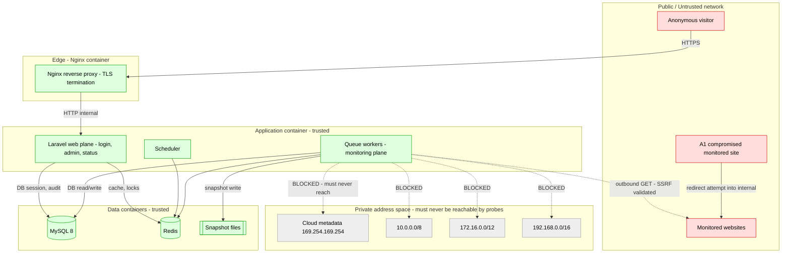
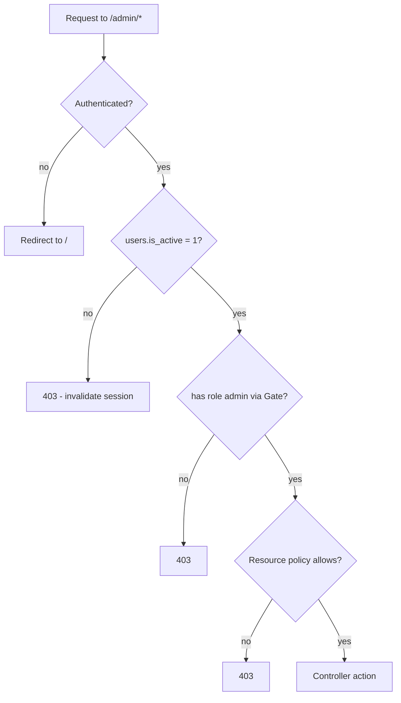
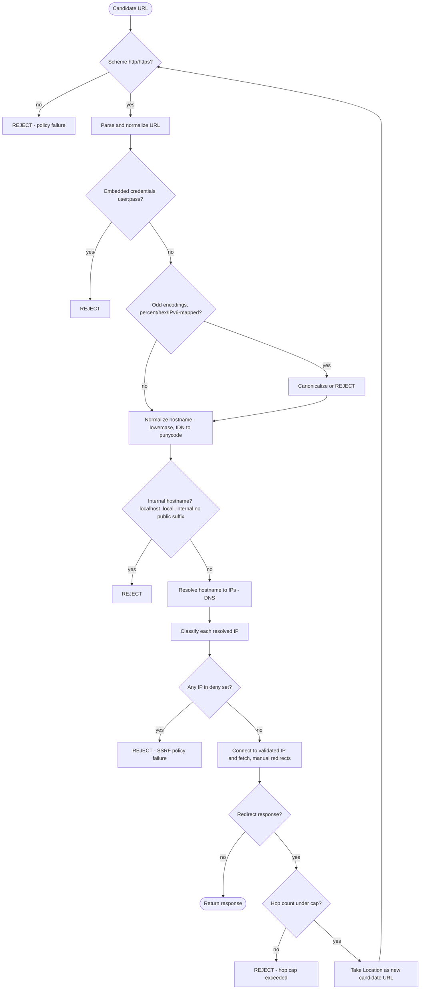

# SECURITY.md — SiteSentinel — Website Monitoring & Security Alerts

> **Specification only.** Nothing described in this document has been implemented.
> Every statement is future/conditional ("the system will…", "Phase 9 implements…").
> There is no application code and there are no migrations at the time of writing.

> **Authority.** [`PRD.md`](PRD.md) §15 states *what must be true*; this document is the detailed
> source of truth for **how** those requirements are met (`PRD.md` §15: *"where they conflict,
> `SECURITY.md` governs the *how*, `PRD.md` governs the *what must be true*"*). Table and column
> names used here are frozen in [`DATABASE.md`](DATABASE.md). Rationale is recorded in
> [`DECISIONS.md`](DECISIONS.md) (`ADR-014` SSRF, `ADR-018` authentication).

---

## 1. Purpose, Scope, Assumptions, and Threat Model

### 1.1 Purpose

This document specifies the security controls of **SiteSentinel** itself — the monitor — and the
controls that protect it from the *monitored* sites it fetches. It covers authentication,
authorization, secret management, the SSRF defence-in-depth pipeline, resource-abuse limits, rate
limiting, input validation, audit logging, cryptography, deployment hardening, and an explicit list of
non-goals.

### 1.2 What is in scope

| In scope | Description |
| --- | --- |
| The monitor's admin plane | `/` (login) and `/admin` (admin area). |
| The monitor's public plane | `/status` (status page), whose exposure is governed by its visibility mode. |
| The monitoring plane | Scheduler, queue workers, and the outbound HTTP client that fetches monitored URLs. |
| Data at rest | MySQL 8, Redis, snapshot files, notebooks at rest. |
| Data in transit | TLS for the monitor's own UI; TLS verification for outbound checks. |
| The fetch path | Every outbound request, **including every redirect hop**, against SSRF and resource abuse. |

### 1.3 What is out of scope

| Out of scope | Reason |
| --- | --- |
| Security of the *monitored* sites | The monitor observes them; it does not defend them. See §13. |
| The host OS, hypervisor, and physical security | Platform responsibility, except where hardening guidance applies (§11). |
| Third-party mail/Telegram providers | The monitor only sends to them; their security is theirs. |
| Denial-of-service against the monitor's own public endpoints | Mitigated at the platform/edge layer; application-level throttling is specified in §3.4. |

### 1.4 Security assumptions

1. The admin is trusted to supply URLs but **may be mistaken or malicious**; the URL is treated as
   untrusted input (this is why `FR-10` validates before any request).
2. The monitored site may **actively attack the monitor** — a compromised site can 302 the monitor
   into the internal network (`PRD.md` §15.4).
3. The that the monitor runs on is assumed **not** to have arbitrary additional protections beyond
   what this document specifies; application-layer controls are mandatory, not optional.
4. `APP_KEY` is secret; if it leaks, all encrypted casts are compromised, so it is treated as the
   root secret (§4).
5. All admin traffic is HTTPS in production (`NFR-11`).
6. At MVP there is exactly one role, `Admin` ([`DATABASE.md`](DATABASE.md) §3.1), and no API surface.

### 1.5 The adversaries (threat model)

| Adversary | Capability | Primary threat | Primary control |
| --- | --- | --- | --- |
| **A1 — Attacker who compromised a monitored site** | Controls the monitored site's responses, including redirects and content. | Pivot the monitor into the internal network (SSRF); exhaust the monitor (resource abuse); inject stored XSS into the dashboard. | §5 (SSRF), §6 (limits), §8 (escaping). |
| **A2 — Attacker who reaches the admin UI** | Can attempt login, guess credentials, ride a stolen session. | Account takeover; unauthorized monitoring changes; secret exfiltration. | §2 (authn), §3 (authz), §4 (secrets). |
| **A3 — Malicious or typo'd monitored URL** | An admin (or a compromised admin session) enters a dangerous URL. | SSRF into `localhost`/private ranges/metadata; internal port scanning via timing. | §5 (SSRF), §6 (limits), §8 (validation). |
| **A4 — Insider with partial access** | Legitimate but over-privileged or departing operator. | Reading secrets, changing monitoring config, deleting evidence. | §4 (secrets), §3 (authz), §9 (audit). |
| **A5 — Network attacker on the monitor's outbound path** | On-path between the monitor and targets. | Intercepting outbound checks; MITM. | §10 (TLS verification by default). |

### 1.6 Trust boundaries



**Boundary crossings:**

1. **Public → Edge** — the only externally exposed listener; terminated by Nginx (`ARCHITECTURE.md` §13).
2. **Edge → App** — internal network only; Nginx only talks to `app` (`ARCHITECTURE.md` §13).
3. **App → Managed network** — the probe's outbound boundary. **Every crossing must pass the SSRF
   pipeline of §5.** This is the most security-critical boundary in the product.
4. **App → Data** — internal containers; MySQL and Redis are never publicly exposed (§11).
5. **Anonymous → Status page** — authorized by visibility mode, never by session (`PRD.md` §15.2).

---

## 2. Authentication

### 2.1 Model

Authentication is **session-based**, admin-only, with **no public registration** (`ADR-018`,
`PRD.md` §15.1). Login is at `/` (`FR-01`). Admin accounts are provisioned out of band via an
installation/seed command (`FR-05`); there is no signup route.

### 2.2 Password hashing

Passwords are stored in `users.password` (`VARCHAR(255)`) as a one-way hash (`FR-03`,
[`DATABASE.md`](DATABASE.md) §3.1). The implementation will use Laravel's `Hash` facade with
**Argon2id** as the preferred driver (falling back to **bcrypt** where Argon2id is unavailable in the
PHP build), with the algorithm and cost recorded in the hash string so cost can be raised over time
without breaking existing logins. Plaintext passwords must never be stored, logged, or echoed.

### 2.3 Password policy

| Control | Requirement |
| --- | --- |
| Minimum length | `≥ 12` characters. |
| Composition | Not enforced by class rules (length dominates); a breached-password check is recommended. |
| Blocked values | Common passwords and the admin's own email/name are rejected. |
| Rotation | No forced periodic rotation (modern guidance); forced change on suspected compromise. |
| Hashing | Argon2id preferred; bcrypt acceptable; never MD5/SHA-1/plain. |

### 2.4 Login throttling and lockout

`FR-06` requires rate-limited login with a lockout window.

| Control | Value |
| --- | --- |
| Rate limit | Keyed on `email` + source IP. |
| Soft limit | Max **5** failed attempts per 15 minutes per key. |
| Lockout | After **10** failed attempts in 30 minutes, the identity is locked for **15** minutes. |
| Response | Throttled attempts return HTTP `429` and are recorded in `audit_logs`. |
| Enumeration resistance | The failure message is identical for unknown and known emails; timing is equalized. |
| Reset | Successful login clears the counter for that key. |

### 2.5 Session security

Sessions are stored server-side in the `sessions` table (`ADR-018`, [`DATABASE.md`](DATABASE.md)
§3.3). The columns used are `id`, `user_id`, `ip_address`, `user_agent`, `payload`, `last_activity`.

| Control | Requirement |
| --- | --- |
| Regeneration | Session ID regenerated on login and on any privilege change (`FR-01`). |
| Cookie flags | `Secure` (prod), `HttpOnly`, `SameSite=Lax` (Lax preserves the server-rendered navigation while blocking cross-site POSTs). |
| Idle timeout | **30 minutes** of inactivity invalidates the session. |
| Absolute timeout | **8 hours**, regardless of activity. |
| Invalidation on password change | All other sessions for the user are invalidated by deleting their `sessions` rows. |
| Logout | `FR-07` — deletes the session row and regenerates the CSRF token. |
| Fixation defence | Any pre-login session ID is discarded, never reused as the authenticated ID. |
| Transport | Admin traffic is HTTPS in production with secure cookies (`NFR-11`). |

### 2.6 CSRF protection

CSRF protection is enforced on **all state-mutating admin actions** (`NFR-14`, `PRD.md` §15.6). The
server-rendered Blade forms carry a per-session token validated on every non-idempotent request.
Native frameworks' automatic inclusion will be used. A minimal, explicit exemption exists only for the
status page's visibility-mode check if it is implemented as a `GET`, and never for state changes.

### 2.7 Remember-me policy

**Disabled at MVP.** A persistent remember-me cookie widens the session lifetime and would require a
separate token table that [`DATABASE.md`](DATABASE.md) does not define (and
`personal_access_tokens` is explicitly N/A). If later enabled, it must use a rotating selector +
verifier with database-backed revocation; this is **Future**.

### 2.8 Password reset

Password reset uses **signed, expiring tokens** stored in `password_reset_tokens`
([`DATABASE.md`](DATABASE.md) §3.2: `email`, `token`, `created_at`).

| Control | Requirement |
| --- | --- |
| Token storage | The `token` column stores a **hash** of the emailed token, never the raw token. |
| Expiry | Tokens expire after **30 minutes**. |
| Single use | A token is deleted on successful use. |
| Enumeration resistance | The "reset requested" response is identical whether or not the email exists. |
| Rate limit | Reset requests are throttled per email and per IP. |
| Transport | Reset link is delivered only over TLS and only to the registered address. |

> **Note.** [`DATABASE.md`](DATABASE.md) §3.2 says the `password_reset_tokens` table can be dropped
> if admins are provisioned out of band only. This document specifies the flow so that the table is
> used if the project ratifies password recovery; otherwise §2.4's lockout still stands and recovery
> is manual.

---

## 3. Authorization

### 3.1 MVP model: a single `Admin` role

At MVP there is exactly one role. `users.role` is `ENUM('admin')` with default `admin`
([`DATABASE.md`](DATABASE.md) §3.1). `users.is_active` (`TINYINT(1)`, default `1`) allows disabling
an account without deleting it; a disabled account must be rejected at login and have its sessions
invalidated.

### 3.2 Enforcement model (policies and gates)

Authorization is enforced with **Laravel gates and policies**, resolved through a single admin gate.



Binding rules:

1. **Every `/admin` route is behind authentication middleware AND the admin gate.** `PRD.md` §15.2
   and `AC-02` require rejection of unauthenticated requests on **every** route *regardless of HTTP
   method* — this is enforced at the route group, not at navigation rendering.
2. **`/status` is not session-authorized.** It is authorized by its visibility mode from
   `status_page_settings.visibility_mode` (`Private` | `Public` | `Password Protected`), never by
   admin session (`PRD.md` §14.4, §15.2, `ADR-013`).
3. **The status page never exposes security detail.** It may show availability only; security state
   and evidence are redacted (`PRD.md` §14.4, §22 rule 8).

### 3.3 Extensibility plan for future roles

The schema and policies leave room without a rewrite:

| Provision | Where it already exists | Why it extends |
| --- | --- | --- |
| `users.role` is an `ENUM` | [`DATABASE.md`](DATABASE.md) §3.1 | Adding a value (e.g. `'viewer'`) is a forward migration; existing rows stay valid. |
| `users.is_active` | [`DATABASE.md`](DATABASE.md) §3.1 | Per-account disablement already supported. |
| Policies scoped to models | This document §3.2 | A future role adds policy branches, not new middleware stacks. |
| `audit_logs.user_id` | [`DATABASE.md`](DATABASE.md) §3.19 | Attribution already records the actor for every future role. |
| No API tokens | [`DATABASE.md`](DATABASE.md) §1.1 | `personal_access_tokens` is N/A at MVP; if an API is ever added, it is additive. |

### 3.4 Route surface

| Route | Auth | Authorization |
| --- | --- | --- |
| `/` | none | login form only |
| `/admin/*` | session | authentication + admin gate + resource policy |
| `/status`, `/status.json` | none | `status_page_settings.visibility_mode` (`Private` \| `Public` \| `Password Protected`) |
| `/status/unlock` (POST) | none | status-page password, rate-limited (`throttle.status-unlock`) |
| `/status/logout` (POST) | none | clears the status-page unlock session keys only |

The canonical spec fixes these routes; no other top-level route may be introduced at MVP.

### 3.5 Status page authorization, unlock, and isolation (Phase 8)

The status page is **not session-authorized by the admin session**. Its access decision is made by
`App\Http\Middleware\EnsureStatusVisibility` + `App\Services\StatusPage\VisibilityGate`, applied
identically to HTML (`/status`) and JSON (`/status.json`):

- **`Private`** — only an authenticated admin sees the projection; anyone else gets a bare `404`
  (existence not advertised). `/status.json` likewise returns `404` to non-admins.
- **`Public`** — anonymous access to the redacted projection only.
- **`Password Protected`** — no data is rendered before a correct password. Locked HTML returns the
  password form; locked JSON returns `403 {"message":"Locked."}`. If the mode is password-protected
  but **no `password_hash` is set**, the gate fails closed with `404` (never renders data).

**Unlock throttle (implemented).** `ThrottleStatusUnlock` allows **5 attempts per 10 minutes**, keyed
`status-unlock:{ip}:{sessionId}` (per source IP **and** per session). Over the limit → `429` with a
`Retry-After` header. A successful unlock clears the key (`RateLimiter::clear`).

**Unlock session-flag shape (implemented).** A successful `Hash::check` writes three session keys —
`status_page.unlocked_at` (ISO-8601 UTC), `status_page.settings_updated_at`
(`v1:{status_page_settings.updated_at}`), and `status_page.version` (= `1`). `VisibilityGate` requires
the presence of `unlocked_at` **and** a `hash_equals` match of the stamp; because the stamp derives
from `updated_at`, rotating the password (or any settings change) immediately revokes all existing
unlocks. `/status/logout` forgets all three keys and **never** logs out the admin session.

**Cache isolation (implemented).** Only the redacted `PublicStatusDTO` is cached
(`status:projection:v1:{sha1(mode)}:{updated_at}`); no raw `websites`/`incidents` row is ever stored,
so a cache read cannot surface an unprojected field. The cache key contains no row identifier.

**`noindex` (implemented).** Every status response sets `X-Robots-Tag: noindex, nofollow`; the views
also emit `<meta name="robots" content="noindex, nofollow">`, and `public/robots.txt` disallows
`/status` and `/admin`. Cache-control is `public, max-age=60` in `Public` mode and
`no-store, private` otherwise.

---

## 4. Secret Management

### 4.1 Classes of secret and where each lives

| Secret | Storage | Mechanism |
| --- | --- | --- |
| `APP_KEY` | Environment / Docker secret | Bootstrap value; never in DB; never logged. |
| DB credentials | Environment / Docker secret | Bootstrap value. |
| Redis auth | Environment / Docker secret | Bootstrap value. |
| SMTP credentials | `notification_channels.secret_ref` | **Encrypted cast** (Laravel `encrypted` cast). |
| Telegram bot token | `notification_channels.secret_ref` | **Encrypted cast**. |
| Channel non-secret config | `notification_channels.config` (JSON) | Stored plaintext — e.g. sender address, chat id (not secret). |
| Status page password | `status_page_settings.password_hash` | **One-way hash** — never reversible, never encrypted. |
| `settings` sensitive values | `settings.value` with `settings.is_encrypted = 1` | **Encrypted cast**, flagged by the column. |

`notification_channels` explicitly separates `config` (non-secret) from `secret_ref` (encrypted) in
[`DATABASE.md`](DATABASE.md) §3.13; this document mandates that the split is honoured strictly.

### 4.2 Binding rules

1. **No plaintext secrets in the database.** Every third-party secret is either encrypted
   (`secret_ref`, `settings.is_encrypted = 1`) or hashed (`password_hash`). No exceptions.
2. **No plaintext secrets in logs.** Log contexts must redact keys matching a denylist
   (`password`, `token`, `secret`, `authorization`, `cookie`, `x-api-key`, `bot_token`, `smtp`).
   Request/response logging for the probe strips `Authorization`, `Cookie`, and any header the
   operator marked sensitive.
3. **No secrets in notifications.** Notification payloads are built from incident metadata only;
   channel secrets are never interpolated into message bodies (`FR-73`).
4. **No secrets in the UI.** Secret fields render masked; an edit requires re-entry; the current
   value is never sent to the browser.
5. **Redaction in exception reporting.** The exception handler must scrub the denylist before
   persisting or displaying a stack trace, because a Telegram token can appear inside an HTTP client
   exception message.
6. **Bootstrap values from environment only** (`NFR-13`). No secret is committed to the repository;
   a real `.env` is never committed and a `.env.example` contains placeholders only.
7. **Rotation.** `APP_KEY` rotation requires re-encryption of all encrypted casts (Laravel provides a
   key-rotation path); channel secrets and the status-page password can be rotated independently.
   `APP_KEY` rotation is treated as a planned maintenance operation, never a silent change.

**Which `settings` keys are encrypted.** [`DATABASE.md`](DATABASE.md) §3.17 defines the `settings`
table with an `is_encrypted` flag. At MVP, `settings` holds **no credential keys** — only operational
values (`scoring.threshold_*`, `retention.*`, global ignore lists), which must remain plaintext so
they can be queried and displayed. Any future `settings` row whose value is a credential (e.g. an
SMTP fallback) MUST set `is_encrypted = 1`.

---

## 5. SSRF — Authoritative Treatment

SSRF is **the defining security risk of this product**: SiteSentinel is, by design, a machine that
fetches URLs supplied by a user (`PRD.md` §15.4). This section is the implementation-level authority
referred to by [`PRD.md`](PRD.md) §15.4 and [`DECISIONS.md`](DECISIONS.md) `ADR-014`.

### 5.1 The threat

Two distinct attacks:

1. **Malicious or mistaken registration** (`A3`). An admin (or a compromised admin session) registers
   `http://127.0.0.1:6379/` or `http://169.254.169.254/latest/meta-data/`. The monitor then fetches
   internal services or cloud credentials and may surface them in a snapshot.
2. **Redirect pivot** (`A1`). A **compromised monitored site** returns `302 Location:
   http://169.254.169.254/latest/meta-data/` or `http://10.0.0.5/admin`. A monitor that validates only
   the *initial* URL follows the redirect straight into the internal network. **This is the attack
   most implementations get wrong.**

Plain SSRF also enables internal **port scanning** via differential timing and error messages, even
when the response body is never shown.

### 5.2 Defense-in-depth pipeline (step by step)

Every outbound request passes the following pipeline, **and the pipeline runs again for every
redirect hop**.



### 5.3 Scheme allowlist

Only `http` and `https` are permitted. Rejected schemes include, at minimum, `file`, `gopher`, `ftp`,
`ftps`, `data`, `dict`, `ldap`, `sftp`, `telnet`, `tftp`, and any scheme with no explicit allow
entry. The allowlist — not a denylist — is the pattern: an unrecognized scheme is rejected by default
(`PRD.md` §15.4).

### 5.4 URL parsing and normalization

| Step | Rule |
| --- | --- |
| Parse | Use a strict URL parser; reject malformed strings and anything the parser cannot canonicalize. |
| Embedded credentials | Reject any URL containing a userinfo component (`user:pass@host`); SiteSentinel sends no target credentials (`FR-20`, `PRD.md` §15.4 "No credential forwarding"). |
| Percent encoding | Decode and re-canonicalize; reject double-encoded hosts (`%256cocalhost`) and encoded separators that would change the host. |
| Hex/decimal IP forms | Reject or canonicalize non-canonical numeric hosts (`0x7f000001`, `2130706433`, `0177.0.0.1`) **before** classification, and canonicalize them so the deny rules see the real address. |
| IPv6 forms | Canonicalize compressed and expanded forms; explicitly handle **IPv4-mapped IPv6** (`::ffff:127.0.0.1`, `::ffff:10.0.0.1`) by extracting and classifying the embedded IPv4. |
| Trailing dots | Strip a trailing root dot (`localhost.`) before internal-name checks. |
| Case | Lowercase the host; IDN hosts are converted to **punycode** so the deny rules operate on the ASCII form. |
| Port | Parse and validate the port; a non-default port is not itself a rejection, but it is part of the candidate and is recorded. |

### 5.5 Hostname resolution and IP classification

Every resolved address is classified against the deny set. If **any** resolved address is denied, the
request is rejected — this prevents DNS answers that mix a public and a private address.

**Blocked ranges and names:**

| Category | Range / name |
| --- | --- |
| Loopback | `127.0.0.0/8`, `::1` |
| Private (RFC 1918) | `10.0.0.0/8`, `172.16.0.0/12`, `192.168.0.0/16` |
| Link-local | `169.254.0.0/16`, `fe80::/10` |
| Unique-local IPv6 | `fc00::/7` |
| Unspecified | `::/128`, `0.0.0.0/8` |
| IPv4-mapped IPv6 | `::ffff:0:0/96` (classify the embedded IPv4) |
| Multicast | `224.0.0.0/4`, `ff00::/8` |
| Reserved / documentation / benchmarking | `192.0.2.0/24`, `198.51.100.0/24`, `203.0.113.0/24`, `198.18.0.0/15`, `240.0.0.0/4` |
| Cloud metadata | `169.254.169.254`, `metadata.google.internal`, `metadata` (Azure), `fd00:ec2::254` |
| Internal hostnames | `localhost`, `*.localhost`, `*.local`, `*.internal` |
| Bare hostnames | Any host with **no public suffix** (e.g. `intranet`, `wiki`) — rejected, because it can only resolve via internal search domains. |

### 5.6 DNS resolution before every request — and re-validation on every hop

This is the crux, and [`PRD.md`](PRD.md) §15.4 states it as a hard requirement:

> *"DNS MUST be resolved immediately before each connection and the result validated against the deny
> rules. Caching a previously-validated resolution across a redirect is prohibited."*

**Validating only the initial URL is insufficient.** The concrete failure mode:

```text
1. Monitor validates  https://example.com          -> resolves to 203.0.113.10 (public)  OK
2. Monitor connects and receives:  302 Location: http://169.254.169.254/latest/meta-data/
3. A naive client follows the redirect WITHOUT re-validating -> SSRF succeeds.
```

Therefore:

| Rule | Statement |
| --- | --- |
| **Automatic redirects disabled** | The HTTP client is configured with automatic redirect following **off**. Redirects are handled manually so each hop is validated. |
| **Resolve per hop** | Before connecting to each hop's target, resolve the hostname and classify every resulting IP against §5.5. |
| **No cross-hop caching** | A resolution validated for hop *N* must never be reused for hop *N+1*, even if the hostname is identical. The attacker can change DNS between hops. |
| **Validate the target, not the string** | Validation classifies resolved IPs, not just hostnames, so a hostname that resolves into private space is caught. |
| **Cap** | Redirect chains are capped (default **5** hops, `FR-23`); exceeding the cap fails the check. |
| **Block private-space landings** | A redirect whose target resolves into the deny set is rejected (`RULE-RED-006` in [`DETECTION-RULES.md`](DETECTION-RULES.md) §8.3). |
| **Policy failure, not outage** | A blocked hop is recorded as a policy/configuration error (`error_type = "ssrf_blocked"`), never as a website outage (`PRD.md` §10.7). |

### 5.7 DNS rebinding and the TOCTOU window

Even with per-hop validation, a **time-of-check-to-time-of-use (TOCTOU)** window exists: the
hostname can resolve to a public IP during validation and to a private IP milliseconds later when
the socket actually connects (`ADR-014` describes this as the DNS-rebinding window).

**Mitigations, in order of strength:**

| Mitigation | Description | Feasibility |
| --- | --- | --- |
| **Connect to the validated IP** | After validating an IP, connect to that literal IP (host header preserved) so the socket cannot land elsewhere. | Preferred. Implementable in PHP. |
| **Pin the resolution for the hop** | Use an HTTP client hook that maps the hostname to the already-validated IP for the duration of that hop only; re-validate per hop. | Preferred. |
| **Re-resolve and re-validate immediately before connect** | Minimize the window by resolving as late as possible and validating the exact answer used. | Mandatory in addition to the above. |
| **Pin the resolver** | Configure a resolver and, where possible, disable OS-level fallback during the check. | Recommended. |
| **Egress firewall** | Network-level egress rules that deny private/metadata ranges from the worker network. | Defence in depth (§5.11); not a substitute. |

### 5.8 Residual risk — what pure PHP cannot fully solve

SiteSentinel is built on Laravel's HTTP client (Guzzle/curl). Under pure PHP:

- A hostname resolved during validation may be re-resolved by the socket layer at connect time. The
  "connect to the validated IP" mitigation closes most of this, but **a fully atomic
  resolve-validate-connect is not guaranteed** by PHP's socket APIs.
- TLS certificate hostname verification must still be performed against the **original hostname**,
  even when connecting to a pinned IP; the HTTP client must be configured to send SNI and verify the
  certificate for the hostname, not the IP.
- `CURLOPT_RESOLVE`-style pinning works for curl but its behaviour must be tested per PHP build.

**Therefore, the residual risk is:** a determined attacker who wins the TOCTOU race inside a single
hop against a client that does not support IP pinning could still reach an internal address. The
recommended mitigation is the **combination** of IP pinning where supported **and** an egress
firewall (§5.11), accepting that the application layer alone is not a complete guarantee. This
limitation is stated explicitly rather than hidden.

### 5.9 Hop cap and redirect policy

| Control | Value | Reference |
| --- | --- | --- |
| Max redirect hops | **5** | `FR-23`, [`DETECTION-RULES.md`](DETECTION-RULES.md) `RULE-RED-004` |
| Behaviour on cap | Fail the check, record `error_type = "redirect_cap_exceeded"`, emit `RULE-RED-004` | `PRD.md` §10.7 |
| Redirect following | Configurable per website: follow (default) or treat final (`FR-22`) | [`DATABASE.md`](DATABASE.md) `websites.monitor_redirects` |
| Chain record | Every hop recorded in `checks.redirect_chain` with status, from-URL, to-URL | [`DATABASE.md`](DATABASE.md) §3.6 |

### 5.10 What the pipeline must always reject (summary)

Reject if any of the following is true for the candidate URL or **any** redirect hop:

1. Scheme is not `http`/`https`.
2. URL contains userinfo/credentials.
3. Host cannot be canonicalized, or contains encoded/double-encoded separators.
4. Host is an internal name (`localhost`, `.local`, `.internal`, or has no public suffix).
5. Any resolved IP falls in a blocked range or is a metadata endpoint (§5.5).
6. The hop count exceeds the cap.
7. The port is on a blocked list (recommended: reject well-known internal-only ports such as `6379`
   Redis, `3306` MySQL, `22` SSH, `25` SMTP unless explicitly allowlisted per website).

### 5.11 Optional egress firewall — defence in depth

Recommended deployment control: run worker containers on a network whose egress is filtered to deny
RFC 1918, loopback, link-local, unique-local, and metadata ranges, allowing only public internet
egress. `ADR-014` explicitly frames this as **defence in depth, not a substitute** for the
application-layer pipeline. It is the mitigation that covers the residual TOCTOU risk of §5.8.

---

## 6. Request & Response Limits (Resource Abuse)

`PRD.md` §15.5 requires that a monitored website (or a hostile registrant) cannot use SiteSentinel as
a resource-exhaustion weapon. Safe defaults:

| Limit | Default | Where enforced | Justification |
| --- | --- | --- | --- |
| Max redirects | `5` | HTTP client (manual loop) | `FR-23`. Five covers normal canonicalization chains while bounding per-check work. |
| Connect timeout | `5 s` | HTTP client | Fail fast on unreachable hosts so a hung TCP connect cannot occupy a worker. |
| Total request timeout | `15 s` | HTTP client | Bounds total wall-clock per request, above the connect timeout to allow a slow but alive origin. |
| Per-check wall-clock budget | `30 s` | Job wrapper | The whole check (DNS + redirects + fetch + parse) must finish within the job timeout. |
| Max response body size | `2 MB` | Streaming abort | `FR-38`. Enough for any real HTML homepage; a homepage larger than 2 MB is anomalous. |
| Max decompressed size | `10 MB` | Streaming abort | Compressed-bomb protection: cap both the **total** decompressed bytes and the **decompression ratio** (e.g. `100:1`). |
| Max header count | `100` | HTTP client | Bounds header parsing cost; excessive headers are anomalous. |
| Max header size | `64 KB` total | HTTP client | Prevents a single oversized header from exhausting memory. |
| Max HTML parsed size | `2 MB` | Parser | The parser never sees more than the body cap; keeps parse cost bounded. |
| Allowed content types | `text/html` for the main fetch | HTTP client | Content rules are defined over HTML; other types are recorded but not parsed as HTML. |
| DNS timeout | `3 s` | Resolver | A slow resolver must not consume the check budget; DNS failure is a recorded failure (`RULE-AV-004`). |
| Max redirect chain bytes | `256 KB` | HTTP client | Guards against redirect bodies (some servers send large ones). |
| Per-run concurrency cap | `10` outbound requests | Queue/worker | Bounds outbound fan-out so one run cannot swamp targets or the local network (`ARCHITECTURE.md` §12). |

**Streaming and abort-on-exceed.** The body is read as a **stream** and aborted the moment
`response_size_bytes` would exceed the cap. The check records `error_type = "body_too_large"` and a
truncated read (`PRD.md` §10.7). Nothing is buffered beyond the cap.

**Compressed-bomb protection.** When `Content-Encoding` indicates compression, the client counts
**decompressed** bytes and aborts on either the total cap (`10 MB`) or a suspicious ratio
(`> 100:1`), because a small compressed payload can expand enormously.

**Slow-loris protection.** A server that trickles bytes forever is stopped by the total request
timeout and the per-check budget. Because header and body reads are both deadline-bound, a slow
drip cannot hold a worker indefinitely. `ARCHITECTURE.md` §12 additionally requires the per-job
timeout to be shorter than the queue visibility window, so a stuck job cannot block a worker forever.

**Relationship to `timeout_seconds`.** [`PRD.md`](PRD.md) §10.1 fixes the probe budget at
`websites.timeout_seconds` (default `10`, per `FR-18`). The resource-limits table's total request
timeout is derived from it: `total = timeout_seconds + 5 s` fixed connect allowance (default 15 s).
The connect timeout is a fixed 5 s. This keeps the operator's expectation (`timeout_seconds`) and the
engine's wall-clock behaviour in a fixed, documented relationship.

---

## 7. Rate Limiting & Concurrency

### 7.1 Queue concurrency

| Queue | Purpose | Concurrency |
| --- | --- | --- |
| `monitoring` | Website checks | Capped (default `10`) to limit outbound fan-out (`ARCHITECTURE.md` §12). |
| `notifications` | Email/Telegram dispatch | Small, separate pool so notification latency is isolated from checks. |
| `maintenance` | Retention pruning, baselines | Single/low concurrency. |
| `default` | Miscellaneous | Bounded. |

### 7.2 Per-website serialization

A website must **never be checked by two workers at once**. This is enforced by:

1. **Redis lock** keyed per `website_id` (`ARCHITECTURE.md` §5), and
2. **Durable fallback columns** `websites.locked_at` and `websites.last_lock_token`
   ([`DATABASE.md`](DATABASE.md) §3.4), consulted via `idx_websites_locked_at`.

The durable lock also enables cross-replica coordination. Locks **auto-expire** so a crashed worker
cannot starve a website permanently; the due-selector treats `locked_at < stale_threshold` as
unlocked. Transient overlap is tolerated by the idempotent upsert on `checks.check_key`
(`ARCHITECTURE.md` §5.1).

### 7.3 Global outbound budget

A bounded global budget prevents the aggregate of many websites from flooding targets or the local
network. It is expressed as a maximum concurrent outbound request count across all monitoring workers
(§6) and, optionally, a token-bucket ceiling on requests per second per target host.

### 7.4 Per-host outbound rate limiting

`ARCHITECTURE.md` §12 specifies per-host outbound rate limiting in the probe layer, which also
prevents the monitor from being a de-facto DoS tool against a single target. Values are an open
question in [`DECISIONS.md`](DECISIONS.md) Open Questions #7 (per-host rate limit numbers not yet
agreed); this document requires the mechanism and leaves the exact number to be ratified.

The mechanism is fixed (per-host token bucket applied in the probe layer before each connection); the
numeric value remains an open question in [`DECISIONS.md`](DECISIONS.md) Open Questions #7 and is not
invented here.

### 7.5 Fairness across many websites

The scheduler enqueues one job per due website (`ARCHITECTURE.md` §5). To prevent one large tenant or
a burst of due sites from starving others, the `monitoring` queue is processed with a bounded
concurrency that is smaller than the number of due sites, so work is interleaved by the queue rather
than processed in one vast wave.

### 7.6 Backpressure when many sites are due simultaneously

| Mechanism | Effect |
| --- | --- |
| Bounded `monitoring` concurrency | The queue length absorbs the burst; workers drain it at a safe rate. |
| Per-host rate limit | A shared host is not hammered even if many of its websites are due. |
| `next_check_at` distribution | The due selector reads `idx_websites_is_active_next_check_at`; staggering intervals avoids synchronized bursts. |
| Job timeout < visibility window | A slow check cannot permanently occupy a worker (`ARCHITECTURE.md` §12). |
| Failed-job isolation | Terminal failures land in `failed_jobs` without blocking the queue. |

### 7.7 Login throttling

Web-plane rate limiting is specified in §2.4 (login) and §2.8 (password reset).

---

## 8. Input Validation & Output Encoding

### 8.1 Validating inputs

| Input | Validation |
| --- | --- |
| `websites.url` | Scheme allowlist (§5.3), full SSRF pipeline (§5), absolute URL required (`FR-09`), max length within `VARCHAR(2048)`, normalized before storage (`websites.scheme`, `websites.host`). |
| `websites.name` | Length bound within `VARCHAR(255)`; escaped on output; no HTML accepted as structure. |
| Notification channel config | Structure validated per channel type; `config` (non-secret) and `secret_ref` (encrypted) validated separately; `type` constrained to the enabled set. |
| Status page password | Hashed into `status_page_settings.password_hash`; policy aligned with §2.3; never stored plaintext. |
| `status_page_settings.slug` | Constrained charset, uniqueness via `uq_status_page_settings_slug`, no path traversal. |
| `visibility_mode` | Constrained to the `ENUM('Private','Public','Password Protected')`. |
| `expected_status`, `timeout_seconds`, `check_interval_seconds` | Range-checked against the canonical bounds (`FR-17`–`FR-19`) to protect the resource budget. |
| `ignored_keywords`, weight/threshold overrides | Bounded size, validated types, per-website scoping. |

### 8.2 Escaping untrusted monitored content

Monitored sites are **attacker-controlled** (`A1`). Their content is untrusted data and must be
handled as such.

1. **Captured HTML must NEVER be rendered as HTML in the dashboard.** The snapshot HTML is stored as
   an **artifact** (filesystem path in `snapshots.html_path`) and is offered for **escaped text
   display or download only**. Rendering attacker HTML in the admin's authenticated origin would be a
   stored-XSS vulnerability with session takeover.
2. **All extracted values are escaped on output.** Titles, keywords, domains, error messages, and
   redirect URLs are HTML-escaped by the Blade engine (`{{ }}`), never with raw output (`{!! !!}`).
   This is `NFR-15` and `PRD.md` §15.6.
3. **Stored-XSS prevention.** Any value derived from a monitored response is treated as untrusted on
   every render, including inside admin tables, incident detail, and the status page.
4. **Status page redaction.** The status page shows availability only and never security detail or
   evidence (`PRD.md` §14.4, §22 rule 8); evidence cannot leak to the public plane.

### 8.3 Content-type sniffing protection

Responses served by the monitor set `X-Content-Type-Options: nosniff` (§10) so a downloaded snapshot
or an error page cannot be sniffed into an executable type. Snapshot downloads are served with an
explicit non-executable content type and `Content-Disposition: attachment`.

### 8.4 Redirect target safety in the config UI

When the dashboard displays a redirect target from `checks.redirect_chain`, the target is rendered as
**escaped text**, never as a clickable link that could carry `javascript:` or `data:` schemes. If a
link is offered, the scheme is re-validated to `http`/`https` first.

---

## 9. Audit Logging & Observability of Security Events

### 9.1 What is logged

Security-relevant events are written to `audit_logs` (columns: `user_id`, `event`, `subject_type`,
`subject_id`, `ip_address`, `user_agent`, `metadata`, `created_at`;
[`DATABASE.md`](DATABASE.md) §3.19):

| Event string | When |
| --- | --- |
| `auth.login.success` | Successful login. |
| `auth.login.failure` | Failed login (including throttled attempts). |
| `auth.login.throttled` | A request rejected by the lockout. |
| `auth.logout` | Explicit logout. |
| `auth.password.reset.requested` | Reset email dispatched. |
| `auth.password.reset.completed` | Password changed via reset. |
| `incident.created` | A new incident is opened. |
| `incident.escalated` | An open incident's severity is raised. |
| `incident.acknowledged` | Admin acknowledges (`FR-58`). |
| `incident.resolved` | Resolution, with `metadata.resolution_mode` = `manual` or `auto` (`FR-57`, `FR-59`). |
| `rule.changed` | A `detection_rules` or `website_rule_settings` change. |
| `settings.changed` | A sensitive `settings` change (thresholds, retention). |
| `channel.secret.updated` | A notification channel's `secret_ref` is updated. |
| `channel.tested` | A channel test send. |
| `status_page.visibility.changed` | `status_page_settings.visibility_mode` changed (metadata `{from, to}`). |
| `status_page.unlock.failed` | A status-page password attempt failed (metadata `reason` = `bad_password` \| `no_password_configured`). |
| `retention.pruned` | A pruning job ran, with counts in `metadata`. |
| `ssrf.blocked` | A probe hop was blocked by the SSRF policy (§5.6). |

### 9.2 Where events go, and the separation rule

| Log class | Destination | Retention |
| --- | --- | --- |
| Security/audit events | `audit_logs` (MySQL) | Retained; revisit ([`DATABASE.md`](DATABASE.md) §4). |
| Application/operational logs | Deployment-managed log files | Deployment rotation (`PRD.md` §16.1: application logs are not a product-managed data class). |
| Monitoring telemetry | `checks`, `check_extractions` | 30d default, 30/60/90 configurable. |
| Notification delivery | `notification_logs` | 90d. |

**Binding rule:** **monitoring data logs are distinct from application logs.** The high-volume
`checks`/`check_extractions` telemetry must never be written into the application log stream, and
audit events must never be mixed into monitoring telemetry. This keeps retention behaviour
predictable and keeps security evidence out of deployment-rotated log files that may be deleted.

### 9.3 Log content rules

- Secrets are redacted (§4.2, rule 2).
- `audit_logs.metadata` holds structured context but **never** a secret or a captured credential.
- `ip_address` and `user_agent` are recorded for admin actions; these are personal data and must be
  covered by the deployment's privacy posture.
- Audit records are append-only; the application provides no update/delete path for `audit_logs`.

---

## 10. Cryptography & Transport

### 10.1 The monitor's own TLS (Nginx)

| Control | Requirement |
| --- | --- |
| Protocol | **TLS 1.2 minimum**; TLS 1.3 preferred; SSLv2/SSLv3/TLS 1.0/1.1 disabled. |
| Cipher suites | Modern AEAD suites only; no RC4, 3DES, or export ciphers; forward secrecy preferred. |
| HSTS | `Strict-Transport-Security: max-age=31536000; includeSubDomains` (add `preload` only when the operator is ready). |
| Certificate | Valid, publicly trusted certificate for the admin host. |
| Redirect | HTTP requests are redirected to HTTPS (`NFR-11`). |
| Secure headers | See §10.2. |

### 10.2 Secure response headers

| Header | Value / guidance |
| --- | --- |
| `Strict-Transport-Security` | `max-age=31536000; includeSubDomains` |
| `Content-Security-Policy` | Restrictive policy for the server-rendered UI; no `unsafe-eval`; scripts limited to the app's own origin and hashes. |
| `X-Frame-Options` | `DENY` (the admin UI must not be framed). |
| `X-Content-Type-Options` | `nosniff` |
| `Referrer-Policy` | `strict-origin-when-cross-origin` |
| `Permissions-Policy` | Deny unused browser features (camera, microphone, geolocation). |
| `Cache-Control` | Admin pages `no-store` so incident detail is not cached in shared caches. |

### 10.3 Outbound TLS verification

Outbound checks verify the target's TLS certificate **by default**. A per-website **explicit opt-out**
exists for self-signed staging sites; when used it must be:

1. **Recorded** — the website is flagged in the admin UI as "TLS verification disabled".
2. **Warned about** — the operator sees a persistent warning, and the exception is visible in audit.
3. **Scoped** — the opt-out applies only to that website, never globally.
4. **Never silent** — it may not be toggled by an automated process or a default.

This satisfies `RULE-SSL-001`'s false-positive consideration in
[`DETECTION-RULES.md`](DETECTION-RULES.md) §8.2 while keeping the default secure.

### 10.4 No weak cryptography

- No MD5/SHA-1 for integrity; content fingerprinting uses SHA-256 (`ADR-019`).
- No custom crypto; use Laravel's `Crypt`/`Hash` and PHP's vetted primitives.
- No plaintext secret storage anywhere (§4).

---

## 11. Deployment Hardening

| Control | Requirement |
| --- | --- |
| Containers | Run as **non-root**; drop unnecessary Linux capabilities. |
| Filesystem | **Read-only** root filesystem where practical; writable mounts only for snapshots, logs, and data volumes. |
| DB user | **Least-privilege** MySQL account: DML on the app schema only, no `SUPER`, no cross-schema access. |
| Redis | **Auth enabled**; never publicly exposed; bound to the internal container network only. |
| MySQL | **Not publicly exposed**; internal network only; strong credentials from environment. |
| `APP_DEBUG` | **`false`** in production, always. Debug mode must never render stack traces or config to a browser. |
| `APP_ENV` | `production` in production. |
| Secrets | From environment/Docker secrets, never committed (§4). |
| Dependency scanning | Composer and container image dependencies are scanned on a schedule and on lockfile change; critical advisories block release. |
| Secret rotation | `APP_KEY`, DB, Redis, SMTP, and Telegram secrets have a documented rotation path (§4.2, rule 7). |
| Network exposure | Only Nginx is exposed to the host (`ARCHITECTURE.md` §13). Scheduler and workers stay off the public plane. |
| Logs | Application logs rotate at the deployment layer; audit and telemetry tables have product-managed retention. |
| Backups | MySQL and snapshot volumes are backed up together and restore-tested; backups are encrypted at rest. |
| Updates | Base images and PHP/Laravel patch releases are applied on a defined cadence. |

---

## 12. Security Checklist (Pre-Release)

Checkable list tied to the acceptance criteria (`PRD.md` §19). `Phase 9` marks hardening-phase
items; earlier phases must still satisfy their own rows.

### Authentication & session
- [ ] `/` is the only login route; no public signup exists (`AC-01`). — Phase 3
- [ ] Passwords are Argon2id/bcrypt hashed in `users.password` (`FR-03`). — Phase 3
- [ ] Login is throttled with lockout (§2.4) and attempts are audited. — Phase 3
- [ ] Sessions regenerate on login; cookies are `Secure`/`HttpOnly`/`SameSite` (§2.5). — Phase 3
- [x] Idle (30 min) and absolute (8 h) timeouts are enforced (`EnforceSessionTimeouts`). — Phase 9
- [ ] Password change invalidates other sessions. — Phase 3
- [ ] CSRF is enforced on every state-mutating admin action (`NFR-14`). — Phase 3
- [ ] Password reset tokens are hashed, expiring, single-use (§2.8). — Phase 3

### Authorization
- [ ] Every `/admin` route is behind auth + admin gate for all HTTP methods (`AC-02`). — Phase 3
- [x] Disabled accounts (`users.is_active = 0`) cannot log in and have sessions invalidated. — Phase 9
- [ ] `/status` is authorized only by visibility mode (`ADR-013`). — Phase 6
- [ ] `/status` never exposes security detail (`PRD.md` §14.4). — Phase 6

### Secrets
- [ ] No plaintext secrets in DB, logs, or notifications (§4.2). — Phase 9
- [ ] `notification_channels.secret_ref` uses encrypted casts; `config` holds non-secrets only. — Phase 5
- [ ] `status_page_settings.password_hash` is hashed, never encrypted-reversible. — Phase 8 (implemented)
- [~] Exception reporting redacts the denylist. — Phase 9 (delivery-log scrub implemented; global handler scrub DEFERRED — §12.1 L11)
- [ ] `.env` is never committed; placeholders only in `.env.example`. — Phase 1

### SSRF
- [ ] Scheme allowlist rejects non-`http(s)` (§5.3). — Phase 4
- [ ] Embedded credentials and odd encodings are rejected/canonicalized (§5.4). — Phase 4
- [ ] All blocked IP ranges and metadata endpoints are denied (§5.5). — Phase 4
- [ ] Automatic redirects are disabled; hops are manual (§5.6). — Phase 4
- [ ] DNS is re-resolved and re-validated on **every** hop (§5.6, `AC-03`). — Phase 4
- [ ] Hop cap is enforced (`FR-23`). — Phase 4
- [ ] A private-space redirect landing fires `RULE-RED-006` and is recorded as a policy failure. — Phase 4
- [x] DNS-rebinding mitigations (validated-IP connect/pinning) are attempted (§5.7). — Phase 4
- [x] Residual risk is documented and an egress firewall is recommended (§5.8, §5.11). — Phase 9

### Resource limits
- [ ] Body size cap with streaming abort is enforced (`FR-38`). — Phase 4
- [~] Decompression-bomb caps are enforced (§6). — Phase 9 (body size cap enforced; decompression-ratio cap DEFERRED — §12.1 L5)
- [ ] Connect/total timeouts and per-check budget are enforced (§6). — Phase 4
- [ ] Max header count/size, DNS timeout, and content-type allowlist are enforced. — Phase 4
- [ ] Slow-loris responses are cut off by deadline-bound reads. — Phase 4

### Rate limiting & concurrency
- [ ] Per-website serialization uses the Redis lock + `websites.locked_at`/`websites.last_lock_token` (§7.2). — Phase 4
- [ ] `monitoring` concurrency is capped (§7.1). — Phase 4
- [ ] Per-host outbound rate limiting mechanism is present (§7.4). — Phase 4
- [x] Backpressure handles a mass of due sites (§7.6). — Phase 9

### Input/output
- [ ] `websites.url` is validated before any request (`FR-10`, `AC-03`). — Phase 3
- [ ] Captured HTML is **never** rendered as HTML; snapshots are escaped text/download (§8.2). — Phase 5
- [ ] All monitored-derived values are escaped on output (`NFR-15`). — Phase 5
- [~] `X-Content-Type-Options: nosniff` set by Nginx; `Content-Disposition: attachment` on snapshot downloads DEFERRED (no download route at MVP). — Phase 9

### Audit & transport
- [ ] `audit_logs` records auth, incidents, rule/settings changes, secret updates, pruning (§9.1). — Phase 9
- [ ] Monitoring telemetry is kept out of the application log stream (§9.2). — Phase 9
- [ ] TLS 1.2+, HSTS, and the secure header set are configured (§10.1–§10.2). — Phase 9
- [ ] Outbound TLS verification is on by default; opt-out is recorded and warned (§10.3). — Phase 4

### Deployment
- [~] Containers are non-root; root FS read-only where practical (§11). — Phase 9 (DEFERRED — §12.1 L21)
- [~] DB user is least-privilege; MySQL and Redis are not publicly exposed (§11). — Phase 9 (not-exposed VERIFIED; least-privilege + Redis auth NOT VERIFIED — §12.1 L19/L20)
- [~] `APP_DEBUG=false` in production (§11). — Phase 9 (guidance + compose default; runtime NOT VERIFIED — §12.1 L18)
- [x] Dependency scanning and a secret-rotation path exist (§11). — Phase 9 (rotation path documented §4.2 rule 7; scheduled dependency scanning remains a deployment/CI responsibility — see §12.1)

---

## 12.1 Phase 9 Security Audit — Findings, Limitations & Dispositions

This section is the **Phase 9 audit deliverable**: every documented limitation, assumption,
deferred mitigation, and known risk in this document is enumerated with its verification status.
Statuses are: **FIXED** (code remediated and covered by a regression test), **VERIFIED
ACCEPTABLE** (control present and adequate for MVP), **DEFERRED** (acknowledged, not built at MVP),
**BLOCKER** (must be resolved before production), or **NOT VERIFIED** (requires infrastructure /
runtime that cannot be exercised by the local test suite).

**Infrastructure-dependent controls are never marked FIXED by code alone.** Where a risk needs a
deployment action (reverse proxy, egress firewall, TLS termination, Redis auth, DB privileges), the
exact operational requirement and its verification method are stated.

### 12.1.1 Disposition matrix

| # | Limitation / assumption / deferred mitigation | Subsystem | Current implementation | Verified status | Risk | Evidence | Remediation / operational requirement | Disposition |
| --- | --- | --- | --- | --- | --- | --- | --- | --- |
| L1 | DNS-rebinding TOCTOU window between validate and connect (§5.7, §5.8) | SSRF | Validated IP pinned via `CURLOPT_RESOLVE`; every hop re-resolved and re-validated | VERIFIED ACCEPTABLE (code) | Medium | `SsrfRegressionTest::test_validated_ip_is_the_ip_pinned_for_connection` asserts the socket is pinned to the validated IP | Egress firewall (§5.11) closes the residual window | VERIFIED ACCEPTABLE — infra residual DEFERRED |
| L2 | Egress firewall denying RFC1918 / loopback / metadata from worker network (§5.11) | Deployment | Not configured in repo (host/network control) | NOT VERIFIED | High (residual SSRF) | N/A locally | Run workers on a network whose egress denies private + metadata ranges; verify with a canary `curl http://169.254.169.254` from the worker container | DEFERRED — operational |
| L3 | Mixed public/private DNS answers (§5.5) | SSRF | `SsrfGuard::chooseIp` now rejects the whole answer if **any** address is denied; `SsrfUrlValidator` already did | FIXED | High | `SsrfGuardTest::test_mixed_public_and_private_answers_are_rejected`; `SsrfRegressionTest::test_mixed_public_private_dns_answer_never_reaches_transport` | — | FIXED |
| L4 | Non-canonical numeric hosts `127.1`, `2130706433`, `0x7f000001`, `0177.0.0.1` (§5.4) | SSRF | Both validators reject alternate numeric IPv4 spellings before resolution | FIXED | High | `SsrfRegressionTest::test_blocked_destination_never_reaches_transport@ipv4 loopback alt` | — | FIXED |
| L5 | Decompression-bomb caps (total + ratio) (§6) | Probe | Body size capped (`CURLOPT_MAXFILESIZE` + `boundedBody`); no explicit decompression-ratio counter | DEFERRED | Medium | `ProbeTest::test_oversized_response_is_rejected` covers size cap only | Add streaming decompressed-byte + ratio abort | DEFERRED (size cap mitigates) |
| L6 | Max header count / size, DNS resolution timeout (§6) | Probe | Not explicitly enforced | DEFERRED | Low | — | Enforce via client options / resolver timeout | DEFERRED |
| L7 | Per-host outbound rate limiting numeric value (§7.4, DECISIONS Open Q7) | Probe | Not implemented (value unratified) | DEFERRED | Low–Medium | — | Ratify value; add probe-layer token bucket | DEFERRED |
| L8 | Login rate-limit keyed on `email` + source IP behind the proxy (§2.4) | Auth | `TRUSTED_PROXIES` opt-in added; default trusts nothing (fail-safe) | FIXED (code) / NOT VERIFIED (deploy) | Medium | `ThrottlingTest::test_forwarded_for_is_not_trusted_by_default` | Set `TRUSTED_PROXIES` to the exact Nginx proxy address/CIDR; never `*` | FIXED — requires deploy config |
| L9 | Session idle (30 min) + absolute (8 h) timeouts (§2.5) | Session | `EnforceSessionTimeouts` middleware on `/admin` | FIXED | Medium | `SessionTimeoutTest` (idle, absolute, refresh) | — | FIXED |
| L10 | Disabled-account (`is_active=0`) session invalidation (§3.1) | Auth | `EnsureAdmin` logs out + invalidates on next request | VERIFIED ACCEPTABLE | Low | `AuthorizationIdorTest::test_disabled_account_is_rejected_and_session_invalidated` | Immediate kill-switch would need a session-scan job (not MVP) | VERIFIED ACCEPTABLE |
| L11 | Exception-reporting denylist scrub (§4.2 rule 5) | Logging | `MessageRedactor` scrubs persisted delivery errors; global exception handler not customised | DEFERRED | Medium | `LoggingBoundariesTest` covers the redactor | Add a global reportable() scrub if non-notification exceptions can carry secrets | DEFERRED |
| L12 | `notification_channels.secret_ref` serialization leakage (§4.2 rule 4) | Secrets | `$hidden = ['secret_ref']` added | FIXED | High | `SecretsRedactionTest::test_channel_secret_is_never_serialized_to_array_or_json` | — | FIXED |
| L13 | Telegram bot token embedded in URLs not redacted (§4.2 rule 2) | Logging | `MessageRedactor` now matches `bot<digits>:<token>` inside URLs | FIXED | High | `SecretsRedactionTest::test_notification_log_never_stores_raw_provider_secret` | — | FIXED |
| L14 | Password-mode fail-closed JSON shape advertised existence (§3.5) | Status page | `StatusPageController::json` now aborts 404 when no usable hash | FIXED | Medium | `AuthorizationIdorTest::test_password_mode_without_hash_fails_closed_for_all_callers` | — | FIXED |
| L15 | Retention pruning enabled (`checks` 30d, `snapshots` 14d, `notification_logs` 90d, `incidents` 365d) (§9, AC-19) | Retention | `Prunable`/`MassPrunable` on `Check`, `Snapshot`, `NotificationLog`, `Incident`, `NotificationCooldown` | FIXED | High (disk growth) | `RetentionPruningTest` (per-table + configured window) | — | FIXED |
| L16 | Secret rotation path (`APP_KEY`, DB, Redis, SMTP, Telegram) (§4.2 rule 7) | Ops | Documented procedure; no automation | DEFERRED | Medium | — | Follow §4.2 rule 7 during planned maintenance | DEFERRED — operational |
| L17 | HSTS, CSP, `X-Frame-Options: DENY`, `Referrer-Policy`, `Permissions-Policy` (§10.1–§10.2) | Nginx/edge | Only `X-Frame-Options: SAMEORIGIN` + `nosniff` in `docker/nginx/default.conf` | NOT VERIFIED / DEFERRED | Medium | — | Add the §10.2 header set at the edge; enable TLS 1.2+ and HTTPS redirect | DEFERRED — operational |
| L18 | `APP_DEBUG=false`, `APP_ENV=production` in production (§11) | Config | Guidance in `.env.example`; compose defaults `APP_DEBUG=false` | VERIFIED ACCEPTABLE (guidance) / NOT VERIFIED (runtime) | High if misconfigured | `ProductionConfigTest::test_no_debug_or_diagnostic_routes_are_registered` | Assert at deploy; never enable debug in prod | NOT VERIFIED — operational |
| L19 | Redis authentication (§11) | Deployment | `docker-compose.yml` runs Redis without `requirepass` | BLOCKER (production) | High | — | Enable Redis auth and keep it on the internal network only; set `REDIS_PASSWORD` | BLOCKER — operational |
| L20 | MySQL least-privilege user (§11) | Deployment | Compose creates a non-root app user; privilege set is image default | NOT VERIFIED | Medium | — | Grant DML-only on the app schema; verify no `SUPER`/cross-schema | NOT VERIFIED — operational |
| L21 | Containers run non-root (§11) | Deployment | `docker/app/Dockerfile` runs as root (no `USER`) | DEFERRED | Medium | — | Add a non-root `USER` and drop capabilities | DEFERRED — operational |
| L22 | MySQL / Redis not publicly exposed (§11) | Deployment | Compose publishes no ports for either service | VERIFIED ACCEPTABLE | Low | `docker-compose.yml` (only `nginx` publishes 80) | — | VERIFIED ACCEPTABLE |
| L23 | Health endpoint disclosure (§11) | App | Component status + queue depth only; no secrets | VERIFIED ACCEPTABLE | Low | `HealthEndpointTest` (secret leak checks) | — | VERIFIED ACCEPTABLE |
| L24 | Login enumeration timing equalisation (§2.4) | Auth | Generic failure message; no artificial delay | VERIFIED ACCEPTABLE | Low | `LoginTest::test_wrong_password_fails_with_generic_message` | — | VERIFIED ACCEPTABLE |
| L25 | CSRF global exemption in tests (§2.6) | CSRF | Blanket `except: ['/*']` removed; relies on Laravel's built-in test bypass only | FIXED | High (if shipped) | `CsrfSessionTest::test_no_blanket_csrf_exemption_is_registered` | — | FIXED |
| L26 | Dependency scanning + image scanning (§11) | Supply chain | Not configured | DEFERRED | Medium | — | Add Composer/container CVE scanning on schedule + lockfile change | DEFERRED |
| L27 | Backup + restore drill (§11) | Ops | Not in repo | DEFERRED | Medium | — | Back up MySQL + snapshot volume together; restore-test; encrypt at rest | DEFERRED — operational |
| L28 | Two-factor authentication (`FR-08`) | Auth | Not implemented (Future) | DEFERRED | Low (single trusted admin) | — | Future phase | DEFERRED (documented Future) |
| L29 | Per-host concurrency cap `10` (§6, §7) | Queue | Config present; enforced by worker topology, not app counter | VERIFIED ACCEPTABLE | Low | `docker-compose.yml` worker command | — | VERIFIED ACCEPTABLE |

### 12.1.2 SSRF verification summary (adversarial)

- **Blocked destinations proven unreachable at the transport:** loopback (`127.0.0.1`, `127.1`, `::1`,
  `::ffff:127.0.0.1`), RFC1918 (`10/8`, `172.16/12`, `192.168/16`), link-local (`169.254/16`,
  `fe80::/10`), unique-local (`fc00::/7`), unspecified, multicast, reserved/documentation ranges,
  cloud metadata (`169.254.169.254`, `fd00:ec2::254`), internal names (`localhost`, `.local`,
  `.internal`, bare hostnames), non-`http(s)` schemes, embedded credentials, and blocked ports.
  Tests assert `Http::assertNothingSent()` / `assertNotSent(...)` — i.e. **no outbound request is
  made**, not merely that validation returned false (`tests/Feature/Security/SsrfRegressionTest.php`).
- **Redirect validation:** every hop re-resolves and re-validates; a redirect to metadata or a
  rebinding host is rejected (`SSRF_BLOCKED_REDIRECT`) and the second request is never sent.
- **DNS/connection consistency:** the validated IP is pinned with `CURLOPT_RESOLVE` and the original
  `Host` header is preserved, so a later DNS change cannot redirect the socket.
- **Remaining limitation:** the TOCTOU/rebinding residual (L1) plus the absence of a configured
  egress firewall (L2) mean the **application layer alone is not a complete guarantee** — the
  deployment MUST add the egress firewall before production.

### 12.1.3 Trusted-proxy requirement (operational)

The app runs behind Nginx. IP-keyed throttling (login §2.4, status unlock §3.5) is only meaningful if
the proxy is trusted for `X-Forwarded-*`. Set `TRUSTED_PROXIES` to the exact proxy address/CIDR
(never `*`); with it unset the app trusts nothing, so a direct client cannot spoof the header, but
all proxied clients share one throttle bucket. **Verify:** send a request with a forged
`X-Forwarded-For` and confirm `Request::ip()` is unchanged when no proxy is trusted.

### 12.1.4 Encryption / key-management assumptions (operational)

`APP_KEY` is the root secret (§4.2 rule 7): rotating it requires re-encrypting every `encrypted`
cast (`notification_channels.secret_ref`) or the values become undecryptable. Keep the previous key
in `APP_PREVIOUS_KEYS` during rotation. `status_page_settings.password_hash` is one-way (never
reversible) and is **not** affected by `APP_KEY` rotation.

### 12.1.5 Production-readiness limitations (cannot be verified locally)

Reverse-proxy TLS termination and header set (L17), live TLS/certificate chain, production Redis
auth and locking (L19), MySQL least-privilege grants (L20), non-root containers (L21), egress
firewall (L2), real secret material and rotation (L16), external SMTP/Telegram delivery, and
runtime monitoring/alerting are **not** exercised by the local test suite. They are deployment
requirements, not code claims, and MUST be verified in the target environment before production.

---

## 13. Explicit Non-Goals

SiteSentinel is **not**, and must not be described as:

1. **A vulnerability scanner.** It does not probe for CVEs, injection flaws, misconfigurations, or
   open ports on the monitored sites. It detects *observable defacement, injection, redirect abuse,
   and availability failure* ([`DETECTION-RULES.md`](DETECTION-RULES.md) §1.3).
2. **A WAF.** It does not sit in front of the monitored sites and cannot block attacks against them.
3. **A server IDS/HIDS.** It does not monitor the monitored sites' hosts.
4. **A guarantee of the monitored sites' security.** A clean report means "no configured rule fired",
   not "the site is secure".
5. **A guarantee of the monitor's own invulnerability.** The monitor's security is only as strong as
   the host it runs on and the correctness of the controls in this document; the residual SSRF risk
   of §5.8 is an explicit example.
6. **An availability SLA tool for arbitrary scale.** Concurrency and rate limits (§6, §7) are
   deliberately bounded to protect both the monitor and its targets; it is not a high-frequency
   probing platform.

Any document or UI copy that implies these capabilities must be corrected.
