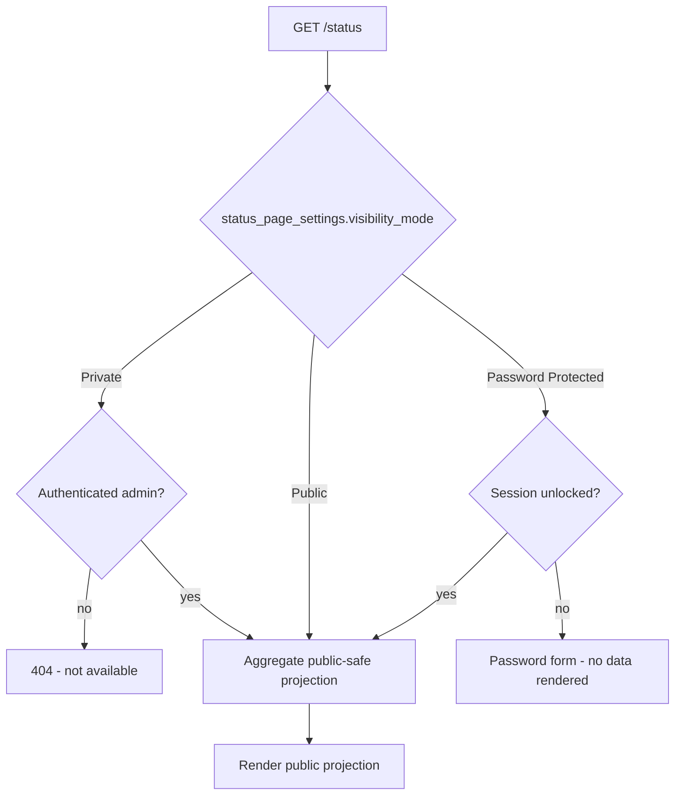
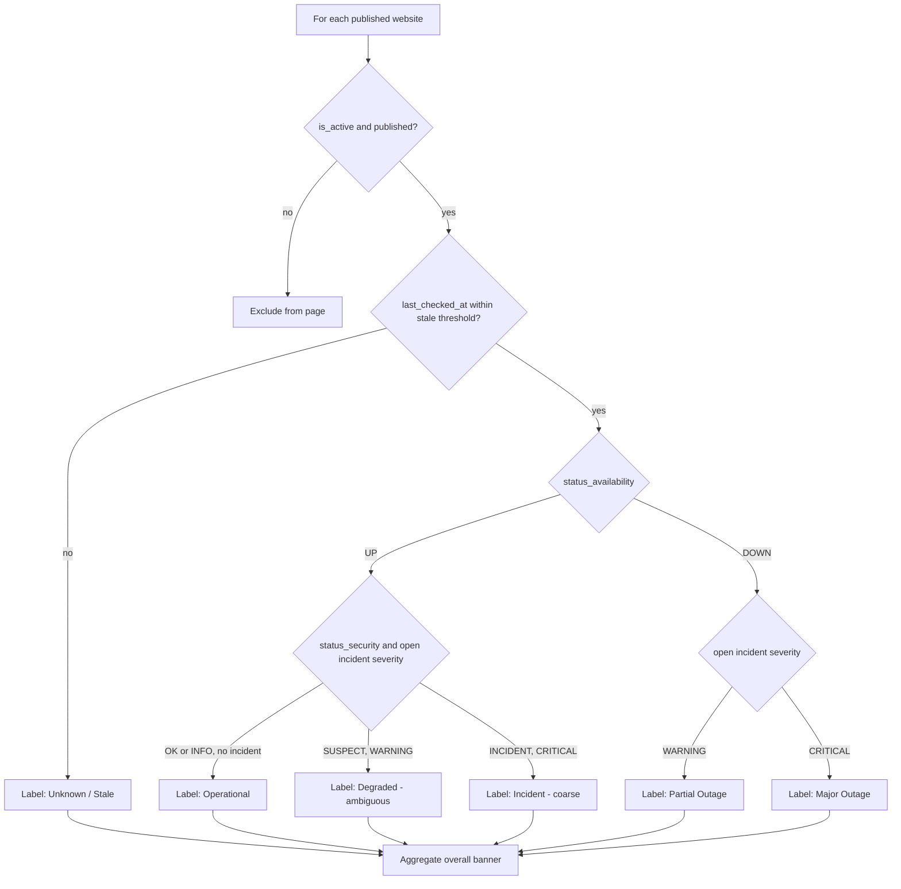

# STATUS-PAGE.md — SiteSentinel — Website Monitoring & Security Alerts

> **Specification only.** Nothing described in this document has been implemented.
> Every statement is future/conditional ("the page will…", "Phase 6 implements…").
> There is no application code and there are no migrations at the time of writing.

> **Authority.** [`PRD.md`](PRD.md) §14 fixes the status page's visibility modes and the
> public/private boundary; this document is the detailed source of truth for **presentation** —
> layout, caching, visibility-mode implementation, and the enforcement mechanism for the §14.4
> public-exposure prohibition (`PRD.md` §21 Cross-Document Map). Table and column names used here are
> frozen in [`DATABASE.md`](DATABASE.md). The route and flow come from [`ARCHITECTURE.md`](ARCHITECTURE.md)
> §10. Secret and password handling defer to [`SECURITY.md`](SECURITY.md) §4. Rationale is recorded
> in [`DECISIONS.md`](DECISIONS.md) `ADR-013`.

---

## 1. Purpose & Scope

### 1.1 What this document is

`STATUS-PAGE.md` is the exhaustive specification of the SiteSentinel public status page served at
**`/status`**: its three visibility modes, the password-protected unlock flow, the **redaction
boundary** that separates admin data from public data, the public service-status model and its
derivation, incident presentation, layout and caching, abuse/privacy considerations, admin controls,
and the acceptance tests that prove no sensitive data ever reaches the public response.

### 1.2 Relationship to sibling documents

| Document | Authority over the status page | What it owns |
| --- | --- | --- |
| [`PRD.md`](PRD.md) §14 | **Authoritative** | Visibility modes (`FR-78`), what may be shown publicly (`FR-79`, `FR-82`), what is admin-only (`FR-80`), the public-exposure prohibition (`§14.4`), visibility toggle + per-website inclusion (`FR-83`). |
| [`ARCHITECTURE.md`](ARCHITECTURE.md) §10 | Derived | The `GET /status` flow and its branch on `status_page_settings.visibility_mode`. |
| [`DATABASE.md`](DATABASE.md) | **Authoritative for names** | `status_page_settings`, `websites.status_availability` / `.status_security`, `incidents`, `checks` columns. |
| [`SECURITY.md`](SECURITY.md) §4 | **Authoritative for secrets** | `status_page_settings.password_hash` is hashed (never reversible); no secrets in output. |
| [`DECISIONS.md`](DECISIONS.md) | Derived | Rationale: `ADR-013` (visibility model + public information redaction). |
| [`NOTIFICATIONS.md`](NOTIFICATIONS.md) | Sibling | Notification payloads are admin-facing and MUST NOT be reused for public rendering. |
| **`STATUS-PAGE.md`** (this file) | **Authoritative for presentation** | Layout, caching, visibility-mode implementation, redaction enforcement. |

If this document contradicts [`PRD.md`](PRD.md) on a product-level requirement, [`PRD.md`](PRD.md)
wins and this document must be fixed.

### 1.3 The two hard rules

1. **`HTTP 200 != healthy`** and the two dimensions (Availability, Security) are orthogonal
   ([`PRD.md`](PRD.md) §10.5). The public page MUST respect this — a security incident does not change
   the public availability label ([`PRD.md`](PRD.md) §14.4).
2. **Suspicious keywords, malicious domains, and redirect targets are NEVER public**
   ([`PRD.md`](PRD.md) §14.4, §22 rule 8). This is a hard prohibition, enforced at a single
   projection chokepoint (§4).

---

## 2. Visibility Modes

`status_page_settings.visibility_mode` is an enum
`ENUM('Private','Public','Password Protected')` defaulting to **`Private`**
([`DATABASE.md`](DATABASE.md) §3.18; `PRD.md` §14.1).

The routing flow comes from [`ARCHITECTURE.md`](ARCHITECTURE.md) §10:



### 2.1 Mode-by-mode behaviour

| Aspect | `Private` | `Public` | `Password Protected` |
| --- | --- | --- | --- |
| **Who can access** | Authenticated admin only | Anyone with the URL | Anyone with the URL, after unlocking |
| **Auth mechanism** | Admin session (§ [`SECURITY.md`](SECURITY.md) §2) | None | Shared status-page password (§3) |
| **What the visitor sees** | The public projection (same as Public) | Public projection | Public projection |
| **Session persistence** | Standard admin session | None | A status-page unlock flag in the visitor's session |
| **Cookie behaviour** | Secure/`HttpOnly`/`SameSite` admin session cookie (`NFR-11`) | No auth cookie; at most a functional cookie | Secure session cookie carrying the unlock flag |
| **Failure behaviour** | Unauthenticated → `404`/not available (do not reveal the page exists) | n/a | Wrong password → throttled (§3.4); no data ever rendered before unlock |

### 2.2 Comparison summary

- **`Private`** — the new-install default ([`PRD.md`](PRD.md) §14.1). The page is not reachable
  without an admin session; unauthenticated visitors get a **`404`/not-available** response rather
  than a "login required" page, so the existence of a status page is not advertised.
- **`Public`** — no authentication; renders the public projection only (`FR-82`).
- **`Password Protected`** — no username; a shared password unlocks a session, and **no data is
  rendered before the password is verified** (`FR-81`).

### 2.3 Recommended default and justification

> **Default = `Private`.**

- A new installation must **never leak** by accident. If `Public` were the default, simply installing
  SiteSentinel would publish a list of monitored websites (and their availability) to anyone who
  guessed the URL — an information disclosure with zero deliberate action by the operator.
- `Private` makes exposure an **explicit, deliberate admin decision** (§11), matching the "explicit
  action with confirmation" rule and `ADR-013`'s rejection of "always public" as leaking security
  posture.
- This matches both the canonical default and [`PRD.md`](PRD.md) §14.1 ("Default for a new
  installation").

---

## 3. Password Protected Mode

The frozen visibility-mode label is **`Password Protected`** (with a space), matching the canonical
spec, [`PRD.md`](PRD.md) §14.1, and the `status_page_settings.visibility_mode` enum
([`DATABASE.md`](DATABASE.md) §3.18). This document uses that exact label throughout.

### 3.1 Password storage

- The status-page password is stored **hashed**, never plaintext, in
  `status_page_settings.password_hash` (`VARCHAR(255)`, nullable) ([`DATABASE.md`](DATABASE.md) §3.18;
  `FR-81`; [`SECURITY.md`](SECURITY.md) §4 checklist: "`status_page_settings.password_hash` is hashed,
  never encrypted-reversible").
- It uses the same modern one-way hash as admin credentials (`Hash` facade; Argon2id/bcrypt, see
  [`SECURITY.md`](SECURITY.md) §2 and [`DECISIONS.md`](DECISIONS.md) `ADR-018`). It is **hash-checked**,
  not decrypted.
- `password_hash` MUST NEVER be rendered, logged, or included in any payload or cache entry.

### 3.2 Session-based unlock

- A correct password sets an **unlock flag in the visitor's session**; subsequent requests in that
  session skip the password form.
- The unlock is scoped to the **status page**, not to `/admin`. It grants no admin capability.
- Session cookies use `Secure`/`HttpOnly`/`SameSite` flags (`NFR-11`).

### 3.3 No username required

- The status page is **password-only** — there is no username field and no account. This is a shared
  secret pattern, deliberately not an authentication system.
- The password is independent from admin credentials (§3.5).

### 3.4 Throttling and lockout

- Password attempts MUST be **rate-limited** (per IP and per session), consistent with the monitor's
  throttling posture ([`SECURITY.md`](SECURITY.md) §2.4, which specifies application-level
  throttling and lockout).
- Repeated failures MUST **back off** (`429` with a retry hint), and MUST NOT reveal whether a
  password was "close".
- Failed attempts SHOULD be auditable (`audit_logs`, [`DATABASE.md`](DATABASE.md) §3.19) so an
  operator can see someone probing the status page.

This throttle is separate from the admin login lockout in [`SECURITY.md`](SECURITY.md) §2.4
(`FR-06`). The behaviour (throttle + backoff + audit) is fixed here; concrete per-IP/per-session
numeric parameters for the status-page password are not fixed at MVP and are ratified in
[`SECURITY.md`](SECURITY.md) §3.4 (see the audit report's open questions).

### 3.5 Independence from admin credentials

- The status-page password is a **separate secret** from admin passwords and is stored in a different
  column (`status_page_settings.password_hash` vs `users.password`). Changing one MUST NOT affect the
  other.
- Rotating the status-page password immediately invalidates the unlock for **new** sessions; existing
  unlocked sessions SHOULD be invalidated by bumping a stored password version/`updated_at` check so
  that changing the password actually revokes access.

### 3.6 Reset flow via admin

- Only an **authenticated admin** can set, change, or clear `status_page_settings.password_hash`
  through `/admin` status-page settings (§11).
- There is **no self-service reset** and no "forgot password" for the status page — an admin
  re-establishes the shared password.
- Enabling `Password Protected` without setting a password MUST be prevented (fail closed) — the
  settings UI MUST require a password whenever the mode is `Password Protected`.

---

## 4. The Public Information Model — The Redaction Boundary

> **This is the most important section of this document.**

All three visibility modes render through a **single public-safe projection**
([`DECISIONS.md`](DECISIONS.md) `ADR-013`: "All modes will render through a public-safe projection
that strips security detail, rule names, scores, technical metadata, and snapshot artifacts"). Even
`Private` mode renders the public projection, so promotion to `Public` cannot accidentally expose
more than was tested.

### 4.1 Field-level boundary

| Data field | Admin view (`/admin`) | Public / status-page view (`/status`) |
| --- | --- | --- |
| Website display name | Real `websites.name` | Display name **or** admin-chosen alias (§11) |
| Website URL | `websites.url` | Not shown (or the alias only) |
| Coarse availability status | `status_availability` (`UP`/`DOWN`) | Derived public label (§5) |
| Coarse response-time band | Full timing | Optional coarse band only (e.g. "normal"/"slow") |
| Security state (`status_security`) | `OK`/`INFO`/`SUSPECT`/`INCIDENT` | Never shown as a security value; folded into a coarse label (§5) |
| Incident severity | `INFO`/`WARNING`/`CRITICAL` | Never shown |
| Incident existence / type | Full detail | A coarse `Incident` label **only** where §5 permits; no type detail |
| **Suspicious keywords** (e.g. `casino`, `maxwin`) | Shown with attribution | **NEVER public** |
| **Suspicious / malicious external domains** | Shown | **NEVER public** |
| **Redirect targets and full redirect chains** | Shown (JSON) | **NEVER public** |
| **Triggered rule IDs, rule names, raw scores, thresholds** | Shown (`FR-49`) | **NEVER public** |
| **Content fingerprints / hashes, baseline comparisons** | Shown | **NEVER public** |
| **Raw HTML, response headers, snapshots** | Shown (snapshot artifacts) | **NEVER public** |
| **Server IPs, internal paths, error stack traces, DB/queue identifiers** | Operational detail | **NEVER public** |
| Incident start time | Exact | Coarse bucket only (§7) |
| Internal resolution notes | `incidents.resolution_notes` | **NEVER public** |
| Notification config / delivery logs / failure states | Shown in `/admin` | **NEVER public** |

This table is the operational form of [`PRD.md`](PRD.md) §14.2, §14.3, and §14.4.

### 4.2 What is explicitly NEVER public

The public page MUST NOT render, embed, or leak — **in HTML, JSON, comments, or asset names** — any
of ([`PRD.md`](PRD.md) §14.4):

- detected keywords or keyword lists (including ignored keywords),
- outbound or injected domains,
- redirect targets or redirect chains,
- rule identifiers, weights, or risk scores,
- snapshots or excerpts of page content,
- the existence or severity of a security incident.

Plus, from [`PRD.md`](PRD.md) §14.3: response headers, resolved IPs, TLS details, content hashes,
notification configuration, delivery logs, and failure states.

> The "in asset names" clause is easy to miss: a CSS class, a cache key rendered into a URL, or an
> `id` attribute derived from a rule id would leak the same fact the visible text hides. The
> projection MUST produce opaque, non-derived identifiers (§10.2).

### 4.3 What IS public

- The **website/service display name** — the admin chooses whether to expose the real `websites.name`
  or an **alias** (§11).
- A **coarse status label** drawn from the fixed set in §5.
- An **optional coarse response-time band** (never an exact millisecond figure that could fingerprint
  infrastructure).
- A coarse **incident** indication **only** where §5 permits it.

### 4.4 Worked before/after example

**Scenario** — the [`PRD.md`](PRD.md) §10.6 canonical case: `contoh-toko.example` returns HTTP `200`
throughout, but content no longer matches its baseline; the detection engine raises a `CRITICAL`
security incident with correlated signals.

**Admin incident detail (`/admin`) — internal, full fidelity:**

```text
Incident #4821 — Contoh Toko (contoh-toko.example)
Type        : security
Severity    : CRITICAL
State       : DETECTED
Availability: UP          Security: INCIDENT
Detected    : 2026-09-01 03:15 UTC
Score       : 22 (threshold CRITICAL = 15, guard = 2 categories)
Rules fired : RULE-KW-005 (weight 5), RULE-LNK-001 (weight 6),
              RULE-RED-001 (weight 5), RULE-CNT-001 (weight 1)
Keywords    : "casino", "maxwin"
Domains     : cdn.partner-betting.example
Redirects   : contoh-toko.example -> gate.example -> partner-betting.example
Snapshot    : snapshots/4821.html (14d retention)
Resolved by : (open)
Resolution  : (none)
```

**Public rendering (`/status`) — same incident, redacted:**

```text
Contoh Toko (alias)        Status: Incident
Updated 2026-09-01 (day-level)

A technical issue is being investigated. No further detail is published.
```

The public view shows only a coarse label plus a day-level timestamp. **No** keyword, domain, redirect
target, rule id, score, threshold, snapshot reference, or incident severity appears. This is the
`PRD` §14.4 requirement rendered concretely.

---

## 5. Service Status Model

### 5.1 Two internal dimensions, one public label

Internally, each website carries two orthogonal dimensions
([`PRD.md`](PRD.md) §10.3–10.5; [`DATABASE.md`](DATABASE.md) §3.4):

- `websites.status_availability` — `UP` | `DOWN` (the stored enum is exactly `UP`/`DOWN`
  per [`PRD.md`](PRD.md) §10.3).
- `websites.status_security` — `OK` | `INFO` | `SUSPECT` | `INCIDENT`.

The public label is a **derived, coarse** projection of these — it is **not** a security value and
must not be invertible back to one.

### 5.2 Public labels

Recommended public labels: `Operational`, `Degraded`, `Partial Outage`, `Major Outage`, `Incident`,
and `Under Maintenance` (if/when applicable).

### 5.3 Derivation table (internal → public)

| Internal availability | Internal security | Active incident severity | Public label |
| --- | --- | --- | --- |
| `UP` | `OK` / `INFO` | none | **`Operational`** |
| `UP` | `SUSPECT` | `WARNING` | **`Degraded`** (ambiguous by design — see §5.4) |
| `UP` | `INCIDENT` | `CRITICAL` | **`Incident`** (coarse; no security detail) |
| `DOWN` | any | `WARNING` | **`Partial Outage`** |
| `DOWN` | any | `CRITICAL` | **`Major Outage`** |
| stale / no recent successful check | any | any | **`Unknown`** / `Stale` (see §6.4) |
| admin-marked maintenance (if implemented) | any | n/a | **`Under Maintenance`** |

Notes:

- **`SUSPECT` maps to an ambiguous public label (`Degraded`), not a security label.** `SUSPECT` means
  the weighted score crossed the **`WARNING`** threshold ([`PRD.md`](PRD.md) §10.4) — a *plausible*
  problem, not a confirmed compromise. Publishing "security issue" on unconfirmed data would
  (a) alarm the client before triage, and (b) tell an attacker exactly which of their artifacts were
  detected ([`PRD.md`](PRD.md) §14.4 rationale). `Degraded` gives the visitor a truthful "something
  looks off" signal without confirming a compromise. This is configurable by Admin only within the
  redaction rules (§11).
- **A security incident with `UP` availability does not change the availability label to an outage.**
  It may surface as the coarse `Incident` label (or, if the admin chooses, no outward change at all),
  matching [`PRD.md`](PRD.md) §14.4: "the status page may show **no outward change in availability
  status** while the admin area correctly reports `HTTP: UP` + `Security: INCIDENT`. That divergence is
  intentional and correct."
- `INFO` NEVER creates an incident ([`PRD.md`](PRD.md) §11.3), so it never lifts a label above
  `Operational`.

### 5.4 Why `SUSPECT` is deliberately ambiguous

- **Do not alert attackers** — a public "compromised" flag is a roadmap of which artifacts were
  detected.
- **Do not alarm clients with unconfirmed data** — "degraded" is recoverable phrasing; "hacked" is
  not, and may be wrong.
- The admin can always upgrade the wording via a **custom status label/message** within the redaction
  rules (§11) when a confirmed incident must be communicated externally.

### 5.5 Examples (matching `PRD.md` §14.2 / task brief)

| Website | Internal | Public shows |
| --- | --- | --- |
| Client A | `UP` + `OK`, no incident | **`Client A — Operational`** |
| Client C | `UP` + `SUSPECT`, `WARNING` incident | **`Client C — Degraded`** |
| Client D | `UP` + `INCIDENT`, `CRITICAL` incident | **`Client D — Incident`** |
| Client E | `DOWN`, `CRITICAL` incident | **`Client E — Major Outage`** |
| Client F | last check stale | **`Client F — Unknown`** |

---

## 6. Status Calculation

### 6.1 Inputs

| Input | Source |
| --- | --- |
| Current availability state | `websites.status_availability` (`UP`/`DOWN`) |
| Current security state | `websites.status_security` (`OK`/`INFO`/`SUSPECT`/`INCIDENT`) |
| Active incident severity | `incidents` rows with `status IN ('DETECTED','ACKNOWLEDGED')` for the website |
| Freshness of last check | `websites.last_checked_at`, `websites.check_interval_seconds` |
| Coarse response-time band | optional, derived from recent `checks` timing |

The aggregation reads the **snapshot columns** on `websites` (`status_availability`,
`status_security`, `last_checked_at`) — [`DATABASE.md`](DATABASE.md) §5 lists "Status page aggregation"
as a hot path served by `idx_checks_website_started_at` + the `websites.status_availability` snapshot.

### 6.2 Aggregation rule — checks → website status

1. A website's status is **not** computed from a single check. The probe maintains the durable
   snapshot on `websites` (`status_availability`, `status_security`) using the flapping thresholds
   ([`NOTIFICATIONS.md`](NOTIFICATIONS.md) §9.3; `websites.consecutive_failures` /
   `consecutive_successes`).
2. The public projection reads that snapshot plus any **open** incident severity, and applies the
   §5.3 derivation.
3. Aggregation across websites yields the page's **overall banner** (§8).

### 6.3 No fabrication

- The projection MUST NOT invent a label not derivable from the inputs. If the inputs are stale or
  missing, the label is `Unknown`/`Stale` (§6.4) — never `Operational`.

### 6.4 Staleness / freshness

- The system knows each website's `check_interval_seconds` and `last_checked_at`.
- **Stale threshold** — if `last_checked_at` is older than a bounded multiple of the expected
  interval (recommended: `max(2 × check_interval_seconds, a small floor)`), the website is presented
  as **`Unknown`** (or `Stale`) rather than its last known label.
- **Hard rule:** *a website with no recent successful check MUST NOT be shown as `Operational`.*
  Showing a healthy label off the back of a stale snapshot would actively mislead the visitor and is
  the exact failure mode `HTTP 200 != healthy` warns against, transposed to the page.
- A website with `is_active = 0` is not monitored; it SHOULD be excluded from the page rather than
  shown as `Operational`.

### 6.5 Calculation flowchart



### 6.6 Overall banner aggregation

- The page-level banner is the **worst** coarse label across published websites, in order of severity:
  `Major Outage` > `Partial Outage` > `Incident` > `Degraded` > `Operational`. `Unknown` sites are
  surfaced separately (e.g. "some services report stale data") rather than silently counted as
  healthy.
- The banner MUST NOT name the cause (no rule ids, no domains) — only the coarse worst case.

---

## 7. Incident Presentation

### 7.1 Active incidents

- An active incident appears publicly as a **coarse label + start time + last-updated**, with **no
  technical detail** (`FR-79`, `FR-80`; [`PRD.md`](PRD.md) §14.2–14.3).
- Recommended shape:

  ```text
  <Display name / alias>   <coarse label>   since <coarse time bucket>
  ```

- The start time is published at a **coarse granularity** only (§7.3). Exact timestamps are admin-only
  because they can fingerprint detection cadence.

### 7.2 History / timeline

- A public-safe timeline MAY show previous incidents as coarse summaries (day-level, label-only),
  if the admin enables history.
- The public timeline MUST NOT include: incident type, severity, rule attribution, evidence,
  resolution notes, or any field from the §4.1 admin column.
- The per-website **admin** timeline (`FR-61`) — which interleaves checks, incident events, and
  notification dispatches — is NEVER reused for public rendering.

### 7.3 Coarse time buckets

> **Recommendation: publish only day-level (or coarser) time buckets publicly.**

- Exact incident start/end times reveal the detection cadence and can help an attacker time their
  activity between checks.
- Day-level buckets convey "this happened recently" to a client without enabling that reverse
  engineering.
- The exact timestamps remain available in `/admin`.

### 7.4 Resolution notes

- `incidents.resolution_notes` and the internal `incident_events` notes are **never public**
  ([`PRD.md`](PRD.md) §14.3). Resolution on the public page is expressed only as the label returning
  to `Operational` (or entering the history list).

---

## 8. Page Content & Layout

### 8.1 Structure

| Region | Content | Redaction notes |
| --- | --- | --- |
| **Header** | Page title / logo / optional custom message | Branding from `status_page_settings.branding` (JSON) |
| **Overall banner** | Worst coarse label (§6.6) | No cause named |
| **Website rows** | One row per published website: display name/alias + coarse label + (optional) coarse response band | No URL/host by default; no security value |
| **Incident section** | Active incidents as coarse label + time bucket | No type/severity/evidence |
| **Last-updated** | A single page-level "updated at" timestamp | Coarse; shows freshness of the projection |
| **Footer** | Optional custom footer text | MUST NOT leak version/internal paths |

### 8.2 Auto-refresh

> **Recommendation: Turbo-based refresh with a poll interval tied to the check cadence.**

- Use **Hotwired Turbo** (the approved architecture — `ADR-002`, `FR-89`) to refresh the page/partial
  on a timer, so the page stays current without a full SPA.
- Recommended poll interval: **the shortest published `check_interval_seconds`** (floor ~60s) — there
  is no point refreshing faster than data can change, and a faster poll wastes load on the only
  high-traffic public endpoint (§9.3).
- **The page MUST work without JavaScript.** Turbo is progressive enhancement: the server-rendered
  HTML is complete and correct on first paint; the poll merely re-fetches it. This is required by the
  server-rendered, no-SPA architecture and is an accessibility baseline.

### 8.3 Branding / settings

- Title, logo, footer, and a custom message come from `status_page_settings.branding` (JSON) and the
  `slug` ([`DATABASE.md`](DATABASE.md) §3.18).
- Custom branding beyond this basic set (custom domain, full theming) is `Future` (`FR-84`) and MUST
  NOT be built at MVP.
- The custom message MUST be admin-authored static text — it MUST NOT interpolate monitored content.

### 8.4 Accessibility basics

- Semantic HTML (`<table>` or a list with clear labels; real headings).
- Colour is never the sole carrier of status — each label has a text name (§5.2).
- Sufficient contrast between label text and background.
- The page is fully operable with JS disabled (§8.2) and readable by a screen reader.

### 8.5 Server-rendered

- The page is rendered **server-side** with Blade and delivered as complete HTML
  ([`ARCHITECTURE.md`](ARCHITECTURE.md) §1.2; `FR-89`). No data is fetched by client-side JS from an
  admin API — there is no public API at MVP ([`DATABASE.md`](DATABASE.md) §1.1 note on
  `personal_access_tokens`: "SiteSentinel … does not expose an API at MVP").

---

## 9. Caching & Performance

### 9.1 Cache the projection, not the raw data

- The cached artefact is the **public-safe projection** (§4.1) — the already-redacted view model —
  never the raw `websites`/`incidents` rows. Caching the projection means the redaction runs once, per
  [`DECISIONS.md`](DECISIONS.md) `ADR-013` ("Redaction at the projection layer enforces this once
  rather than per-view").
- This also makes leakage structurally harder: the cache physically cannot contain a field that the
  projection dropped.

### 9.2 TTL and invalidation

- **TTL recommendation:** tie the cache TTL to the check cadence — a short TTL (on the order of the
  shortest published `check_interval_seconds`, floor ~60s) so the page is never meaningfully staler
  than the monitoring data behind it.
- **Invalidation on incident state change:** when an incident opens, escalates, or resolves
  ([`PRD.md`](PRD.md) §12), the status-page cache MUST be invalidated/refreshed so the coarse label
  updates promptly rather than waiting out the TTL.
- Cache store is Redis at MVP ([`ARCHITECTURE.md`](ARCHITECTURE.md) §12); the `cache` table exists
  only as a framework fallback and is not the primary store ([`DATABASE.md`](DATABASE.md) §3.21).

### 9.3 Load considerations

- **`/status` is the only realistically high-traffic public endpoint.** `/` is login and `/admin` is
  authenticated; everything else runs off the request path.
- Therefore the status page MUST be: cheap to render, cached as a projection (§9.1), free of
  admin-dependency queries in the render path (`FR-82`), and safe to serve many times per second.
- It MUST NOT trigger per-request probing, per-request aggregation over `checks`, or per-request
  incident detail assembly — all of that is precomputed into the cached projection.

---

## 10. SSRF / Abuse and Privacy Considerations

### 10.1 No user-supplied URL fetching from the status page

- The status page performs **no outbound fetch** of any kind. It renders precomputed state only
  ([`ARCHITECTURE.md`](ARCHITECTURE.md) §10 flow).
- It MUST NOT accept URLs, targets, or parameters that induce a fetch — that would turn the one public
  endpoint into an SSRF proxy, the defining risk the monitor's SSRF guard exists to prevent
  ([`SECURITY.md`](SECURITY.md) §5; [`PRD.md`](PRD.md) §15.4).

### 10.2 Enumeration protection

- The public page MUST NOT reveal internal website IDs, DB primary keys, internal hostnames, file
  paths, queue names, or any identifier that aids an attacker's reconnaissance
  ([`PRD.md`](PRD.md) §14.4 "in … asset names").
- Use **opaque, non-derived** public identifiers for each row (e.g. a slug or index), never an
  `id`/class derived from `website_id`, rule id, or hash.
- Do not expose a count of total monitored websites unless the admin explicitly publishes it; the
  count itself is reconnaissance.

### 10.3 `noindex` and robots policy

> **Recommendation: send `X-Robots-Tag: noindex, nofollow` and serve a robots policy that discourages
> indexing of `/status`.**

- Even a "public" status page is not meant to be a search-indexed directory of a client's
  infrastructure. Indexing would make enumeration trivial and could surface stale outage pages in
  search results.
- Combine a `robots.txt` disallow with the response header, and rely on the header as the
  authoritative control (robots.txt is advisory).

### 10.4 No DDoS mitigation in-app

- Denial-of-service against the public endpoint is explicitly **out of scope at the application
  layer** ([`SECURITY.md`](SECURITY.md) §1.3: mitigated at platform/edge). The application keeps the
  render path cheap (§9.3); edge protection is a deployment concern.

### 10.5 Visibility changes are explicit

- Changing `visibility_mode` from `Private` to `Public` (or to `Password Protected`) MUST be an
  **explicit admin action with a confirmation warning** (§11.3). There is no implicit or automatic
  exposure.

---

## 11. Admin Controls

### 11.1 Settings the admin manages

| Control | Stored in |
| --- | --- |
| Visibility mode | `status_page_settings.visibility_mode` |
| Status-page password | `status_page_settings.password_hash` (hashed) |
| Public slug | `status_page_settings.slug` (unique: `uq_status_page_settings_slug`) |
| Branding (title/logo/footer/custom message) | `status_page_settings.branding` (JSON) |
| Which websites are listed, and their display aliases | per-website inclusion + `websites.name` / alias (see §11.2) |
| Whether the page is shown at all | `visibility_mode = Private` (no public exposure) |

All from [`DATABASE.md`](DATABASE.md) §3.18. Per [`DECISIONS.md`](DECISIONS.md) open questions, whether
this stays a separate table or folds into `settings` is revisitable — this document does not change
the frozen name `status_page_settings`.

### 11.2 Per-website inclusion and aliasing

- `FR-83` requires Admin to toggle, **per website**, whether it appears on the status page at all.
- The admin also chooses whether the public row shows the real `websites.name` or an **alias**, so a
  client's real service name need not be exposed ([`PRD.md`](PRD.md) §14.2: "per website that Admin
  has chosen to publish").
- Aliasing is a **display mapping only** — it does not change the monitored row, and it MUST still
  pass through the §4 projection.

### 11.3 Confirmation / warning UX for going public

> **Going public requires an explicit, warned action.**

- Toggling to `Public` MUST show a confirmation that states plainly: *the page will be reachable by
  anyone with the URL and will list the selected websites' availability*.
- The confirmation MUST require a deliberate second action (e.g. a typed confirmation or an explicit
  checkbox), so a mis-click cannot publish a client list.
- The change SHOULD be recorded in `audit_logs` ([`DATABASE.md`](DATABASE.md) §3.19).
- Going **back** to `Private` MUST take effect immediately and invalidate the cached public projection
  and any status-page unlock sessions.

---

## 12. Acceptance Criteria & Testing

### 12.1 Testable acceptance criteria

1. `GET /status` in `Private` mode returns `404`/not-available to an unauthenticated visitor and the
   public projection to an authenticated admin (`FR-78`, §2.1).
2. `GET /status` in `Public` mode returns the public projection with **no** authentication
   (`FR-82`).
3. `GET /status` in `Password Protected` mode renders **no data** before a correct password; a wrong
   password is throttled; a correct password unlocks the session (§3.2–3.4; `FR-81`).
4. `status_page_settings.password_hash` is a **hash**, never plaintext or reversibly encrypted
   (§3.1; [`SECURITY.md`](SECURITY.md) §4).
5. Every published row shows only a label from the fixed set (§5.2), a coarse timestamp, and an
   alias/display name.
6. A website with a stale `last_checked_at` beyond threshold shows `Unknown`/`Stale`, never
   `Operational` (§6.4).
7. A `UP` + `INCIDENT` website does **not** display as an availability outage; it may show `Incident`
   or no outward change (§5.3, §7.1; [`PRD.md`](PRD.md) §14.4).
8. The page is complete and correct with JavaScript disabled (§8.2, §8.5).
9. Switching `Private → Public` requires the confirmation warning (§11.3); `Public → Private`
   immediately hides the page and clears the cache/unlock.

### 12.2 Required visibility-gate tests (all three modes)

- **Private:** unauthenticated → `404`; authenticated admin → projection. Assert the page's existence
  is not advertised.
- **Public:** anonymous request → projection; assert no admin-only data.
- **Password Protected:** assert (a) no data before unlock, (b) throttle after N failures, (c) unlock
  persists within the session, (d) password rotation revokes access (§3.5).

### 12.3 The redaction regression test (mandatory)

> **An explicit regression test MUST assert that no sensitive field ever appears in the public
> response.**

- The test builds a website/incident with **all** sensitive fields populated (keywords such as
  `casino`/`maxwin`, malicious domains, a multi-hop redirect chain, rule ids/weights/scores,
  content hashes, snapshot paths, response headers, resolved IPs, internal paths) and then asserts the
  raw public HTTP body contains **none** of them — including in HTML comments, JSON blocks, CSS class
  names, and asset/URL fragments ([`PRD.md`](PRD.md) §14.4; [`DECISIONS.md`](DECISIONS.md) `ADR-013`
  consequences: "redaction logic must be regression-tested to avoid accidental leakage").
- The test MUST cover **all three visibility modes**, since all render through the same projection.
- This test is a **release blocker**: a failure means the §14.4 hard rule is violated.

### 12.4 Additional required tests

- **Derivation table test** — each row of the §5.3 table maps to the expected public label; `SUSPECT`
  maps to `Degraded` and never to a security-flavoured label.
- **Staleness test** — clock-controlled; a stale website is `Unknown`, not `Operational`.
- **Cache test** — the cached artefact is the projection (no raw field present) and is invalidated on
  incident state change (§9.2).
- **No-SSRF test** — the status page performs no outbound request and accepts no fetch-inducing
  parameter (§10.1).
- **Enumeration test** — no `website_id`, rule id, or internal path appears in the response or in
  element/asset identifiers (§10.2).

---

*End of `STATUS-PAGE.md` — specification only; authoritative for status page presentation.*
